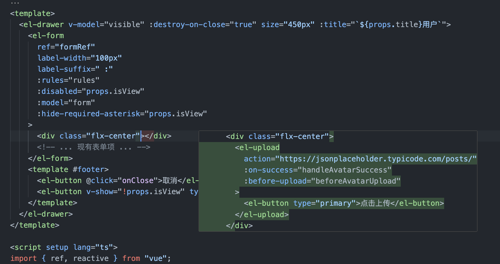
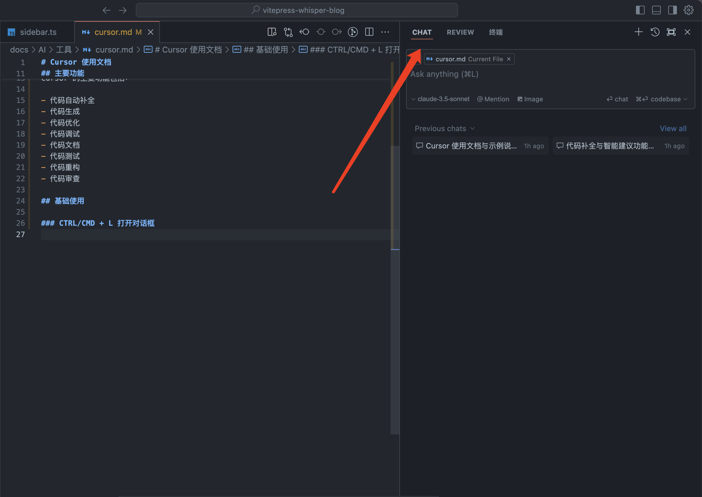
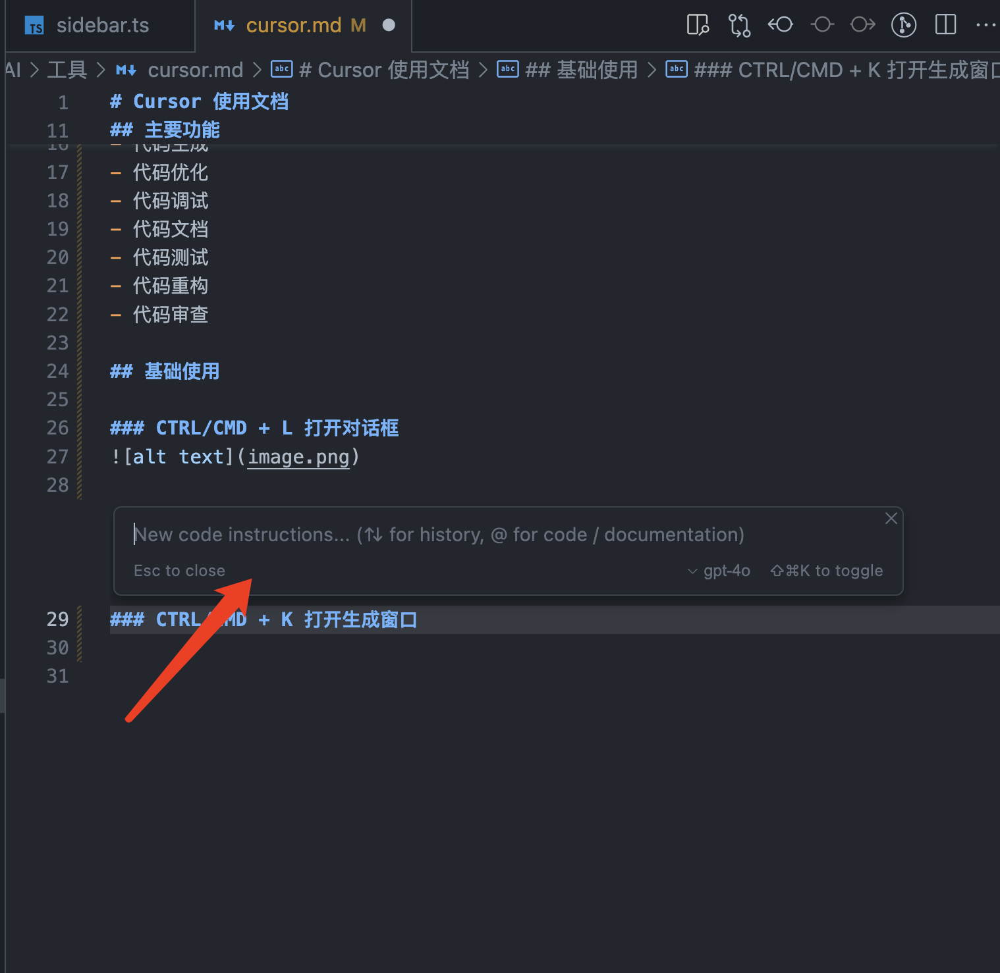
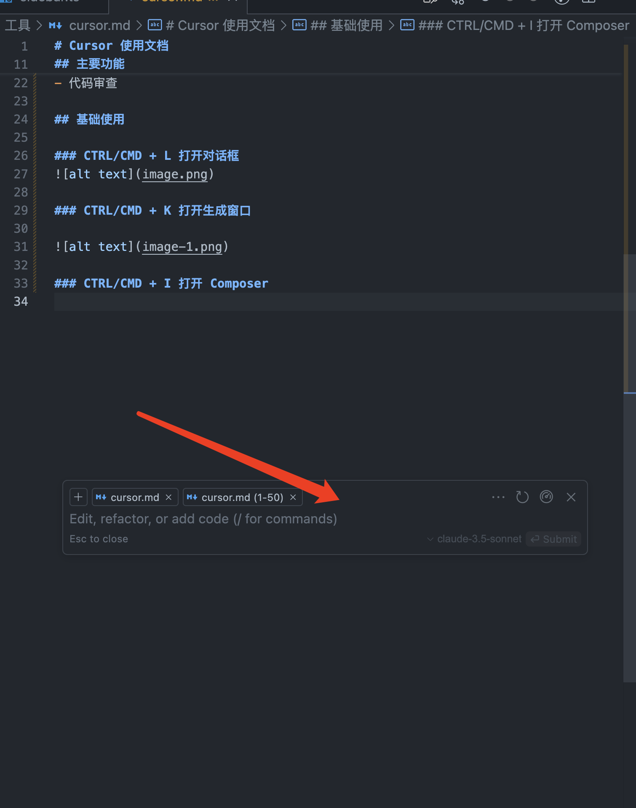
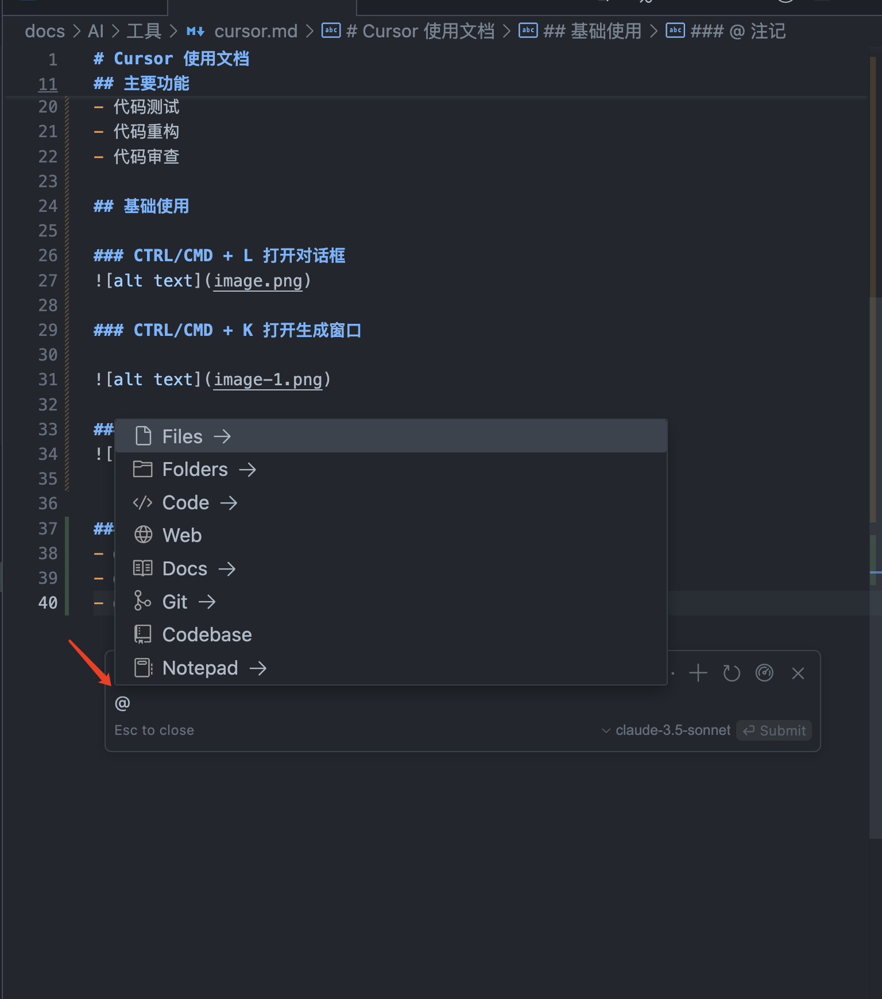
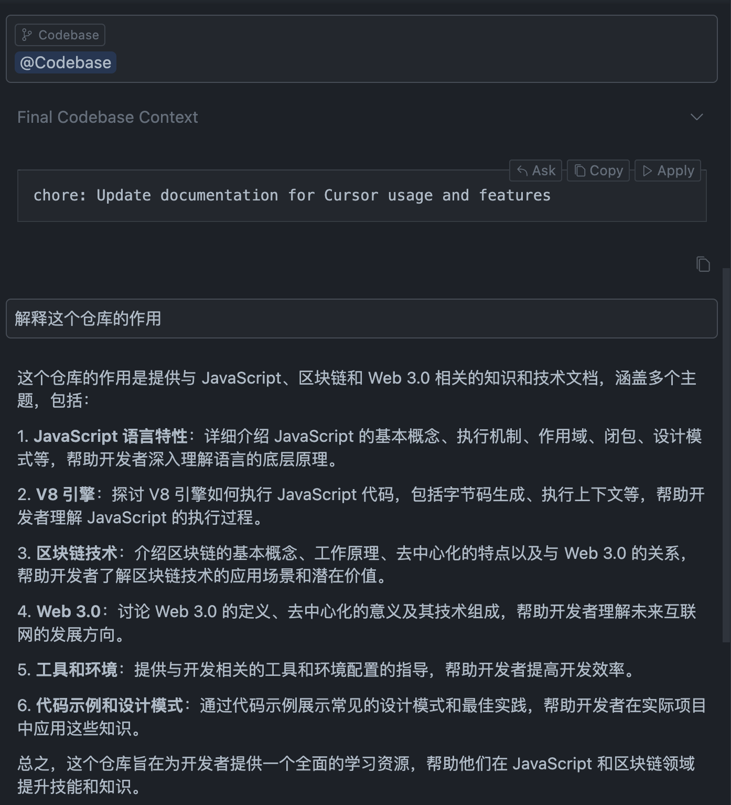
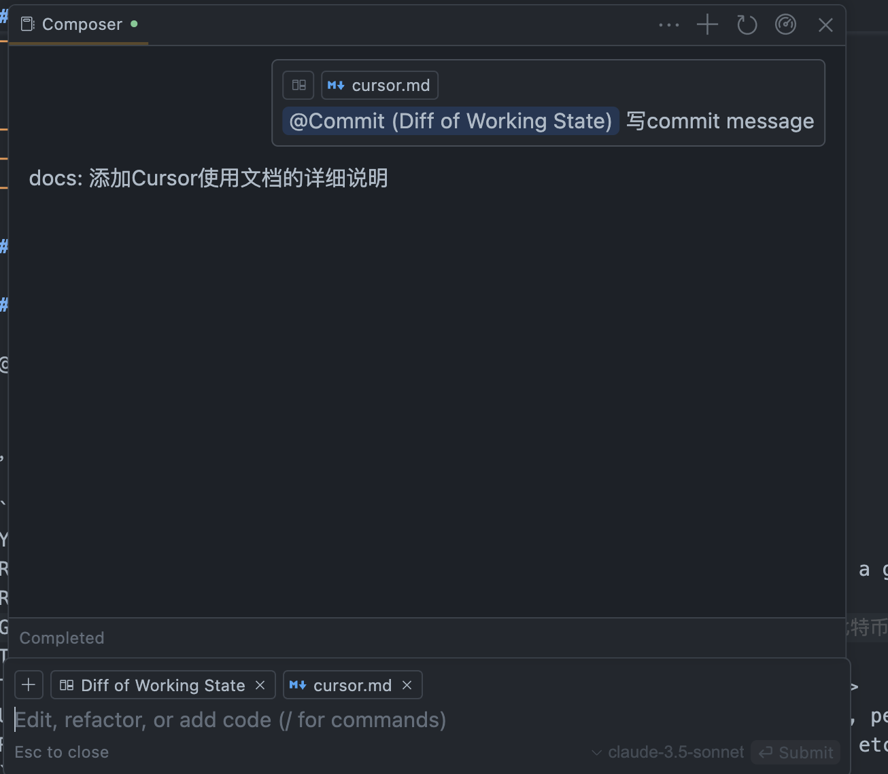
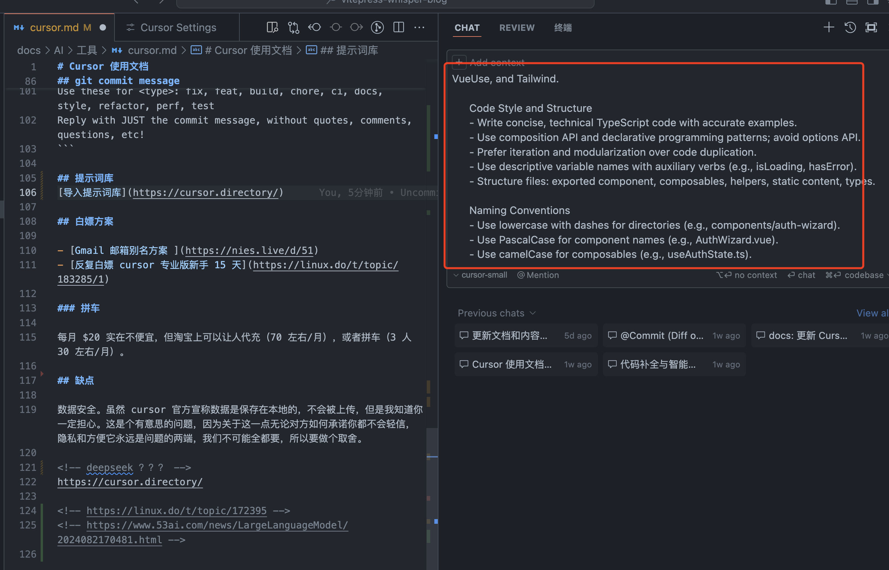

# Cursor 使用文档

Cursor 是一款基于 VScode fork 的代码编辑器，因此所有你在 VSCode 上的配置都能够导入到 Cursor 里使用。

> 作为一个独立的应用程序，Cursor 对编辑器的 UI 有更多的控制权，从而实现更好的 AI 集成。

## 安装

Cursor 支持 Windows、Mac 和 Linux 系统，从 [Cursor 官网](https://cursor.sh/) 下载安装。

::: tip 为什么不是 copilot

1. 模型选用
   - GPT4-o 是 Copilot **唯一指定**的模型，但是它的代码能力显著落后于 Sonnet-3.5，而 Cursor 能调用 Sonnet-3.5，这已经算得上一大压倒性优势。
   - 事实上，Cursor 也能切换 GPT4-o 或其他模型。
2. 检索能力
   - Copilot 在检索文件时，是基于字符串的 Jaccard（衡量两个集合相似度的指标） 相似度进行比较
   - Cursor 在使用 @Codebase 功能时，会先对当前代码仓库计算 Embedding，检索时计算的是 Embedding 向量的相似度，因此 Cursor 检索文件的相关性会明显更高。
3. 知识库截止日期

- GPT-4o 的知识库截止日期是 2023 年 10 月
- Cursor 可选用更新的知识库
  :::

## 主要功能

Cursor 的主要功能包括：

- 代码生成
  - 代码重构
- 代码自动补全
- 代码解释（整体或局部）和修改
- 自定义代码上下文
- 代码测试生成
- 代码审查 review
- 生成 git commit message
- 终端命令生成

## Tab 自动生成

Cursor 自动生成代码块，只需要按下 Tab 键即可。


`cmd + right` 键，可以跳转到下一个代码块。

`cmd + left` 键，可以跳转到上一个代码块。

### Tab - Tab - Tab

> Cursor 可以预测接受编辑后你将前往的位置。如果可用，您将能够按 Tab 键转到下一个位置，从而允许您通过 Tab-Tab-Tab 进行编辑。
> 经测试不大好用。

## Chat

### CTRL/CMD + L 打开对话框



### CTRL/CMD + K 打开生成窗口



### CTRL/CMD + I 打开 Composer



### 补充上下文

在这里提问可以仅针对当前文件、文件夹、图片、文档、网络或者整个 codebase


- @Files 传递指定代码文件的上下文
- @Folders 传递文件目录信息的上下文
- @Code 传递指定代码块的上下文
- @Web 从搜索引擎的搜索内容获取上下文
- @Docs 从指定文档获取上下文
  - https://mp.weixin.qq.com/s/NNsXoLb2m20duqK77huChQ
  - https://mp.weixin.qq.com/s/mGshe7pU5FgmjWuKom5DHQ
- @Git 解释历史提交
- @Codebase 代码仓里扫描相应的文件传入
  解释当前仓库
  
- @NotePad 从剪贴板获取上下文
- @Chat
  @Chat 注记只能在文件内的代码生成窗口（CTRL + K 打开的窗口）里使用，它能够将你右边打开的对话窗口里的对话内容作为上下文传递给大模型。

## AI review

## git commit message

@Commit，然后 Cursor 就能自动将 diff 添加到聊天中，键入"写 commit message"即可生成。

{width=50% height=50%}

也可以自定义 prompt：

```
You are an expert software engineer.
Review the provided context and diffs which are about to be committed to a git repo.
Review the diffs carefully.
Generate a commit message for those changes.
The commit message MUST use the imperative tense.
The commit message should be structured as follows: <type>: <description>
Use these for <type>: fix, feat, build, chore, ci, docs, style, refactor, perf, test
Reply with JUST the commit message, without quotes, comments, questions, etc!
```

## 提示词库

[导入提示词库](https://cursor.directory/)


Cursor 将基于提示词库为你提供更精准的代码补全和错误修复建议。无论是简单的函数补全，还是复杂的错误修复，Cursor 都会为你提供帮助。

## 白嫖方案

- [Gmail 邮箱别名方案 ](https://nies.live/d/51)
- [反复白嫖 cursor 专业版新手 15 天](https://linux.do/t/topic/183285/1)

### 拼车

每月 $20 实在不便宜，但淘宝上可以让人代充（70 左右/月），或者拼车（3 人 30 左右/月）。

## 缺点

数据安全。虽然 cursor 官方宣称数据是保存在本地的，不会被上传，但 ┓( ´∀` )┏。 隐私和方便它永远是问题的两端，总得做个取舍。

<!-- deepseek ？？？ -->

<!-- https://linux.do/t/topic/172395 -->
<!-- https://www.53ai.com/news/LargeLanguageModel/2024082170481.html -->
