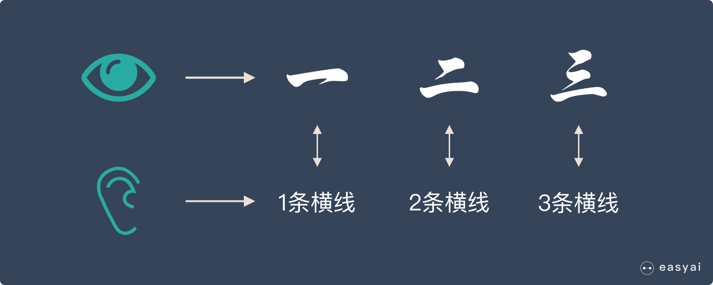
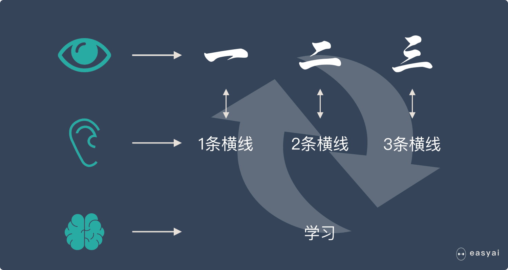
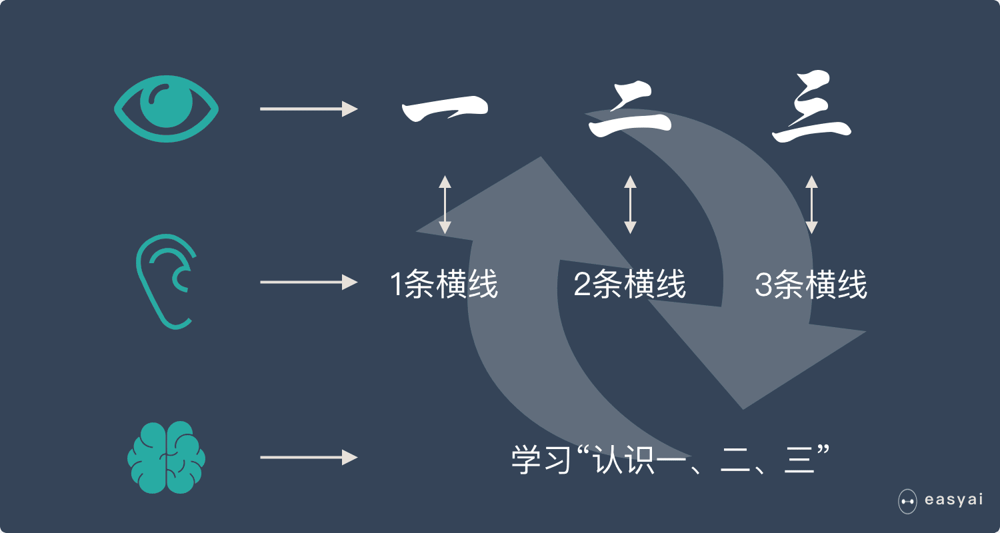
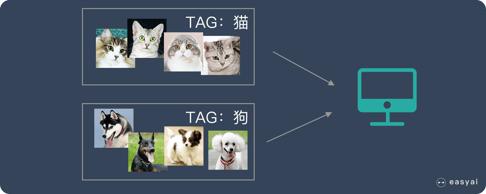
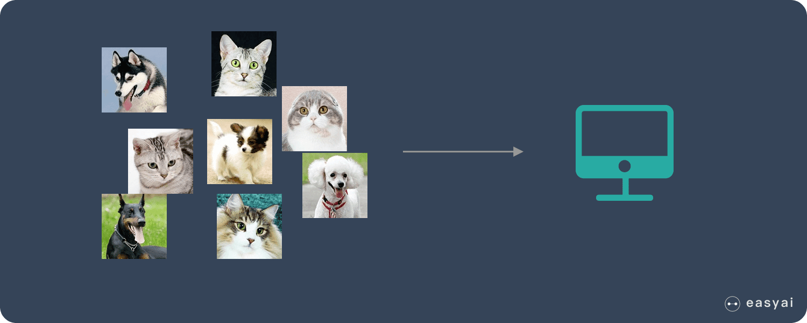

# 机器学习（Machine Learning，ML）

目的是让计算机能够从数据中学习并进行预测或决策，而不需要明确的编程规则。

## 原理

假如我们正在教小朋友识字（一、二、三）。我们首先会拿出 3 张卡片，然后便让小朋友看卡片，一边说“一条横线的是一、两条横线的是二、三条横线的是三”。
不断重复上面的过程，小朋友的大脑就在不停的学习。

当重复的次数足够多时，小朋友就学会了一个新技能——认识汉字：一、二、三。

我们用上面人类的学习过程来类比机器学习。机器学习跟上面提到的人类学习过程很相似。

- 上面提到的认字的卡片在机器学习中叫——训练集
- 上面提到的“一条横线，两条横线”这种区分不同汉字的属性叫——特征
- 小朋友不断学习的过程叫——建模
- 学会了识字后总结出来的规律叫——模型
  通过训练集，不断识别特征，不断建模，最后形成有效的模型，这个过程就叫“机器学习”

机器学习根据训练方法大致可以分为 3 大类：

- 监督学习（Supervised Learning
- 无监督学习（Unsupervised Learning）
- 强化学习（Reinforcement Learning）

## 监督学习

监督学习是指我们给算法一个数据集，并且给定正确答案。机器通过数据来学习正确答案的计算方法。

比如一大堆猫和狗的照片，我们想让机器学会如何识别猫和狗。当我们使用监督学习的时候，我们需要给这些照片打上标签。我们给照片打的标签就是“正确答案”，机器通过大量学习，就可以学会在新照片中认出猫和狗。

这种通过大量人工打标签来帮助机器学习的方式就是监督学习。这种学习方式效果非常好，但是成本也非常高。

## 无监督学习

无监督学习是指算法自己去发现数据中的模式，而不需要任何的指导。

我们把一堆猫和狗的照片给机器，不给这些照片打任何标签，但是我们希望机器能够将这些照片分分类。

非监督学习中，虽然照片分为了猫和狗，但是机器并不知道哪个是猫，哪个是狗。对于机器来说，相当于分成了 A、B 两类。

## 强化学习

强化学习更接近生物学习的本质，因此有望获得更高的智能。它关注的是智能体如何在环境中采取一系列行为，从而获得最大的累积回报。通过强化学习，一个智能体应该知道在什么状态下应该采取什么行为。

简单来讲，它更像是通过试错来学习。在强化学习中，智能体（Agent）与动态环境交互，通过行动（Action）影响环境的状态（State），并从环境中获得奖励（Reward）。智能体的目标是最大化长期的累计奖励。

## 参考

[机器学习 – machine learning | ML](https://easyai.tech/ai-definition/machine-learning/)
