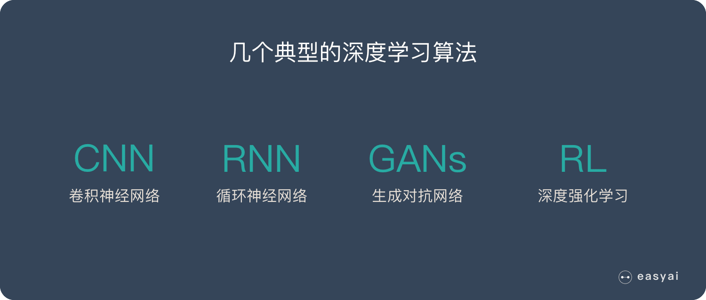

# 深度学习

通过**多层神经网络**来自动学习数据中的特征和模式。  
与机器学习方法相比，深度学习能够处理更复杂和大规模的数据，尤其在图像、语音、自然语言处理等领域表现出色。

## 白话解释

简单理解为一种让电脑模仿人脑思考的技术，它可以通过大量的数据进行学习，从而完成任务，比如识别图片中的物体、理解文字或语言、甚至做出决策。

1. 多层的“思考”过程：深度学习中的“深度”是指它有很多层，每一层都像是电脑的大脑在逐步理解问题。比如，看一张猫的图片，电脑先学会看颜色，然后看形状，接着看出耳朵和胡子，最后就知道这是一只猫。
2. 自动学习特征：传统的机器学习需要人为告诉电脑哪些细节是重要的（如边缘、颜色等），而深度学习的好处是不需要人去告诉它要看什么，它会自动从大量数据中找到这些重要的特征。
3. 模仿人脑的神经网络：深度学习用的模型叫做神经网络，就像是模拟人脑中的神经元一样，层层传递信息。通过训练，电脑的“神经网络”能够自动从数据中找到规律。

## 应用领域：

1. 计算机视觉：如图像分类、目标检测、自动驾驶等。
2. 自然语言处理：如机器翻译、文本生成、问答系统。
3. 语音识别：如语音助手、语音到文本转换。
4. 游戏和强化学习：如 AlphaGo、自动化决策。

## 4 种典型的深度学习算法

### 卷积神经网络 – CNN

CNN 的价值：

- 能够将大数据量的图片有效的降维成小数据量(并不影响结果)
- 能够保留图片的特征，类似人类的视觉原理

CNN 的基本原理：

- 卷积层 – 主要作用是保留图片的特征
- 池化层 – 主要作用是把数据降维，可以有效的避免过拟合池化层 – 主要作用是把数据降维，可以有效的避免过拟合
- 全连接层 – 根据不同任务输出我们想要的结果
  CNN 的实际应用：
- 图片分类、检索
- 目标定位检测
- 目标分割
- 人脸识别
- 骨骼识别

### 循环神经网络 – RNN

- RNN 是一种能有效的处理序列数据的算法。比如：文章内容、语音音频、股票价格走势…

之所以他能处理序列数据，是因为在序列中前面的输入也会影响到后面的输出，相当于有了“记忆功能”。但是 RNN 存在严重的短期记忆问题，长期的数据影响很小（哪怕他是重要的信息）。
于是基于 RNN 出现了 LSTM 和 GRU 等变种算法。这些变种算法主要有几个特点：

- 长期信息可以有效的保留
- 挑选重要信息保留，不重要的信息会选择“遗忘”

RNN 几个典型的应用如下：

- 文本生成
- 语音识别
- 机器翻译
- 生成图像描述
- 视频标记

### 生成对抗网络 – GANs

### 深度强化学习 – RL

深度学习和强化学习可以结合起来形成深度强化学习（DRL），即利用深度学习中的神经网络来增强强化学习的能力。深度强化学习使用神经网络来近似强化学习中的价值函数或策略函数，从而应对高维状态空间的问题。

#### 应用场景：

- AlphaGo：通过深度学习和强化学习的结合，AlphaGo 能够击败世界顶级围棋选手。深度学习用于预测局面的下一步动作，而强化学习通过试错法来提高策略。
- 自动驾驶：在自动驾驶中，汽车的 AI 需要根据路况和其他车辆的动态调整行动，通过强化学习不断优化驾驶策略。
