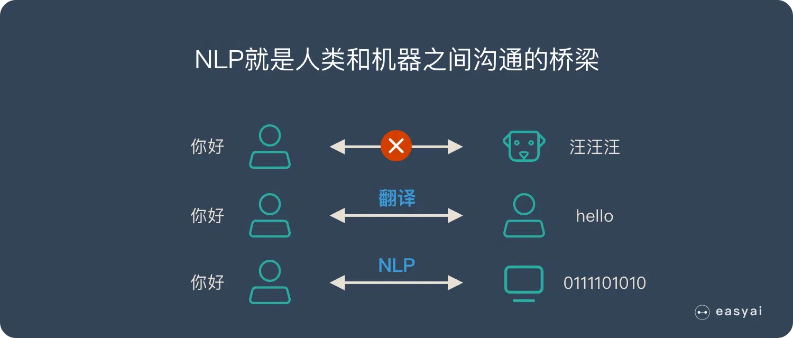

# 自然语言处理

自然语言处理（NLP）， 目标是让计算机像人类一样理解和生成语言。

## NLP 的 2 大核心任务

- 自然语言理解 – NLU | NLI
- 自然语言生成 – NLG

### 自然语言理解

自然语言理解（NLU）是指让计算机理解人类语言，包括语音识别、文本理解、文本分类、文本摘要、文本生成等。

#### 难点:

- 语言的多样性
- 语言的歧义性
- 语言的鲁棒性
- 语言的知识依赖
- 语言的上下文

> 语言的鲁棒性：通常指的是语言模型在应对不同类型的输入时，仍然能正确理解、处理并产生有效结果的能力。

### 自然语言生成 – NLG

自然语言生成（NLG）是指让计算机生成人类可读的语言，包括文本生成、对话生成、机器翻译、手写文字生成等。

#### NLG 的 6 个步骤：

- 内容确定 – Content Determination
- 文本结构 – Text Structuring
- 句子聚合 – Sentence Aggregation
- 语法化 – Lexicalisation
- 参考表达式生成 – Referring Expression Generation|REG
- 语言实现 – Linguistic Realisation

#### 难点

- 语言是没有规律的，或者说规律是错综复杂的。
- 语言是可以自由组合的，可以组合复杂的语言表达。
- 语言是一个开放集合，我们可以任意的发明创造一些新的表达方式。
- 语言需要联系到实践知识，有一定的知识依赖。
- 语言的使用要基于环境和上下文。

### NLP 的 4 个典型应用：

- 情感分析
- 聊天机器人
- 语音识别
- 机器翻译
