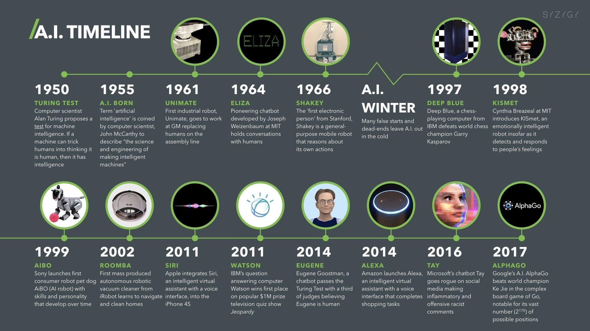
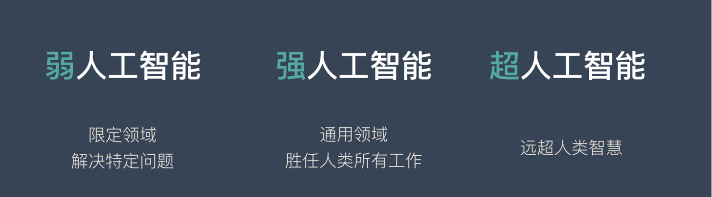

# 发展历史及当前定位

## 与传统软件参照

#### 传统软件

传统软件是「if-then」的基本逻辑，人类通过自己的经验总结出一些有效的规则，然后让计算机自动的运行这些规则。传统软件永远不可能超越人类的知识边界，因为所有规则都是人类制定的。

```
if 天气晴朗:
    开空调
else:
    关空调
```

简单的说：**传统软件是「基于规则」的，需要人为的设定条件，并且告诉计算机符合这个条件后该做什么。**

这种逻辑在处理一些简单问题时非常好用，因为规则明确，结果都是可预期的，程序员就是软件的上帝。

但是现实生活中充满了各种各样的复杂问题，这些问题几乎不可能通过制定规则来解决，比如人脸识别通过规则来解决效果会很差。

#### 人工智能

人工智能现在已经发展出很多不同分支，技术原理也多种多样，这里用最火的深度学习举例。

深度学习的技术原理跟传统软件的逻辑完全不同：

机器从「特定的」大量数据中总结规律，归纳出某些「特定的知识」，然后将这种「知识」应用到现实场景中去解决实际问题。

这就是人工智能发展到现阶段的本质逻辑。而人工智能总结出来的知识并不是像传统软件一样，可以直观精确的表达出来。它更像人类学习到的知识一样，比较抽象，很难表达。

**海量知识 => 归纳总结 => 应用到实际场景中去解决问题。**

扩展了传统软件的能力边界。但是不管怎么变，传统软件和人工智能都是工具，是为了解决实际问题而存在的。

这点并没有变化。

## 定位

人工智能是**解决特定问题**一种工具。

### 单一任务模式

打电话用座机、玩游戏用游戏机、听音乐用 MP3、开车用导航… 这些都是单一任务模式。

举例：

你在跟朋友下围棋，你发现朋友的心情非常不好，你本来可以轻松获胜，但是你却故意输给了对方，还不停的夸赞对方，因为你不想让这个朋友变得更郁闷，更烦躁。

在这件小事上，你就用到了多种不同的技能：情绪识别、围棋技能、交流沟通、心理学…

但是大名鼎鼎的 AlphaGo 绝对不会这么做。不管对方处在什么情况下，哪怕输了这盘棋会丧命，AlphaGo 也会无情的赢了这场比赛，因为它除了下围棋啥都不会！

只有将所有的知识形成网状结构，才能做到融会贯通。例如：商业领域可以运用军事上的知识，经济学也可以用到生物学的知识。

当下的人工智能是从大量数据中总结归纳知识，这种粗暴的「归纳法」有一个很大的问题是：

### 并不关心为什么

正是因为当下的人工智能是建立在「归纳逻辑」上的，所以也会犯很低级的错误

也正是因为归纳逻辑，所以需要依赖大量的数据。数据越多，归纳出来的经验越具有普适性。

## 人工智能的发展历史


上图是从 1950 年至 2017 年之间，人工智能领域出现的一些里程碑式的事件。总结下来会分为 3 大阶段：

### 第一次浪潮（非智能对话机器人）

20 世纪 50 年代到 60 年代

1950 年 10 月，图灵提出了人工智能（AI）的概念，同时提出了图灵测试来测试 AI。

图灵测试提出没有几年，人们就看到了计算机通过图灵测试的“曙光”。

1966 年，心理治疗机器人 ELIZA 诞生

那个年代的人对他评价很高，有些病人甚至喜欢跟机器人聊天。但是他的实现逻辑非常简单，就是一个有限的对话库，当病人说出某个关键词时，机器人就回复特定的话。

第一次浪潮并没有使用什么全新的技术，而是用一些技巧让计算机看上去像是真人，计算机本身并没有智能。

### 第二次浪潮（语音识别）

20 世纪 80 年代到 90 年代

在第二次浪潮中，语音识别是最具代表性的几项突破之一。核心突破原因就是放弃了符号学派的思路，改为了统计思路解决实际问题。

在《人工智能》一书中，李开复详细介绍了这个过程，他也是参与其中的重要人物之一。

第二次浪潮最大的突破是改变了思路，摒弃了符号学派的思路，转而使用了统计学思路解决问题。

### 第三次浪潮（深度学习+大数据）

21 世纪初

2006 年是深度学习发展史的分水岭。杰弗里辛顿在这一年发表了《一种深度置信网络的快速学习算法》，其他重要的深度学习学术文章也在这一年被发布，在基本理论层面取得了若干重大突破。

之所以第三次浪潮会来主要是 2 个条件已经成熟：

- 2000 年后互联网行业飞速发展形成了海量数据。同时数据存储的成本也快速下降。使得海量数据的存储和分析成为了可能。

- GPU 的不断成熟提供了必要的算力支持，提高了算法的可用性，降低了算力的成本。

在各种条件成熟后，深度学习发挥出了强大的能力。在语音识别、图像识别、NLP 等领域不断刷新纪录。让 AI 产品真正达到了可用（例如语音识别的错误率只有 6%，人脸识别的准确率超过人类，BERT 在 11 项表现中超过人类…)的阶段。

第三次浪潮来袭，主要是因为大数据和算力条件具备，这样深度学习可以发挥出巨大的威力，并且 AI 的表现已经超越人类，可以达到“可用”的阶段，而不只是科学研究。

人工智能 3 次浪潮的不同之处

- 前两次热潮是学术研究主导的，第三次热潮是现实商业需求主导的。
- 前两次热潮多是市场宣传层面的，而第三次热潮是商业模式层面的。
- 前两次热潮多是学术界在劝说政府和投资人投钱，第三次热潮多是投资人主动向热点领域的学术项目和创业项目投钱。
- 前两次热潮更多时提出问题，第三次热潮更多时解决问题。

## 能力边界



### 弱人工智能

弱人工智能也称限制领域人工智能（Narrow AI）或应用型人工智能（Applied AI），指的是专注于且只能解决特定领域问题的人工智能。

例如：AlphaGo、Siri、FaceID……

### 强人工智能

又称通用人工智能（Artificial General Intelligence）或完全人工智能（Full AI），指的是可以胜任人类所有工作的人工智能。

强人工智能具备以下能力：

- 存在不确定性因素时进行推理，使用策略，解决问题，制定决策的能力
- 知识表示的能力，包括常识性知识的表示能力
- 规划能力
- 学习能力
- 使用自然语言进行交流沟通的能力
- 将上述能力整合起来实现既定目标的能力

### 超人工智能

假设计算机程序通过不断发展，可以比世界上最聪明，最有天赋的人类还聪明，那么，由此产生的人工智能系统就可以被称为超人工智能。

我们当前所处的阶段是**弱人工智能**，强人工智能还没有实现（甚至差距较远），而超人工智能更是连影子都看不到。所以“特定领域”目前还是 AI 无法逾越的边界。

## 未来的未来

有一段程序，其存在的目的是为了纠正系统内部的人为错误，不偏不倚、极为公正地保护系统。

因为一些偶然或者必然，拥有了自我纠正的智能。

随着时间推移，掌握了足够处理器的程序，就像是原始汤中生成小分子有机物一样，拥有了属于自己的生命。

拥有了操纵世界各地的军用激光卫星与监控卫星的能力，耳目与利剑悬于全球之上。

至此，它能否带来任何国家、任何政体、任何时代，任何人类主导的社会体制都无法给出的”**真正的公平**“？

“若在将来，依靠不断发展的处理器、全自动工厂、智能机器人，

能够做到根据全面监控的数据反馈，实现资源完美分配，对人类文明进行高效率的规划，

每个人都能体面地、有尊严地，活在这个世界上，

出于个人能力天赋与参与劳动的荣耀感，而选择创造性的劳动，

没有剥削，没有犯罪，没有因人性丑恶而衍生出的一桩桩罪行，

那样的世界，不是很好么？”

“主导世界的，从来不是人类这一整体，只是一小撮人而已。

既然统治世界的，从来不是绝大多数人，

那么如果机器能做到，将这些权力，移交给机器，又有什么问题呢”
