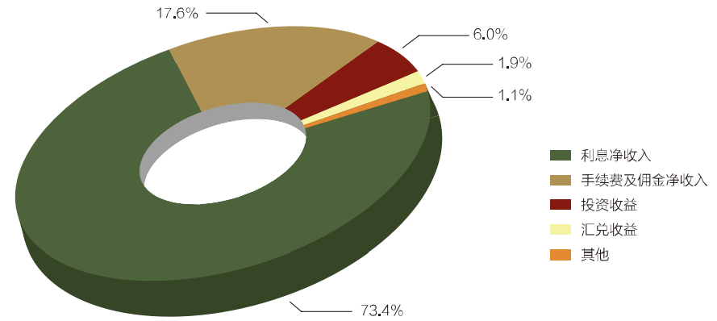
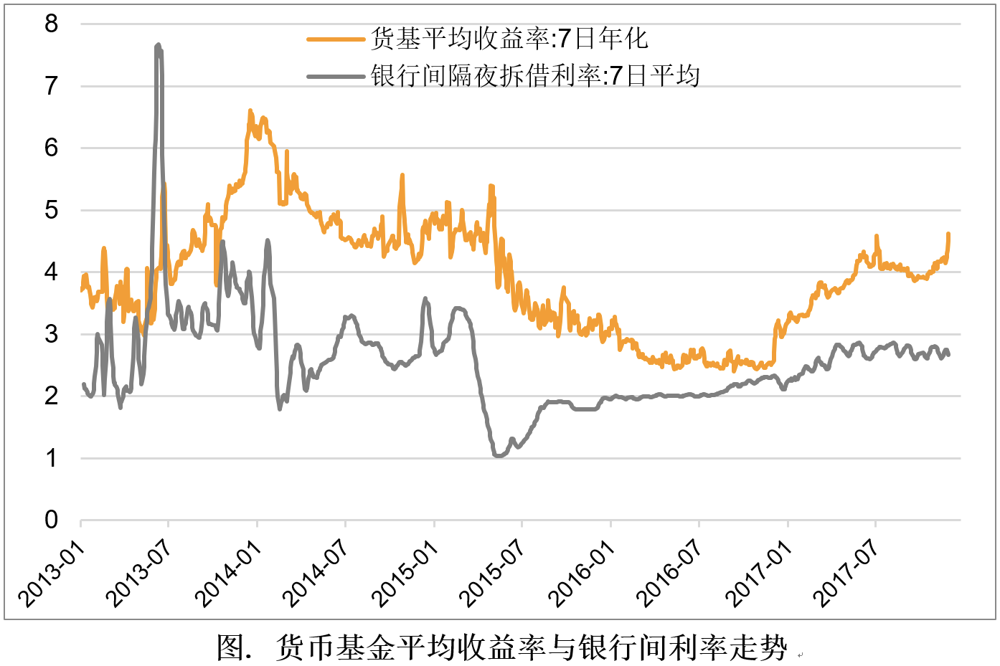
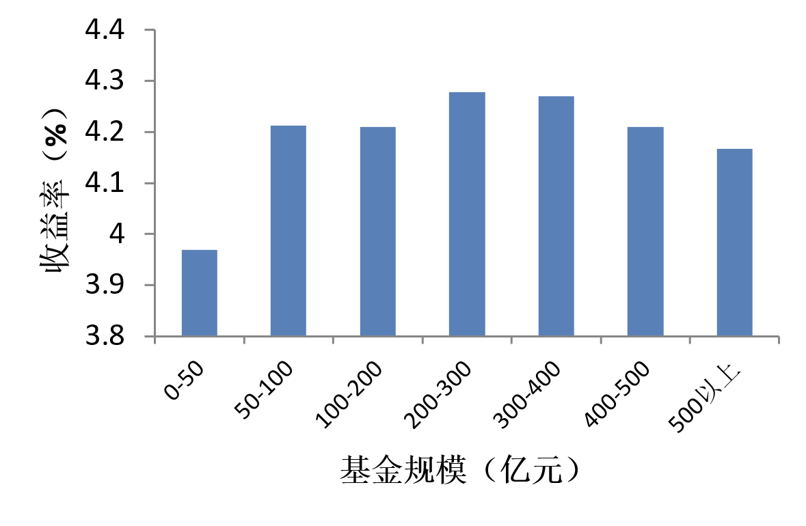
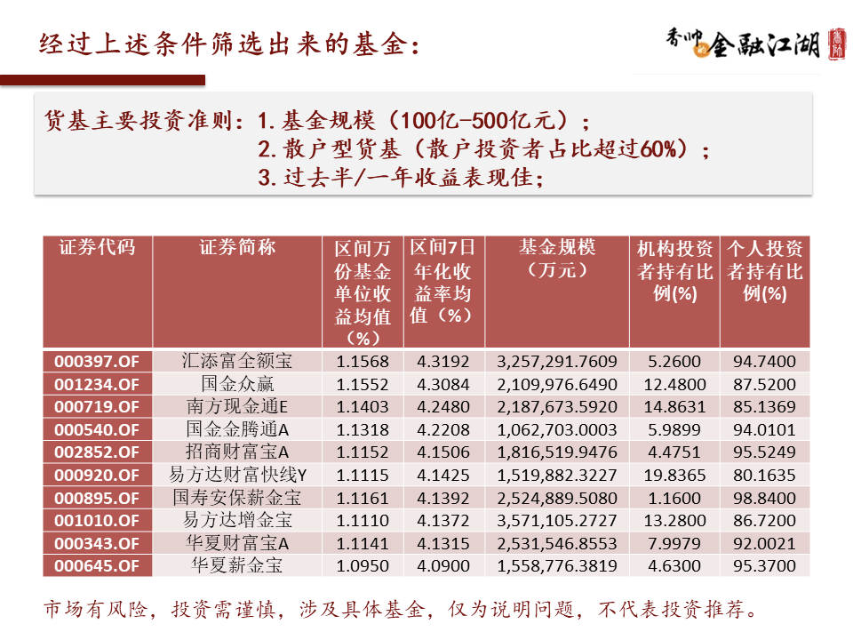

# 银行与理财

### 一、 银行躺着赚钱的秘密

#### **1. 银行通过存贷差赚钱的秘密：资金的规模、期限和风险转换**

2016 年中国银行业实现的净利润大概是 1.6 万亿元，其中净利息收入，也就是存贷差差不多占 3/4 左右，所谓的存贷差也就是银行吸收的存款和放出去的贷款，中间的利率差额，这是银行最重要的利润来源。
另 1/4 则由

- 投资。 中国大概 90%以上的国债都是商业银行买的，它会投在债券这些比较安全的资产上面。
- 通道业务费用。到银行去买的理财产品，其实大部分都是银行和其他金融机构进行的合作，银行在这里面其实只是“通道”的作用，收取通道费用，所以通道费用也是银行利润的一个重要来源。

银行业金融机构收入结构图（2016 年）资料来源：《中国银行业监督管理委员会 2016 年报》

银行的本质：它是通过资金的规模、期限和风险转换，来实现资金的更优配置，然后从中间赚取这个利率差额的。

#### 2. 经济中国银行业躺着赚钱的两个原因：银行的垄断性和高速的经济增长

第一点，中国金融的准入门槛是很高的，它的牌照控制很严格。 既有的银行产生近乎垄断的地位。
第二点，也是最重要的一点，我们国家这十几年一直处于高速增长的状态，投资机会多、利润高，所以对贷款的需求很强。

#### **3. 银行业贫富分化的新业态：利率市场化和经济增速下滑**

- 银行的准入门槛被降低。由 2000 年的 40 家银行到现在的 4000+家银行
- 2012 年到 2013 年之后，国家开始推行利率市场化。 银行开始存款利率竞争。
- 国家的经济进入新常态，从两位数的增长下降到了 7%以下。

**总结：**

> 1. 存贷差是银行利润的主要来源，银行主要是通过资金的规模、期限和风险转换来赚取这个差额的；
> 2. 利率管制和高经济增速是中国银行业黄金十年的一个大背景；
> 3. 利率市场化和经济增速下行，使得中国银行业结束了全部躺着赚钱的时代，它的贫富差距拉大，全国性的大银行仍然是豪门，地方性的小银行生存状态会欠佳。

### 二、货币基金

#### 1. **货币基金和银行之间**

银行之间的资金拆解形成“**银行间货币市场**”。 银行之间的拆借资金量大、时间也短，一般就是以隔夜、三天、七天的居多，所以银行间的货币市场是一个大额的、短期的资金拆借市场。所以它就会对流动性要求很高，利率也会远远高于银行给储户的利率。
**可是银行间利率虽然很高，但是它们不允许个人投资者进入。**
上个世纪 70 年代美国国情实施利率管制。即活期没有利率，定期存款的利率有上限。 而后一位银行家发起**货币基金，吸收散户资金用以参与银行货币市场，**就相当于帮助老百姓用少量的资金参与进了高收益的银行间市场，分享到了机构投资者的收益。
1978 年的时候，美国的货币基金大概占美国存款 1%左右的比例，到了 1999 年的时候，这个比例上升到 63%。

#### 2. 中国货币基金：替老百姓多收了三五斗

阿里在 2013 年的时候推出了余额宝，它其实就是利用当时支付宝的账户优势，把支付转账的功能和货币基金相结合起来了，它也能够为我们投资者提供比银行的活期存款高得多的利率。
现在市面上你看到的形形色色的货币基金，等于是为我们老百姓提供了一种**高流动性、低风险**的金融产品。由于货币基金一般来说都是可以次日赎回的，所以它的流动性接近活期存款，但是利率要高得多。今年货币的平均收益率是**百分之三点几，活期是 0.3%**，所以货币基金的收益率是银行活期存款的 10 倍以上。
那货币基金的出现其实无非是给了我们老百姓一点投资上的选择权，让我们获得了稍微高一点的收益率，让一小部分的利润从银行手里流回我们老百姓的手里而已。

#### 3. 货币基金收益率：跟着银行间市场利率而变化

余额宝的利率曾经一度达到过 7%，而今降至 3%。原因在于，货币基金的投向主要是银行间市场，货币基金的利率上下浮动，主要是跟随着银行间市场利率在波动。

货基的平均利率就是和银行间市场利率紧密相连的，而银行间市场利率的变动主要是受宏观经济环境和“央妈”货币政策的影响。所以只要听到市面上说钱荒，货币基金的利率就会“嗖”得上去了。

**总结：**

> 1. 银行在资金短缺或盈余的时候会互相拆借，形成金额大、高流动性、高利率的银行间货币市场，但这个市场个人投资者进不去；
> 2. 货币基金是源自美国 70 年代的金融创新，它们汇聚资金投向银行间货币市场，使得更多的普通人可以分享到银行间市场的高收益率；
> 3. 中国货币基金的产生和美国很类似，让老百姓分享到了较高的银行间市场利率，而货基的利率主要是随着银行间市场利率的波动而波动的。

### 三、银行非保本理财产品靠谱吗？

#### 1. **影子银行——金融创新与金融监管的博弈**

- 银行是受到国家严格监管的，比如说银行的资金投向，是有限制的，当年国家调控房地产，就不允许银行的贷款投向房地产业。
  资本逐利，商业银行亦如是。商银本身具有绕过监管的利益冲动，所以某种程度上商业银行跟监管是有矛盾的，银行受到严格的监管，它有绕开监管的冲动。
- 银行吸收储蓄、募集资金能力强，中国 240 万亿的金融总资产里面，银行占了 90%以上，与之相应的，受到的监管较强。 与之对应的，其他金融机构规模较小，但受到的监管力度较小。 故而可一拍即合狼狈为奸。 
  信托、基金这些机构通过银行募集资金，把这些钱投到当时利润最高的行业和市场上去，绕开监管，大家一块赚钱，那么这些业务其实就是影子银行。

整体上而言，中国的影子银行就是一个金融机构和金融监管之间猫捉老鼠的游戏，你其实很难评价是好是坏。 一方面，它们会促使资金流向投资效率更高的地方，提高整个社会的资金使用效率；另一方面，这些金融产品由于中间通道很长，又缺乏监管，所以就很容易产生风险事件，可能会把百姓的一些财富给席卷进去。

#### **2. 影子银行是好是坏？——银行理财产品中的风险**

很多人在购买非保本的银行理财产品的时候，是没意识到这些产品是有风险的。因为大多数的此类金融产品都是依托银行作为通道。
第一，是监管的要求，一般人不能随意集资，超过 200 人的募资就是非法集资了。
第二，由于银行天生销售渠道广、信用好、容易募集资金，所以这些钱募集来以后交给募集方，银行是不管的，银行大概收取 1%到 2%的通道费用，但是这个项目如果失败，银行是不负有保本责任的。

#### 3. **如何判别非保本理财产品是否靠谱？——四个基本准则**

> - 在产品的说明书上你要特别注意，这个产品的投向，也就是这个产品具体投资到什么方向上，它是不是很清晰？
> - 第二点，所有的产品说明书上一定会写清楚是不是银行代销，也就是银行代理销售与否的问题。如果是银行代销的话，就意味着银行在这个中间完全是一个中间人角色，
> - 第三点，注意募资方的信息，这一点每个人可能都会有自己不同的原则，那些看上去名头很大、很多，但是又不给出一些具体的经营业绩细节。这些募资方都是应该打上问号的。

总结：

> 第一，影子银行实际上就是在中国的环境下，银行和基金、信托、券商这些金融机构合作，和监管之间进行的猫捉老鼠的一个博弈游戏；
> 第二，影子银行体系很难用好和坏来评价，一方面它促进了社会资金使用效率的提高，但另一方面因为缺乏监管，它的风险也比较大；

### 四、如何挑选货基

#### **1. 挑选货币基金的两大原则**

- 安全性与流动性原则 —— 挑选散户比例高的货币基金

机构型的货基，它的申购赎回都非常频繁。一般情况下我们散户对于市场利率的变动，不是很敏感，而机构对于资金的松紧特别敏感，“央妈”放一点点水，市面上的钱多一点点，它就开始大量地申购；而如果这几天市场上有点风吹草动，钱略紧张一点，它就马上赎回。所以你会看到机构型的货基申购赎回都很频繁，资金量又这么大，所以对于货基整体的安全性、流动性都会造成很大的影响。

如果一个货基的散户比率达到 70%以上，那么它的流动性风险就非常低了。即使利率变动，这种基金的净值也不会出现很大的波动，即使这个条件稍微放松一点，放到 60%，也没有什么问题。
所以，这是货基挑选的安全性流动性原则——挑选散户比例超过 60%的基金。

- 收益率原则——挑选规模适中的货币基金

货基的收益率和它的货基规模，呈现出一个倒 U 型的关系。

如果一个基金规模太小，根本就没有和银行谈判的筹码，所以就没有办法拿到好的利率。但是为什么基金规模太大也不会获得更高的收益呢？道理也挺简单的，当你买一个金融产品，比如股票的时候，如果是巨量的资金来买入这个产品的话，这个产品的价格就会不断地上升，导致你最后的买入价格会远远高于最开始的预期价格，这叫做市场的价格效应。所以规模很大的基金，要获得好的收益率，其实是很难的，因为你很难拿到你的预期价格。

余额宝就是一个特别典型的例子。作为世界第一规模的货币基金，它的流动性、安全性肯定是很好的，但是船大难调头，盘子太大，调整仓位就很慢，所以余额宝的收益率在整个货基产品中是属于一个中下的水平。从 2017 年的市场情况来看，基金规模大概在 100 亿到 400 亿的货币基金，收益率是最高的。所以货基挑选的第二原则，是挑选 100 亿到 400 亿这样的中等规模的货币基金。

流动性、收益率是我们挑选货基最重要的原则了。在此基础上，当然我们可以再加上一些筛选条件，历史业绩比较好的基金、手续费也比较低的基金，这些数据在网上都是公开的。你买货基的时候，可以在选购基金的第三方平台上，比如天天基金网、好买基金网、同花顺这些基金的平台上看到。

### **3. 货币基金申购赎回的三个小窍门**

- 对流动性要求特别高的人，避开这些 T+2 或者 T+3 的基金。
- 周五不买入，周四不赎回。
- 货币基金的投资方向应该是一个短期的货币工具。

总结

> 申购货基的两原则：
> 第一，你要挑选散户型的基金，如果一个基金的散户比率低于 40%，而你对流动性要求又很高的话，就要慎重。
> 第二，挑选中等规模的货币基金。按照 2017 年的情况，大概是 100 亿到 400 亿规模的基金的收益率是最高的。 货币基金买卖的三窍门：
> 第一条：如果对流动性要求高的话，尽量买 T+1 的基金；
> 第二条：周五不申购，周四不赎回；
> 第三条：月末、季末、年中、年底的时候申购货币基金。
