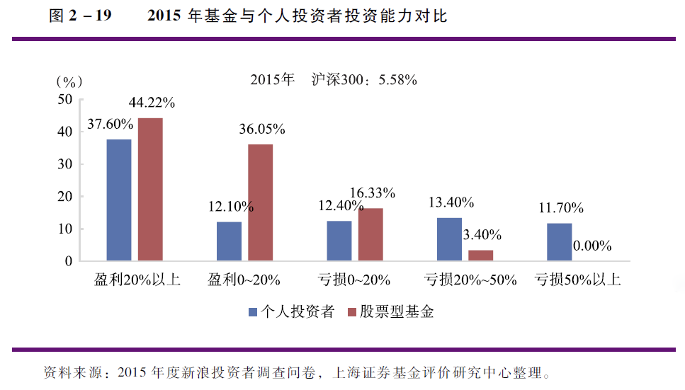

# 基金

2016 年年底的时候，全球各种基金管理的资产大概在 50 万亿美金左右。这是个什么概念呢？相当于当年美国 GDP 的 3 倍，中国 GDP 的 4 倍。

### 一、为什么说基金是资管时代的新王者？

#### 1. **基金的本质：集聚资金，专业理财**

基金就是把大家的钱集合在一起，交给专业人士去打理，然后进行多样化投资的一种资产管理方式。

#### 2. **基金的优势：分散化和专业化**

- 分散化
  从我们个人来讲，个人的资金有限，你很难有效地进行分散投资，而基金的规模大，可以覆盖更多的投资标的，把风险分散。我们平时很熟悉的股票型基金，通常它会购买几十个，甚至上百个股票，涉及多个行业。普通人很难自己做到的。而购买基金，就相当于用很少的资金量实现了分散化投资。
- 专业化

1. 投资美股，投资境外资产。
2. 进入利率较高的银行间市场。 (货基)专业化的操作，也使得基金能够更快地对市场作出反应。比如说大盘突然下挫，导致所有的股票下跌。但是，你忙着上班，无暇分析，所以经常会在错误的时间作出错误的决策。而专业的基金经理可以根据最新的信息，迅速地作出更好的判断。
   

#### 3. **基金真的帮投资者赚钱了吗？**

过去的 20 年，也就是 1997 年到 2016 年，中国股票型的基金平均年化收益率是 16.18%，比同期上证综指的收益率高了整整一倍，而债券型的基金年化收益率平均是 7.64%，是同期银行长期存款利率的 3 倍左右。
但到目前为止，我们国家的公募基金仅仅管理了 4%左右的家庭金融资产，而同期美国的公募基金管理了 22%的美国家庭金融资产，一半左右的美国家庭都在这些基金上有投资。

未来的趋势还是专业理财。在未来五年到十年的日子里，中国基金市场的规模会越来越大，产品也会变得越来越丰富。

### 二、怎么选择基金？给你一个投资坐标系

我们国家大概有 2.7 亿的老百姓买过基金。基金是现代金融市场的超级物种，有很多种类，但是其中最常见，也是规模最庞大的基金种类是那些二级市场的证券投资基金。
这个二维坐标包括两个维度，第一个叫投资标的，第二个叫投资风格。

#### 1. **一、基金投资的二维坐标之一：投资标的**

基金投资在什么类型的金融产品上，顾名思义，股票型（偏股型）基金主要投资于股票，债券型基金主要投资于债券，而货基肯定就是投资在货币市场，混合型基金可以灵活地投资在股票、债券和货币市场的工具上面。 投资标的决定了基金的基本属性，以及它的收益率、风险和流动性：股票型（偏股型）基金追求的是高收益，债券型基金追求的是安全性，而货币型基金追求的则是流动性。

> 2017 年，股票型基金（包括偏股混合型基金）的平均收益率较高为 13.7%，但风险较大，标准差为 14.9%，排名前 10%的基金平均收益率为 40.5%，排名后 10%的基金平均收益率为-10.9%，而债券型基金（包括偏债混合型基金）的收益率标准差仅为 3.5%（平均收益率为 2.6%），货币型基金主要投资于短期债券、银行存款等流动性很好的资产，风险很小（收益率标准差仅为 1.1%，平均收益率为 3.5%），赎回到账快（T+1 日到账，股基债基一般为 T+3 日到账），而且通常不收取申购、赎回费用，管理费用也较低（货币基金管理费率约为 0.15%至 0.3%左右，而股基、债基管理费率约为 0.3%至 2%左右）。

基金的投资标的对应着我们个人资产管理上的三大需求，收益、安全和流动性。

#### 2. **基金投资的二维坐标之二：投资风格**

所谓投资风格就是指基金是“主动投资型”还是“被动投资型”。
被动型的基金就叫“指数基金”，它一般就是选取一个特定的指数成分股作为投资的对象。比如说工银瑞信基金就推出过一个叫“工银沪深 300”的基金，它就是选取沪深 300 指数作为投资对象，完全复制这个指数。所以基金的收益率就会和沪深 300 指数的收益率完全一致。
而主动型的基金就是要战胜大盘，基金经理们通过挑选股票（选股），选择买卖时机（择时）等方法，希望获得比大盘指数高的回报率。
被动型基金，它投资的是“长期趋势”，而主动型基金投资的是“短期波动”。而这两种策略，也正好对应着投资者的两种偏好。

> 在金融产品的投资上，普通人大概有两种倾向。一类人，特别善于接受新的观点，适应变化。所以他们也不相信，一个规律能够左右世界，他们总是在努力地寻找新的规律。这样的投资者，我们把他们称为“狐狸型”的投资者，他们精力旺盛，愿意承担风险，善于总结经验。所以很明显，他们适合在短期波动中寻找超额收益的主动型基金。
> 与之相反，另外一类人特别地严谨、认真，所以对稳定有着更高的要求，他们总是希望找到一种长期稳定的规律，对于那些突如其来的变化，他们更多的时候是抱着一种观望的态度，这样的投资者我们可以将他们归类为“树獭型”的投资者，他们追求安全、稳定，以静制动。这种投资者就更适合从长期趋势中获得收益。

#### 4. **基金选择小贴士**

1. 看宏观大环境。作为普通人，在牛市里，你不妨多配置被动型的指数基金，稳妥地搭上好光景的快车。而在熊市的时候，可以稍微多配置一点债券型基金，获得一个较为稳妥和安全的收益。

2. 要看行业。如果你自己在某个行业里面，或者对某个行业特别地有信心，但是你又没有时间或者能力对个股做研究，那你就不妨选择行业或者板块的指数基金，分享这个行业的红利。

3. 要看时机。如果央行有降息降准的动作的时候，债券的价格会上升，债券基金的收益会上升，这个时候你应该果断地加大债基的配置。反之，央行加息或者提高存款准备金率的时候，可以下调债基的配置。

4. 要看品牌。在挑选主动型股票基金的时候，你不妨遵循“王中王”的原则，也就是挑那些王牌基金公司的王牌基金。具体而言，就是选择历史悠久，规模较大的基金公司旗下最有口碑的基金。而在挑选债基的时候，我建议你可以挑选银行系的债券基金，因为大部分债券都是在银行间市场交易的。通过银行系的基金公司，可以拿到成本更低的债券。

附：
[香帅的北大金融学课 - 幕布](https://mubu.com/doc/5N-16fg3HMM)

### 三、私募基金比公募基金更高端吗？

公募就是指包括你我他在内的社会大众，公开募集资金的方法；而私募就是指针对少数人，也就是我们俗称的高净值人群来募集资金。
根据募集来的资金要去投资什么，我们还可以把私募基金分成两类：一类是我们下周要讲的投资一级市场的“**私募股权基金**”。另外一种就是投资二级市场的**“私募证券投资基金**”，在我们国家，就叫“阳光私募”，也就是你平时听到的私募基金。在美国，它就叫做“**对冲基金**”。
私募和公募一样，其实都是投资于股票、债券这些金融产品。但是，和公募相比，私募有两大特征。**一个叫“少监管”，另一个叫“高激励”。**

#### 1. **私募基金的本质特征之一：少监管**

私募行业面对的是少部分高净值人群，一般来说，私募的门槛在 100 万，甚至更高。有更高的风险承受能力。再者监管需要成本，所以，对于私募基金，监管要比公募松得多，少了很多的限制条款。
在公募基金里，单支股票不能够超过基金资金总额的 10%。私募就较为宽松。
高风险，少监管，发挥的余地就更大。

#### 2. **私募基金的本质特征之二：高激励**

公募基金经理的收入大部分来自于固定的管理费，一般是**基金规模的 2%；**而私募基金经理的大部分收入来自于业绩提成，通常是**基金超额回报的 20%。**
公募基金经理的收入来自于基金规模，和业绩的关系不是特别地大。所以，公募基金经理普遍有一种不求有功，但求无过的心态
私募基金经理的收入就真的是考验个人能力，如果客户不赚钱的话，基金公司是没有收入的，那基金经理的收入自然也就会变得很低。
这种激励机制和收入水平的不同是公募和私募的另外一个重要区别。

#### 3. **投资私募基金比公募基金更赚钱？**

1. 私募的监管少了，难免就会鱼龙混杂，因为并不是每个人都是明星经理，都具有很好的业务能力，但是因为监管少，就很容易混到行业里面来，南郭先生滥竽充数。
2. 对于私募的基金经理人来讲，等于是拿着别人的钱去做高风险投资，输了算别人的，赢了就能获得 20%的收益提成。

所以在选择私募的时候，确实要做更多的研究，一般来讲有两个标准，你可以参考：
第一，如果基金经理大量地持有自己的基金，这就意味着他对自己的基金更加有信心，这种基金是可以选择的。
第二，你可以到网上再多方地查一下，一个基金经理如果在业界的口碑比较好，相对来讲也是会比较安全的。
\*\*

### 四、投资基金，你需要提防这些坑

#### 1. 坑 1 **抬轿子——基金之间的利益输送**

基金公司有动力去牺牲个别基金的利益，去造就一个明星基金，从而带动整个基金公司的收入。

应对：查底牌：
第一，你要关注一下这个基金公司旗下其他基金的情况，如果几个基金持仓的股票类似，业绩却差很远，就要谨慎。
第二，如果这几支基金共同持仓的还是小盘股，那么“抬轿子”的嫌疑就更大了，因为小盘股的流通筹码少，容易控盘，一拉即涨停，方便其他的基金接力“抬轿子”，然后去吸引投资者买入，而大盘股的流通筹码大，就不太容易操纵股票。

#### 2. 坑 2 **老鼠仓——基金经理对亲朋好友的利益输送**

基金经理人先用私人，或者亲戚朋友的账户去买入股票，然后再用我们投资者的钱大量地买入该股票，等股票涨到很高的时候，就卖出自己账户上的股票，而投资者的资金却被套牢了。这就像老鼠把粮食偷到到自己窝里，所以这种行为就叫“老鼠仓”。
为什么中国基金业的“老鼠仓”这么多呢？除了人性的贪婪之外，其中最重要的一个原因就是咱们这个证券市场上违规违法的成本比较低。
应对：识前科

#### 3. **坑 3——上市公司与基金公司之间的利益输送**

第一步，先约定由上市公司择机发布“高送转”、“业绩预增”等利好消息，或者是引入那些什么“在线教育”、“机器人”等等热点题材。
第二步，在信息公布之前，徐翔就开始大量地买入这个股票，拼命地拉升股价。
第三步，就是等徐翔建好仓以后，上市公司发布信息，徐翔再以大宗交易的方式接盘上市公司股东减持的股票，随后自己在二级市场全部抛售掉。
三步之后，上市公司的股东就实现了在高位减持股票，而这些股票盈利的部分，上市公司就按照五五，或者四六分成，把它汇入徐翔指定的账户，这就属于上市公司和基金公司中间搞利益输送的一个猫腻。

> 豪绅的钱如数奉还。百姓的钱三七分成。

不要过度迷信明星基金经理，尤其是那些被神化的基金经理人。
