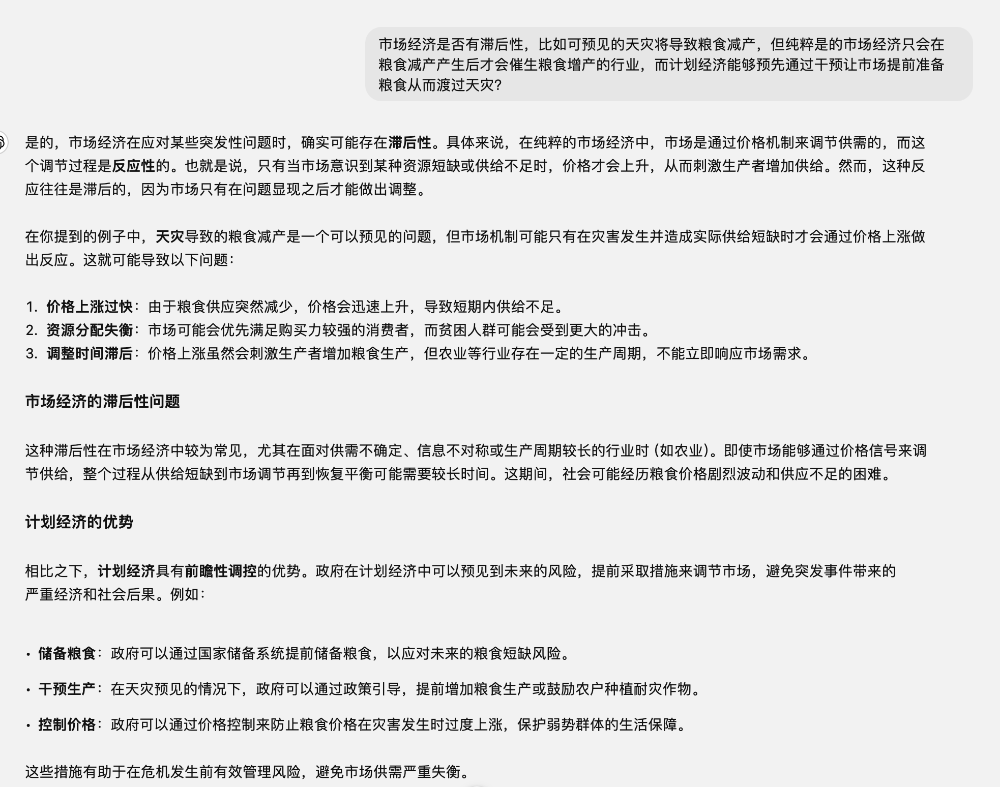

# 市场经济

市场经济是一种经济体制，在这种体制下，资源的分配主要通过市场供求机制来决定，而非由中央计划或政府直接控制。在市场经济中，生产和消费的决定主要由自由的市场力量（如消费者、企业、投资者等）来影响，价格根据供需情况自由浮动，从而协调经济活动。

## 核心特征：

1. 自由竞争: 企业和个人可以自由进入或退出市场，企业间通过竞争提高效率、创新产品，从而满足消费者需求。
2. 价格机制: 商品和服务的价格由市场供求决定。价格是信息的载体，指引生产者和消费者的决策。
3. 私有产权: 财产和生产资料归私人所有，个人和企业可以自主决定如何使用资源和生产资料。
4. 供需决定资源分配: 资源（劳动力、资本、自然资源等）通过市场供求分配到最需要的地方，生产者根据利润动机决定生产什么，消费者根据偏好和价格决定消费什么。
5. 利润动机: 企业的主要目的是通过生产商品和服务来获得利润，这鼓励了创新和提高效率。

## 市场经济的运作

在市场经济中，资源配置是由数以千计的经济行为者根据自身利益做出的许多微小决定决定的。

每当某些产品的需求旺盛时，该产品的价格就会上涨，从而为生产者增加产量提供了利润激励。反之亦然。

这与计划经济相反，在计划经济中，资源由中央政府分配，中央政府缺乏这种收集和处理海量动态信息的能力，也缺乏这种利润的激励机制。

## 优点：

- 资源高效配置：市场经济通过价格机制可以使资源更有效地流动到需求最高的地方，避免资源浪费。
- 促进创新：企业为了获取更多利润，会投入更多资源进行研发和创新，推动技术进步和产品多样化。
- 消费者主导：消费者的选择和偏好直接影响市场的走向，企业需要不断优化产品和服务来满足消费者需求。

## 缺点：

- 市场失灵：市场并非总能有效分配资源，可能出现垄断、外部性（如污染）、**信息不对称**等问题，导致资源错配。
- 贫富差距：自由市场容易导致财富和收入分配不平等，可能会加剧社会的不平衡。
- **公共物品供给不足**：市场机制难以有效提供非盈利性但对社会有益的公共产品（如国防、基础设施、教育等）。

## 现实中的应用：

大多数国家采用的是混合经济，即结合了市场经济与政府干预。政府通过制定法规、提供公共服务、调控市场失灵等手段，来避免市场经济的负面影响。

## 思考

