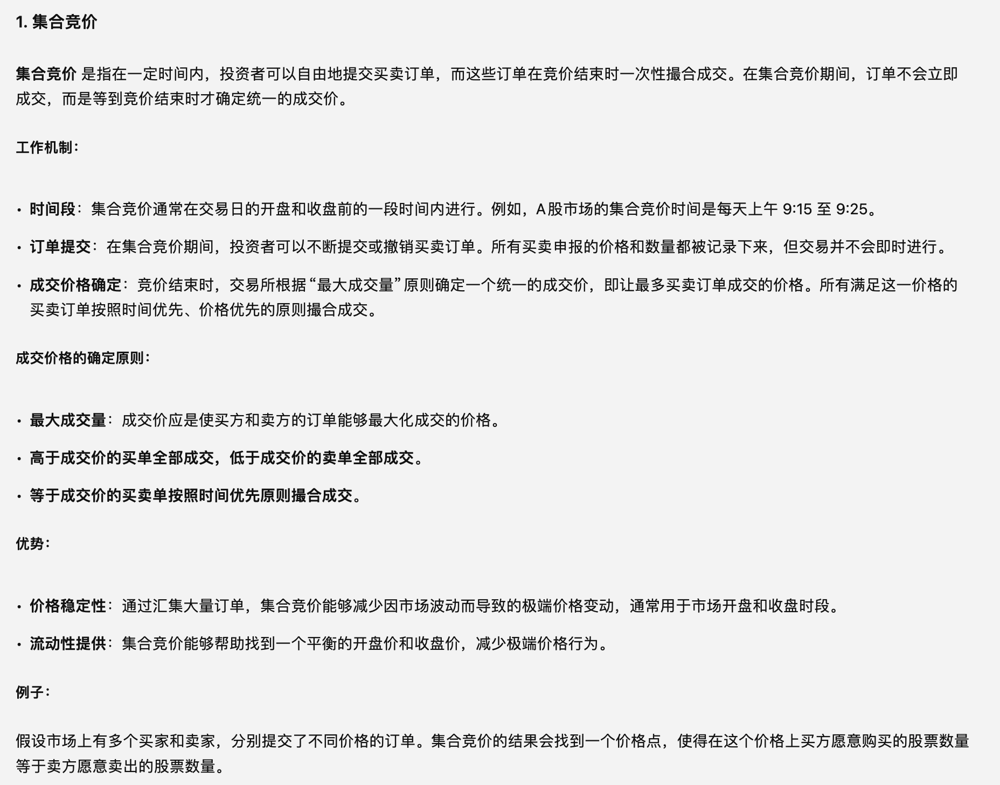

# 股票基础

## 起源

​ 股票（stock）是股份公司发行的所有权凭证，是股份公司为筹集资金而发行给各个股东作为持股凭证并借以取得股息和红利的一种有价证券。**每股股票都代表股东对企业拥有一个基本单位的所有权**。每支股票的背后都会有一家上市公司。同时，每家上市公司都会发行股票。

​ 同一类别的每一份股票所代表的公司所有权是相等的。每个股东所拥有的公司所有权份额的大小，取决于其持有的股票数量占公司总股本的比重。

​ 股票是股份公司资本的构成部分，可以转让、买卖，是资本市场的主要长期信用工具，但不能要求公司返还其出资。

​ 上海证券交易所、深圳证券交易所的成立标志着我国证券市场开始发展。1990 年 12 月 19 日，上海证券交易所开业；1991 年 7 月 3 日，深圳证券交易所正式开业。

## 交易规则

### 交易时间

每周一至周五，每天上午 9:30 至 11:30，下午 1:00 至 3:00。法定公众假期除外。

集合竞价：上午 9：15——9：25 　其中 9：15——9：20 可以撤单，9：20——9：25 不能撤单，9：25 以成交量最大的价格为**开盘价**。

连续竞价：上午 9：30——11：30，　下午 1：00——3：00

### T ＋ 1 交易制度（T 为交易日当天）

​ 股票买卖实行 T ＋ 1 交易制度，即当天买的股票 T ＋ 1 日才能卖出，当天卖的股票 T ＋ 1 才能取出现金，但可以用卖出股票的钱买其它股票或新股交款。

​ 因此，当天买入的股票，可用数量不变，第二个交易日才有相应变化，当天买入的权证，买入成交数量立刻加入可用数量。当天卖出的股票或权证，相应资金第二个交易日才是可取资金。

涨跌幅限制
​ 重组成功上市股票首日无涨跌幅限制，一般情况下涨跌幅限制为前一交易日收市价上下 10%，即一个交易日最大振幅为 20%，ST 股票及\*ST 股票涨跌幅限制为前一交易日收市价上下 5%，即一个交易日最大振幅为 10%。​ 股票涨（跌）幅价格＝股票前一日收盘价格 ×10%（或 5%）

### 成交顺序

价格优先——较高价格买进申报优先于较低价格买进申报，较低价格卖出申报优先于较高价格卖出申报；

时间优先——买卖方向、价格相同的，先申报者优先于后申报者。先后顺序按交易主机接受申报的时间确定。

### 委托规则

- 1 手=100 股
- 1—99 股为零股
- 不足 1 股为零碎股

买入委托必须为整百股（配股除外），卖出委托可以为零股，但如为零股必须一次性卖出。股票停盘期间委托无效，买入委托不是整百股（配股除外）委托无效，委托价格超出涨跌幅限制委托无效。

### 交易费用

买进费用：

1. 佣金 0.2%-0.3%，根据你的证券公司决定，但是佣金最低收取标准是 5 元。比如你买了 1000 元股票，实际佣金应该是 3 元，但是不到 5 元都按照 5 元收取

2. 过户费（仅仅限于沪市）。每一千股收取 1 元，就是说你买卖一千股都要交 1 元

3. 通讯费。上海，深圳本地交易收取 1 元，其他地区收取 5 元

卖出费用：

1.  印花税 0.1% (政府会根据经济情况调节)

2.  佣金 0.2%-0.3%，根据你的证券公司决定，但是佣金最低收取标准是 5 元。比如你了卖 1000 元股票，实际佣金应该是 3 元，但是不到 5 元都按照 5 元收取

3.  过户费（仅仅限于沪市）。每一千股收取 1 元，就是说你买卖一千股都要交 1 元

### 代码规则

- 沪市股票买卖的代码是以 600 或 601 打头，如：运盛实业：股票代码是 600767。中国国航：股票代码是 601111。

- 深市 A 股票买卖的代码是以 000 打头，如：顺鑫农业：股票代码是 000860。

- 沪市新股申购的代码是以 730 打头。如：中信证券：申购的代码是 730030。

- 深市新股申购的代码与深市股票买卖代码一样，如：中信证券在深市市值配售代码是 003030。

- 中小板股票代码以 002 打头，如：东华合创股票代码是 002065。

- 创业板股票代码以 300 打头，如：探路者股票代码是：300005

## 股票开户

## 股票风险

### 涨跌停限制

-     A股市场（中国大陆）：
-     主板市场：涨跌幅限制为 ±10%。即股票价格在一个交易日内最多可以上涨或下跌10%，超过这个幅度的交易不再进行。例如，如果某只股票的前一日收盘价为10元，则当日涨停价为11元，跌停价为9元。
-     科创板和创业板：涨跌幅限制为 ±20%。
-     新股上市的前5个交易日：不设涨跌停限制。
-     B股市场（中国大陆）：涨跌停幅度一般为 ±10%。
-     港股市场：香港股市没有明确的涨跌停机制，但设有“波动控制机制”，在股票价格波动过大时会触发临时停牌。
-     美股市场：美股没有涨跌停机制，但存在“熔断机制”。如果整个市场指数下跌达到一定幅度（7%、13%、20%），会触发市场熔断，即暂停交易一段时间。

注：涨停板只是表示在某一时刻，股票的价格达到了当天的最高涨幅（例如，主板市场为 10%），并不意味着股票价格不会下跌。

