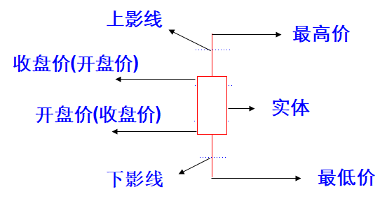

# K 线基础

K 线是提供买进和卖出的讯号以及市场反转的时机，也体现了未来股价的走向。

## 基本概念

Ｋ线是由开盘价、最高价、最低价、收盘价所组成，也是记录买方和卖方实战的过程；

- 收盘价高于开盘价就以“实体红线”表示，收盘价低于开盘价则以“实体绿线”表示
- 最高价及最低价则以“影线”表示，高价拉回则留上影线，低价拉回则留下影线
- 开盘价、最高价、最低价、收盘价的变化，构成了Ｋ线的上下影线，上下影线的变化，则反映了市场的波动方向和强度。

### K 线画法

