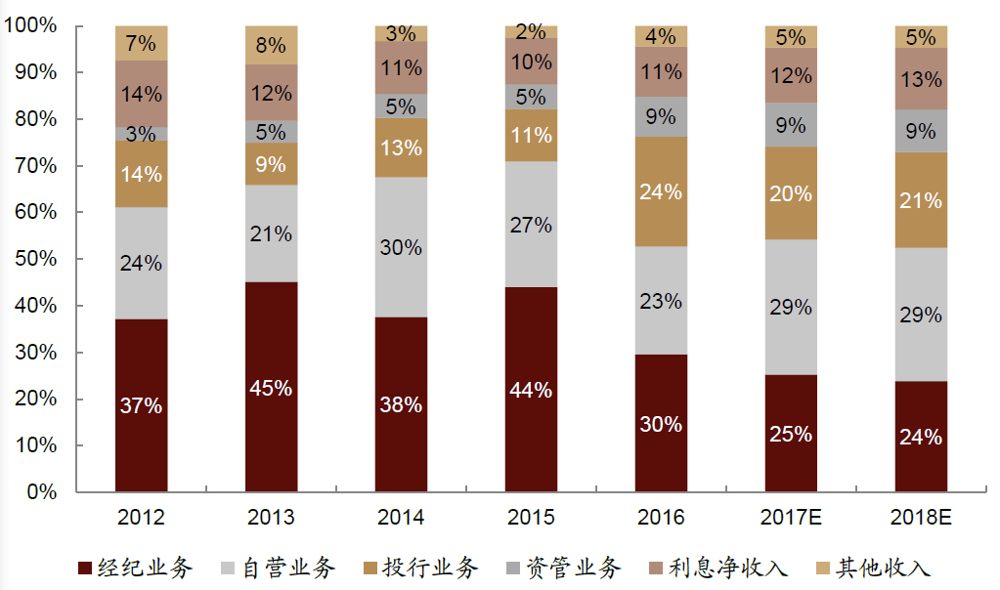
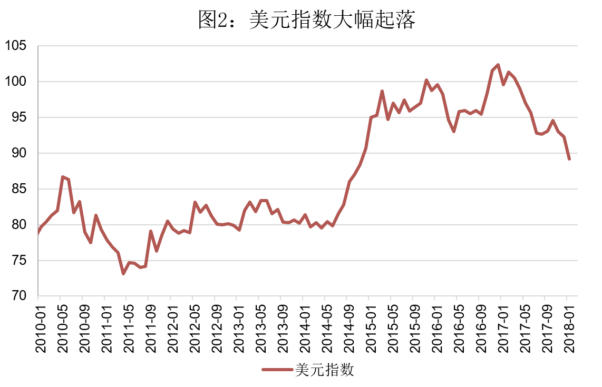

# 金融创新- 投行创新业务

### 一、零售经纪

#### 1. **投资银行转型的开始**

在零售经纪业务模式之前，资本市场是富人的游戏，在这个业务模式之后，中产阶级才真正地进入了金融市场，金融的民主化和普及化才真正地得以实现。
美林，不起眼的小投行，眼见无法与传统的豪门大投行竞争，故而另辟战场，转向新兴中产阶级。

- 向没有金融意识的普通百姓进行金融普及教育。向普通投资者免费地提供证券教育，讲解股票债券知识。
- 不断地简化开户手续，让大家迈过敢买股票的第一关。

此次的转型对投行的改变也很大。比如说在帮你买卖交易证券的过程中，投行就产生了做证券自营业务的需求和代客理财的资管业务的需求。所以慢慢地，投行就从为企业融资服务的卖方业务开始过渡到为个人、机构投资服务的买方业务。 美林在 1977 年推出的现金管理账户(cash-management-account)——你的钱白天在这个股票账户里，可以买卖股票，剩余的资金到了晚上以后，它就自动地替你转入到货币基金里，去挣货币基金的利息。这样老百姓就可以多挣一点。所以你会看到，零售经纪业务改变了金融市场中投资者的结构，然后使得整个金融市场极速地扩容，这种融资型的证券市场逐步转型为我们普通人的财富管理市场。
**“创新”这个词一点也不遥远，你对于市场需求进行挖掘，对于市场前景进行准确把握，然后在商业模式上再做一点微小的改进，可能都会成为非常了不起的创新。**
\*\*

#### 2. 零售经纪的盈利模式

在券商开户以后，每一笔证券交易都是要交“过路费”的，过路费分为佣金、印花税和过户费，全部加起来大概就是千分之一点六左右的费率。
也就是说，你买卖一万块钱的股票，大约有 16 块钱的费用产生，其中 10 块钱是印花税，交给了税务部门，然后 3 块 5 的佣金交给了券商，5 毛钱的佣金要归证监会和交易所当监管费，还有每 1000 股要缴纳 1 块钱的过户费，然后这个钱是归中债登，也就是中国证券登记结算有限公司收的。

在国外大投行的业务中，零售经纪的占比已经在不断地下降了，不到 10%。但是，中国券商对零售经纪的依赖比较大，两年前大概还占到 50%左右，2017 年是因为 IPO 的解冻，市场的交易频度也不是特别活跃，所以下降到了 1/4 左右。但这个数字，跟国际同行比，还是蛮大的。所以就证明，中国投行业的同质化竞争比较严重，在业务创新能力方面和国际大投行还是有一定的差距的。

#### 3. **选择券商的两个标准和一个窍门**

主要还是资金的规模、实力，还有能够提供的增值服务的业务方面。

- 第一，在挑选券商的时候，由于金融机构都是有风险的，所以挑那些规模比较大，实力比较雄厚的券商会比较地安心。
- 另外一条，服务体验特别地重要，尤其是在费率没有太大差异的情况底下，增值服务和你的用户体验就会更重要了。
- 由于所有的券商在不断发展的过程中间，其增值服务也是不断推出的，所以它会牵涉到一些线下的服务。所以这个时候，你挑选离你自己的家，或者说单位比较近的一些营业厅，可能在时间等各种成本上来讲都是比较便利的。

总结：

> 1. 零售经纪就是券商为散户提供的证券交易中介服务，你不要小看这个金融服务，它其实是一项非常了不起的投行业务创新，推动了整个全球金融民主化的进程；
> 2. 券商通过零售经纪业务赚取佣金，尤其在中国的券商业，佣金收入是投资银行的主要来源之一； 3. 我们在选择券商开户的时候，资金规模，还有实力排名，以及这些券商能不能够给你提供便利有效的增值服务，都是你要关注的焦点。

### 二、垃圾债券

垃圾债的另外一个名字叫 high yield bond（高收益债），就是指那些风险比较高的债券（比如说面值 100 元的（零息）一年期债券，一般企业卖 95 元，相当于收益率５％[(100-95)/100=5%]，一个企业风险大，可能就得卖 90 元,甚至更低，收益率就变成了 10%或者更高）。

垃圾债并不是垃圾，它是高收益债券。你投资得当的话，是可以刨出金子来的。

#### 1. **投资银行家对垃圾债的价值发掘**

原来的企业业绩很好，债券的等级很高，结果经营业绩下滑以后，就被下调等级，所以被称为堕落天使。经过分析后发现，这些企业的基本面其实挺好的，主要是宏观环境非常低迷，然后导致它们的经营业绩下滑，只要挺过这个难关，可能一切就会雨过天晴。

既然有堕落天使，那也可以有“小天使”。什么叫小天使呢？就是那些实力比较弱小的公司，或者现金流不是很稳定的新兴的高科技公司。它们原来真的是融资无门。发行股票发行不了，上市上不了，银行贷款借不了，发行公司债又拿不到好的信用等级，这时候垃圾债就给它们开了一扇新世界的大门。

垃圾债其实不是垃圾，它里面蕴含着很多价值投资的机会，而且也替这些中小企业的融资打开了一扇新的大门。

#### 2. **兴风作浪的垃圾债券**

以 600 万美金的资产，去竞购 14 亿的西北工业公司，自有资金就这么多，其余的钱都是通过发行这种高收益的垃圾债来募资的。这么高的杠杆率意味着什么？利润高得离谱。特别是在 80 年代中期的时候，达到了一个特别疯狂的地步。

所以从垃圾债在杠杆收购里面的运用开始，垃圾债就遭到很多人批评。但是，我们要一分为二地来看待这个事件。很多学术研究后来都发现了，垃圾债加杠杆收购这件事情对美国企业的更新换代其实是起了很大的作用的。
一方面，它治愈了美国当时盛行的大企业病。因为在大企业里面的高管，很多都不是大股东，所以他们对企业缺乏责任感，经常会浪费公司的钱，也缺乏危机感，不去励精图治。所以杠杆收购来了以后，给他们形成了很大的压力，逼着他们开始进行战略和经营上的调整。所以，大家都认为，这一拨杠杆收购的浪潮其实加快了美国企业的结构调整，使得美国企业后来变得更加健康。
另外一方面，我们要看到的就是，杠杆收购和垃圾债的合体，逼着企业更加关注短期的利益和股价。所以我们也会看到一个趋势，就是企业对研发的投入开始下降，而且人性的贪婪在这种过高的利润和过高的杠杆率里面，被放大了，催生了很多金融混乱的局面，也催生了很多金融犯罪，整个市场秩序也被搞乱了。
投资银行家一方面挖掘了垃圾债天使的一面，但是另一方面过度地运用垃圾债，又把它魔鬼的一面给勾了出来。

#### 3. **中国的垃圾债市场怎么参与？**

在中国，是有垃圾债市场的，但是名字不叫垃圾债，叫中小企业私募债。

这个债券的发行门槛非常非常地低，只要是境内注册的，而且是没上市的非房地产企业，中小微企业都可以发行。而且，对发行人也没有净资产和盈利能力的要求，而且采取备案制发行。

这么低的门槛，它的风险自然就会偏高，也就是违约率可能会比较高。所以，它也要求，一般人不要去投资这个债券市场，要让那些风险的承受能力比较高的人去投资。所以，这个债券市场的最低准入门槛是 500 万，如果你没有这个资金的话是不准投这个市场的。

但是，截至目前，我们这个中小企业私募债，也就是垃圾债市场的规模真的是很小，现在一共也就是 73 支债券，而且票面利率大概是 8%到 10%之间，在违约率又很高的情况下，这样的收益率就不太足以对投资者，构成很大的吸引力了。

所以，目前来看，中国是有垃圾债市场的，但是发展得还非常地不充分。
总结：

> 1. 其实垃圾债就是指那些高风险的债券，因为投资人的本金保障比较低，所以会要求比较高的回报率，因此又叫高收益债券；
> 2. 垃圾债其实有两种类型，一种是因为公司盈利下降，被降级成垃圾债的堕落天使；另外一种是实力较弱的小公司或者现金流不稳定的高科技公司；
> 3. 垃圾债和其他的金融工具一样，是中性的，严格遵循着高风险、高收益的原则，它为中小企业开辟了融资新渠道，但也造就了 80 年代杠杆收购的滔天巨浪。

### 三、量化交易

量化交易，这个行业也经常被称为宽客（Quants）。它看上去特别地神秘，因为它汇聚了麻省理工学院（MIT）、斯坦福、哈佛等所有顶尖名校各个专业的精英和天才，还有诺奖得主。所以这个行业的从业者经常会被称为“火箭科学家”，为什么呢？因为他们把金融市场当成天体运行，进行非常精密的计算、推演，找到中间特别细微的偏离，再设计特别复杂的工具，然后加杠杆，赚取着常人难以想象的利润。这个利润有多高呢？2006 年，来自摩根士丹利、高盛、德意志，这些投行的顶级宽客们平均的年收入是 5.7 亿美金，年龄最小的大概是 30 岁左右。

#### 1. **量化交易是什么？**

简单地说，量化交易就是依靠计算机程序实施投资策略的方法。比如说金融学上有一个很著名的交易策略叫动量交易（momentum trading），就是说股票价格向上突破的时候买入，向下跌破的时候卖出。但是这个策略说起来简单，做起来其实很难。就说 A 股市场，有 3000 多支股票，在短短的时间里要靠人力把所有的股票过一遍，其实是完全不可能的。但是现在有了计算机，就没问题了。交易员可以写代码，然后向计算机输入一个交易策略的指令：“当股票价格上涨超过 20 日平均线时买入，当股票价格跌破 20 日移动平均线时卖出”，然后把这个交易策略的指令输出去，让机器来下单操作

#### 2. **量化交易的原理和应用**

量化交易的作用就是利用计算机技术和金融理论的进步，帮助克服我们人性上的弱点，然后在投资中做出更好的决策。什么叫做人性的弱点？作为生物个体，投资者没有办法回避的一个弱点就是，我们的时间、体力、精力、注意力、判断力都是很有限的。比如说你要用传统的方法，每个证券都去仔细分析它的基本面或者看它的技术图形，那即便像巴菲特这样的股神，也只能分析很少的证券。

现在的美股市场上，量化交易大概要占到 60%左右的比重。还有就是随着大数据和计算机技术的迭代，量化投资、量化交易的应用范围也越来越广。比如说原来看一个农业股，就看看它的财务数据、历史产量，但是现在很多交易公司是怎么做的？它们利用卫星的数据来分析天气，然后把农产品的历史产量，还有相关的产量的数据都拿过来，再对农产品的未来产量做预测，然后在这个基础上再来预测分析农业股未来的表现。所以你看，量化交易的核心竞争力是什么呢？就是可以对海量的数据进行计算，然后把这个规律给提炼出来，做出预测。在一个市场很平稳的状态底下，你如果能够精确地把握这个规律，然后再加一点杠杆，当然就可以赚很多很多的钱了。

#### 3. **量化交易的风险**

量化交易是在历史数据里面去挖掘规律，所以它依赖的是历史数据，也就是过去的趋势，那如果这个趋势存在的条件发生变化，过去的策略就都没有用处了。

量化交易把金融市场当作一个稳态结构，然后从历史数据中挖掘规律，利用高杠杆赚利润。但是金融市场不是天体世界，它归根到底是人的市场。金融市场的规律会被人性所影响，而人性中间的贪婪、恐惧、欲望都会随着市场情况的变化而变化。所以说金融市场的规律和人性是一个相互作用的动态过程，市场上很少有一成不变的规律，再厉害的模型也很难应对这种突如其来的规律变化。

#### 4. **中国的量化交易路漫漫其修远兮**

中国是有量化交易的，但是其实现在处于一个特别萌芽的状态。
中国的金融市场像一条水流湍急的大河，波浪很大，这意味着什么呢？它忽上忽下使得很多的趋势和现象很容易就被浪头盖掉或消失掉。这句话是什么意思呢？中国的市场规律变动是非常非常频繁的，就使得中国的这种量化交易策略非常不稳定。

总结：

> 1. 量化交易，就挖掘海量数据，寻找规律，然后使用这个规律进行自动的计算和决策，获得高收益的投资模式；
> 2. 投资银行曾投入大量资源，促进了量化技术的发展和应用。很多投行内部就设有巨型的量化交易基金和部门；
> 3. 量化交易有它适用的条件，它在规律稳定的时候可以获得很高的收益，但是如果规律发生了巨大变化，而我们又没有能及时调整的话，可能会带来巨大的损失。

### 四、如何正确认识形形色色的“金融创新”？

创新，可以是天使，也可以是魔鬼。尤其在中国这种金融市场薄弱、金融知识匮乏的市场里，很多创新都容易流于概念的炒作。

#### 1. **“智能投顾”这个投资顾问到底智能吗？**

\*\*
根据大数据来对每个客户进行动态的风险测评，然后再根据每个客户的风险偏好推荐最合身的证券投资组合。其实这背后的金融理论一点也不科幻，一点也不尖端，这就是 1952 年马格维茨提出的投资组合理论（Portfolio Theory），马格维茨凭这个理论在 1990 年拿了诺贝尔奖。这个理论其实说的就是如何根据每个人的风险偏好，在千万个证券里面计算出你的最优投资组合。看上去，现在我们个人的数据沉淀这么多，大数据的计算能力这么强，这个模式在理论上好像是可以成立的。但是你要考虑到，这对金融服务机构有非常高的要求。

1. 首先得拥有海量的个人实时数据。

2. 得有极强的大数据分析能力。

3. 还必须有大量的像行为金融学、心理学、计算机编程方面的高级的专业人士。

现在放眼市场上，有几个机构能够做到？像腾讯、阿里、平安等少数几家超级企业，可能具备这个潜质，但是仍然需要很长很长的时间去挖掘数据，理解人性，修正模型。其实就算这几家企业真正地能做到智能投顾，还路漫漫其修远兮。

#### 2. **机器人怎么选股？**

机器人选股不属于智能投顾这个范畴里面，它属于量化交易。
中国市场变化快，规律不稳定，小概率事件时常发生，这种脱离了人工监测的机器人选股，风险是极其大的。远的不说，就说今年以来的金融严监管，几乎所有的量化策略都失灵了，尤其是最近两个季度，很多量化基金的绝对收益在 1%到 2%之间，比你的银行存款都要低得多。所以说，很多机构说的什么智能投顾、机器人选股，很多时候就是营销的噱头。我希望你对这智能投顾和机器人选股这两个概念要有一个清醒的认识。

#### 3.**P2P 投资靠不靠谱？**

什么叫 P2P？就是 Peer to Peer，也就是个人对个人的贷款平台。
P2P 平台为什么会频繁出事呢？不是因为监管的问题，而是因为它背后的金融逻辑不对，其实监管部门对 P2P 平台的定义是非常精确的。像银监会，是怎么定义 P2P 平台的呢？它就是“网贷平台，就是金融信息中介，你不得直接或者间接地吸纳存款资金，不得非法集资”，换句话说，就是不允许你搞资金池。这就和 P2P 平台要做的贷款业务发生了矛盾。为什么呢？P2P 做的是个人对个人的贷款业务。贷款业务的核心是什么？是去了解借款人的资质，包括他的还款能力、还款意愿。

- 第一，互联网是没有办法自动甄别信息的真伪的。比如说，你在要求借款人填表的时候，有哪个借款人会主动地说自己不诚信呢？除了极个别超级互联网公司之外，网上留下的这些零碎信息，根本就达不到征信的要求。互联网可以传递真实信息，也可以传递虚假信息，这两种信息对于互联网来说是完全一样的。所以说，识别借款人资质的工作不是说有了互联网就可以自动完成的。
- 第二，作为信息中介，你就只能收取信息中介费，这个费用是很低的，你没有办法通过吸收存款来赚取存贷差。那么这一点点收入，很难覆盖贷款业务的成本。举个例子，很多人都喜欢拿美国的网贷平台，也就是 P2P 平台的鼻祖 Lending Club 作标杆。Lending Club 确确实实是始终坚持着信息中介的路线，不开资金池，不接触资金，就收取一点点双方的服务费为盈利点。这家被炒得很火的企业实际上盈利是非常低的，光 2016 年它就亏损了 1.46 亿美元，然后在它当时轰轰烈烈上市以后，它的股价至今为止已经跌了 80%，上市初期的时候，市值是 50 亿美元，截至今年，市值已经只剩了 17 亿美元。所以，在目前的情况下，一个信息中介想支撑贷款业务的成本，是非常难的。
- 第三，就是 P2P 做的小额和微额贷款，本来就是传统银行不愿意做的高风险、高成本业务。现在很多 P2P 平台，压根儿没有互联网技术，也没有任何金融专业知识。所以，没有数据，没有风险管理，也没有有效的获得客户的渠道，怎么可能不出问题呢？

一个 P2P 平台要成功，必须有海量的高质量数据，有有效的风险识别技术和强大的算法。换句话说，你投资的这个 P2P 平台需要在互联网和金融风控这两个技术上有非常高的壁垒。
金融创新要成功不是那么容易的事情。第一，它需要背后的金融逻辑过硬；第二，它需要满足现实中的条件，如果这两条做不到的话，金融创新就可能只是噱头，或者是海市蜃楼。

总结：

> 1. “智能投顾”就是根据大数据来对每个客户进行动态的风险测评，再根据客户的风险偏好推荐最“合身”的股票债券或者投资组合；
> 2. 机器人选股不是智能投顾，而是量化交易；
> 3. P2P 平台是为个体与个体之间的网络借贷提供信息中介的公司。P2P 平台要成功，必须有海量的高质量数据，有效的识别技术和算法，在互联网和金融风控这两个技术上有很高的壁垒；
> 4. 金融创新需要过硬的金融逻辑和充足的现实条件。

### 五、如何判断人民币汇率走向？

过去两年半的时间里，人民币兑美元汇率坐了一次过山车，先是 6.2 左右（即 1 美元兑 6.2 人民币），贬值到 6.9 左右，正当大家纷纷预期人民币“破 7 望 8”的时候，又突然转头向下，从 6.9 左右升值到 6.3 左右。很多人都好奇为什么会这样？尤其是，这几年我国经济趋势下行，很多人都看空人民币，人民币也很配合地贬值，可是，贬着贬着，怎么就升回去了呢？

#### 1. **汇率波动，究竟是谁惹的祸？**

****
以前人民币是盯住美元的，美元升值的时候人民币也就被动升值，被美元拉着升值。我国一直到 2015 年 8 月的时候才不再盯住美元，开始对美元贬值，人民币前两年的贬值，其实是抵消了之前的被动升值。后来，美元开始贬值，但是此时人民币已经不盯住美元了，所以就相对美元升值。但是，尽管相对于美元升值，相对于其他货币，还是很稳定的。
所以，人民币汇率之所以之前会出现大幅波动，背后的原因是在美元波动。中国有句古话，树欲静而风不止，人民币是树，美元是风，树是静止的，而风是动的，树只好随着风动。

#### **2. 美元为什么会出现大幅波动？**

美元是当今国际货币体系的基础，全球的重大政治、经济、军事事件，都会影响美元。

- 第一个关键因素，是美元加息。美国从金融危机以来，维持接近于零的利率水平，已经很多年，2014 年的时候，美联储放出风声要开启加息周期，于是，从 2014 年年中，在加息预期的刺激下，美元开始大幅升值，一直到 2016 年年底，累计升值超过 25%。在这期间，美联储也确实稳步加息，从 2015 年开始已经连续加息 5 次，加息预期得以实现。现在呢，加息的靴子落地之后，美元的升值压力也就慢慢消退了。
- 第二个关键因素，是全球经济复苏。2016 年下半年开始，全球经济开始复苏，欧洲的经济复苏尤其显著。2017 年，欧元区增速达到 2.5%，十年最高，欧洲经济的强劲复苏，带来了欧元的强劲上涨。从 2017 出到 2018 年初，欧元对美元升值了 11%了。这是什么含义呢？美元和欧元是当今的两大货币，此消彼长，欧元的升值就是美元的贬值。欧元以外的其他货币，也都随着经济的复苏大幅上涨。

为什么经济复苏，美元会下跌，其他货币会上涨的？道理是这样的。中国有句古话，叫做“盛世古董、乱世黄金”，说的是战乱的时候，安全资产最重要，繁荣的时候，有风险，但是也有高收益的资产，会受到欢迎。
当今世界最安全的货币是美元，前几年全球经济不是很好，又碰上美元加息，所以美元大涨。到了 2017 年，全球经济强劲复苏，风险资产受到追捧，原来不被看好的欧元和其他货币，在经济强劲复苏的背景下，受到追捧。

#### 3. 如**何判断美元的未来走势？**

理解汇率走势，要区分长期和短期，长期看趋势，短期看波动。

> 看长期趋势，要看影响国家综合实力的根本性的、基础性的变化。比如说美元，美元的长期趋势是贬值。为什么这么说，这是由美国综合力量的相对下降决定的。当今世界正在从单极格局，演变成多极格局。从美国的一家独大，演变成美国、欧洲、中国等多极共存的局面。这样一来，美元的相对价值，长期看是下降的。欧元、人民币等货币的相对价值，长期看是相对上升的。而且，中国经济和其他一些发展中大经济体，依然保持较快增速，长期升值的潜力依然不可低估。
> 看短期波动，要看一些短期的重大事件，这些事件会主导一些短期的，比如说 2-3 年的汇率变化。比如说，2014 年的美元升值，主导力量是美元加息的预期。2017 年的美元贬值，主导力量是全球的经济复苏。

如果全球的经济复苏能持续，则是一个导致美元继续贬值的力量。再比如说，如果朝鲜局势又变得不稳定，甚至发生小规模的冲突，那么美元安全资产的属性又会显现出来，是一个导致美元升值的力量。
判断美元的短期走势，要留意这些重大的风险事件。
总结:

> 1. 过去两年人民币对美元汇率的大幅波动，是美元导致的，而不是人民币导致的。所谓树欲静而风不止，这里的树是人民币，风是美元；
> 2. 美元在过去几年的大幅波动，是一些重大事件驱动的，最重要的是美元加息和全球经济复苏；
> 3. 理解汇率变化，不仅要看短期的重大风险事件，还要看长期的趋势。前者主导 2-3 年的波动，后者主导更长时间的趋势。长期看，美元是贬值的，人民币是升值的。
