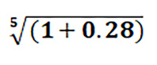
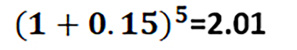
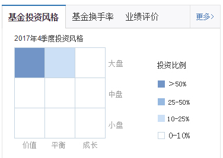

# 基金业绩

### 一、“不要把鸡蛋放在一个篮子里”有理论依据吗？

基金有分散化，也就是风险分散这个特征。在很多人的认知中，风险分散不就是不把鸡蛋放在一个篮子里吗？实际上，风险分散的背后有一个非常深刻的金融理论，这就是今天我要给你讲的，马科维茨的投资组合理论。这个理论被称为“现代金融学的宇宙大爆炸理论”（Big Bang of Modern Finance），从某种意义上说，它为基金的分散化和专业化提供了坚实的理论基础。

#### 1. **投资组合——风险分散的魔法**

投资组合就是你按照一定的比例把资金投资在不同的证券上。和投资单个证券相比，投资组合最大的优势就是“分散风险”，通过基金投资的基本原理，就是投资组合。

随着股票数目的增加，你的这个投资组合的风险呈现出单调下降的一个趋势。当股票数目增加到 100 的时候，风险已经下降到了 7.68%。 当组合中包含的股票达到一定数目后，风险就下降到了一定的水平，然后我们再增加股票数目，就没有效果了。

#### 2. **投资组合理论——华尔街第一次革命**

分散化是怎么降低风险的，其实在市场上有很多人早就在无意识地运用这种逻辑，但是一直到 1952 年，这个逻辑才被芝加哥大学一个叫马科维茨的博士生挖掘出来，然后形成了一套系统的金融框架。
把组合中所有证券的投资比例视为变量，然后就把证券资金配置的问题转化成了设计一个数学规划，对每一个固定的收益率来求最小方差，或者对每一个固定的方差求解最大的收益率，解析一组多元方程，就可以找到使这个投资组合收益最大，或者风险最小的投资决策。
这个模型提供了一套科学的、量化的框架，你只要有足够的历史数据，就可以准确地找到最优的投资组合，也就是从这个时候开始，**投资就从一门经验和艺术逐渐向科学和技能转变**。而你知道，技能是可以通过后天的系统化学习获得的。
所以，当我们说到基金有“分散化”和“专业化”这两个特征的时候，这并不是两个干瘪的名词，它的背后是有一个很强大的理论逻辑在支持的。更重要的是，现代金融学的几乎所有分析，都没有脱离马科维茨的“风险—收益”这个框架。

### 二、选股能力和市场风险：阿尔法收益和贝塔收益

市场上那么多主动型基金，它们的收益到底来自哪里呢？这就是我们今天讲的这两个金融学概念：承担风险带来的贝塔收益（风险收益）和基金经理能力带来的阿尔法收益（选股收益）。

#### 1. **阿尔法收益和贝塔收益**

“高收益，高风险”： 金融资产到底有什么风险呢？
对金融资产的风险来源越清楚，你对它的收益是不是可持续也会更明白。
在股票价格波动的背后，有一些共同的因素，还有一些个别的因素。换一句话说，金融资产的风险应该来自两个方面，一个是来自整个市场的风险，另外一个就是来自资产个体的风险。

上个世纪 60 年代的时候，美国华盛顿大学的威廉·夏普就观察到了这个现象，然后他开始思考一个问题，既然金融资产的风险可以分为两个部分，而收益又是来自风险，那么是不是金融资产的收益也可以拆解成两个部分呢？
他把金融资产的收益拆解成两个部分，和市场一起波动的部分叫贝塔收益，不和市场一起波动的部分就叫阿尔法收益。给定一个市场基准的话，每个金融资产都可以算出一个贝塔。如果贝塔等于 1，就意味着这个金融资产和市场波动保持着一致。贝塔大于 1，就意味着这个资产涨跌的幅度比市场要大。反之，如果贝塔小于 1，就意味着这个资产的涨跌幅度会比市场小。

#### 2. **基金的阿尔法收益和贝塔收益**

基金的收益当然也可以拆解成贝塔收益和阿尔法收益两个部分。你会发现，获取这两种不同的收益，所要求的基金经理的能力也是不一样的，所以他们获得的报酬也是不一样的。

在基金业里面，你可以把贝塔收益看作是一种相对被动的投资收益，基金经理追求的是一个稳健的市场平均收益，所以基金经理在大部分情况下都会顺势而为，随着大盘一起起起伏伏。而阿尔法收益则要求基金经理主动决策，通过选股和选择买卖时点，力争获得一个比市场平均值要高的收益。
被动型基金，也就是各种指数基金，其实它们挣的就是一个贝塔收益，也就是承担市场风险所带来的收益。而那些主动型基金，挣的是阿尔法收益，也就是基金经理的管理能力、选股、择时所带来的收益。这就是为什么被动型的基金会收取更低的管理费，因为管理费是付给基金经理人的费用，而被动型基金所获得的贝塔收益和基金经理的资产管理能力的关系就没有那么密切。

一个比较有趣的例子是我们在前面课程里讲过的达里奥的桥水基金。他在自己的对冲基金中就引入了阿尔法和贝塔分离的策略，他为此设立了两个基金，一个叫纯粹阿尔法（Pure Alpha），一个叫全天候（All Weather）。纯粹阿尔法很好理解，它就是一个典型的主动投资策略，他运用像期权、互换，或者期货等金融衍生工具对金融市场风险进行对冲，然后规避市场的涨跌带来的风险，只获取基金经理挑选股票和其它资产带来的超额收益。所以，它的收益主要来自基金经理的投资管理能力，取得的是阿尔法收益。全天候基金则比较特殊，一方面它仍然是买入股票、债券、大宗商品等市场指数产品，获取贝塔收益。但是要记住，股票、债券、大宗商品这些指数产品，它们的风险其实是不一样的，所以它们的贝塔收益也是不一样的。而达里奥会根据宏观经济环境来调整这些资产的配置。比如说经济强劲增长的时候，就加大股票指数的配置，而出现衰退的时候，就加大债券指数的配置。这些调整的目的就是一个，获得更高的贝塔收益。所以，你不妨将它理解成一种主动型的被动投资策略。

除了这种通过调整资产配置来获得主动的贝塔收益以外，基金经理还可以通过加杠杆的方式放大贝塔收益。比如说一个指数基金经理，可以将自己购买的金融资产进行抵押，借入资金，购买更多的指数资产，这样当指数上涨的时候，这个基金就可以获得更多的收益。当然了，指数下跌的时候，这个基金也会承担更多的风险。

### 三、为什么说“在投资的世界里，活得久才是王道”？

在投资的世界里，活得久才是王道。 在选择基金的时候，我们应该找那些资深的，经历过牛熊转换的基金经理。

#### 1. **高收益率错觉**

假设现在有两个基金经理，在 5 年的时间里，一个非常激进，5 年中有 3 年都取得了 100%的回报率，但是有 2 年亏损了 60%。另一个基金经理则非常平稳，每年取得 15%左右的收益率。这两个基金经理谁的业绩更好呢？
我们在学校里做过这个实验，不准你进行计算，要求只用直觉来作出选择。大部分的年轻人都会选择那个大起大落的基金经理，原因很简单，100%的年化收益率太诱人了，而另一个 15%的涨幅感觉涨得太慢，不过瘾。
好，我现在来告诉你实际的情形是什么。如果你经过一个简单的计算，你就会发现，第一个基金经理，5 年的累计收益率为 28%，平均每年是 5%左右，也就是 1.28 开五次方根：
  
第二个基金经理实现了 5 年翻倍，累计收益率为 100%： 
    
这就是一个典型的高收益错觉，这个错觉的产生和我们人类“短视”和“有限注意力”的认知习惯有很大关系。我们常说，鱼的记忆只有 7 秒，其实人类也一样，越是近期的信息，在我们脑中的权重越大

#### 2. **基金经理人的选择**

一个基金经理的从业年限越长，他所管理的基金业绩就越好
最近有篇文章，考察了日本几代人的风险投资决策，在控制了年龄、职业、性别等各种因素之后发现，凡是经历过重大地震灾害的个人，都会明显地倾向于采取风险对冲的活动，这个逻辑如果放在基金业就会体现在基金经理人是不是经历过经济周期，然后具有穿越牛熊的风险应对能力。
当市场上都是没有经历过周期洗礼的玩家时，这本身就是一种市场风险，因为这些人的行为会加剧市场的波动，有时候甚至会将一个小小的冲击变成一个系统性的风险。
为什么说资深的，有较长连续任职期限的基金经理会有更好的长期业绩呢？不仅仅是因为他们有经验，而且是因为我们人类的经历会深刻地影响着我们的偏好和未来的决策，而那些穿越经济周期活下来的基金经理，会有更好的风险控制的能力。

### 四、晨星九宫格：购买基金的必备武器

#### 1. **为什么要判断主动型基金的投资风格？**

什么是主动型基金的投资风格？ 主动型基金就是试图通过选择行业和具体的股票，然后去捕捉那个买入和卖出时点，去获得一个高于市场平均水平收益的基金。但是，市场上还有那么多证券，即使是专业的基金经理，也受限于自己的“有限注意力”，只能够专注于某些类型的投资，比如说去投成长股或者价值股，大盘股或者小盘股，这些基金投资上的不同偏好就是主动型基金的不同风格。
准确地判断基金的投资风格非常重要，为什么呢？因为不同的投资风格所承受的风险、所取得的收益是非常不同的，换言之，因为风格的不同，评价基金业绩的基准会变得非常不同。这就像两个小孩都宣称自己拿了班上的第一名，但是你要仔细去看，其实两个人一个是在快班，一个是在慢班，虽然听上去他们的相对排名是完全一致的，但实际的绝对水平肯定是有很大差异的。同样的道理，在考虑一个基金排名的时候，你也必须找到和这个基金同类型投资风格的基金来比较，否则单纯从绝对收益来排名，就很容易忽略收益背后的风险。

#### 2、晨星九宫格是什么？

那怎么来判定这个基金的投资风险呢？全球基金业最著名的研究和评级机构晨星公司（Morningstar），研发出了一整套基金的评价体系，这套体系基本上被全球的基金业当作行业标准，其中“晨星投资风格箱方法”（Morningstar Style Box）就是基金业识别基金投资风格最广泛应用的一个方法。
这个方法的应用一点也不复杂，首先晨星按照基金持有股票的规模进行排序，然后将基金定义为“大盘”、“中盘”和“小盘”。紧接着他们再按照基金持有股票的成长性来进行排序（这个指标可以用股票的账面净资产除以市值来表示），在这个排序的基础上，将基金的风格定义为“价值型”、“平衡型”和“成长型”。
所谓价值型一般就是指“白马绩优股”，比如说沪深 300 中包含的一些股票；所谓成长型一般就是指收入或净利润增长很快的股票，比如创业板上的一些股票；平衡型自然就是介于成长型和价值型中间的股票。在按照这两个要素进行排序后，晨星画出一个正方形，纵轴描绘的就是基金所持股票的规模，分为大盘、中盘、小盘，横轴描绘的是基金所持股票的成长性，分为价值型、平衡型和成长型。那么这个包括九个网格的正方形就是著名的晨星投资风格箱，它的每个格子对应着一种基金的投资风格，比如说大盘价值或者是小盘成长等等，所以又被称为晨星九宫格。
这个投资风格箱用一种非常简单和直观的方法，描述了主动型基金的资产配置风格，这个方法使得投资者可以依据基金的真实投资风格，而不是根据它的名称或者广告来评价基金。同时它也为基金的分类和追踪基金的投资组合提供了行业标准，所以在基金业得到了广泛的应用。错判基金的投资风格真的会造成很多错误的投资决策，比如说大盘价值基金比小盘成长基金的绝对收益率看上去要低得多。
像美国在 1990 年到 2015 年的这 26 年间，大盘价值型基金的年平均收益率是 9%左右，而小盘成长基金则是 17%左右，所以你很容易得到结论，后者的业绩要好得多。但是如果我们看另外一个数字你就会发现，同期大盘价值基金收益率的标准差（也就是风险波动率）是 10，而小盘成长基金收益率的标准差是多少呢？是差不多 20%，如果从风险-收益比（收益率/收益率标准差）的角度来看，你就会发现两个基金的表现其实差别不大，甚至大盘价值基金还要略略地好一点点。

#### 3、宫格背后的金融学逻辑：价值溢价和规模溢价

听到这里的时候，你可能还有问题，那晨星判断基金风格的这两个指标到底是怎么定出来的呢？千万不要以为这是拍脑袋的结果，其实这种划分涉及了金融资产定价理论中两个非常重要的概念，叫价值溢价和规模溢价。
大概在六、七十年代业界就开始发现，从长期来看小盘股比大盘股有更高的收益率，那种很稳定的蓝筹股也比成长型的股票有更高的收益率，这件事让人非常地困惑，为什么呢？我给你举个例子你就明白了。现在我们假定世界上存在着两种类型的股票，假如说一种类型的股票比另外一种类型的股票表现更好，那么你想想看会产生什么现象？只要我们大家都是理性的，我们就都会去争相买那个表现更好的股票，对不对？那么这个股票的价格就会被推高，收益率就会下降。
所以说从长期来看，两种类型的股票不管是成长对标价值，还是大盘对标小盘，收益率都不应该存在显著的差异。但是在实际上，价值股的收益率高于成长股，小盘股的收益率高于大盘股的现象却持续了十好几年，基金经理们也早就意识到了价值溢价和规模溢价的存在，他们就开始有意识地专门将资金投向价值股和小盘股。换句话说，如果一个基金经理，投资价值股或者小盘股挣到了高收益，这不是因为他的选股能力，而是因为市场上存在着这种溢价。
也正因此，判断基金的投资风格就显得更重要了，否则你就无法分辨出基金收益中哪些是来自于市场的整体波动，哪些是来自于基金的投资风格，而哪些才是真正来自基金经理的能力。这两个溢价在 90 年代以后，被诺奖得主尤金·法玛写成了学术论文，尤金·法玛就是我们在前面提到过的，那个提出有效市场假说的人。而这篇论文就是资产定价理论中最著名的 Fama-French（三因子模型），这个模型我们在后面的课程里还会详细地跟你再讲解。
最后我要给你一点非常实用的小技能，作为普通投资者，你怎么才能够知道你所购买的基金投资风格呢？非常简单，所有基金的简介中都会给出这个九宫格的信息，你可以在基金网上输入你要查找的基金名称，基金信息的介绍页面就会显示这个基金的投资风格信息。这时候你应该对比的是和你购买基金的同类风格基金的收益率和风险，这样才能够帮助你作出正确的投资决策。

这就是一个比较典型的大盘价值型基金

总结：

> 投资组合分散化，股票增加风险低牢记阿法和贝塔，弄清两者会定价基金收益看长期，历经熊牛能活下投资要看九宫格，综合评估比收益
