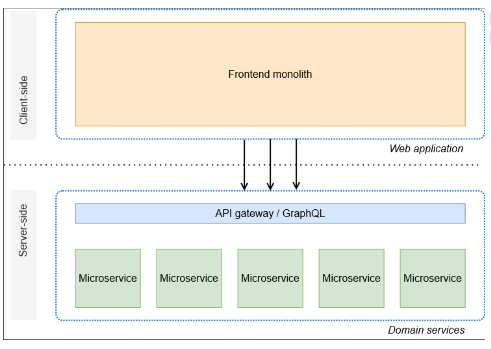
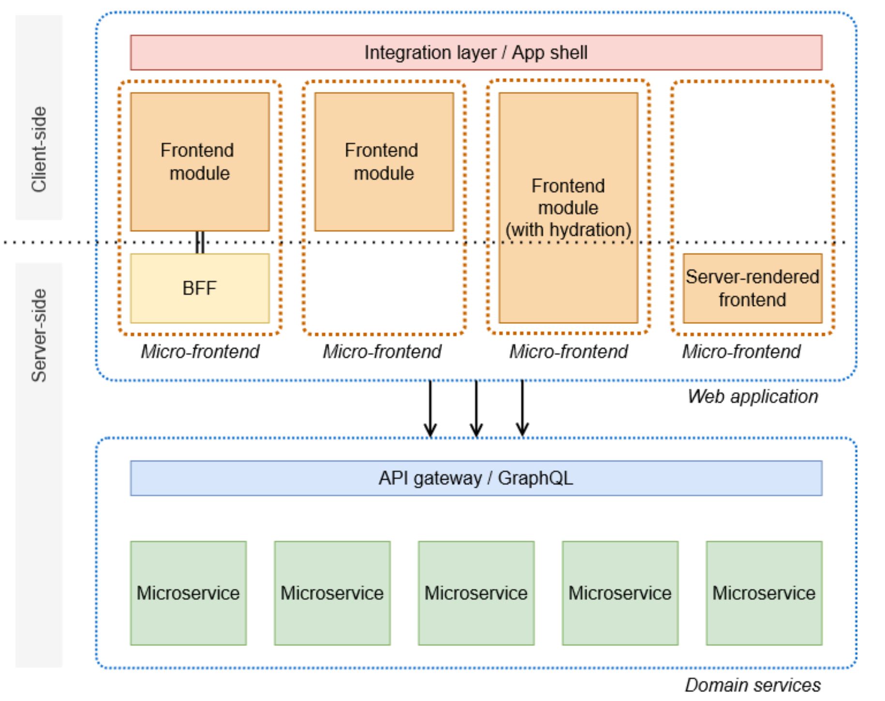
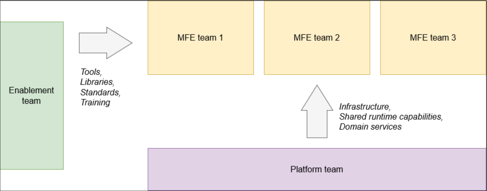

# AWS 规范性指导: 了解和实现微前端

<table>
  <tr>
    <th style="width: 80px">作者</th>
    <th >  </th>
  </tr>
  <tr>
  </tr>
    <tr>
    <td>简介</td>
    <td> 作为规范性指南，旨在帮助不同专业领域的 IT 负责人、产品负责人和架构师了解微前端架构并在 Amazon Web Services 上构建微前端应用程序。</td>
  </tr>
</table>

## 概述

微前端是一种架构，其基础是将应用程序前端分解为独立开发和部署的工件。

传统的微服务架构，其前端整体结构使用 API 网关连接到后端微服务

客户端渲染的微前端可以直接使用集中式 API Gateway 公开的 API。
• 团队可以在有限的上下文中创建 backend-for-frontend (BFF)，以减少前端对 API 的闲聊。
• 在服务器端，微前端可以通过使用一种称为水合的技术在客户端增强服务器端方法来表达。当浏览器
渲染页面时，关联的页面会 JavaScript 被水合以允许与用户界面元素进行交互，例如单击按钮。
• 微前端可以在后端进行渲染，并使用超链接路由到网站的新部分。

## 基础概念

微前端架构在很大程度上受到两个架构概念的启发：
• 领域驱动的设计是将复杂的应用程序结构化为连贯域的心理模型。
• 分布式系统是一种将应用程序构建为松散耦合子系统的方法，这些子系统是独立开发并在自己的专用
基础设施上运行的。

### 领域驱动设计

埃文斯在 2003 年的著作《领域驱动的设计：解
决软件核心的复杂性》中假设软件开发应该由业务问题而不是技术问题驱动。埃文斯提出，IT 项目首先
开发一种无处不在的语言，以帮助技术和领域专家找到共同的理解。基于这种语言，他们可以制定一个
相互理解的商业现实模型。

埃文斯引入了其他多个重要术语，其中一个是有限上下文。有限的上下文是大型 IT 应用程序中独立的
部分，其中包含仅针对一个业务问题的解决方案或实施。大型应用程序将由多个有界上下文组成，这些
上下文通过集成模式松散耦合。这些有限的上下文甚至可以有自己的无处不在的语言的方言。例如，应
用程序付款环境中的用户可能与交付环境中的用户有不同的方面，因为在付款过程中，运费的概念无关
紧要。
Evans 没有定义有界上下文应该有多小或多大。大小由软件项目决定，并且可能会随着时间的推移而
演变。衡量上下文边界的良好指标是实体（域对象）和业务逻辑之间的凝聚程度。

在此页面上，主要的构建块是搜索表单、筛选器面板和结果列表。要确定边界，必须确定独立的功能上
下文。此外，还要考虑非功能方面，例如可重用性、性能和安全性。“属于同一事物” 的最重要指标是它
们的沟通模式。如果架构中的某些元素必须频繁通信并交换复杂的信息，则它们可能共享相同的边界上
下文。

### 分布式系统

当今最受欢迎的分布式系统示例是微服务。在微服务架构中，后端服务由域驱动（而不是由用户界面或
身份验证等技术问题驱动），由自治团队拥有。微前端具有相同的原理，将解决方案范围扩展到前端。

## 微前端中的架构决策

在应用程序中应用微前端架构模式的团队必须尽早就架构做出多项决定：

- 微前端的识别和边界的定义
- 使用微前端撰写页面和视图
- 跨微前端的路由、状态管理和通信
- 管理跨领域问题的依赖关系

### 微前端的识别和边界的定义

团队可以将应用程序域分解为业务子域和受限上下文。然后，自治团队可
以拥有其受限上下文的功能，并将这些上下文作为微前端交付。

定义明确的有界上下文应最大限度地减少功能重叠以及跨上下文进行运行时通信的需求。可以使用事件
驱动的方法实现所需的通信。这与用于微服务开发的事件驱动架构没有什么不同

### 使用微前端撰写页面和视图

#### 客户端合成

在客户端（浏览器或移动 Web 视图）上以文档对象模型 (DOM) 片段的形式动态加载和附加微前端。
微前端工件（例如 JavaScript 或 CSS 文件）可以从内容分发网络 (CDN) 加载，以减少延迟。客户端
组合需要满足以下条件：
• 一个拥有和维护 shell 应用程序或微前端框架的团队，以便能够在浏览器中在运行时发现、加载和渲
染微前端组件
• 前端技术（例如 HTML、CSS 和）方面的高技能水平以及 JavaScript 对浏览器环境的深入理解
• 优化页面中的 JavaScript 加载量，以及避免全局命名空间冲突的纪律

#### 服务器端合成

在页面缓存到边缘之前，使用源服务器来撰写页面。这可以通过传统技术（例如 PHP、Jakarta Server
Pages (JSP) 或模板库）来完成，通过包含来自微前端的片段来撰写页面。您还可以使用服务器上运行
的 JavaScript 框架（例如 Next.js），在服务器上使用服务器端渲染 (SSR) 来撰写服务器上的页面。
在服务器上呈现页面后，可以将其缓存在 CDN 上以减少延迟。部署新版本的微前端时，必须重新渲染
页面，并且必须更新缓存以向客户提供最新版本。
服务器端组合需要对服务器环境有深入的了解，以建立部署、发现服务器端微前端和缓存管理的模式。

#### 跨微前端的路由、状态管理和通信

路由选项取决于组合方法。可以通过减少前端组件之间的耦合来优化通信。

议减少前端组件之间的耦合。减少耦合的一种方法是从同步函数调用转向异步
消息传递

发布订阅取代直接调用。

### 管理跨领域问题的依赖关系

#### 尽可能不分享

nothine-nothine 方法假设独立软件工件之间根本不应共享任何依赖关系，或者至少在集成或运行时不
应该共享。这意味着，如果两个微前端依赖于同一个库，则每个微前端都必须在构建时在库中烘焙并单
独发货。此外，每个微前端都必须验证该库不会污染全局命名空间和共享资源。
这会导致裁员，但这是一种有意识的权衡，具有最大的灵活性。由于没有共享运行时依赖关系，因此团
队可以最大限度地灵活地以他们认为有用的任何方式发展软件，前提是他们在解决方案范围内这样做，
并且不违反任何接口合同。
在微前端遵循无共享原则的平台上，尽可能保持微前端的轻量化非常重要。它要求开发人员熟练而勤奋
地优化微前端以提高性能，并且不会为了开发者体验而牺牲用户体验。

#### 共享代码

将其作为库或运行时模块共享。例如，前端核心团队通过 CDN 提
供供微前端使用的库。业务价值团队可以在运行时加载库，也可以使用软件包存储库来发布他们的
库。Micro-Frontend 团队可以在构建时针对打包库的特定版本进行开发，类似于使用混合框架的移动
应用程序。

第三种选择是使用私有包注册表来支持公共库的构建时集成。这降低了库合约中的重大更改在运行时引
发错误的风险。但是，这种更为保守的方法需要更多的管理，才能将所有微前端与较新的库版本同步。

为了管理运行时依赖关系，微前端可以使用导入映射（或诸如之类的库 System.js）来指定每个模块
在运行时的加载位置。webpack Module Federation 是另一种指向远程模块托管版本并解决独立微前端
之间常见依赖关系的方法。

#### 共享状态

### 框架和工具

框架是根据渲染层划分的：
• 客户端渲染 (CSR)
• 服务器端渲染 (SSR)
前端架构包括其他功能，例如静态站点生成 (SSG)。但是，SSG 只能执行一次。微前端主要是在运行
时组成的，因此 CSR 和 SSR 是主要选项。

#### 客户端渲染

对于企业社会责任，有两种流行的选择：
• 单个 SPA 框架
• 模块联合
Single SPA 是构成微前端的轻量级选择。它解决了微前端架构中最常见的挑战，例如在同一页面中组
合多个微前端并避免依赖冲突。
Module Federation 最初是一个插件，由 webpack 5 提供，它解决了微前端架构中的绝大多数挑战，包
括跨不同工件的依赖关系管理。Module Federation 2.0 原生可与 Rspack、webpack、esbuild 配合使
用，现在也可以使用 JavaScript

#### 服务器端渲染

在 SSR 方面，两个主要选项更为复杂：
• 采用诸如 Next.js 之类的现有框架，并应用使用模块联合的微前端原则。
• 使用 HTML-交换代表微前端的 HTML 片段，并在运行时将这些片段组合 over-the-wire 到模板中。这
种方法的一个例子是 Podium。

## 组织和工作方式

**与所有架构策略一样，微前端的影响远远超出了组织选择实施的技术。** 构建微前端应用程序的决定必须
与业务、产品、组织、运营甚至文化保持一致（例如，赋予团队权力和去中心化决策）。作为回报，这
种微前端架构支持真正敏捷、产品驱动的开发，因为它可以显著减少原本独立的团队之间的沟通开销。

### 敏捷开发

敏捷范式的基础是《敏捷宣言》（2001），它假设了四个主要原则（例如，“个人和互动胜于流程和工
具”）和十二项原则。诸如 Scrum 和规模化敏捷框架（SaFe）之类的流程框架是围绕敏捷宣言出现的，
并已进入日常实践。但是，它们背后的哲学在很大程度上被误解或忽视了。
在微前端架构的背景下，必须遵循以下敏捷原则：
• “经常交付可运行的软件，从几周到几个月不等，优先考虑较短的时间范围。”
这一原则强调了分阶段工作并尽可能定期和频繁地将软件交付到生产环境是多么重要。从技术角度来
看，这是指持续集成和持续交付 (CI/CD)。在 CI/CD 中，用于构建、测试和部署的工具和流程是每个
软件项目不可或缺的一部分。该原则还意味着运行时基础设施和运营责任必须归团队所有。这种所有
权在分布式系统中尤其重要，在分布式系统中，独立子系统对基础设施和运营的要求可能截然不同。
• “围绕积极进取的个人构建项目。为他们提供所需的环境和支持，并相信他们能把工作做好。”
“最好的架构、要求和设计来自于自组织团队。”
这两项原则都强调所有权、独立性和 end-to-end 责任感的好处。当（且仅当）团队真正拥有自己的
微前端时，微前端架构才会成功。从构思到设计和实施，再到交付和运营，电子 nd-to-end 责任确保
了团队能够真正行使所有权。无论是在技术上还是在组织上，团队都需要这种独立性，这样团队才能
对战略方向拥有自主权。我们不建议在使用瀑布式开发模式的集中式组织中使用微前端平台。

### 团队组成和规模

软件团队要行使所有权，就必须在组织规定的界限内进行自我管理，包括团队交付的方式和内容。
为了提高效率，团队必须能够独立交付软件，并有权决定交付软件的最佳方式。从外部产品经理那里获
得功能要求或从外部设计师那里获得用户界面设计但不参与这些项目的规划的团队，不能被视为自主团队。这些功能可能违反现有合同或功能。此类违规行为将需要进一步的讨论和谈判，有可能延迟交付，
并在团队之间引入不必要的冲突。
同时，团队不应变得太大。虽然规模更大的团队拥有更多的资源并且可以容纳个人缺席，但每增加一个
新成员，沟通的复杂性就会呈指数级增长。无法说出一个普遍有效的最大队伍规模。项目所需人员数量
取决于团队成熟度、技术复杂性、创新速度和基础设施等因素。例如，亚马逊遵循双披萨规则：一支规
模太大而无法吃两个披萨的队伍应该分成较小的队伍。这可能是一个挑战。分裂应沿着自然界限进行，
并应赋予每个团队对其工作的自主权和所有权。

## DevOps 文化

DevOps 指一种软件工程实践，其中开发生命周期的各个步骤从组织和技术角度紧密整合。与普遍的看
法相反， DevOps 这在很大程度上与文化和思维方式有关，而很少涉及角色和工具。
传统上，软件组织会有专家团队，例如设计、实施、测试、部署和运营。每当一个团队完成工作时，
他们就会将项目移交给下一个团队。但是，通过专业团队的孤岛交付软件会导致移交过程中的摩擦。同
时，当专家被迫以狭隘的重点工作时，他们缺乏邻近领域的知识，对产品也没有系统的看法。这些缺陷
可能导致软件产品的一致性降低。
例如，当软件架构师设计的解决方案将由不同团队中的某人实施时，他们可能会忽略实现的固有方面
（例如依赖关系不匹配）。然后，开发人员走捷径（例如猴子补丁），或者在架构师和开发团队之间启
动正式 back-and-forth 的补丁。由于管理这些流程的开销，开发不再是敏捷的（从灵活、自适应、增量
和非正式的意义上讲）。
尽管该术语 DevOps 主要涉及文化，但它意味着在实践中使之成为 DevOps 可能的技术和过程。
DevOps 与 CI/CD 密切相关。当开发者完成软件增量实现后，他们会将其提交到版本控制系统（例如
Git）。传统上，构建系统随后会构建和集成软件，然后在或多或少的统一和集中化流程中对其进行测
试和发布。借助 CI/CD，软件的构建、集成、测试和发布是固有的、自动化的。理想情况下，通过专门
为给定项目量身定制的配置文件，该过程是软件项目本身的一部分。
尽可能多的步骤是自动化的。例如，应减少手动测试做法，因为几乎所有类型的测试都可以实现自
动化。以这种方式设置项目后，每天可以充满信心地多次交付软件产品的更新。另一种支持的技术
DevOps 是基础设施即代码 (IaC)。
传统上，设置和维护 IT 基础架构需要手动安装和维护硬件（在数据中心设置电缆和服务器）和操作软
件。这是必要的，但它有很多缺点。安装既耗时又容易出错。硬件往往过度配置或配置不足，导致开支
过高或性能降低。通过使用 IaC，您可以通过配置文件描述 IT 系统的基础架构要求，通过该文件可以
自动部署和更新云服务。
所有这些与微前端有什么关系？ DevOps、CI/CD 和 IaC 是微前端架构的理想补充。微前端的好处取决
于快速无摩擦的交付流程。只有在团队 end-to-end 负责任地拥有软件项目的环境中， DevOps 文化才
能蓬勃发展

### 跨多个团队协调微前端开发

在跨多个跨职能团队扩展微前端开发时，会出现两个问题：首先，团队开始对范式进行自己的解释，做
出框架和库选择，并创建自己的工具和帮助程序库。其次，完全自主的团队必须对诸如低级基础设施管
理之类的通用功能负责。因此，在多团队的微前端组织中再引入两个团队是有意义的：支持团队和平台
团队。这些概念在具有分布式系统的现代 IT 组织中被广泛采用，并且在 Tea m Topologies 中有详细记
录。
下图显示了支持团队向三个微前端团队提供工具、库、标准和测试。平台团队为这三个微前端团队提供
基础架构、共享运行时功能和域服务。

平台团队通过将微前端团队从无差别的繁重工作中解放出来，为他们提供支持。这种支持可能包括基础
设施服务，例如容器运行时、CI/CD 管道、协作工具和监控。但是，成立平台团队不应导致组织将开发
与运营分开。情况恰恰相反：平台团队提供工程产品，而微前端团队对平台上的服务拥有所有权和运行
时责任。

支持团队通过专注于治理和确保微前端团队之间的一致性来提供支持。（平台团队不应参与其中。）
支持团队维护共享资源，例如用户界面库，并创建框架选择、性能预算和互操作性惯例等标准。同时，
它为新团队或团队成员提供应用治理所定义的标准和工具的培训

## 部署

微前端团队自主权的北极星是拥有一个自动化管道，其生产路径独立于其他微前端团队。遵循不共享原
则的团队可以实现独立的管道。共享库或依赖平台团队的团队必须决定如何管理部署管道中的依赖关
系。
通常，每个管道都执行以下操作：
• 构建前端资产
• 将资产部署到主机以供使用
• 确保更新注册表和缓存，以便向客户交付新版本
实际的管道步骤因技术堆栈和页面合成方法而异。
对于客户端组合，这意味着将应用程序包上传到托管存储桶，然后通过在 CDN 上缓存来发布以供使
用。在服务工作线程中使用浏览器缓存的应用程序还应实现更新服务工作线程缓存的方法。
对于服务器端组合，这通常意味着部署服务器组件的新版本并更新微前端注册表以使新版本可被发现。
您可以使用蓝/绿或灰色部署模式来逐步推出新版本。

## 你需要平台团队吗？

一些公司的团队负责拥有和维护其他团队在微前端上工作时采用的代码、基础架构和流程。常见职责包
括：
• 创建和维护可用于包含微前端的存储库的 CI/CD 管道。生成和测试代码更改，然后将其发布到多个
环境中。
• 创建和维护与可观测性相关的工具，例如共享仪表板、警报机制和系统以应对问题。
• 创建和维护用于事件处理、共享服务使用和第三方依赖项的共享库。
• 创建和维护能够持续监控非功能性质的工具，例如系统的性能、安全性和可靠性。
• 创建和维护设计系统。
• 创建、维护和支持微前端系统的应用程序 shell。
根据项目的规模，您可以使用以下方法之一来管理这些职责：
• 创建一个专门的平台团队，其唯一职责是开发共享工具。
• 创建一个由来自多个团队的成员组成的小组。小组成员将时间分散在处理微前端和开发共享工具之
间。这也被称为老虎队。

- [服务器端渲染微前端——架构](https://aws.amazon.com/cn/blogs/compute/server-side-rendering-micro-frontends-the-architecture/)
- [开发人员何时以及为什么应该考虑这种更新、更小的前端架构模式？](https://increment.com/frontend/micro-frontends-in-context/)

- [具有事件架构的有界上下文](https://eda-visuals.boyney.io/visuals/bounded-context-with-event-architectures)

- 敏捷软件开发宣言
- https://github.com/d2forum/14th/blob/master/PPT/%E5%BE%AE%E5%89%8D%E7%AB%AF%E6%9E%B6%E6%9E%84%E4%BD%93%E7%B3%BB--%E5%85%8B%E5%86%9B.pdf
