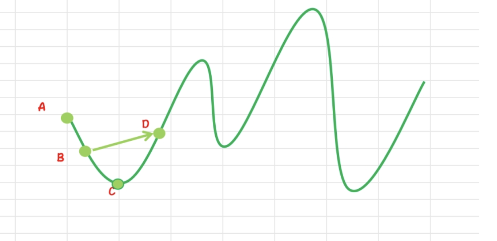

# 马丁格尔

- 一是行情是无法预测的，每一秒的上涨和下跌都是随机的。
- 二是长期保持 100%胜率的「交易圣杯」根本不存在，这是违背客观规律的，但通过交易策略、风险控制、数据分析、项目调研等多维度分析，可以提高交易胜率。

## 现货马丁格尔

从概率与统计学视角来看，每次掷骰子都是独立事件，也就是说前面掷 99 次骰子，也不会影响第 100 次骰子，即每次骰子开大和开小的概率永远是各自 50%。

马丁格尔逻辑最早起源于十八世纪法国的小镇赌博，从第一笔掷骰子开始，如果输钱后就将赌注翻倍，由于每笔交易胜负的概率都是 50%，只要不断的赌下去，总有一次可以将所有亏损赢回来并赚取第一笔本金同等金额。比如，第一次赌注为 1 元，第 4 次押注后成功，那么将弥补之前 3 次交易的损失，并且盈利 1 元。

这就是为什么马丁格尔逻辑被成为称为「100%胜率」的原因，只要玩家有无限资金、无限次押注，中间输了多少次都没有关系，最终一定会连本带利赢回来。但前提是拥有无限资金，如果没有无限资金、却无限次押注，那么最终将失去所有资金。

在一个双边市场中，用户开仓进场，如果遇到逆势行情就不断加码降低持仓成本，直到行情反弹达到止盈目标。其本质就是提高用户低买高卖的概率。

值得注意的是，马丁格尔策略也存在明显的短板，若上涨获利套现，部分仓位没有得到利用，会导致资金利用率低；若市场出现单边下跌行情，并未反弹至盈利位置，则会带来相应的亏损风险等等。

比如，当用户以 A 价格买入某标的，但标的开始逆势下跌，通过 OKX 马丁格尔策略，用户可以分批次加码买入标的，从而使其持仓成本降至为 B，一旦标的反弹至价格 D，那么系统将一次性卖出标并实现收益。尽管 D 小于 A，但是由于较低的成本，所以用户仍能从这个波段中盈利。

马丁格尔策略属于一种加仓逻辑，遇到单边不回调行情时，则会面临爆仓风险，所以需要手动设置好如止损目标等风控参数。但如果结合行情以及技术指标决定策略入场时机，并透过合约马丁格尔加仓单不断低位吸筹，降低整体持仓成本，就可以尽可能最大化收益。

## 合约马丁格尔
