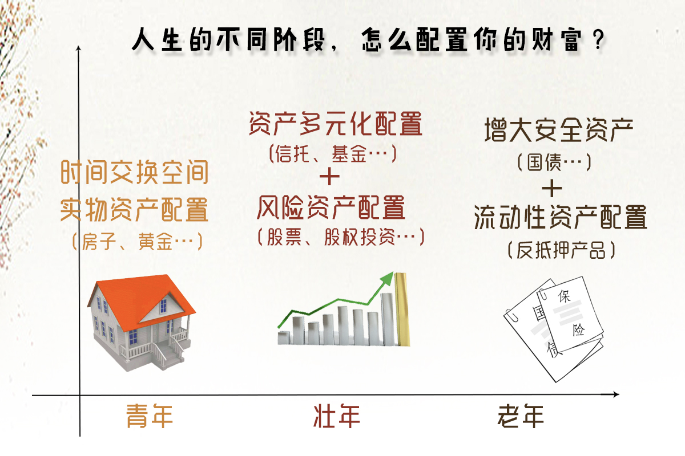

# 个人资产配置的生命周期

## **青年时期：最应该加大实物资产的配置**

年轻人要加大实物资产的配置，有三个理由：

1. 房子是具有“居住”这种消费功能的。
2. 买房是对抗资产贬值一个特别好的工具。
3. 最重要的是，它给了年轻人以时间换空间的一个权利。
4. 买房就是买一个城市的股票。

条件允许的情况下，应该有这种加大实物资产配置，以时间换空间，增大自己年轻时候资本积累的意识。

## **壮年时期：要加大风险资产的配置**

在壮年的时候，你应该加大风险资产的配置，进行资产的多元化配置。

## **步入老年：加大流动性资产的配置**

可以做一个反向的抵押。比如说有好几套房产，你可以拿一套抵押出去，抵押公司就按照房子的市值逐年逐月地付给你一笔现金，它会一直付到你去世为止。也就是说我们可以把自己非流动性的资产，利用金融工具转化成高流动性的资产。

> 年轻时候最大的资产投资应该包括有形的资产投资和无形的资产投资。
> “有形”的资产投资就是文中所提到的“实物资产”，包括房子、贵金属等；
> “无形”的资产最重要的是对自己的投资，让自己的每一分钟变得越来越“值钱”，也就是对自己的价值投资。年轻时代缺钱，但有大把的时间，我们一定要把这些时间在有效的注意力管理下放到能够提高自己“身价”的地方，比如，不断打磨自己的技能，让自己在所从事的事业上不断进步；比如，多看一本书，多听一个得到产品，让自己的视野和见识向精英和高手靠拢；比如，多花些时间进行身体锻炼，让革命的本钱不贬值……。个人资产配置的生命周期再一次提醒我们，年轻时代太珍贵，到老年只能通过“做一些反抵押类型的金融”来变相“买”时间。
