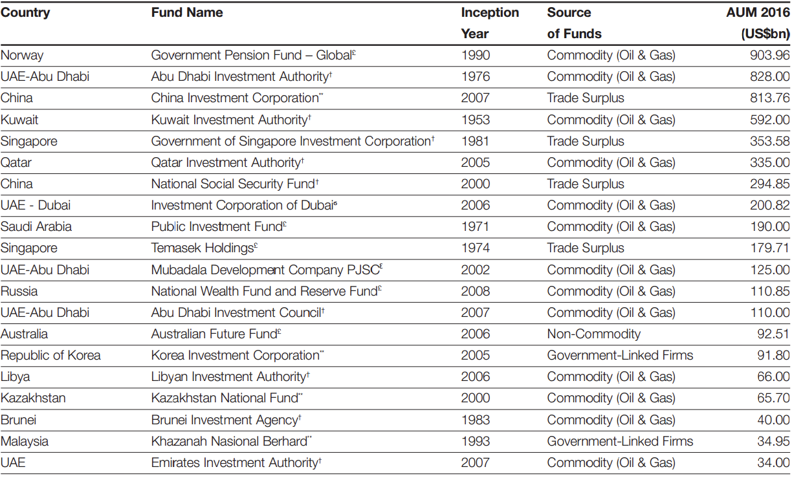

# 另类投资

### 一、传奇的对冲基金到底对冲的是什么？

#### 1. **卖空与套期保值**

卖空就是指你卖出某个自己看空，但是自己手里又没有的东西。
现在有个股票，市场价格是 100 块钱。你看空这个股票，赌它还会大跌，所以你找到一个手里有这个股票的人，借他 1 万股，约定在 3 个月以后，把这 1 万股还给他。当然了，你也不能白借，你要付给他一定的利息，比如说是 5%。你不是看空吗？所以借来股票之后，你就迅速地把这 1 万股全部卖出去，获利是 100 万，然后三个月后，如你所愿，这个股票真的跌到了 80 块钱。现在你可以做一件事情，你花 80 万，在市场上把这 1 万股全部买回来，然后还给别人，再加上利息 5 万（100 万\*5%=5 万）。

对冲：就是买入一个金融产品的同时，卖空另一个和它价格变动相连的产品，来规避风险。
找到一个事物的反作用力，然后将这个事物的效用给抵消掉。
一方面买入一部分自己看多的股票，同时卖空一部分自己看空的股票，这样一来，无论大盘是涨还是跌，只要他自己买入的这个股票比卖空的股票涨得多或者跌得少，他就是赚钱的。换句话说，通过同时地买入和卖空，琼斯使得自己的基金有了独立于大盘的走势，对冲或者消除了市场的风险。所以琼斯就把自己的基金叫做“hedged fund”（对冲的基金），他也被称为世界上第一个对冲基金的经理。

#### 2. **对冲基金高收益的秘密**

对冲基金的高手们都是从市场的“错误定价”中来赚钱的，而且他们用高杠杆和复杂的交易策略去牟取高额利润，就像丛林里狩猎的豹子一样，在捕猎之前，必须屏息静气，所以对冲基金也必须对自己的策略守口如瓶，否则你想想，**如果全市场都知道有“套利机会”，哪里还能够赚钱呢？**
\*\*

#### 3. **风险被“对冲”了吗？**

理论上，“对冲策略”是为了对冲和消除风险，但实际上因为对冲的策略，你是要运用很多金融衍生品，要运用卖空这些机制的。而用高杠杆来获取高收益，自然就会放大风险。
你想用高杠杆获取高收益，其实这是有前提条件的，这个前提条件是什么呢？就是基金经理的判断要非常准确，比市场高明，就像放大收益一样，一旦判断失误，高杠杆同时也会放大损失。
美国的《证券法》就规定，个人投资者如果连续两年的年收入在 20 万美金以下，是没有资格去投资对冲基金的。还有就是，如果是一个机构投资者的话，资产规模在 500 万美金以下，也是不能去投资对冲基金的。这就是为了保护一些中小投资者，让大家不要去轻易地涉足这种高风险、高收益的对冲基金的领域。

#### 4. 总结：

> 1. 对冲基金是一种私募的证券投资基金，它因为受到的监管少，可以更灵活地运用各种手法操纵金融工具，达到对冲风险和放大收益的目的；
> 2. 对冲基金的特点是复杂交易，高杠杆。对冲基金经理经常会使用非常复杂的交易策略，买卖金融衍生品，用高杠杆撬动大量资金来追逐高收益；
> 3. 对冲基金并没有把风险完全地对冲掉，对冲策略在放大收益的同时，其实也放大了风险。

### 二、私募股权基金：“果农型”的投资人

#### 1. **什么是私募股权基金？**

这个词语其实是和我们上周讲的“私募证券基金”是相对的。
第一，它属于私募，也就是说只针对少数投资人，它是不公开募集资金的，私募股权基金和其他的私募一样，享受着“少监管、高激励”的优势。
第二，它和投资股票、债券等金融产品的“证券投资基金”不同，它的投资对象是企业，买的是企业的股权。
那你可能会问，股票、债券不也是企业发行的吗？私募股权投资和私募证券投资的区别在哪里呢？我在北大上课的时候，曾经用过一个比喻，如果说各种金融产品像水果的话，证券投资基金就是贩卖水果的商贩，而私募股权基金就是果农，他要从种果树开始培育，一直到果子成熟，比如上市、被收购。你的果子培育得越好，价格就卖得越高。所以说，私募股权基金，它是从企业的长期经营和稳定增长中获利，而证券投资基金是从企业证券的价格变动中获利，它们的投资目的是很不一样的。

#### 2. **私募股权基金的作用**

私募股权基金在金融市场上是著名的长期投资者。

- 资金
- 技术
- 管理和资本运作

在成熟型的企业里面，私募股权机构除了投入资金以外，它主要是在管理上对企业进行改造，然后把它改造成一个和原来面目完全不一样的企业，达到企业和自己双赢的目的。
国际私募股权的巨头们在全球获得了很大的成功，它们的成功其实有一个共同的秘诀，就是它们能够准确地判断一个行业的周期，在低谷或者说在起始的阶段，低价进入，获得它的股权。通过培育新企业，或者改造旧企业经营的方式，使得企业的价值增加，在这种行业周期性发展或者复苏的时候，再实现成功地退出。

#### 3. **私募股权投资基金的钱从哪里来？**

企业的发展是需要时间的，短期投资者很容易对管理层造成一个压力，就迫使那些管理层关注短期的利益，甚至会牺牲长期战略。私募股权投资基金就不存在这个问题，因为一般私募股权投资基金有 5 到 7 年的封闭期，投资人一般来说是不能够中途撤资的。

- **谁会有这么大的耐心，为了企业的投资回报，要等 5 到 7 年这么长的时间？**

在美国的私募股权投资基金中，最大的一方投资人是谁呢？是地方政府和企业的养老金计划，占到了差不多 1/4 以上。中国的私募股权基金里，社保资金和保险都是特别重要的出资人。这些大资金，追求的不是短期的高收益，它们追求的是一个长期、稳定、安全、可靠的收益。所以，它们的投资目标和私募股权投资基金，是吻合的。

- **为什么这些投资人，会愿意放心地把钱交到私募股权投资机构里面，而不是自己去投呢？**

1. 专业理财的问题，要相信社会的专业化分工是现在和未来社会的发展方向。
2. 私募股权机构，基本上采取的是“有限合伙制度”：基金管理人是普通合伙人，也就是你平时经常听到的 GP（General Partner）。普通合伙人对这个基金承担的是什么责任呢？是无限责任。而投资人是有限合伙人，也就是 LP（Limited Partner），他们就承担一个出资的义务，对这个基金只负有一个有限的责任。

### 三、主权财富基金：金融市场上的超级玩家

全球最大的对冲基金是桥水基金，它的资产规模是 1500 亿美金。全球最大的私募股权机构黑石，大概是 4000 亿美金的资产规模。 沙特阿拉伯央行手里有 5000 亿美金的资产要管理，而中国的外汇管理局就更厉害了，管理着 30000 多亿美金的资产。一般人很少意识到这些背后是“国家主权”的金融机构，才是金融市场上真正呼风唤雨的巨无霸。

#### 1. **什么是主权财富基金？**

中东石油交换而来的、中国贸易顺差积累的巨额美元外汇储备，存在贬值风险（要是美国持续地量化宽松），此种情况下，急需进行资产管理，让手里的这些国家的外汇储备保值增值。 在这个背景下，替部分外汇储备资产进行管理的“主权财富基金”就诞生了。所以中国的外管局（外汇储备资产管理机构），实际上就承担着“主权财富基金”的这么一个职能。

2007 年以后，我们国家就正式地成立了一家主权财富基金，叫做“中投有限责任公司”（China Investment Corporation），它和外管局一块儿做外汇资产的投资。但是，和外管局这种保守型的投资策略不太一样，中投公司的投资非常分散。像股票、债券、大宗商品、房地产，其中有两笔交易特别受到世人的瞩目。
一个是成立之初的第一单，当时中投想做一个非常亮丽的亮相，所以就选择了用 30 亿美金入股美国特别著名的私募股权投资基金——黑石，这 30 亿美金占它的总股本的 10%。本来是想强强联合，在金融市场上打响第一炮，没想到刚刚买了股权以后，2008 年就遭遇了金融危机，黑石的股价大跌，中投这一把就亏了几十亿，亏得非常惨。但是，无论如何，这么大一笔投资，让世界很快地就记住了来自中国的财大气粗的主权基金。
另外一个投资案例是比较成功的，2012 年的时候，中投投资了阿里巴巴 10 亿美金，这样获得了它 2.7%的股份。在 2014 年，阿里巴巴 IPO 的时候，这笔投资已经增值了 400%，估值已经达到了 50 亿美金。

#### 2. **最成功的的主权财富基金是哪个国家的？**

主权财富基金是从外汇储备资产管理开始的，延伸至国有资产。世界上最成功的主权财富基金是新加坡的淡马锡，它管理的是新加坡的国有资产。
国有资产都面临着一个问题，就是在国有企业里面，你没有办法解决责、权、利不清的一些代理问题，国有企业的效率普遍比较低下，怎么在保持国有股份不变的基础上，提高国有资产的运营效率，这是中国的问题，也是当时新加坡政府面临的问题。 所以新加坡政府就设计出了淡马锡这种模式。它的一个非常重要的特征就是，经营权和所有权彻底地分开。淡马锡这个主权财富基金，是由新加坡财政部完全控股，也就是说，新加坡政府是真正的实际控制人。它每年按经营的状况，向政府分红。
作为基金管理公司，淡马锡具有完全独立的董事会，财政部尽管是它的最大股东，但是它完完全全没有办法干涉公司的经营决策。淡马锡一方面是具有国家战略方面的考量，另外一方面，具有市场化和商业化的运作，这样一方面保证国有资产不流失，另外一方面也就避免了国有企业效率低下的问题。很多人都认为，淡马锡实现了国家战略和基金商业化运作之间很完美的结合。

#### 3. **淡马锡模式对中国的借鉴意义在哪里？**

第一个方面，淡马锡这种独立运营的主权财富基金的模式，可以降低主权财富的政治色彩。当这种基金出去投资的时候，可以降低被投资国家的疑虑。其实你看，中国现在实施一带一路的战略，为什么要去设立丝路基金，搞亚投行？其实就相当于设置一个市场化运作的基金。

第二个方面，其实是更重要的一点，因为淡马锡模式的精髓就是把经营权和所有权相独立，政府在这里面只充当一个财务投资者的角色。基金公司的经营管理层完全根据商业化运作，就形成了一个“政府—国有资本投资公司—企业”的三层构架。这么一个三层构架避免了政府直接投资企业，使政府对企业经营的影响降到了最低。在整个过程中间，政府只起到了一个监管者、所有者、战略指导者的作用。

#### 4. **主权财富基金的过去和未来**

把前 20 大的主权财富基金放到一张表里，除了挪威以外，绝大部分都是来自于石油出口国或者是新兴的发展中国家。

欧美国家在这张表里面是看不到踪影的，这里面其实反映了一个什么样的原因呢？就是大部分的新兴国家都是依靠出口战略发展起来的，大部分都是贸易的顺差国，所以积累了大量的外汇储备。而那些欧美的发达国家，大部分是贸易的逆差国，没有那么多外汇储备，同时它们的整个体制和机制也决定了它们整个国家的运行是一种藏富于民的手段。集中在国家手里的财富并不是很多，这是它们没有在表上出现的原因。
但另外一个原因其实也反映了世界多极格局的形成。最重要的就是，美国的相对地位的下降，欧洲这些年的份额也在下降。所以你可以看到，作为金融市场上这么一个特殊的存在，主权财富基金特殊就特殊在“主权”两个字上面。主权财富的变化其实跟整个全球经济格局的变化是息息相关的，主权财富的份额的变化也是昭示着未来世界的发展的趋势。

### 四、卖空机制到底是福音还是祸水？

#### 1. **估值偏高的纠正者**

最后均衡的股票价格反映的是乐观情绪和悲观情绪的一个平均值。
如果市场禁止卖空的话，市场价格最后反映的是什么呢？它就仅仅只是乐观一派的观点。所以会造成一个估值偏高的现象。卖空制度使得多空双方都能够通过交易进入市场，有利于制衡单边的交易，纠正过高的估值，抑制资产的泡沫。换句话说，就是卖空机制提高了市场的定价效率。

#### 2. **市场波动制造者？**

经过实证证据表明，卖空禁令在一定程度上是损害了市场效率的。我和我的合作者在 A 股股灾以后，也专门对股指期货和市场流动性的关系做了研究，我们也发现，股指期货被限制以后，对市场的流动性其实是产生了比较显著的负面影响

#### 3. **监管难题**

禁止卖空，不符合市场运行规律，也可能损害市场的长期效率。但是，在市场剧烈波动的时候，卖空，尤其是那种裸卖空，就是你手里还没有借到证券就开始卖证券，这种行为会创造出大量的虚拟证券供应，短期内会扭曲市场的价格，然后引发市场的进一步暴跌和恐慌。有时候，甚至可能就传染到其他市场，损害整个经济运行的稳定。
所以说，卖空机制这个问题，到今天也没有得到一个完美的答案。每次的危机过后，各国的监管层都会对卖空进行严厉限制，然后随着时间推移，又逐渐放松。目前，各国比较一致的监管原则包括这样几条：一是禁止裸卖空，二是对卖空的价格采取一定的限制，三是加强卖空的信息披露，提醒投资者相关风险。这些措施也许都还不完美，但是我想人类社会的制度演化也就是这样一个反复的过程，我们需要在不断的试错中继续前行。
