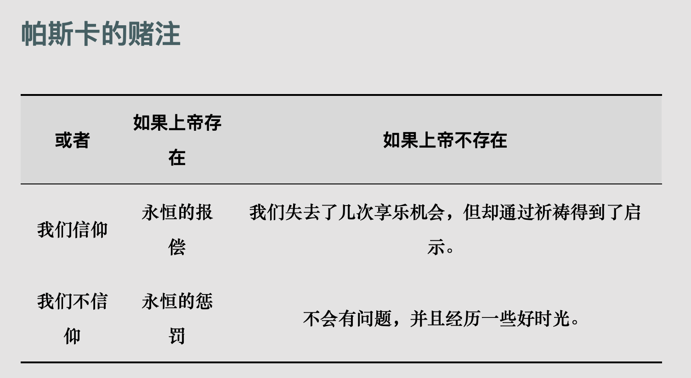

# 上帝

## 开篇

- 你信仰上帝吗？
- “上帝最突出的特征是什么？”
  “上帝是无所不能（全能）的吗？

      上帝是无所不知（全知）的吗？

      上帝创造了宇宙吗？

      上帝关心人类吗？

      上帝有感情吗？

      如果有，那么有哪些？”

- “上帝与他所创造的世界截然不同并且相互分离吗？上帝对我们来说是可知的吗？

  他能否表现为或曾经表现为人的样子？

  3.你为什么信仰上帝？或者为什么不信？

## 信仰上帝

- "上帝"是诸多信仰的延伸。

  - “公平与正义”。 相信上帝这个伟大存在能够保证公平与正义的呈现--不再今生，就在来世，就是很重要的。

- 许多人信仰上帝，是因为无法找到任何最终的正义。

- 信仰上帝不必然与正义和赏罚相关。 信仰本身也会赋予生活以意义。

::: tip 索伦.克尔凯郭尔

成为宗教信徒，意味着做出一种激情的个人选择。要置一切证据甚之理性本身于不顾。

:::

## 西方关于上帝的传统观念

### 上帝是超验的

传统观念认为上帝是一个超越于人的日常经验世界的、在我们之外的、并且与他所创造的世界截然不同的存在。

那么如何感知？ 如何与上帝建立联系？

“有一种观点认为，我们无法直接知道上帝，但我们可以通过他在地球上的代表来知道他并与之发生关系，比如通过教会、某些重要人物（如天主教的教皇、民族宗教观念中的某位首领）、《圣经》或其他圣典、近来某位圣徒的教诲来实现；另一种观点认为，我们关于上帝的知识以及我们与他的关系必须是直接的和个人的。比如德国教士马丁·路德之所以会发起基督教的宗教改革运动，部分原因就在于，他认为教会妨碍了个人与上帝之间直接的联系；”

教会垄断了与上帝的直接联系权。

> 跟颛顼的绝地天通类似？

### 上帝是内在的

观点： 上帝“在我们之中或是宇宙本身”

“要想找到上帝，我们不必向外“追求”他，而只需内视我们自己”

那么“什么样的经验才是与觉察到上帝相关的？”

### 上帝是完全内在的：泛神论

“17 世纪的犹太哲学家巴鲁赫·斯宾诺莎（1632-1677），简单地说，他主张上帝即万物，上帝与宇宙是同一的。斯宾诺莎的目标是发展出这样一种上帝观念：它不会使我们与最髙存在者之间可怕地遥遥相距，因为那样一来，各种鱼目混珠的宗教和上帝观念就有可能滋生出来，而说不清楚它们中的哪一种才是“真正”的宗教。”

“我们每个人就像某个伟大存在者血液中的一个小虫子，我们只看到了自己的周围，就不由得把它当作实在，并产生了某个“外在于我们”的更伟大的存在者的模糊观念。但实际上，我们就是那个伟大存在者的一部分，一旦我们认识到这一点，我们便会超越自己狭隘的感性认识以及关于某种外在事物的看法，开始把我们自己看成那个存在者的一部分。”

“他看来，上帝不可能创造了宇宙（因为他就是宇宙），向上帝祈祷——而不是单纯地信仰他——没有任何意义。但我们从斯宾诺莎这里所能获得的最重要的教益就是，历史上一切上帝观念的转变都遭受了不宽容的对待，甚至连那些虔诚的宗教信徒所秉持的上帝观念也难逃此厄运。”

“如果上帝是等同于宇宙整体的，那么信仰上帝与相信宇宙的存在还有什么区别？”

答：他们看待宇宙存在的方式是完全不同的。对某种东西的宗教信仰成了一种面向万物的宗教态度。

### 上帝是普遍精神

“黑格尔所主张的精神”

“人本质上是精神的主要表现，精神通过我们进行活动，甚至利用我们来为它的目的服务。同时，精神并非与我们相异。”

“精神”并不是什么异己的力量，而就是你在赛场上与他人同样感受到的情感联系、比赛的激烈以及大家共有的热情。现在，想像把这幅图景一直扩展到全人类，扩展到你作为人类的一分子所感受到的那种“团队精神”，扩展到对生活的热情，那么这就是黑格尔所说的“精神"的意思了；它比我们任何一个人都要大，但却不是某种异于我们的东西。对黑格尔来说，这就是上帝。”

### 上帝是过程

“上帝不能只用上帝的当下存在——作为某一特定时刻的某个存在者——来把握，而必须通过一段长期的发展，作为一个过程来理解。换句话说，上帝并非总是现在这个样子，而是一直处于生成过程中”

摘录来自
大问题：简明哲学导论
ePUBw.COM
此材料可能受版权保护。

### “上帝是超验的造物主：自然神论”

“上帝是物理学的必要假设” -- 伏尔泰

“不认为上帝具有人的属性。上帝不能被说成是公正的、智慧的或仁慈的，也不能被说成是有爱心的、忌妒的或关心我们的。”

“伏尔泰坚持认为我们应当放弃拟人论的“迷信”，但这样一来，这位上帝也就不再是一个道德存在者，一个人格神了。”

“拉普拉斯曾（对拿破仑皇帝）说：“我不需要那样的假设。”如果仅仅把上帝当作一种初始的创造力来理解，那么这即使是从一般意义上对最初级的宗教信仰来说也是不够的。—个被当作非人格的、不关心人类事务的上帝不是一个可崇拜的上帝，他不能赋予我们的生活以意义，在大多数人（既包括有神论者，也包括无神论）看来，他绝对配不上“上帝”这一称号。

”

摘录来自
大问题：简明哲学导论
ePUBw.COM
此材料可能受版权保护。

### “上帝是未知的信仰对象”

### “上帝是一个道德的存在者”

## 关于“恶”

> 1. 上帝是全能的，

    2. 上帝是全知的，以及
    3. 上帝是善的。

然而，如果世界上存在着恶，那么根据前面就可以推出，以下三条陈述中至少有一条必然为真：

> 1.他对此无能为力，

    2.他对此一无所知，或者

    3.他对此漠不关心。

”

### 否认上帝

### 区别恶

### 否认恶

### 最少的恶

### 审美整体解答

### 自由意志解答

### 来世的公平

### “上帝的“神秘方式”

### “给出一种回答”

## “信仰与理性：信仰的方式”

### 宇宙论论证

### 设计论证

### 本体论论证

### 理性的信仰

### “帕斯卡的赌注”

从理性计算和利益最大化的角度，信仰上帝是最优的选择。

### 非理性的信仰

## “理解你的信仰”
