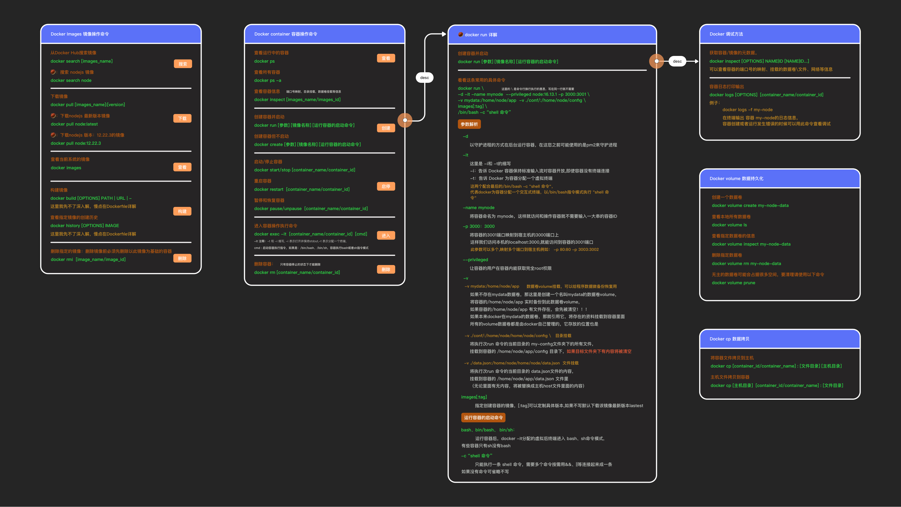

# Docker

Docker 是一个开源的应用容器引擎，让开发者可以打包他们的应用以及依赖包到一个可移植的容器中，然后发布到任何流行的 Linux 机器上，也可以实现虚拟化。容器是完全使用沙箱机制，相互之间不会有任何接口。

> 感觉 Docker 容器可以类比为“局部变量”，而传统的全局环境设置则类似于“全局变量”。  
> Docker 的容器化机制就像是把每个项目的环境独立封装起来，像局部变量一样管理和使用。


## 一、概念

docker 分几个概念：镜像、容器、仓库。

### 1.1 镜像

镜像是 Docker 运行容器的基础，一个镜像包含了运行容器所需的一切：代码、运行时、库、环境变量、配置文件等。

镜像概念等价于 Npm 包的概念，直接理解成 Npm 第三方包即可。

#### 常用命令

### 1.2 容器

容器化是将应用程序或服务、其依赖项及其配置（抽象化为部署清单文件）一起打包为容器映像的一种软件开发方法。

软件容器充当软件部署的标准单元，其中可以包含不同的代码和依赖项。 按照这种方式容器化软件，开发人员和 IT 专业人员只需进行极少修改或不修改，即可将其部署到不同的环境。

#### 常用命令

```bash
# 查找镜像
docker search ubuntu

# 拉取特定tag版本的镜像(默认是latest)
docker pull ubuntu:18.0.4

# 查看下载的所有本地镜像
docker images

# 删除镜像
docker rmi ubuntu:18.0.4

```

### 1.3 仓库

理解与 Npm 仓库一样的东西

#### 常用命令

```bash
docker pull nginx
```

## 二、构建镜像

## 三、容器运行



- https://dockerworld.cn/?id=344
