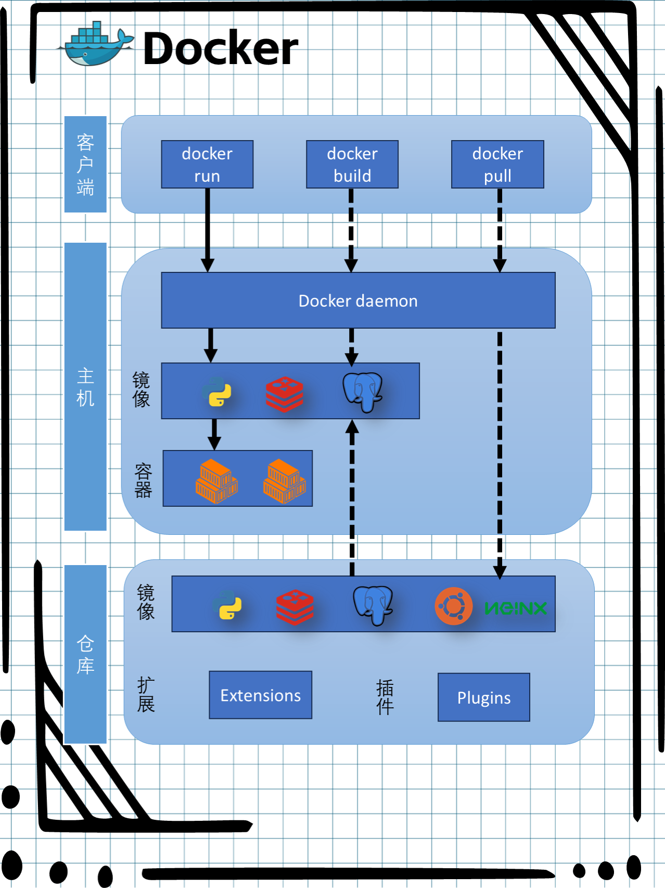

# Docker

<!--
- https://juejin.cn/post/6962848738645639175

- https://weijunext.com/article/docker-full-stack

- http://pea3nut.blog/e1200

抹平不同系统的应用程序安装差异

docker 分几个概念：镜像、容器、仓库

镜像：就是像是我们装机时候需要的系统盘或者系统镜像文件，这里它负责创建 docker 容器的，有很多官方现成的镜像：node、mysql、monogo、nginx 可以从远程仓库下载
容器：可以比拟成一个迷你的系统，例如一个只安装 mysql5.7 的 linux 最小系统，当然你喜欢也可以把 mysql、node 安装在同一个容器中，记住**，容器与容器，容器和主机都是互相隔离的**
仓库：仓库就像是 github 那样的，我们可以制作镜像然后 push 提交到云端的仓库，也可以从仓库 pull 下载镜像 -->

Docker 是一个开源的应用容器引擎，让开发者可以打包他们的应用以及依赖包到一个可移植的容器中，然后发布到任何流行的 Linux 机器上，也可以实现虚拟化。容器是完全使用沙箱机制，相互之间不会有任何接口。

## 为什么需要 Docker？
