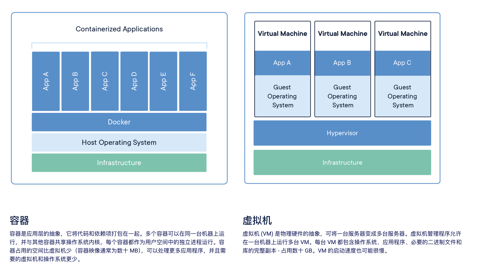

# Docker

Docker 是一个开源的应用容器引擎，让开发者可以打包他们的应用以及依赖包到一个可移植的容器中，然后发布到任何流行的 Linux 机器上，也可以实现虚拟化。容器是完全使用沙箱机制，相互之间不会有任何接口。

> 感觉 Docker 容器可以类比为“局部变量”，而传统的全局环境设置则类似于“全局变量”。  
> Docker 的容器化机制就像是把每个项目的环境独立封装起来，像局部变量一样管理和使用。


## 一、概念

docker 分几个概念：镜像、容器、仓库。

### 1.1 镜像

镜像是 Docker 运行容器的基础，一个镜像包含了运行容器所需的一切：代码、运行时、库、环境变量、配置文件等。

镜像概念等价于 Npm 包的概念，直接理解成 Npm 第三方包即可。

- 镜像是不可变的。镜像一旦创建，就无法修改。您只能创建新镜像或在其上添加更改。

- 镜像由层组成。每层代表一组添加、删除或修改文件的文件系统更改。

Docker Hub 是 Docker 官方的镜像仓库，类似于 Npm 的仓库。

### 1.2 容器

容器化是将应用程序或服务、其依赖项及其配置（抽象化为部署清单文件）一起打包为容器映像的一种软件开发方法。

软件容器充当软件部署的标准单元，其中可以包含不同的代码和依赖项。 按照这种方式容器化软件，开发人员和 IT 专业人员只需进行极少修改或不修改，即可将其部署到不同的环境。

#### 容器与虚拟机

简单来说，虚拟机是一个完整的操作系统，拥有自己的内核、硬件驱动程序、程序和应用程序。启动虚拟机只是为了隔离单个应用程序，这会带来很大的开销。

容器则不同，容器是基于操作系统层面的，共享内核，没有自己的硬件驱动程序，也没有自己的程序和应用程序。



#### 运行容器

[运行容器](https://docs.docker.com/engine/containers/run/)

#### 常用命令

```bash
# 查找镜像
docker search ubuntu

# 拉取特定tag版本的镜像(默认是latest)
docker pull ubuntu:18.0.4

# 查看下载的所有本地镜像
docker images

# 删除镜像
docker rmi ubuntu:18.0.4

```

### 1.3 仓库

理解与 Npm 仓库一样的东西

#### 常用命令

```bash
docker pull nginx
```

### 1.4 docker compose

容器的最佳实践之一是每个容器应该只做一件事，并做好它。

使用 Docker Compose，您可以在单个 YAML 文件中定义所有容器及其配置。如果您将此文件包含在代码存储库中，则克隆存储库的任何人都可以使用单个命令启动并运行。

::: tip Dockerfile 与 Compose 文件

Dockerfile 提供构建容器映像的指令，而 Compose 文件定义正在运行的容器。通常，Compose 文件会引用 Dockerfile 来构建用于特定服务的映像。
:::

## 二、构建镜像

### 镜像层 images layers

堆叠图层
分层是通过内容寻址存储和联合文件系统实现的。虽然这涉及技术，但其工作原理如下：

每一层下载完成后，都会被提取到主机文件系统上其自己的目录中。
当您从图像运行容器时，将创建一个联合文件系统，其中各层堆叠在一起，从而创建一个新的统一的视图。
当容器启动的时候，它的根目录被设置为这个统一目录的位置，使用 chroot。

docker container commit

### Dockerfile

Dockerfile 是用于创建容器映像的文本文档。它为映像构建器提供有关要运行的命令、要复制的文件、启动命令等的说明。

```bash
FROM python:3.12
WORKDIR /usr/local/app

# Install the application dependencies
COPY requirements.txt ./
RUN pip install --no-cache-dir -r requirements.txt

# Copy in the source code
COPY src ./src
EXPOSE 5000

# Setup an app user so the container doesn't run as the root user
RUN useradd app
USER app

CMD ["uvicorn", "app.main:app", "--host", "0.0.0.0", "--port", "8080"]
```

1. 确定基础映像 Determine your base image
2. 安装应用程序依赖项
3. 复制任何相关的源代码和/或二进制文件
4. 配置最终图像

### 构建镜像

- 构建图像——基于构建图像的过程 Dockerfile
- 标记图像 - 为图像命名的过程，这也决定了图像可以分发到哪里
- 发布镜像——使用容器注册表分发或共享新创建的镜像的过程

### 构建缓存

### 多阶段构建

## 三、容器运行

### 公开端口

### 覆盖容器默认值

### 持久保存容器数据 volumes

### 数据共享

Docker 提供了存储选项来弥合容器隔离与主机数据之间的差距。
Docker 提供了两种主要存储选项，用于在主机和容器之间保存数据和共享文件：卷和绑定挂载。

### 多容器应用程序: Docker Compose


- https://dockerworld.cn/?id=344
- https://yeasy.gitbook.io/docker_practice/image/dockerfile
- https://docs.docker.com/get-started/workshop/02_our_app/
- https://www.linglan01.cn/post/16
