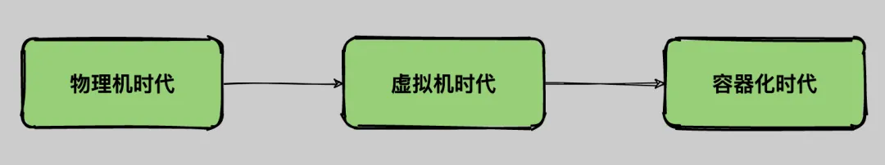

# K8s

> k8s 是 kubernets 的缩写，’8‘代表中间的八个字符。

## 参考

- [Docker 不香吗？为什么还要用 k8s](https://mp.weixin.qq.com/s?__biz=MzIwODI1OTk1Nw==&mid=2650322467&idx=1&sn=30ab39d4f59135ecf6eb322fb0712189&chksm=8f09c839b87e412fdae1c39072ebdbbdcc3420b46fb66a324f5f81d8ebe621fe0ac3ef003a7d&token=1553501157&lang=zh_CN#rd)
