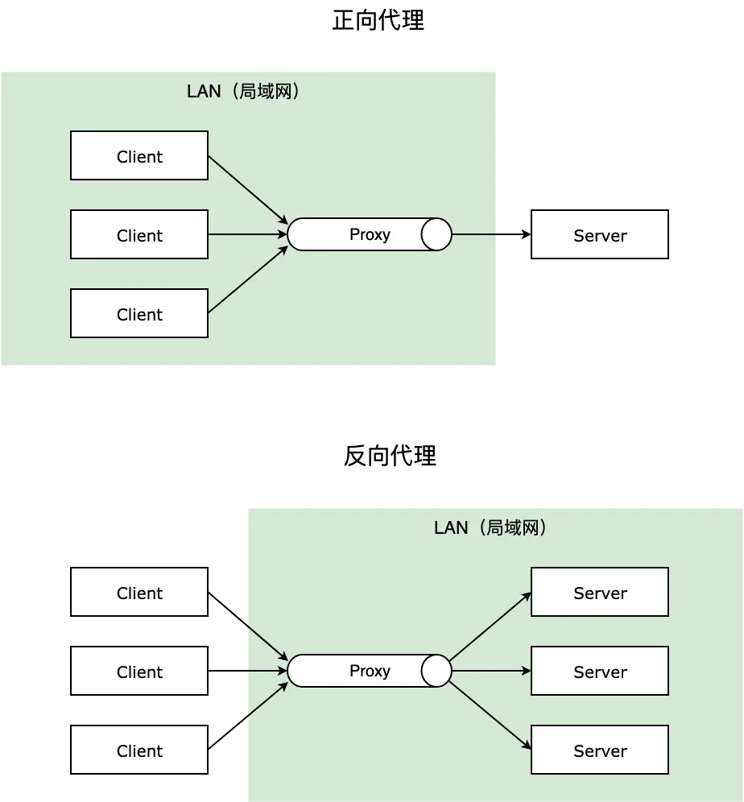

# Nginx

## 一、基础概念

Nginx (engine x) 是一款轻量级的 Web 服务器 、反向代理服务器及电子邮件（IMAP/POP3）代理服务器。

### 1.1 特点

- 处理高并发连接：官方测试 Nginx 能够支持 5 万并发链接，实际生产环境中可以支撑 2 - 4 万并发连接数；
- 静态内容快速响应：Nginx 可以直接处理静态文件（如图片、CSS 和 JavaScript 文件），减轻后端服务器的负担。
- 动态内容的负载均衡：将用户请求分发到多个后端服务器，提高网站的响应速度和可用性。
- 安全加固：通过配置 SSL、防止 DDoS 攻击等方式，提高网站的安全性。

### 1.2 常用命令

[安装](https://docs.ffffee.com/nginx/2-nginx%E5%AE%89%E8%A3%85%E6%8C%87%E5%8D%97.html#mac-%E5%AE%89%E8%A3%85-nginx)

```bash
nginx # 启动
nginx -s stop       快速关闭Nginx，可能不保存相关信息，并迅速终止web服务。
nginx -s quit       平稳关闭Nginx，保存相关信息，有安排的结束web服务。
nginx -s reload     因改变了Nginx相关配置，需要重新加载配置而重载。
nginx -s reopen     重新打开日志文件。
nginx -c filename   为 Nginx 指定一个配置文件，来代替缺省的。
nginx -t            不运行，仅仅测试配置文件。nginx 将检查配置文件的语法的正确性，并尝试打开配置文件中所引用到的文件。
nginx -v            显示 nginx 的版本。
nginx -V            显示 nginx 的版本，编译器版本和配置参数。
```

- 配置文件：`open /opt/homebrew/etc/nginx`
- 打开 Html 目录: `open /opt/homebrew/var/www`

### 1.3 配置文件 nginx.conf

最简单的配置文件结构示意

```bash
# 全局配置
worker_processes  1; # Nginx 使用 1 个工作进程。

events {
  worker_connections  1024; # 每个进程允许的最大连接数。
}

http {
  server {
    listen       80;                # 监听 80 端口
    server_name  localhost;         # 服务器名称

    location / {
        root   /usr/share/nginx/html;   # 根目录
        index  index.html index.htm;    # 默认主页文件
    }
  }
}
```

## 二、动静分离


动静分离是指将静态资源（如 HTML、CSS、JavaScript、图片等）与动态资源（如 API 接口、PHP 等后端代码）分离，通过 Nginx 将静态资源直接提供给客户端，而将动态请求代理给后端服务处理。这样可以提高静态资源的访问速度，并减轻后端服务器的负担。

```bash
# 动静分离 配置示例
worker_processes  1;

events {
    worker_connections  1024;
}

http {
    server {
        listen       80;
        server_name  www.example.com;

        # 静态资源处理
        location /static/ {
            root /var/www/html;  # 静态资源存放路径
            index index.html;
        }

        # 动态请求代理到后端服务器
        location /api/ {
            proxy_pass http://localhost:3000;  # 代理到后端应用服务器（例如 Node.js）
            proxy_set_header Host $host;
            proxy_set_header X-Real-IP $remote_addr;
            proxy_set_header X-Forwarded-For $proxy_add_x_forwarded_for;
            proxy_set_header X-Forwarded-Proto $scheme;
        }

        # 根目录请求
        location / {
            root /var/www/html;   # 网站根目录
            index index.html index.htm;
            try_files $uri $uri/ =404;  # 优先查找文件，不存在时返回 404
        }
    }
}
```

## 三、正向代理和反向代理



### 3.1 正向代理（Forward Proxy）

正向代理是指代理服务器代表客户端向目标服务器发出请求。客户端知道自己在访问代理服务器，目标服务器不知道客户端的真实 IP 地址。

工作原理：

- 客户端发送请求给代理服务器。
- 代理服务器代表客户端向目标服务器发送请求。
- 目标服务器将响应发送回代理服务器。
- 代理服务器将响应返回给客户端。

场景：

- 访问受限网站：当客户端无法直接访问某些网站时，可以通过正向代理绕过访问限制。（科学上网）
- 隐藏客户端信息：正向代理可以隐藏客户端的真实 IP，保护隐私。
- 缓存：正向代理可以缓存客户端的请求结果，以减少重复请求和加快访问速度。

```bash
# 正向代理配置示例
# 允许客户端通过 8080 访问目标网站 http://target-website.com，同时保留原始请求的关键信息。
server {
    listen 8080;

    location / {
        proxy_pass http://target-website.com;  # 将请求代理到目标网站
        proxy_set_header Host $host;
        proxy_set_header X-Real-IP $remote_addr;  # 向目标网站发送客户端真实 IP
        proxy_set_header X-Forwarded-For $proxy_add_x_forwarded_for;
        proxy_set_header X-Forwarded-Proto $scheme;
    }
}
```

### 3.2 反向代理（Reverse Proxy）

反向代理是指代理服务器代表目标服务器接收客户端请求并返回响应。客户端不知道后端服务器的存在，只知道它在和代理服务器通信。

工作原理：

- 客户端发送请求给反向代理服务器。
- 反向代理服务器将请求转发给内部的目标服务器（后端服务器）。
- 后端服务器返回响应给反向代理服务器。
- 反向代理服务器将响应返回给客户端。

场景：

- 负载均衡：反向代理可以将客户端请求分发到多个后端服务器，平衡负载。
- 隐藏服务器信息：反向代理可以隐藏后端服务器的真实 IP 和架构，增强安全性。
- SSL 终止：反向代理可以处理 HTTPS 加密流量，减轻后端服务器的负担。
- 缓存：反向代理可以缓存后端服务器的响应，提升性能。

```bash
# 反向代理配置示例
server {
    listen 80;
    server_name www.example.com;

    location / {
        proxy_pass http://localhost:3000;  # 将请求代理到后端应用
        proxy_set_header Host $host;
        proxy_set_header X-Real-IP $remote_addr;  # 向后端服务器传递客户端真实 IP
        proxy_set_header X-Forwarded-For $proxy_add_x_forwarded_for;
        proxy_set_header X-Forwarded-Proto $scheme;
    }
}
```

这是一个反向代理最简单的模型，只是为了说明反向代理的配置。但是现实中反向代理多数是用在负载均衡中。

> 代理其实就是一个中介，A 和 B 本来可以直连，中间插入一个 C，C 就是中介。刚开始的时候，代理多数是帮助内网 client 访问外网 server 用的（比如 HTTP 代理），从内到外 . 后来出现了反向代理，"反向"这个词在这儿的意思其实是指方向相反，即代理将来自外网 client 的请求 forward 到内网 server，从外到内

## 四、负载均衡

随着业务的不断增长和用户的不断增多，一台服务已经满足不了系统要求了。这个时候就出现了服务器 集群。

在服务器集群中，Nginx 可以将接收到的客户端请求“均匀地”（严格讲并不一定均匀，可以通过设置权重）分配到这个集群中所有的服务器上。这个就叫做负载均衡。

### 4.1 负载均衡的工作原理

负载均衡器位于客户端与服务器集群之间，扮演“中间人”的角色，负责将客户端的请求分配给不同的后端服务器。常见的负载均衡策略包括：

- 轮询（Round Robin）：请求依次分配给每个服务器。
- 最少连接（Least Connections）：将请求分配给当前连接数最少的服务器。
- IP 哈希（IP Hash）：根据客户端的 IP 地址分配请求，确保来自同一客户端的请求总是被分配到同一台服务器。
- 加权轮询（Weighted Round Robin）：根据服务器的权重，分配更多请求到性能更强的服务器。

#### 4.2 Nginx 负载均衡配置示例

- 轮询

```bash
http {
    upstream backend_servers {
        server server1.example.com;
        server server2.example.com;
        server server3.example.com;
    }

    server {
        listen 80;
        server_name www.example.com;

        location / {
            proxy_pass http://backend_servers;  # 将请求转发给后端服务器组
            proxy_set_header Host $host;
            proxy_set_header X-Real-IP $remote_addr;
            proxy_set_header X-Forwarded-For $proxy_add_x_forwarded_for;
        }
    }
}
```

说明:

- upstream：定义一个后端服务器组 backend_servers，包含了 server1.example.com、server2.example.com 和 server3.example.com。
- proxy_pass：将客户端的请求转发给后端服务器组 backend_servers，Nginx 会自动按照轮询的方式分发请求。

#### 4.3 健康检查

为了确保负载均衡的服务器始终可用，Nginx 可以对后端服务器进行健康检查。默认情况下，如果后端服务器不可用，Nginx 会自动跳过它并将请求分配给其他可用服务器。

```bash
http {
    upstream backend_servers {
        server server1.example.com max_fails=3 fail_timeout=30s;
        server server2.example.com;
        server server3.example.com;
    }

    server {
        listen 80;
        server_name www.example.com;

        location / {
            proxy_pass http://backend_servers;
            proxy_set_header Host $host;
            proxy_set_header X-Real-IP $remote_addr;
            proxy_set_header X-Forwarded-For $proxy_add_x_forwarded_for;
        }
    }
}
```

配置说明：

- max_fails=3：如果连续 3 次连接失败，则认为该服务器不可用。
- fail_timeout=30s：在 30 秒内不会再向该服务器发送请求，之后会重新尝试。

## 五、SSL/TLS 加密

要在 Nginx 中启用 SSL/TLS，需要一个有效的 SSL 证书 和 私钥。证书可以通过 CA 机构购买或使用免费的 Let’s Encrypt 证书。

```bash
# 配置示例
server {
    listen 443 ssl;  # 监听 HTTPS 请求的 443 端口
    server_name www.example.com;

    ssl_certificate /etc/nginx/ssl/example.com.crt;   # 指定证书路径
    ssl_certificate_key /etc/nginx/ssl/example.com.key;  # 指定私钥路径

    ssl_protocols TLSv1.2 TLSv1.3;  # 启用 TLS 1.2 和 TLS 1.3
    ssl_ciphers HIGH:!aNULL:!MD5;  # 配置安全的加密算法

    location / {
        proxy_pass http://backend_server;
        proxy_set_header Host $host;
        proxy_set_header X-Real-IP $remote_addr;
        proxy_set_header X-Forwarded-For $proxy_add_x_forwarded_for;
    }
}

# 配置 HTTP 到 HTTPS 的重定向
server {
    listen 80;
    server_name www.example.com;
    return 301 https://$host$request_uri;  # 将所有 HTTP 请求重定向到 HTTPS
}
```

配置说明：

- ssl_certificate：指定服务器的 SSL 证书文件路径。
- ssl_certificate_key：指定服务器的 SSL 私钥文件路径。
- ssl_protocols：指定启用的 SSL/TLS 版本，建议只启用安全版本，如 TLS 1.2 和 TLS 1.3。
- ssl_ciphers：指定加密算法的组合，确保使用强加密。

#### HTTP 重定向到 HTTPS

```bash
server {
    listen 80;
    server_name www.example.com;
    return 301 https://$host$request_uri;  # 将所有 HTTP 请求重定向到 HTTPS
}
```

## 六、常见优化

### 6.1 图片防盗链

```bash
# 配置示例
server {
  listen       80;
  server_name  *.sherlocked93.club;

  # 图片防盗链

  location ~* \.(gif|jpg|jpeg|png|bmp|swf)$ {
    valid_referers none blocked 192.168.0.2;  # 只允许本机 IP 外链引用
    if ($invalid_referer){
      return 403;
    }
  }
}
```
