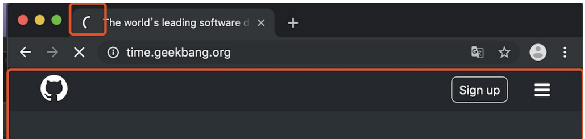

# 从用户搜索开始

## 主要流程

- **资源获取：**
  - 1.  ⽤⼾输⼊ url 并回⻋
  - 2.  浏览器进程检查 url，组装协议，构成完整的 url
  - 3. 『浏览器进程』通过进程间通信（**IPC**）把 url 请求发送给『**⽹络进程』**
  - 4. 『⽹络进程』接收到 url 请求后检查本地缓存是否缓存了该请求资源，如果有则将该资源返回给『浏览器进程』。
  - 5.  如果没有，⽹络进程向 web 服务器发起**http**请求（⽹络请求），请求流程如下：
    - 1.1 进⾏ DNS 解析，获取服务器 ip 地址，端⼝（端⼝是通过 dns 解析获取的吗？这⾥有个疑问）。
    - 1.2 利⽤ ip 地址和服务器建⽴ tcp 连接
    - 1.3 构建请求头信息
    - 1.4 发送请求头信息
    - 1.5 服务器响应后，**⽹络进程**接收响应头和响应信息，并解析响应内容
  - 6，⽹络进程解析响应流程；
    - 6.1 检查状态码，**如果是 301/302，则需要重定向**，从 Location ⾃动中读取地址，重新进⾏第 4 步，如果是 200，则继续处理请求。
    - 6.2 200 响应处理：
      - 检查响应类型 Content-Type，如果是字节流类型，则将该请求提交给下载管理器，该导航流程结束，不再进⾏后续的渲染，如果是 `html` 则通知浏览器进程准备『**渲染进程**』 准备进⾏渲染。
- **资源渲染**:
  - 7，准备渲染进程
    - 7.1 浏览器进程检查当前 url 是否和之前打开的渲染进程根域名是否相同，如果相同，则复⽤原来的进程， 如果不同，则开启新的渲染进程
  - 8.  传输数据、更新状态
    - 8.1 渲染进程准备好后，浏览器向渲染进程发起“提交⽂档”的消息，渲染进程接收到消息和⽹络进程建⽴传输数据的“管道”
    - 8.2 渲染进程接收完数据后，向浏览器发送“确认提交”。浏览器进程接收到确认消息后更新浏览器界⾯状态：安全、地址栏 url、前进后退的历史状态、更新 web ⻚⾯。
  - 9.  渲染流程
    - HTML
    - CSS
    - JS
      - V8 如何执行 JS 代码
      - ...

## 一、资源获取

### 1.1 处理用户输入

当关键字录入之后，地址栏将判断关键字是搜索内容抑或 URL。

- 如果是搜索内容，地址栏会使⽤浏览器默认的搜索引擎，来合成新的带搜索关键字的 URL。
- 如果判断输⼊内容符合 URL 规则，⽐如输⼊的是 time.geekbang.org，那么地址栏会根据规则，把这段内容加上协议，合成为完整的 URL，如[https://time.geekbang.org](https://time.geekbang.org/)。

从图中可以看出，当浏览器刚开始加载⼀个地址之后，标签⻚上的图标便进⼊了加载状态。但此时图中⻚⾯显⽰的依然是之前打开的⻚⾯内容，并没⽴即替换为极客时间的⻚⾯。因为需要等待**提交⽂档**阶段，⻚⾯内容才会被替换。

### 1.2 资源请求

接下来，便进⼊了⻚⾯资源请求过程。这时，浏览器进程会通过**进程间通信（IPC）**把 URL 请求发送⾄**⽹络进程**，⽹络进程接收到 URL 请求后，会在这⾥发起真正的 URL 请求流程。

- ⾸先，⽹络进程会查找**本地缓存**是否缓存了该资源。如果有缓存资源，那么直接返回资源给浏览器进程；如果在缓存中没有查找到资源或缓存到期，那么直接进⼊⽹络请求流程。
- 请求前的第⼀步是要进⾏ DNS 解析，以获取请求域名的服务器 IP 地址。如果请求协议是 HTTPS，那么还需要建⽴ TLS 连接。
- 接下来就是利⽤ IP 地址和服务器建⽴ TCP 连接。连接建⽴之后，浏览器端会构建请求⾏、请求头等信息，并把和该域名相关的 Cookie 等数据附加到请求头中，然后向服务器发送构建的请求信息。
- 服务器接收到请求信息后，会根据请求信息⽣成响应数据（包括响应⾏、响应头和响应体等信息），并发给⽹络进程。等⽹络进程接收了响应⾏和响应头之后，就开始解析响应头的内容了。

### 1.2.1 [浏览器缓存](https://www.yuque.com/liuxia-1onjl/ebooks/lllmft?view=doc_embed)

### 1.2.2 DNS 解析

> DNS: Domain Name System。 将人类可读的域名 (例如，www.amazon.com) 转换为机器可读的 IP 地址 (例如，192.0.2.44)。

**查询流程**:

- 1、检查**浏览器缓存**中是否存在该域名与 IP 地址的映射关系，如果有则解析结束，没有则继续
- 2、到**系统本地**查找映射关系，一般在 hosts 文件中，如果有则解析结束，否则继续
- 3、到**本地域名服务器**去查询，有则结束，否则继续
- 4、**本地域名服务器**查询**根域名服务器**，该过程并不会返回映射关系，只会告诉你去下级服务器(顶级域名服务器)查询
- 5、**本地域名服务器**查询**顶级域名服务器**(即 com 服务器)，同样不会返回映射关系，只会引导你去二级域名服务器查询
- 6、**本地域名服务器**查询**二级域名服务器**(即 baidu.com 服务器)，引导去三级域名服务器查询
- 7、**本地域名服务器**查询**三级域名服务器**(即 mail.baidu.com 服务器)，此时已经是最后一级了，如果有则返回映射关系，则**本地域名服务器**加入自身的映射表中，方便下次查询或其他用户查找，同时返回给该用户的计算机，没有找到则网页报错
- 8、如果还有下级服务器，则依此方法进行查询，直至返回映射关系或报错。

### 1.2.3 [数据请求：TCP](./04-数据请求：TCP.md)

### 1.2.4 [数据请求：HTTP 请求流程](./05-数据请求：HTTP请求流程.md)

### 1.2.5 响应数据类型处理

在处理了跳转信息之后，我们继续导航流程的分析。URL 请求的数据类型，有时候是⼀个下载类型，有时候 是正常的 HTML ⻚⾯，那么浏览器是如何区分它们呢？

答案是 Content-Type。**Content-Type 是 HTTP 头中⼀个⾮常重要的字段， 它告诉浏览器服务器返回的响应体数据是什么类型**，然后浏览器会根据 Content-Type 的值来决定如何显⽰响应体的内容。

- 响应头中的 Content-type 字段的值是 text/html，这就是告诉浏览器，服务器返回的数据 是**HTML 格式**。
- Content-Type 的值是 application/octet-stream，显⽰数据是**字节流类型**的通常情况下，浏览器会按照**下载类型**来处理该请求。
  如果 Content-Type 字段的值被浏览器判断为**下载类型，那么该请求会被提交给浏览器的下载管理器，同时该 URL 请求的导航流程就此结束**。但如果是**HTML， 那么浏览器则会继续进⾏导航流程**。由于 Chrome 的⻚⾯渲染是运⾏在渲染进程中的，所以接下来就需要准备渲染进程了。

## 二、资源渲染

### 2.1 渲染进程

默认情况下，Chrome 会为每个⻚⾯分配⼀个渲染进程，也就是说，每打开⼀个新⻚⾯就会配套创建⼀个新的渲染进程。但是，也有⼀些例外，在某些情况下，浏览器会让多个⻚⾯直接运⾏在同⼀个渲染进程中。
Chrome 的默认策略是，每个标签对应⼀个渲染进程。但**如果从⼀个⻚⾯打开了另⼀个新⻚⾯，⽽新⻚⾯和当前⻚⾯属于同⼀站点的话，那么新⻚⾯会复⽤⽗⻚⾯的渲染进程**。官⽅把这个默认策略叫 process-per- site-instance。

渲染进程准备好之后，还不能⽴即进⼊⽂档解析状态，因为此时的⽂档数据还在⽹络进程中，并没有提交给渲染进程，所以下⼀步就进⼊了提交⽂档阶段。

#### **2.1.1 提交⽂档**

⾸先要明确⼀点，**这⾥的“⽂档”是指 URL 请求的响应体数据。**

**“提交⽂档”的消息是由浏览器进程发出的，渲染进程接收到“提交⽂档”的消息后，会和⽹络进程建⽴传输数据的“管道”。**

等⽂档数据传输完成之后，渲染进程会返回“**确认提交**”的消息给浏览器进程。

浏览器进程在收到“确认提交”的消息后，会**更新浏览器界⾯状态**，包括了安全状态、地址栏的 URL、前 进后退的历史状态，并更新 Web ⻚⾯。

⼀旦⽂档被提交，渲染进程便开始⻚⾯解析和⼦资源加载了。

### 2.2 HTML、CSS、JS 如何变成页面

#### 

1. 渲染进程将 HTML 内容转换为能够读懂的 DOM 树树结构。
2. 渲染引擎将 CSS 样式表转化为浏览器可以理解的 styleSheets，计算出 DOM 节点的样式。
3. 创建布局树，并计算元素的布局信息。
4. 对布局树进⾏分层，并⽣成分层树。
5. 为每个图层⽣成**绘制列表**，并将其提交到**合成线程**。
6. 合成线程将图层分成图块，并在光栅化线程池中将图块转换成位图。
7. 合成线程发送绘制图块命令 DrawQuad 给浏览器进程。
8. 浏览器进程根据 DrawQuad 消息⽣成⻚⾯，并显⽰到显⽰器上。

### 2.3 [以 V8 的角度看 JS](https://www.yuque.com/liuxia-1onjl/ebooks/rch2db?view=doc_embed)

- V8 如何执行一段 js 代码
- 执行上下文
- 变量提升
- JS 调用栈
- 作用域
- 作用域链和闭包
- 栈和堆
- 消息队列
- 事件循环
- 垃圾回收
