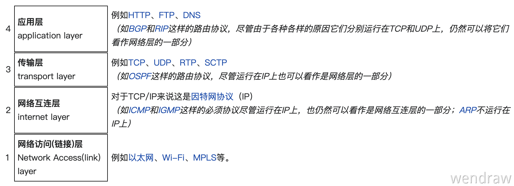
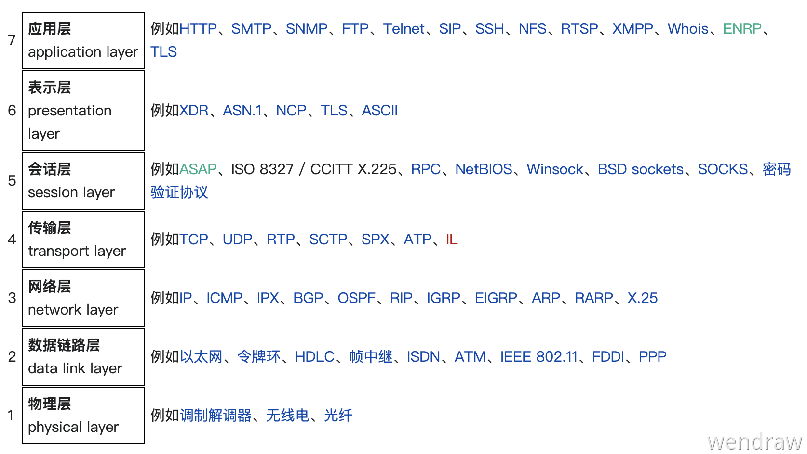
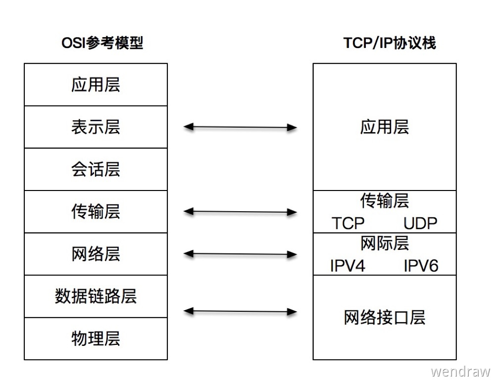

# 数据请求：计算机网络基础

你肯定常常听人说起过「四层」和「七层」，这些概念究竟是什么呢？计算机网络有两波人在搞，一波是由[文顿·瑟夫](https://zh.wikipedia.org/wiki/%E6%96%87%E9%A1%BF%C2%B7%E7%91%9F%E5%A4%AB)和[罗伯特·卡恩](https://zh.wikipedia.org/wiki/%E7%BD%97%E4%BC%AF%E7%89%B9%C2%B7%E5%8D%A1%E6%81%A9)两位开发的 [TCP/IP](https://zh.wikipedia.org/wiki/TCP/IP%E5%8D%8F%E8%AE%AE%E6%97%8F)。另一波是 ISO 组织（[国际标准化组织](https://zh.wikipedia.org/wiki/%E5%9B%BD%E9%99%85%E6%A0%87%E5%87%86%E5%8C%96%E7%BB%84%E7%BB%87)）召集了一帮人搞出了一个 [OSI 模型](https://zh.wikipedia.org/wiki/OSI%E6%A8%A1%E5%9E%8B)（Open System Interconnection Model）。

## TCP/IP

TCP/IP 可能是你已经听得耳朵起茧子的概念了，它是目前事实上的网络通信标准。用「分层」的概念将复杂的网络通过分治的思想分为了「四层」。

TCP/IP 协议总共有四层，就像搭积木一样，每一层需要下层的支撑，同时又支撑着上层，任何一层被抽掉都可能会导致整个协议栈坍塌。我们从下网上依次介绍。

第一层：**Link Layer（链接层**），负责在以太网、WiFi 这样的底层网络上发送原始数据包，工作在网卡这个层次，使用 MAC 地址来标记网络上的设备，所以有时候也叫做 MAC 层。

第二层：**Internet Layer（网络互联层 或者 网际层）**，IP 协议就处于这一层。因为 IP 协议定义了「IP 地址」的概念，所以可以在「链接层」的概念上，用 IP 地址取代 MAC 地址，把所有的局域网、广域网链接成一个虚拟的巨大的网络。在这个网络中想要找到具体的设备，只要将 IP 地址再 “翻译” 成 MAC 地址就可以了。

第三层：**Transport Layer（传输层）**，这个层次的指责就是保证数据在 IP 地址之间能 “可靠的” 传输。是 TCP 协议的工作层次，当然还有其他协议，如：UDP、RTP 等等。

第四层：**Application Layer（应用层）**，由于下面三层已经把数据传输的基本能力搞定了，应用层主要是针对特定领域去实现协议，所以这一层就是百花齐放了。如：HTTP、Telnet、SSH、FTP、SMTP 等等。

## OSI

OSI 是 ISO 组织提出来的“大一统”的通讯标准，OSI 模型也分为「七层」。

我们也从下往上稍微介绍一下：

第一层：**Physical Layer（物理层）**，就是网络的物理形式，如：调制解调器、光纤、网卡等等。
第二层：**Data Link Layer（数据链路层）**，基本上相当于 TCP/IP 的「链接层」。
第三层：**Network Layer（网络层）**，基本上相当于 TCP/IP 的「网络互联层」。
第四层：**Transport Layer（传输层）**，基本上相当于 TCP/IP 的「传输层」。
第五层：**Session Layer（会话层）**，维护网络中的连接状态，即保持会话和同步。
第六层：**Presentation Layer（表示层）**，把数据转换成适合的、容易理解的语法和语义。
第七层：**Application Layer（应用层）**，面向具体应用的传输数据。

但是在 OSI 模型发布之前 TCP/IP 协议栈已经实际运行在很多网络系统之中了。所以 ISO 组织表示这是一个 “参考” 标准，具体怎么实现还是看你们自己。

不知道你们有没有跟我一样的疑问，TCP/IP 已经的「四层」已经够用了为什么还要弄出来一个「七层」的概念。相对而言 TCP/IP 是一个纯软件的协议栈，最底层的电缆、网卡等物理设备没有给出定义。OSI 模型弥补了这个缺，在理论层面上可以更加完整描述网络。所以 TCP/IP 和 OSI 模型之间的关系可以用一张图表示。

## 参考

[第 195 期 | TCP/IP 和 Linux 是如何改变世界的？](https://time.geekbang.org/column/article/192553)[05 | 常说的“四层”和“七层”到底是什么？“五层”“六层”哪去了？](https://time.geekbang.org/column/article/99286)
