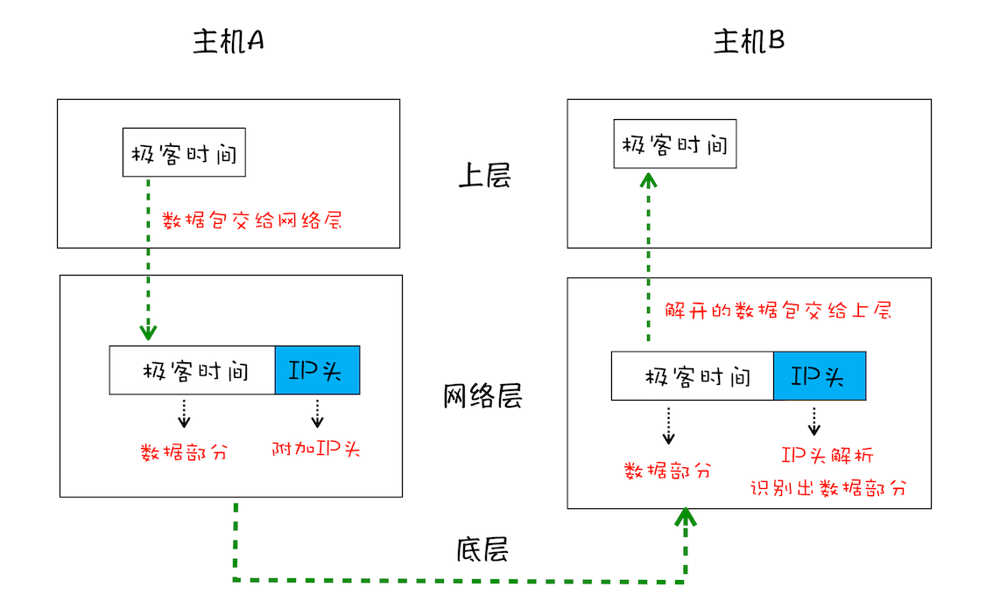
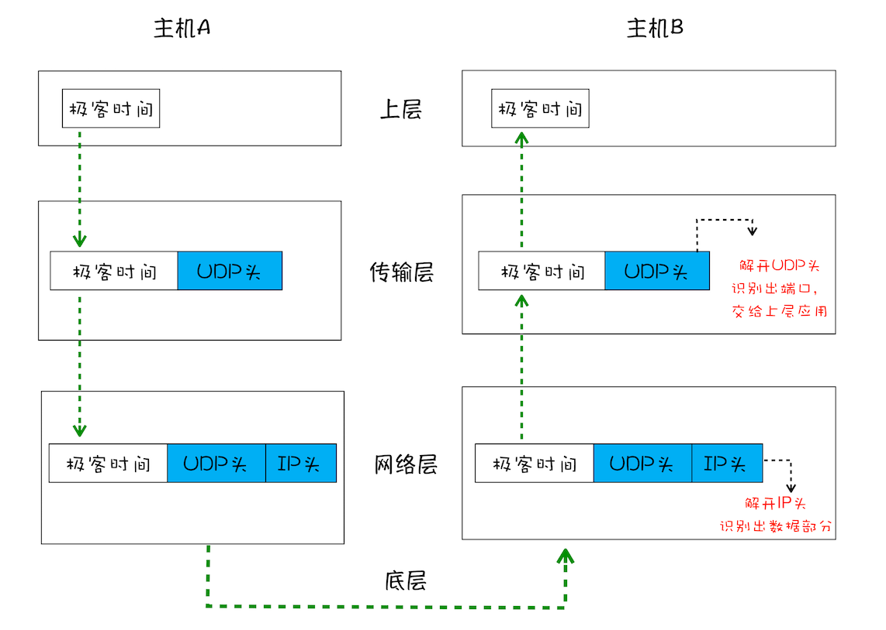
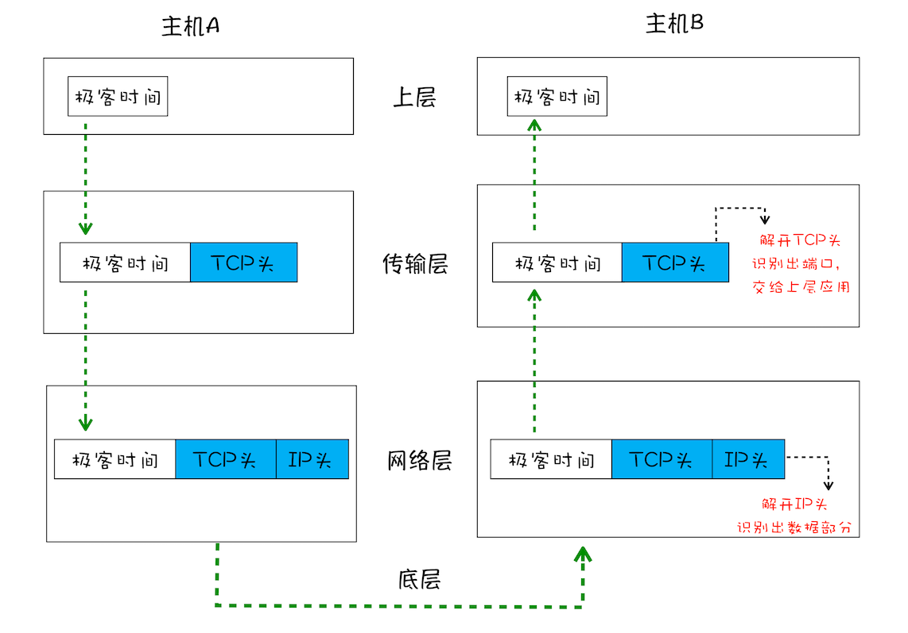
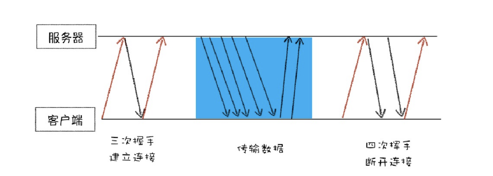

# 数据请求：TCP

> TCP 如何保证页面文件完整的被送达浏览器？

互联网，实际上是一套 **理念** 和 **协议** 组成的体系架构。其中，协议是一套众所周知的规则和标准，如果各方都同意使用，那么它们之间的通信将变得毫无障碍。

互联网中的数据是通过数据包来传输的。如果发送的数据很大，那么该数据就会被拆分为很多小数据包来传输。比如你现在听的音频数据，是拆分成一个个小的数据包来传输的，并不是一个大的文件一次传输过来的。

# IP：把数据包传送目的主机

> 数据包要在互联网上进行传输，就要符合网际协议（Internet Protocol，简称 IP）标准。
> 互联网上不同的在线设备都有唯一的地址，地址只是一个数字，这和大部分家庭收件地址类似，你只需要知道一个家庭的具体地址，就可以往这个地址发送包裹，这样物流系统就能把物品送到目的地。

IP：不同的在线地址唯一的地址。 数据 data 交由网络层后，对齐进行 IP 头包装，(IP 头是 IP 数据包开头的信[息，包含 IP 版本、源 IP 地址、⽬标 IP 地址、⽣存时间等信息](https://zh.wikipedia.org/wiki/%E4%BC%A0%E8%BE%93%E6%8E%A7%E5%88%B6%E5%8D%8F%E8%AE%AE)) ，发送到目标 IP 地址网络层，再经拆解后，数据 data 到达目标上层。

# 2. UDP：把数据包送达应用程序

IP 只负责将数据传送到对方电脑。 对方电脑需要判断该数据当应用到什么地方，比如浏览器抑或王者荣耀。 因此，需要基于 IP 之上开发能和应⽤打交道的协议，最常⻅的是“⽤⼾数据包协议（User Datagram Protocol）”，简称**UDP**。

UDP 中⼀个最重要的信息是**端⼝号**，每个想访问⽹络的程序都需要绑定⼀个端⼝号。通过端⼝号 UDP 就能把指定的数据包发送给指定的程序了，**所以 IP 通过 IP 地址信息把数据包发送给指定的电脑，⽽ UDP 通过端⼝号把数据包分发给正确的程序**。和 IP 头⼀样，端⼝号会被装进 UDP 头⾥⾯，UDP 头再和原始数据包合并组成新的 UDP 数据包。**UDP 头中除了⽬的端⼝，还有源端⼝号等信息。**

在使⽤ UDP 发送数据时，有各种因素会导致数据包出错，虽然 UDP 可以校验数据是否正确，但是对于错误的数据包，UDP 并不提供重发机制，只是丢弃当前的包，⽽且 UDP 在发送之后也⽆法知道是否能达到⽬的地。

虽说 UDP 不能保证数据可靠性，但是传输速度却⾮常快，所以 UDP 会应⽤在⼀些关注速度、但不那么严格要求数据完整性的领域，如在线视频、互动游戏等。

# 3. TCP：把数据完整地送达应用程序

TCP（Transmission Control  Protocol，传输控制协议）是⼀种⾯向连接的、可靠的、基于字节流的传输层通信协议。相对于 UDP，TCP 有下⾯两个特点:

- 对于数据包丢失的情况，TCP 提供重传机制；
- TCP 引⼊了数据包排序机制，⽤来保证把乱序的数据包组合成⼀个完整的⽂件。

⼀个完整的 TCP 连接的⽣命周期包括了“建⽴连接”“传输数据”和“断开连接”三个阶 段。

- ⾸先，建⽴连接阶段。这个阶段是通过“三次握⼿”来建⽴客⼾端和服务器之间的连接。TCP 提供⾯向连接的通信传输。⾯向连接是指在数据通信开始之前先做好两端之间的准备⼯作。**所谓三次握⼿，是指在建⽴⼀个 TCP 连接时，客⼾端和服务器总共要发送三个数据包以确认连接的建⽴。**

- 其次，传输数据阶段。在该阶段，**接收端需要对每个数据包进⾏确认操作**，也就是接收端在接收到数据包之后，需要发送确认数据包给发送端。所以当发送端发送了⼀个数据包之后，在规定时间内没有接收到接 收端反馈的确认消息，则判断为数据包丢失，并触发发送端的重发机制。同样，⼀个⼤的⽂件在传输过程 中会被拆分成很多⼩的数据包，这些数据包到达接收端后，接收端会按照 TCP 头中的序号为其排序，从⽽ 保证组成完整的数据。

- 最后，断开连接阶段。数据传输完毕之后，就要终⽌连接了，涉及到最后⼀个阶段“四次挥⼿”来保证双⽅都能断开连接。

# 总结：

> 1. 互联⽹中的数据是通过数据包来传输的，数据包在传输过程中容易丢失或出错
> 2. IP 负责把数据包送达⽬的主机。
> 3. UDP 负责把数据包送达具体应⽤。
> 4. ⽽ TCP 保证了数据完整地传输，它的连接可分为三个阶段：建⽴连接、传输数据和断开连接。

# 拓展

1、现在的浏览器可以同时打开多个页签，他们端口一样吗？如果一样，数据怎么知道去哪个页签？
作者回复: 端口一样的，网络进程知道每个 tcp 链接所对应的标签是那个，所以接收到数据后，会把数据分发给对应的渲染进程

2、http 和 websocket 都是属于应用层的协议吗？
作者回复: 是的，他们都是应用层协议，而且 websocket 名字取的比较有迷惑性，其实和 socket 完全不一样，你可以把 websocket 看出是 http 的改造版本，增加了服务器向客户端主动发送消息的能力。

3、tcp 传送数据时 浏览器端就做渲染处理了么？如果前面数据包丢了 后面数据包先来是要等么？类似的那种实时渲染怎么处理？针对数据包的顺序性？
作者回复: 接收到 http 响应头中的 content-type 类型时就开始准备渲染进程了， 响应体数据一旦接受到便开始做 DOM 解析了！ 基于 http 不用担心数据包丢失的问题，因为丢包和重传都是在 tcp 层解决的。http 能保证数据按照顺序接收的！

4、老师，那我打开谷歌浏览器里面开了 10 个页面，那就是至少有 40 个进程？windows 下我控制面板里能看到 40 个 google.exe？插件进程页面间能公用么
作者回复: 不用这么多啊，浏览器进程 网络进程，GPU 进程都是共同的，你打开十个页面一般也就十几个进程。

> 原文: <https://www.yuque.com/liuxia-1onjl/ebooks/gaw8m7>
