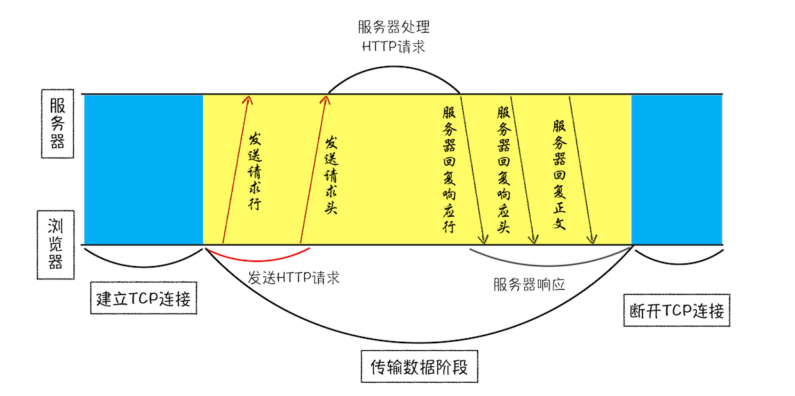
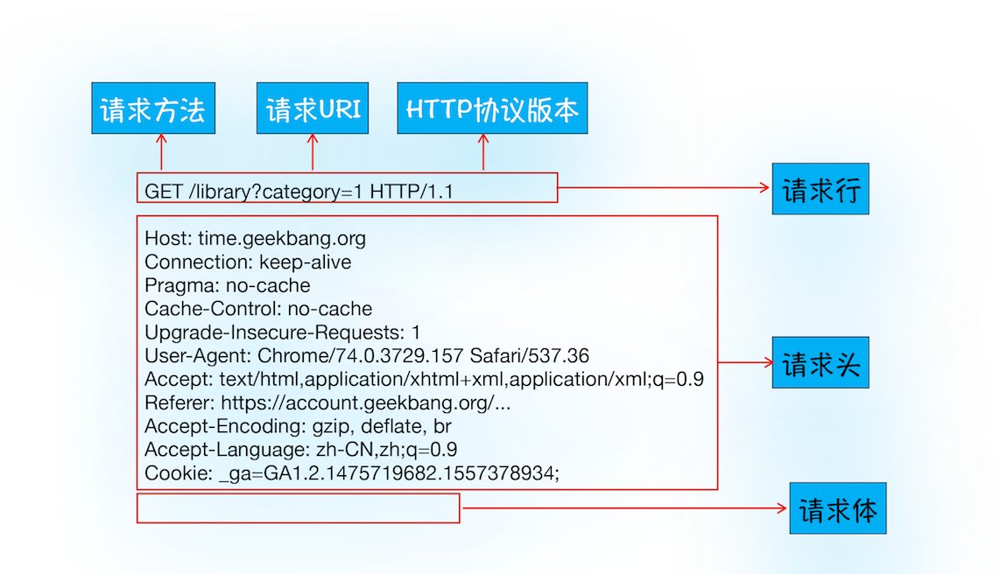
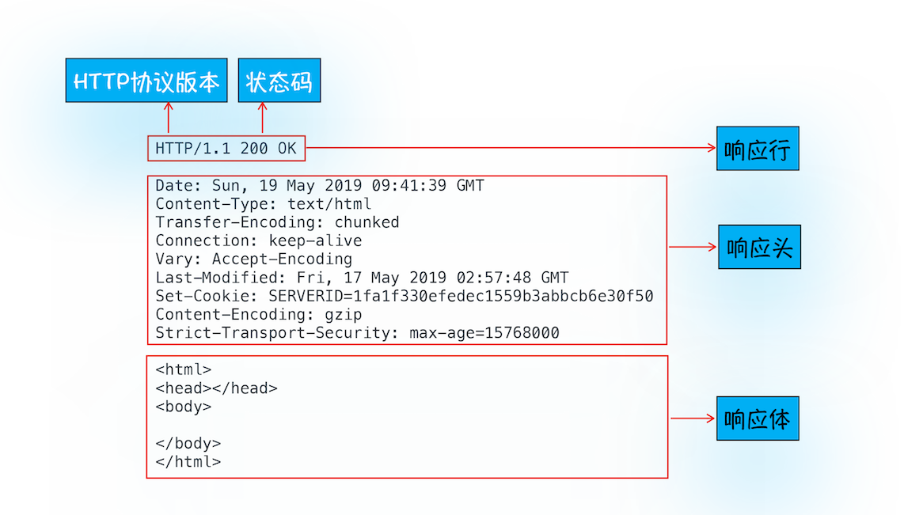
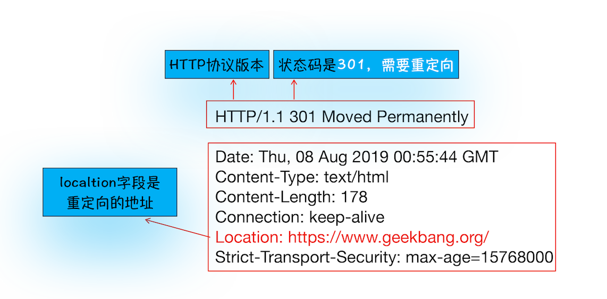
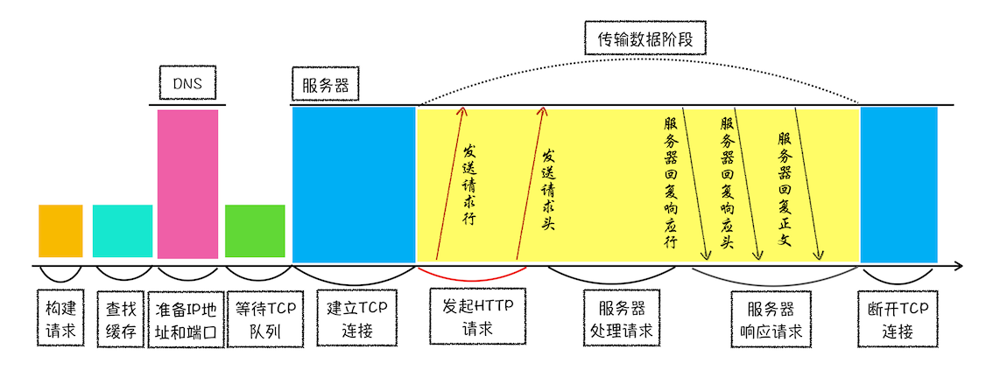

# 数据请求：HTTP 请求流程

**HTTP 是一种允许浏览器向服务器获取资源的协议，是 Web 的基础，**通常由浏览器发起请求，用来获取不同类型的文件，例如 HTML 文件、CSS 文件、JavaScript 文件、图片、视频等。此外，**HTTP 也是浏览器使用最广的协议**，所以要想学好浏览器，就要先深入了解 HTTP。

### 浏览器端发起 HTTP 请求流程

如果你在浏览器地址栏里键入极客时间网站的地址：[http://time.geekbang.org/index.html，](http://time.geekbang.org/index.html%EF%BC%8C) 那么接下来，浏览器会完成哪些动作呢？下面我们就一步一步详细“追踪”下。

#### 1. 构建请求

首先，浏览器构建 **请求行 **信息（如下所示），构建好后，浏览器准备发起网络请求。
GET /index.html HTTP1.1

#### 2. 查找缓存

在真正发起网络请求之前，浏览器会先在浏览器缓存中查询是否有要请求的文件。其中，**浏览器缓存是一种在本地保存资源副本，以供下次请求时直接使用的技术**。

当浏览器发现请求的资源已经在浏览器缓存中存有副本，它会拦截请求，返回该资源的副本，并直接结束请求，而不会再去源服务器重新下载。这样做的好处有：

- 缓解服务器端压力，提升性能（获取资源的耗时更短了）；
- 对于网站来说，缓存是实现快速资源加载的重要组成部分。

当然，如果缓存查找失败，就会进入网络请求过程了。

#### 3. 准备 IP 地址和端口

不过，先不急，在了解网络请求之前，我们需要先看看 HTTP 和 TCP 的关系。因为浏览器使用 **HTTP 协议作为应用层协议**，用来封装请求的文本信息；并使用 **TCP/IP 作传输层协议** 将它发到网络上，所以在 HTTP 工作开始之前，浏览器需要通过 TCP 与服务器建立连接。也就是说** HTTP 的内容是通过 TCP 的传输数据阶段来实现的**，你可以结合下图更好地理解这二者的关系。

TCP 和 HTTP 的关系示意图

那接下来你可以思考这么“一连串”问题：

- HTTP 网络请求的第一步是做什么呢？结合上图看，是和服务器建立 TCP 连接。
- 那建立连接的信息都有了吗？[上一篇文章](https://www.cnblogs.com/bala/p/11843110.html)中，我们讲到建立 TCP 连接的第一步就是需要准备 IP 地址和端口号。
- 那怎么获取 IP 地址和端口号呢？这得看看我们现在有什么，我们有一个 URL 地址，那么是否可以利用 URL 地址来获取 IP 和端口信息呢？

在[上一篇文章](https://www.cnblogs.com/bala/p/11843110.html)中，我们介绍过数据包都是通过 IP 地址传输给接收方的。由于 IP 地址是数字标识，比如极客时间网站的 IP 是 39.106.233.176, 难以记忆，但使用极客时间的域名（time.geekbang.org）就好记多了，所以基于这个需求又出现了一个服务，负责把域名和 IP 地址做一一映射关系。这套域名映射为 IP 的系统就叫做 “**域名系统**”，简称** DNS** （Domain Name System）。

所以，这样一路推导下来，你会发现在 **第一步浏览器会请求 DNS 返回域名对应的 IP**。当然浏览器还提供了 **DNS 数据缓存服务**，如果某个域名已经解析过了，那么浏览器会缓存解析的结果，以供下次查询时直接使用，这样也会减少一次网络请求。

拿到 IP 之后，接下来就需要获取端口号了。通常情况下，如果 URL 没有特别指明端口号，那么 HTTP 协议默认是 80 端口。

#### 4. 等待 TCP 队列

现在已经把端口和 IP 地址都准备好了，那么下一部是不是可以建立 TCP 连接了呢？

答案依然是 “不行”。 Chrome 有个机制，同一个域名同时最多只能建立 6 个 TCP 连接，如果在同一个域名下同时有 10 个请求发生，那么其中 4 个请求会进入排队等待状态，直至进行中的请求完成。

当然，如果当前请求数量少于 6，会直接进入下一步，建立 TCP 连接。

#### 5. 建立 TCP 连接

排队等待结束之后，终于可以快乐的和服务器握手了，在 HTTP 工作开始之前，浏览器通过 TCP 与服务器建立连接。而 TCP 的工作方式，我在[上一篇文章](https://www.cnblogs.com/bala/p/11843110.html)中已经做过详细介绍了，如果有必要，你可以自行回顾下，这里就不在重复讲述了。

#### 6. 发送 HTTP 请求

一旦建立了 TCP 连接，浏览器就可以和服务器进行通信了。而 HTTP 中的数据正是在这个通信过程中传输的。

你可以结合下图来理解，浏览器是如何发送请求信息给服务器的。

HTTP 请求数据格式

首先浏览器会向服务器发送 **请求行**，它包括了 **请求方法、请求 URL（Uniform Resource Identifier）和 HTTP 版本协议**。

发送请求行，就是告诉服务器浏览器需要什么资源，最常用的请求方法是 **Get**。比如，直接在浏览器地址栏键入极客时间的域名（time.geekbang.org），这就是告诉服务器要 Get 它的首页资源。

另外一个常用的请求方法是 **POST**，它用于发送一些数据给服务器，比如登录一个网站，就需要通过 POST 方法把用户信息发送给服务器。如果使用 POST 方法，那么浏览器还要准备数据给服务器，这里准备的数据是通过 **请求体 **来发送。

在浏览器发送请求行命令之后，还要以 **请求头 **形式发送其他一些信息，把浏览器的一些基础信息告诉服务器。比如包含了浏览器所使用的操作系统、浏览器内核等信息，以及当前请求的域名信息、浏览器端的 Cookie 信息，等等。

### 服务器端处理 HTTP 请求流程

历经千辛万苦，HTTP 的请求信息终于被送达了服务器。接下来，服务器会根据浏览器的请求信息来准备相应的内容。

#### 1. 返回请求

一旦服务器处理结束，便可以返回数据给浏览器了。你可以通过工具软件 curl 来查看返回请求数据，具体使用方法是在命令行中输入以下命令：
curl -i https://time.geekbang.org/
注意这里加上了-i 是为了返回响应行、响应头和响应体的数据，返回的结果如下图所示，你可以结合这些数据来理解服务器是如何响应浏览器的。

服务器响应的数据格式

首先服务器会返回 **响应行**，包括协议版本和状态码。

但并不是所有的请求都可以被服务器处理的，那么一些无法处理或者处理出错的信息，怎么办呢？服务器会通过请求行的状态码来告诉浏览器它的处理结果，比如：

- 最常用的状态码是 200， 表示处理成功；
- 如果没有找到页面，则会返回 **404** 。

状态码类型很多，这里我就不过多介绍了，网上有很多资料，你可以自行查询和学习。

随后，正如浏览器会随同请求发送请求头一样，服务器也会随同响应向浏览器发送 **响应头**。响应头包含了服务器自身的一些信息，比如服务器生成返回数据的时间、返回的数据类型（JSON、HTML、流媒体等类型），以及服务器要在客户端保存的 Cookie 等信息。

发送完响应头后，服务器就可以继续发送 **响应体** 的数据，通常，响应体就包含了 HTML 的实际内容。

以上这些就是服务器响应浏览器的具体过程。

#### 2. 断开连接

通常情况下，一旦服务器向客户端返回了请求数据，它就要关闭 TCP 连接。不过如果浏览器或者服务器在其头信息中加入了：
Connection: Keep-Alive
那么 TCP 连接在发送后将仍然保持打开状态，这样浏览器就可以继续通过同一个 TCP 连接发送请求。 **保持 TCP 连接可以省去下次请求时需要建立连接的时间，提升资源加载速度。**比如，一个 Web 页面中内嵌的图片就都来自同一个 Web 站点，如果初始化了一个持久连接，你就可以复用该连接，以请求其他资源，而不需要重新再建立新的 TCP 连接。

#### 3. 重定向

到这里似乎请求流程快结束了，不过还有一种情况你需要了解下，比如当你在浏览器中打开 geekbang.org 后，你会发现最终打开的页面地址是 https://www.geekbang.org。

这两个 URL 之所以不一样，是因为涉及到了一个 **重定向操作**。跟前面一样，你依然可以使用 curl 来查看下请求 geekbang.org 会返回什么内容？

在控制台输入如下命令：
curl -I geekbang.org
注意这里输入的参数是 -I， 和 -i 不一样，-I 表示只需要获取响应头和响应行数据，而不需要获取响应体的数据，最终返回的数据如下所示：

服务器返回响应行和响应头（含重定向格式）
从图中你可以看到，响应行返回的状态码是 301，状态 301 就是告诉浏览器，我需要重定向到另外一个网址，而需要重定向的网址正是包含在响应头的 Location 字段中，接下来，浏览器获取 Location 字段中的地址，并使用该地址重新导航，这就是一个完整重定向的执行流程。这也就解释了为什么输入的是 geekbang.org，最终打开的却是 https://www.geekbang.org 了。

HTTP 请求流程示意图
从图中可以看到，浏览器中的 HTTP 请求从发起到结束一共经历了如下八个阶段：构建请求、查找缓存、准备 IP 和端口、等待 TCP 队列、建立 TCP 连接、发起 HTTP 请求、服务器处理请求、服务器返回请求 和 断开连接。

然后我还通过 HTTP 请求路径解答了两个经常会碰到的问题，一个涉及到了 Cache 流程，另外一个涉及到如何使用 Cookie 来进行状态管理。
