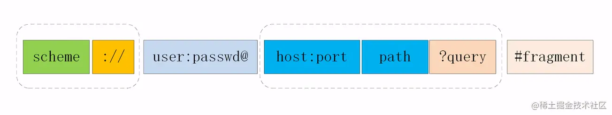

# 数据请求：HTTP 与 HTTPS

# 一、什么是 HTTP?

> 超文本传输协议，是一个基于请求与响应，无状态的，应用层的协议，常基于 TCP/IP 协议传输数据，互联网上应用最为广泛的一种网络协议,所有的 WWW 文件都必须遵守这个标准。设计 HTTP 的初衷是为了提供一种发布和接收 HTML 页面的方法。

## 1.1 HTTP 的请求方法

### 有哪些请求方法？

http/1.1 规定了以下请求方法(注意，都是大写):

- GET: 通常用来获取资源
- HEAD: 获取资源的元信息
- POST: 提交数据，即上传数据
- PUT: 修改数据
- DELETE: 删除资源(几乎用不到)
- CONNECT: 建立连接隧道，用于代理服务器
- OPTIONS: 列出可对资源实行的请求方法，用来跨域请求
- TRACE: 追踪请求-响应的传输路径

### GET 和 POST 有什么区别？

首先最直观的是语义上的区别。
而后又有这样一些具体的差别:

- 从**缓存**的角度，GET 请求会被浏览器主动缓存下来，留下历史记录，而 POST 默认不会。
- 从**编码**的角度，GET 只能进行 URL 编码，只能接收 ASCII 字符，而 POST 没有限制。
- 从**参数**的角度，GET 一般放在 URL 中，因此不安全，POST 放在请求体中，更适合传输敏感信息。
- 从**幂等性**的角度，GET 是**幂等**的，而 POST 不是。(幂等表示执行相同的操作，结果也是相同的)
- 从**TCP**的角度，GET 请求会把请求报文一次性发出去，而 POST 会分为两个 TCP 数据包，首先发 header 部分，如果服务器响应 100(continue)， 然后发 body 部分。(**火狐**浏览器除外，它的 POST 请求只发一个 TCP 包)

## 如何理解 URI？

**URI**, 全称为(Uniform Resource Identifier), 也就是**统一资源标识符**，它的作用很简单，就是区分互联网上不同的资源。
但是，它并不是我们常说的网址, 网址指的是 URL, 实际上 URI 包含了 URN 和 URL 两个部分，由于 URL 过于普及，就默认将 URI 视为 URL 了。

### URI 的结构

URI 真正最完整的结构是这样的。


## 理解 HTTP 状态码？

RFC 规定 HTTP 的状态码为**三位数**，被分为五类:

- **1xx**: 表示目前是协议处理的中间状态，还需要后续操作。
- **2xx**: 表示成功状态。
- **3xx**: 重定向状态，资源位置发生变动，需要重新请求。
- **4xx**: 请求报文有误。
- **5xx**: 服务器端发生错误。

接下来就一一分析这里面具体的状态码。

### 1xx

**101 Switching Protocols**。在 HTTP 升级为 WebSocket 的时候，如果服务器同意变更，就会发送状态码 101。

### 2xx

**200 OK**是见得最多的成功状态码。通常在响应体中放有数据。
**204 No Content**含义与 200 相同，但响应头后没有 body 数据。
**206 Partial Content**顾名思义，表示部分内容，它的使用场景为 HTTP 分块下载和断点续传，当然也会带上相应的响应头字段 Content-Range。

### 3xx

**301 Moved Permanently**即永久重定向，对应着**302 Found**，即临时重定向。
比如你的网站从 HTTP 升级到了 HTTPS 了，以前的站点再也不用了，应当返回 301，这个时候浏览器默认会做缓存优化，在第二次访问的时候自动访问重定向的那个地址。
而如果只是暂时不可用，那么直接返回 302 即可，和 301 不同的是，浏览器并不会做缓存优化。
**304 Not Modified**: 当协商缓存命中时会返回这个状态码。详见[浏览器缓存](https://link.juejin.cn?target=http%3A%2F%2F47.98.159.95%2Fmy_blog%2Fperform%2F001.html)

### 4xx

**400 Bad Request**: 开发者经常看到一头雾水，只是笼统地提示了一下错误，并不知道哪里出错了。
**403 Forbidden**: 这实际上并不是请求报文出错，而是服务器禁止访问，原因有很多，比如法律禁止、信息敏感。
**404 Not Found**: 资源未找到，表示没在服务器上找到相应的资源。
**405 Method Not Allowed**: 请求方法不被服务器端允许。
**406 Not Acceptable**: 资源无法满足客户端的条件。
**408 Request Timeout**: 服务器等待了太长时间。
**409 Conflict**: 多个请求发生了冲突。
**413 Request Entity Too Large**: 请求体的数据过大。
**414 Request-URI Too Long**: 请求行里的 URI 太大。
**429 Too Many Request**: 客户端发送的请求过多。
**431 Request Header Fields Too Large**请求头的字段内容太大。

### 5xx

**500 Internal Server Error**: 仅仅告诉你服务器出错了，出了啥错咱也不知道。
**501 Not Implemented**: 表示客户端请求的功能还不支持。
**502 Bad Gateway**: 服务器自身是正常的，但访问的时候出错了，啥错误咱也不知道。
**503 Service Unavailable**: 表示服务器当前很忙，暂时无法响应服务。

## HTTP 的特点？HTTP 有哪些缺点

### HTTP 特点

HTTP 的特点概括如下:

1. 灵活可扩展，主要体现在两个方面。一个是语义上的自由，只规定了基本格式，比如空格分隔单词，换行分隔字段，其他的各个部分都没有严格的语法限制。另一个是传输形式的多样性，不仅仅可以传输文本，还能传输图片、视频等任意数据，非常方便。
2. 可靠传输。HTTP 基于 TCP/IP，因此把这一特性继承了下来。这属于 TCP 的特性，不具体介绍了。
3. 请求-应答。也就是一发一收、有来有回， 当然这个请求方和应答方不单单指客户端和服务器之间，如果某台服务器作为代理来连接后端的服务端，那么这台服务器也会扮演**请求方**的角色。
4. 无状态。这里的状态是指**通信过程的上下文信息**，而每次 http 请求都是独立、无关的，默认不需要保留状态信息。

### HTTP 缺点

#### 无状态

所谓的优点和缺点还是要分场景来看的，对于 HTTP 而言，最具争议的地方在于它的**无状态**。
在需要长连接的场景中，需要保存大量的上下文信息，以免传输大量重复的信息，那么这时候无状态就是 http 的缺点了。
但与此同时，另外一些应用仅仅只是为了获取一些数据，不需要保存连接上下文信息，无状态反而减少了网络开销，成为了 http 的优点。

#### 明文传输

即协议里的报文(主要指的是头部)不使用二进制数据，而是文本形式。
这当然对于调试提供了便利，但同时也让 HTTP 的报文信息暴露给了外界，给攻击者也提供了便利。WIFI 陷阱就是利用 HTTP 明文传输的缺点，诱导你连上热点，然后疯狂抓你所有的流量，从而拿到你的敏感信息。

### 压缩方式

当然一般这些数据都是会进行编码压缩的，采取什么样的压缩方式就体现在了发送方的 Content-Encoding 字段上， 同样的，接收什么样的压缩方式体现在了接受方的 Accept-Encoding 字段上。这个字段的取值有下面几种：

- gzip: 当今最流行的压缩格式
- deflate: 另外一种著名的压缩格式
- br: 一种专门为 HTTP 发明的压缩算法

// 发送端 Content-Encoding: gzip // 接收端 Accept-Encoding: gzip

## HTTP 如何处理大文件的传输

对于几百 M 甚至上 G 的大文件来说，如果要一口气全部传输过来显然是不现实的，会有大量的等待时间，严重影响用户体验。因此，HTTP 针对这一场景，采取了范围请求的解决方案，允许客户端仅仅请求一个资源的一部分。

### 如何支持

当然，前提是服务器要支持**范围请求**，要支持这个功能，就必须加上这样一个响应头:

> Accept-Ranges: none

用来告知客户端这边是支持范围请求的。

### Range 字段拆解

而对于客户端而言，它需要指定请求哪一部分，通过 Range 这个请求头字段确定，格式为 bytes=x-y。接下来就来讨论一下这个 Range 的书写格式:

- **0-499**表示从开始到第 499 个字节。
- **500**- 表示从第 500 字节到文件终点。
- **-100**表示文件的最后 100 个字节。

服务器收到请求之后，首先验证范围**是否合法**，如果越界了那么返回 416 错误码，否则读取相应片段，返回 206 状态码。
同时，服务器需要添加 Content-Range 字段，这个字段的格式根据请求头中 Range 字段的不同而有所差异。
具体来说，请求单段数据和请求多段数据，响应头是不一样的。

```shell
// 单段数据
Range: bytes=0-9
// 多段数据
Range: bytes=0-9, 30-39


```

接下来我们就分别来讨论着两种情况。

### 单段数据

对于单段数据的请求，返回的响应如下:

```javascript
HTTP/1.1 206 Partial Content
Content-Length: 10
Accept-Ranges: bytes
Content-Range: bytes 0-9/100

i am xxxxx
```

值得注意的是 Content-Range 字段，0-9 表示请求的返回，100 表示资源的总大小，很好理解。

### 多段数据

接下来我们看看多段请求的情况。得到的响应会是下面这个形式:

```javascript
HTTP/1.1 206 Partial Content
Content-Type: multipart/byteranges; boundary=00000010101
Content-Length: 189
Connection: keep-alive
Accept-Ranges: bytes


--00000010101
Content-Type: text/plain
Content-Range: bytes 0-9/96

i am xxxxx
--00000010101
Content-Type: text/plain
Content-Range: bytes 20-29/96

eex jspy e
--00000010101--

```

这个时候出现了一个非常关键的字段 Content-Type: multipart/byteranges;boundary=00000010101，它代表了信息量是这样的:

- 请求一定是多段数据请求
- 响应体中的分隔符是 00000010101

因此，在响应体中各段数据之间会由这里指定的分隔符分开，而且在最后的分隔末尾添上--表示结束。
以上就是 http 针对大文件传输所采用的手段。

## HTTP 中如何处理表单数据的提交

在 http 中，有两种主要的表单提交的方式，体现在两种不同的 Content-Type 取值:

- application/x-www-form-urlencoded
- multipart/form-data

由于表单提交一般是 POST 请求，很少考虑 GET，因此这里我们将默认提交的数据放在请求体中。

### application/x-www-form-urlencoded

对于 application/x-www-form-urlencoded 格式的表单内容，有以下特点:

- 其中的数据会被编码成以&分隔的键值对
- 字符以**URL 编码方式**编码。

如：

```json
// 转换过程: {a: 1, b: 2} -> a=1&b=2 -> 如下(最终形式)
"a%3D1%26b%3D2"
```

### multipart/form-data

对于 multipart/form-data 而言:

- 请求头中的 Content-Type 字段会包含 boundary，且 boundary 的值有浏览器默认指定。例: Content-Type: multipart/form-data;boundary=----WebkitFormBoundaryRRJKeWfHPGrS4LKe。
- 数据会分为多个部分，每两个部分之间通过分隔符来分隔，每部分表述均有 HTTP 头部描述子包体，如 Content-Type，在最后的分隔符会加上--表示结束。

相应的请求体是下面这样:

```javascript
Content-Disposition: form-data;name="data1";
Content-Type: text/plain
data1
----WebkitFormBoundaryRRJKeWfHPGrS4LKe
Content-Disposition: form-data;name="data2";
Content-Type: text/plain
data2
----WebkitFormBoundaryRRJKeWfHPGrS4LKe--

```

## Cookie

前面说到了 HTTP 是一个无状态的协议，每次 http 请求都是独立、无关的，默认不需要保留状态信息。但有时候需要保存一些状态，怎么办呢？
HTTP 为此引入了 Cookie。Cookie 本质上就是浏览器里面存储的一个很小的文本文件，内部以键值对的方式来存储(在 chrome 开发者面板的 Application 这一栏可以看到)。向同一个域名下发送请求，都会携带相同的 Cookie，服务器拿到 Cookie 进行解析，便能拿到客户端的状态。而服务端可以通过响应头中的 Set-Cookie 字段来对客户端写入 Cookie。举例如下:

```javascript
// 请求头
Cookie: a=xxx;b=xxx
// 响应头
Set-Cookie: a=xxx
set-Cookie: b=xxx

```

### Cookie 属性

#### 生存周期

Cookie 的有效期可以通过**Expires**和**Max-Age**两个属性来设置。

- **Expires**即过期时间
- **Max-Age**用的是一段时间间隔，单位是秒，从浏览器收到报文开始计算。

若 Cookie 过期，则这个 Cookie 会被删除，并不会发送给服务端。

#### 安全相关

如果带上 Secure，说明只能通过 HTTPS 传输 cookie。
如果 cookie 字段带上 HttpOnly，那么说明只能通过 HTTP 协议传输，不能通过 JS 访问，这也是预防 XSS 攻击的重要手段。
相应的，对于 CSRF 攻击的预防，也有 SameSite 属性。
SameSite 可以设置为三个值，Strict、Lax 和 None。
**a.** 在 Strict 模式下，浏览器完全禁止第三方请求携带 Cookie。比如请求 sanyuan.com 网站只能在 sanyuan.com 域名当中请求才能携带 Cookie，在其他网站请求都不能。
**b.** 在 Lax 模式，就宽松一点了，但是只能在 get 方法提交表单况或者 a 标签发送 get 请求的情况下可以携带 Cookie，其他情况均不能。
**c.** 在 None 模式下，也就是默认模式，请求会自动携带上 Cookie。

### Cookie 的缺点

1. 容量缺陷。Cookie 的体积上限只有 4KB，只能用来存储少量的信息。
2. 性能缺陷。Cookie 紧跟域名，不管域名下面的某一个地址需不需要这个 Cookie ，请求都会携带上完整的 Cookie，这样随着请求数的增多，其实会造成巨大的性能浪费的，因为请求携带了很多不必要的内容。但可以通过 Domain 和 Path 指定**作用域**来解决。
3. 安全缺陷。由于 Cookie 以纯文本的形式在浏览器和服务器中传递，很容易被非法用户截获，然后进行一系列的篡改，在 Cookie 的有效期内重新发送给服务器，这是相当危险的。另外，在 HttpOnly 为 false 的情况下，Cookie 信息能直接通过 JS 脚本来读取。

### CORS

CORS 其实是 W3C 的一个标准，全称是跨域资源共享。它需要浏览器和服务器的共同支持，具体来说，非 IE 和 IE10 以上支持 CORS，服务器需要附加特定的响应头，后面具体拆解。不过在弄清楚 CORS 的原理之前，我们需要清楚两个概念: **简单请求**和**非简单请求**。
浏览器根据请求方法和请求头的特定字段，将请求做了一下分类，具体来说规则是这样，凡是满足下面条件的属于**简单请求**:

- 请求方法为 GET、POST 或者 HEAD
- 请求头的取值范围: Accept、Accept-Language、Content-Language、Content-Type(只限于三个值 application/x-www-form-urlencoded、multipart/form-data、text/plain)

浏览器画了这样一个圈，在这个圈里面的就是**简单请求**, 圈外面的就是**非简单请求**，然后针对这两种不同的请求进行不同的处理。

#### 简单请求

请求发出去之前，浏览器做了什么？
它会自动在请求头当中，添加一个 Origin 字段，用来说明请求来自哪个源。服务器拿到请求之后，在回应时对应地添加 Access-Control-Allow-Origin 字段，如果 Origin 不在这个字段的范围中，那么浏览器就会将响应拦截。
因此，Access-Control-Allow-Origin 字段是服务器用来决定浏览器是否拦截这个响应，这是必需的字段。与此同时，其它一些可选的功能性的字段，用来描述如果不会拦截，这些字段将会发挥各自的作用。
**Access-Control-Allow-Credentials**。这个字段是一个布尔值，表示是否允许发送 Cookie，对于跨域请求，浏览器对这个字段默认值设为 false，而如果需要拿到浏览器的 Cookie，需要添加这个响应头并设为 true, 并且在前端也需要设置 withCredentials 属性:
let xhr = new XMLHttpRequest(); xhr.withCredentials = true; 复制代码
**Access-Control-Expose-Headers**。这个字段是给 XMLHttpRequest 对象赋能，让它不仅可以拿到基本的 6 个响应头字段（包括 Cache-Control、Content-Language、Content-Type、Expires、Last-Modified 和 Pragma）, 还能拿到这个字段声明的**响应头字段**。比如这样设置:
Access-Control-Expose-Headers: aaa 复制代码
那么在前端可以通过 XMLHttpRequest.getResponseHeader('aaa') 拿到 aaa 这个字段的值。

#### 非简单请求

非简单请求相对而言会有些不同，体现在两个方面: **预检请求**和**响应字段**。
我们以 PUT 方法为例。
var url = 'http://xxx.com'; var xhr = new XMLHttpRequest(); xhr.open('PUT', url, true); xhr.setRequestHeader('X-Custom-Header', 'xxx'); xhr.send(); 复制代码
当这段代码执行后，首先会发送**预检请求**。这个预检请求的请求行和请求体是下面这个格式:
OPTIONS / HTTP/1.1 Origin: 当前地址 Host: xxx.com Access-Control-Request-Method: PUT Access-Control-Request-Headers: X-Custom-Header 复制代码
预检请求的方法是 OPTIONS，同时会加上 Origin 源地址和 Host 目标地址，这很简单。同时也会加上两个关键的字段:

- Access-Control-Request-Method, 列出 CORS 请求用到哪个 HTTP 方法
- Access-Control-Request-Headers，指定 CORS 请求将要加上什么请求头

这是预检请求。接下来是**响应字段**，响应字段也分为两部分，一部分是对于**预检请求**的响应，一部分是对于 **CORS 请求**的响应。
**预检请求的响应**。如下面的格式:
HTTP/1.1 200 OK Access-Control-Allow-Origin: \* Access-Control-Allow-Methods: GET, POST, PUT Access-Control-Allow-Headers: X-Custom-Header Access-Control-Allow-Credentials: true Access-Control-Max-Age: 1728000 Content-Type: text/html; charset=utf-8 Content-Encoding: gzip Content-Length: 0 复制代码
其中有这样几个关键的**响应头字段**:

- Access-Control-Allow-Origin: 表示可以允许请求的源，可以填具体的源名，也可以填\*表示允许任意源请求。
- Access-Control-Allow-Methods: 表示允许的请求方法列表。
- Access-Control-Allow-Credentials: 简单请求中已经介绍。
- Access-Control-Allow-Headers: 表示允许发送的请求头字段
- Access-Control-Max-Age: 预检请求的有效期，在此期间，不用发出另外一条预检请求。

在预检请求的响应返回后，如果请求不满足响应头的条件，则触发 XMLHttpRequest 的 onerror 方法，当然后面真正的**CORS 请求**也不会发出去了。
**CORS 请求的响应**。绕了这么一大转，到了真正的 CORS 请求就容易多了，现在它和**简单请求**的情况是一样的。浏览器自动加上 Origin 字段，服务端响应头返回**Access-Control-Allow-Origin**。可以参考以上简单请求部分的内容。

# HTTP1.1

# HTTPS

# webSocket

> 原文: <https://www.yuque.com/liuxia-1onjl/ebooks/yvgmeu>
