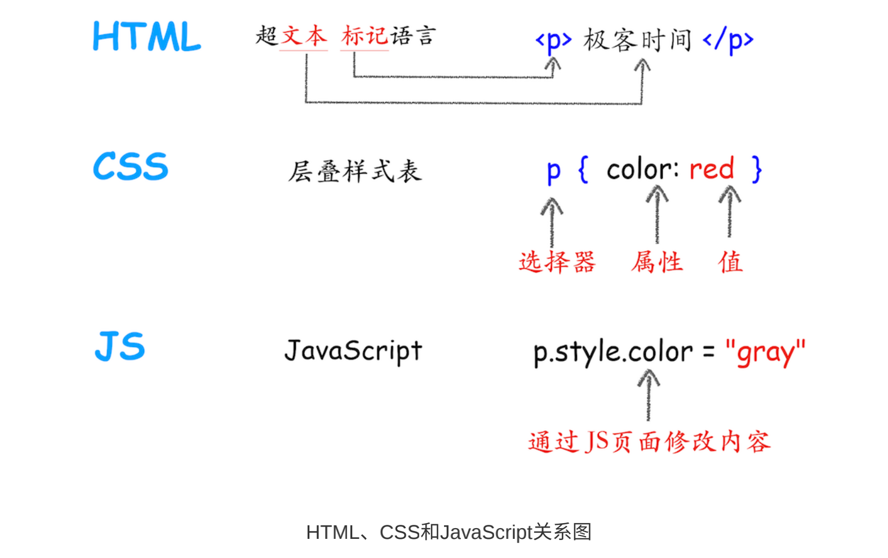

# 页面渲染：从文件到页面

1. 渲染进程将 HTML 内容转换为能够读懂的 **DOM 树**结构。
2. 渲染进程将 CSS 样式表转化为浏览器可以理解的 **styleSheets**，计算出 DOM 节点的样式。
3. 创建**布局树**，并计算元素的布局信息。
4. 对布局树进行分层，并生成**分层树**。 5.为每个图层生成**绘制列表**，并将其提交到合成线程。
5. 合成线程将图层分为**图块**，并在**光栅化线程池**中将图块转换成位图。
6. 合成线程发送绘制图块命令 **DrawQuad **给浏览器进程。
7. 浏览器进程根据 DrawQuad 消息**生成页面**，并**显示**到显示器上。

> 在 HTML 页面内容被提交给渲染引擎之后，渲染引擎首先将 HTML 解析为浏览器可以理解的 DOM；然后根据 CSS 样式表，计算出 DOM 树所有节点的样式；接着又计算每个元素的几何坐标位置，并将这些信息保存在布局树中。

按照渲染的时间顺序，流水线可分为如下几个子阶段：构建 DOM 树、样式计算、布局阶段、分层、绘制、分块、光栅化和合成。

### 样式计算（Recalculate Style）

样式计算的目的是为了计算出 DOM 节点中每个元素的具体样式，这个阶段大体可以分为三步来完成。

- **当渲染引擎接收到 CSS 文本时，会执行一个转换操作，将 CSS 文本转换为浏览器可以理解的结构 —— styleSheets**。
- **需要将所有值转换为渲染引擎容易理解的、标准化的计算值**
- 计算出 DOM 树中每个节点的具体样式

* **CSS 的继承规则和层叠规则**

### 布局阶段

现在，我们由 DOM 树 和 DOM 树中元素的样式，但这还不足以显示页面，因为我们还不知道 DOM 元素的几何位置信**息。那么接下来就需要计算出 DOM 树中可见元素的几何位置，我们把这个计算过程叫做布局**。
Chrome 在布局阶段需要完成两个任务：**创建布局树**和**布局计算**。

1. 创建布局树
   - 遍历 DOM 树中的所有可见节点，并把这些节点加到布局中；
   - 而不可见的节点会被布局树忽略掉，如 head 标签下面的全部内容，再比如 body.p.span 这个元素，因为它的属性包含 display:none ，所以这个元素也没有被包进布局树。

#### 2. 布局计算

a. 分层：，**渲染引擎还需要为特定的节点生成专用的图层，并生成一棵对应的图层树**
**b: 图层绘制：**渲染引擎会对图层树中的每个图层进行绘制
c: 栅格化（raster）操作

通常一个页面可能很大，但是用户只能看到其中的一部分，我们把用户可以看到的这个部分叫做 **视口**（viewport）
