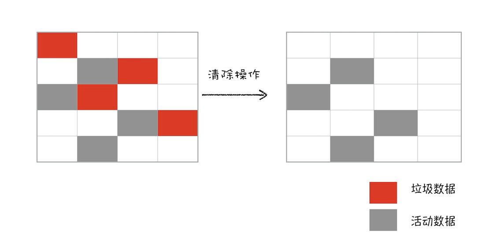

# 垃圾回收

垃圾回收程序周期性的检查变量不会再度使用而释放他占用的内存。

垃圾回收策略⼀般分为⼿动回收和⾃动回收，java python JavaScript 等⾼级预⾔为了减轻程序员负担和出错概率采⽤了⾃动回收策略。JavaScript 的原始类型数据和引⽤数据是分别存储在栈和椎中的，由于栈和堆分配空间⼤⼩差异，垃圾回收⽅式也不⼀样。
栈中分配空间通过 ESP 的向下移动销毁保存在栈中数据 ；
堆中垃圾回收主要通过副垃圾回收器（新⽣代）和主垃圾回收器（⽼⽣代）负责的，副垃圾回收器采⽤ scavenge 算法将区域分为对象区域和空闲区域，通过两个区域的反转让新⽣代区域⽆限使⽤下去。主垃圾回收器采⽤ Mark-Sweep（Mark-Compact Incremental Marking 解决不同场景下问题的算法改进）算
法进⾏空间回收的。⽆论是主副垃圾回收器的策略都是标记-清除-整理三个⼤的步骤。另外还有新⽣代的 晋升策略（两次未清除的），⼤对象直接分配在⽼⽣代。

## 标记清除

主要思想是给当前不使用的值加上标记，然后再回收他的内存;

- 变量进入上下文中时，打上存在于上下文的标记。
  不在上下文中的变量，理论上永远不该释放他们 的内存，因为随时可可能被调用。
- 垃圾回收器在运行时会给存储在内存中的所有变量加上标记，然后他会去掉环境变量和被环境变量引用的变量的标记，此后被加上标记的变量(环境变量中没有使用访问的变量)就是准备删除的变量;最后垃圾回收器完成清除工作，销毁那些带标记的值，并回收他们占用的内存空间;

弊端：对⼀块内存多次执⾏标记-清除算法后，会产⽣⼤量不
连续的内存碎⽚。⽽碎⽚过多会导致⼤对象⽆法分配到⾜够的连续内存，于是⼜产⽣了另外⼀种算法⸺标
记记--整整理理（（MMaarrkk--CCoommppaacctt）），
，这个标记过程仍然与标记-清除算法⾥的是⼀样的，但后续步骤不是直接对可
回收对象进⾏清理，⽽是让所有存活的对象都向⼀端移动，然后直接清理掉端边界以外的内存。你可以参考 下图：

## 引用计数

含义是跟踪记录所有值被引用的次数;
例如变量 a 赋值后，这个值的引用次数为 1，这个 a 值又被赋值给另一个变量 b，这时引用次数+1;但当 b 赋另外的值，引用次数-1;当值的引用书为 0，说明没有办法再访问这个值，这时就可以将内存回收了。

## 常见的内存泄漏

## 如何判断内存泄漏

## 内存管理与性能
