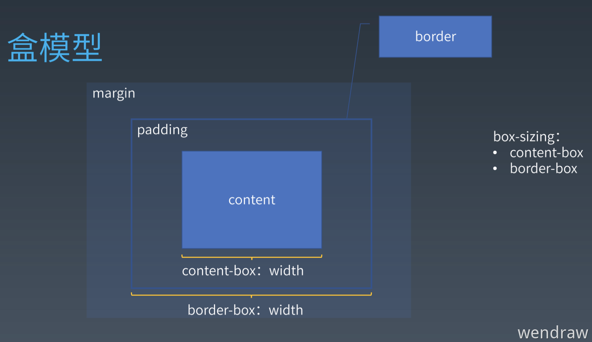

# Layout (布局)

浏览器排版技术大概分成三代：

1. **正常流（Normal Flow）**，代表是 display: block、display: inline-block、display: inline、position: absolute、position: relative、float、clear。
2. **弹性布局（Flexiable Box Layout）**，就是 display: flex。
3. **网格布局（Grid Layout）**，就是 display: grid。

这几代的排版方式都是以 display 的不同值来控制的。
而在 CSS 中排版的基本单位是「**文字**」和「**Box（盒**）」。

# Box（盒）

在 CSS 中，所有的元素都被一个个的“盒子（box）”包围着，理解这些“盒子”的基本原理，是我们使用 CSS 实现准确布局、处理元素排列的关键。

我们在学习 Box 之前先要弄清楚「Box 盒」、「Tag 标签」和「Element 元素」这几个的概念。我们可以用这几句话来描述它们之间的关系：

- HTML 代码中可以书写开始标签、结束标签、自封闭标签。
- 一对起止标签，表示一个元素。
- DOM 树中存储的是元素和其他类型的节点。
- CSS 选择器选中的是元素。
- CSS 选择器选中的元素，在排版时可能会产生多个盒。
- 排版和渲染的基本单位是盒。

总结来说就是，**源代码里面写的是「标签」**，**在语义里面的是「元素」**，**表现里面的是「盒**」。

然后「盒」还可以可以理解为，为了展现一个元素，在界面上产生的一个矩形的区域。

## Block Box（块级盒子）和 Inline Box（行内级盒子）

盒子主要分为「块级盒子」和「行内级盒子」，这两种盒子会在页面流（page flow）和元素之间的关系方面表现出不同的行为。

块级盒子的表现如下：

- 块级盒子会在行内级的方向（就是排版的方向）上扩展并占据父容器在该方向上的所有可用空间，在绝大数情况下意味着块级盒子会和父容器一样宽。
- 每个块级盒子都会换行。
- width 和 height 属性可以使用。
- 设置 padding、margin、border 都会将周围其他盒子“推开”。

行内级盒子的表现如下：

- 行内级盒子不会换行。
- width 和 height 属性不会起作用。
- 垂直方向的 padding、margin、border 属性会被应用，但是不会把其他处于 inline 状态的盒子推开。
- 水平方向的 padding、margin、border 属性会被应用，会把其他处于 inline 状态的盒子推开。

HTML 中的 a、span、em、strong 都是默认的 inline box。

这两种盒子还可以根据 display 来设置，如果是带 inline 就开头的就是行内盒子。

> display 现在基本都是分成两种，不带 inline 的和带 inline 的。如，block、flex、grid 和 inline-block、inlie-flex、inline-grid 等。
>
> 关于 display 的属性在 [CSS Display Module Level 3](https://www.w3.org/TR/2020/CR-css-display-3-20200519/) 有定义，不过很多概念太新了，建议只做了解即可。

## 盒模型

盒模型就是描述盒是怎么表示的，完整的 CSS  盒模型应用于块级盒子，但是行内级盒子只使用盒模型中定义的部分内容。

盒模型主要由 4 层组成：

- **Content box**：这个区域是用来显示内容的，大小可以通过 width 和 height 设置。
- **Padding box**：包围在内容区域外部的空白区域，大小可以通过 padding 相关属性设置。
- **Border box**：边框包裹 content 和 padding，大小可以通过 border 相关属性设置。
- **Margin box**：这是最外面的区域，是盒子和其他元素之间的空白区域，大小可以通过 margin 相关属性设置。

在「**标准盒模型」**中，width、height 指的是 content box。它们再加上 padding 和 border 决定了整个盒子的大小。

在「**替代（IE）盒模型**」中，width、height 指的是 border box。它们就决定了整个盒子的大小。

然后盒的宽度 width 可以使用 **box-sizing** 进行调整，默认的值是 **content-box**。还可以设置为为 **border-box**。

> margin  不计入实际大小  ——  当然，它会影响盒子在页面所占空间，但是影响的是盒子外部空间。盒子的范围到边框为止  ——  不会延伸到 margin。

最后其实只要记住这个图就能搞懂盒模型了：

**思考题：为什么会有「盒模型」？**

其实我们的盒模型很多的概念都是从排版（文本编辑领域）来的。

margin 其实可以翻译成留白，因为它往往是表示图片、表格等周围的留白，一般文字不会紧贴着图片、表格等排版，需要空出一个距离，这个距离就是留白。然后图片、表格等需要的留白是不一样的，这就得出一个属性 margin。

padding 在书籍排版领域，对应的就是页边距的概念，就是每一页的内容不可能紧紧挨着边沿，也需要空出一段距离。

# Normal Flow（正常流）

在学习正常流之前，来想一个问题，我们是如何写字的？

可以总结为下面三点：

- 从左到右书写。
- 同一行写的字都是对齐的。
- 一行写满了，就换到下一行。

当没有设置 display 属性，或者值为 block、inline-block 的时候，就是按照正常流来排版的。

正常流排版其实就跟我们写字的方式一样，**依次排列，排不下就换行**。

## 正常流排版

flex 排版，主要分成 3 步：

- 收集元素进行
- 计算主轴
- 计算交叉轴

正常流的排版其实也是类似的。总的来说也可以分成 3 步：

- 收集「盒」进行。
- 计算「盒」在行中的排布。
- 计算行的排布。

在 CSS 标准中，规定了如何排布每一个文字或者盒的算法，这个算法依赖 formatting context（格式化上下文），格式化上下文其实就是一个排版的「当前状态」。

所以排版的过程就是：

> formatting context（格式化上下文） + boxes（盒） / character（文字） = position（位置）

然后我们需要排版的盒有两种 block box（块级盒）和 inline box（行内级盒），所以排版为它们规定了「Block formatting context（BFC 块级格式化上下文）」和「Inline formatting context（IFC 行内级格式化上下文）」。

### IFC（行内级格式化上文）

...

### BFC（块级格式化上下文）

所谓 BFC，即为 Web 页面中盒模型布局的 CSS 渲染模式，指一个独立的渲染区域或者说是一个隔离的独立容器。

#### 特性

- 1.内部的元素会在垂直方向，从顶部开始一个接一个地放置。
- 2.元素垂直方向的距离由 margin 决定。属于同一个 BFC 的两个相邻元素的 margin 会发生叠加
- 3.都是从最左边开始的。每个元素的 margin box 的左边，与包含块 border box 的左边(对于从左往右的格式化，否则 相反)。即使存在浮动也是如此 4.BFC 的区域不会与 float box 叠加。
- 5.BFC 就是页面上的一个隔离的独立容器，容器里面的子元素不会影响到外面的元素，反之亦然。
- 6.计算 BFC 的高度时，浮动元素也参与计算（当 BFC 内部有浮动时，为了不影响外部元素的布局，BFC 计算高度时会包 括浮动元素的高度）

**创建方式**

- 根元素（<`html`>)
- 浮动元素 （float 不为 none)
- 绝对定位元素（ position 为 absolute 或者 fixed）
- 行内块元素（display 为 inline-block）
- display 为 flow-root 的元素
- overflow 不为 visible 的块元素
- 表格系列（display 为 table-cell\table-caption\table\table-\*）
- 弹性元素（display 为 flex 的元素的子元素）
- 网格元素（display 为 grid 的元素的子元素）
- contain 值为 layout\content\paint 的元素
- column-span 设置为 all 的元素

#### 作用

**利用 BFC 避免 margin 重叠**
**自适应两栏布局**
**清除浮动**
**...**

## 参考

[BFC](https://blog.csdn.net/sinat_36422236/article/details/88763187?ops_request_misc=%257B%2522request%255Fid%2522%253A%2522164934299216780271967578%2522%252C%2522scm%2522%253A%252220140713.130102334..%2522%257D&request_id=164934299216780271967578&biz_id=0&utm_medium=distribute.pc_search_result.none-task-blog-2~all~top_positive~default-1-88763187.142^v7^control,157^v4^control&utm_term=BFC&spm=1018.2226.3001.4187)
