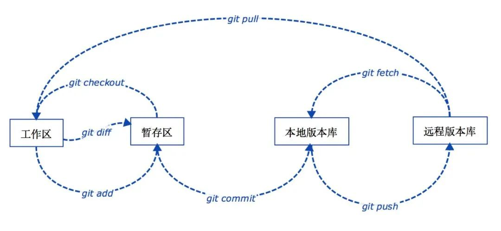
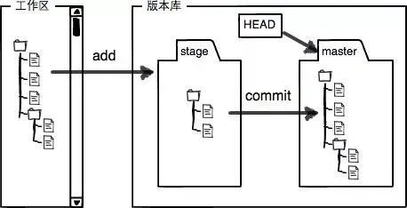

# Git

## 基础

- git config
- git branch
- git checkout
- git status
- git add
- git commit
- git push
- git pull
- git log
- git tag

## 深入

- Git 工作区  
  即项目目录

- 本地版本库
  工作区有一个隐藏目录 .git，此为 Git 的版本库。

- 暂存区（stage）
  本地版本库里存了很多东西，其中最重要的就是称为 stage（或者叫 index）的暂存区，还有 Git 为我们自动创建的第一个分支 master，以及指向 master 的一个指针叫 HEAD。

- 远程仓库（Remote Repository）
  即 Git 服务器上所对应的仓库

### 操作文件

- git add
- git commit
- git rm
- git mv
- git status

### 操作分支

git branch
git checkout
git merge
git log
git tag
git stash

### 操作历史

git log
git reset
git cherry-pick
git rebase
git revert
git diff
git reflog

## 常见操作

- 版本回滚
- 分支管理
