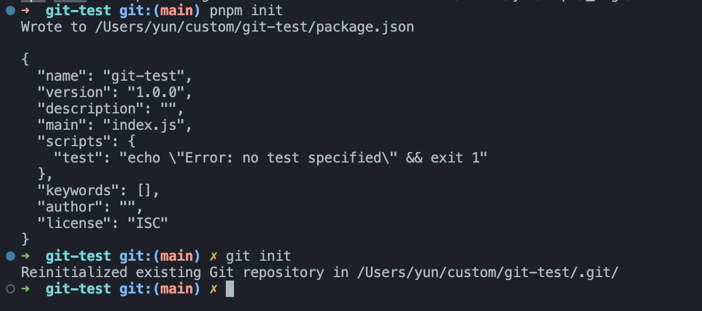
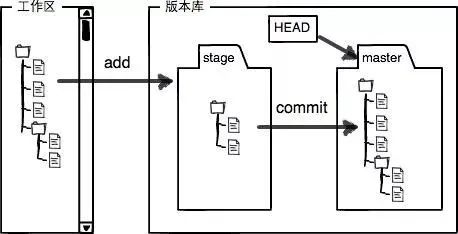

# Git

## 一、常见命令

```bash
# 基础
git init # 初始化
git clone # 克隆
git status # 状态
git add # 添加
git commit # 提交

# 查看历史和日志
git log # 日志
git reflog # 查看历史
git diff # 查看差异

# 分支管理
git branch # 查看分支
git checkout # 切换分支
git merge # 合并分支
git branch -d # 删除分支

# 远程仓库操作
git remote -v # 查看远程仓库
git remote add origin <远程仓库地址> # 添加远程仓库
git push -u origin master # 推送到远程仓库
git pull # 拉取远程仓库
git fetch # 拉取远程仓库

# 撤销和回滚
git checkout -- <文件> # 撤销工作区的修改
git reset HEAD <文件> # 撤销暂存区的修改
git reset --hard <commit-hash> # 回滚到指定提交
git revert <commit-hash> # 撤销指定提交
git commit --amend -m "新的提交说明" # 修改最近一次提交的提交说明

# 暂存更改
git stash # 暂存更改
git stash list # 查看暂存列表
git stash pop # 恢复最近一次的暂存
git stash apply <stash-hash> # 恢复指定暂存
git stash drop <stash-hash> # 删除指定暂存

# 标签
git tag # 查看标签
git tag <标签名> # 创建标签
git tag -a <标签名> -m "标签说明" # 创建带说明的标签

# 合并冲突
git merge --abort # 放弃合并

# 其他
git clean -f # 移除未跟踪的文件
git log --graph --oneline --all # 查看分支合并图
```

## 二、基础

### 1. git init

```bash
mkdir git-test && cd git-test && pnpm init
git init
```


git init 后会生成一个 .git 的隐藏目录，这个目录是 Git 用来存储版本库信息的。

### 2. git config

git config 是用于配置 Git 的命令，允许你设置 Git 的行为和参数，既可以针对全局配置，也可以针对单个项目进行配置。配置项可以包括用户名、邮箱、换行符、合并行为等。

```bash
git config [选项] [参数]
```

- --global：配置全局用户级别的 Git 设置（应用于系统中的所有 Git 仓库）。
- --system：配置系统范围内的 Git 设置（对所有用户和仓库生效，需要管理员权限）。
- --local：只针对当前 Git 仓库进行设置，这是默认行为。

```bash
# 配置用户名
git config --global user.name "Your Name"
# 配置邮箱
git config --global user.email "youremail@example.com"

# 查看配置
git config --list
# 查看用户名
git config user.name
# 查看邮箱
git config user.email

# 配置别名
git config --global alias.st status # 将 git status 简化为 git st

#  配置颜色输出
git config --global color.ui true

# 配置默认分支名称
git config --global init.defaultBranch main #  Git 初始化仓库时的默认分支名称从 master 改为 main：
```

### 3. git branch

git branch 命令用于显示、创建或删除 Git 仓库中的分支。

```bash
# 查看分支
git branch # 初始化之后至少一次提交才能创建分支。 否则分支列表为空，且不能创建分支
git branch -a # 查看所有本地和远程分支
git branch -r # 查看远程分支
# 创建分支
git branch <分支名>

# 删除分支
git branch -d <分支名> # 删除分支
# 强制删除分支
git branch -D <分支名>

# 重命名分支
git branch -m <新分支名>
```

### 4. git checkout

git checkout 命令用于切换分支、恢复文件或创建新的分支

```bash
# 切换到指定分支
git checkout <分支名>
# 创建并切换到新分支
git checkout -b <新分支名>

# 恢复文件
git checkout <文件名> # 恢复到指定提交
git checkout -- <文件名> # 恢复到最新提交
git checkout <commit-id> -- <文件名> # 恢复到指定提交
# 例如 恢复 README.md 文件到某个特定的提交版本：
git checkout abc123 -- README.md

# 切换到特定提交
git checkout <commit-id>

# 切换到远程分支
git checkout -b <本地分支名> origin/<远程分支名> # 克隆远程分支到本地并切换到本地分支

# 放弃未提交的更改
git checkout -- . # 放弃所有未提交的更改,
# git checkout .  简单讲，git checkout -- . 是更安全的做法，而 git checkout . 在大多数情况下也能正常工作。
git checkout -- <文件名> # 放弃指定文件的未提交更改
```

### 5. git merge

git merge 命令用于将一个分支的更改合并到当前分支。

```bash
# 合并分支
git merge <分支名>
# 例，当前在 dev 分支， master 分支有更新，合并到 dev 分支
git merge master

# 合并结果
  # 快速合并（Fast-Forward Merge）：
    # 如果当前分支的提交历史是线性的，Git 会执行快速合并，即直接将当前分支的指针移动到目标分支的最新提交。
    # 例如：
    Updating 34d2f4e..6f1e2d7
    Fast-forward
  # 三方合并（Three-Way Merge）：
    # 如果当前分支和目标分支都有不同的提交，Git 会进行三方合并。它会找到两个分支的共同祖先，计算出差异，并将它们合并在一起。
    # 这种情况下，会生成一个新的合并提交（merge commit）。
    # 例如：
    Merge branch 'master' into dev
  # 冲突
    # 如果合并过程中出现冲突，Git 会暂停合并，并提示你手动解决冲突。
    # 解决冲突后，使用 git add 标记冲突已解决，然后继续合并。
    # 最后，使用 git commit 完成合并。
    # 例如：
    Auto-merging README.md
    CONFLICT (content): Merge conflict in README.md
    Automatic merge failed; fix conflicts and then commit the result.

    # 处理冲突
     # 查看冲突状态
     git status
     # 查看冲突文件
     git diff
     # 编辑文件，解决冲突
     # 标记冲突已解决
     git add <文件名>
     # 完成合并
     git commit -m "Merged <分支名>"

# 特殊合并选项
  # 使用 --no-ff 选项进行合并： 强制 Git 创建一个合并提交，即使合并可以通过快速合并完成。这样可以保留分支的历史记录。
  # 好处： 保留分支的历史记录，方便回溯和查看分支的提交历史。
  git merge --no-ff <分支名>

  # 使用 --squash 选项进行合并： 将所有提交压缩成一个提交，这样可以保持分支的线性历史。
  # 好处： 简化提交历史，减少分支的复杂度。
  git merge --squash <分支名>

  # 使用 --rebase 选项进行合并： 将当前分支的更改重新应用到目标分支上，这样可以保持分支的线性历史。
  # 好处： 可以避免产生额外的合并提交，使历史记录更加线性，像是一个从头到尾的顺序开发过程。
  git merge --rebase <分支名>
```

### 6. git stash

git stash 命令用于将当前工作目录的更改保存到堆栈中，以便稍后恢复。

git stash 保存的内容 **不在暂存区**，而是以栈的形式存储在 Git 本地版本库的特殊区域。

```bash
# 保存更改
git stash # 保存当前的更改, 不包括未跟踪的文件
git stash -u # 保存当前的更改, 包括未跟踪的文件

# 查看堆栈
git stash list
# 恢复更改
git stash pop # 恢复最近一次的 stash 并删除
git stash apply # 恢复指定 stash, 不删除

# 删除 stash
git stash drop <stash-hash> # 删除指定 stash
git stash clear # 删除所有 stash

```

使用场景：

- 当你正在开发一个功能，但是需要紧急修复另一个问题，你可以将当前的更改保存到 stash 中，然后切换到另一个分支进行修复，修复完成后，再切换回原来的分支，使用 git stash pop 恢复原来的更改。

### 7. git tag

git tag 是 Git 中用于为特定的提交（commit）打上标签（tag）的一种功能。标签通常用于给重要的版本创建标记，例如发布的版本号（v1.0、v2.0 等）。与分支不同，标签是指向某个特定提交的引用，通常用于标记项目的重要里程碑。

```bash
# 查看标签
git tag

# 创建轻量标签
git tag <标签名> <提交ID>  # 轻量标签只关联到某个提交，不包含额外信息。
git tag v1.0 <commit-hash> # 也可以为指定的提交创建轻量标签：

# 创建附注标签
git tag -a <标签名> -m "标签说明" <提交ID> # 附注标签会存储更多信息，并且你可以为标签添加描述。
git tag -a v1.0 -m "Release version 1.0"

git show v1.0 # 对于附注标签，可以使用 git show 查看详细信息，包括创建者、日期、注释等。

# 删除标签
git tag -d <标签名>

# 推送标签到远程仓库
git push origin <标签名> # 本地创建的标签不会自动推送到远程仓库，需要手动推送标签。
git push origin --tags # 推送所有标签到远程仓库
```

## 三、工作流

在 Git 的工作流中，代码管理涉及四个关键区域，每个区域对应不同的操作阶段。

{width=100%}

- 工作区（Working Directory）：即项目目录，存放着开发者正在进行的工作文件。
- 暂存区（Staging Area）：临时存放区，用于保存即将提交的更改。
- 本地版本库（Local Repository）：即 .git 目录，用于保存项目的所有历史记录。
- 远程仓库（Remote Repository）：即 Git 服务器上所对应的仓库，用于保存项目的所有历史记录。

关系如下：


### 工作区与暂存区相互转换

```bash
# 工作区 -> 暂存区
git add <file> # 添加文件到暂存区
# 暂存区 -> 工作区
git reset HEAD <file> # 撤销暂存区的文件
git checkout -- <file> # 撤销工作区的文件
git restore <file> # 恢复文件到最新提交
git restore --staged <file> # 恢复暂存区的文件到工作区
```

### 暂存区到本地版本库

```bash
# 暂存区 -> 本地版本库
git commit # 提交暂存区的文件到本地版本库
```

### 本地版本库与远程仓库相互转换

```bash
# 本地版本库 -> 远程仓库
git push origin <分支名> # 推送本地版本库到远程仓库

# 远程仓库 -> 本地版本库
git pull # 拉取远程仓库到本地版本库
```

### 远程仓库到工作区

```bash
# 远程仓库 -> 工作区
git clone <远程仓库地址> # 克隆远程仓库到本地
```

## 四、按操作类型划分

### 操作文件

- git add
- git commit
- git rm
- git mv
- git status

### 操作分支

- git branch
- git checkout
- git merge
- git log
- git tag
- git stash

### 操作历史

- git log
- git reset
- git cherry-pick
- git rebase
- git revert
- git diff
- git reflog

## 五、.git 文件

.git 目录是 Git 项目的本地版本库所在的隐藏目录，包含了项目的所有版本控制信息和元数据。当你运行 Git 命令时，Git 会在这个目录中存取各种必要的数据。

```bash
# .git 目录结构
.git/
├── HEAD
├── config
├── description
├── hooks/
├── info/
├── objects/
├── refs/
├── logs/
├── index
├── COMMIT_EDITMSG
└── packed-refs
```

### 1. HEAD

HEAD 文件是一个符号引用，指向当前分支的最新提交。当你在某个分支上进行操作时，HEAD 会自动更新，指向该分支的最新提交。

### 2. config

config 文件包含了 Git 仓库的配置信息，包括用户名、邮箱、远程仓库地址等。

```bash
# 内容示例
[core]
  repositoryformatversion = 0
  filemode = true
  bare = false
[remote "origin"]
  url = git@github.com:user/repo.git
  fetch = +refs/heads/*:refs/remotes/origin/*
```

### 3. description

description 文件用于描述 Git 仓库的简短描述信息。

### 4. hooks/

hooks 目录包含了 Git 仓库的钩子脚本，用于在特定事件发生时执行一些操作。

```bash
# 内容示例
pre-commit
pre-push
```

::: tip .git hooks 和 husky 优先级
如果 .git/hooks/ 目录和 Husky 的 .husky/ 目录下同时存在 pre-commit 文件，Git 实际上会只执行 .husky/ 目录下的 pre-commit 文件，而忽略 .git/hooks/ 目录下的钩子文件。 原因是 Husky 会覆盖 Git 默认的钩子行为，将钩子操作迁移到 .husky/ 目录进行管理。
:::

### 5. info/

info 目录包含了 Git 仓库的配置信息，包括全局配置和本地配置。 特别是 exclude 文件，它类似于 .gitignore，但仅适用于当前仓库的忽略规则。

### 6. objects/

这是 Git 的核心目录，存储了项目的所有数据（文件、目录、提交等），以对象的形式保存。

- 对象类型：
  1.  Blob：存储文件内容。
  2.  Tree：存储目录结构。
  3.  Commit：存储提交历史。
  4.  Tag：存储标签信息。
- 子目录：
  - info/：与对象存储相关的信息。
  - pack/：当 Git 进行打包（pack）操作时，这个目录保存了打包的数据，减少了空间使用。

### 7. refs/

refs 目录包含了 Git 仓库的所有引用，包括分支、标签等。

### 8. logs/

logs 目录包含了 Git 仓库的所有日志信息，包括提交日志、标签日志等。

### 9. index

index 文件是 Git 仓库的**暂存区**，用于保存即将提交的更改。

### 10. packed-refs

packed-refs 文件是一个二进制文件，包含了 Git 仓库的所有引用，包括分支、标签等。

### 11. COMMIT_EDITMSG

这个文件保存了最近一次提交时的提交信息（commit message），供再次编辑或修改时使用。

## 六、参考文档

- [保姆级 Git 教程，10000 字详解](https://github.com/CoderLeixiaoshuai/java-eight-part/blob/master/docs/tools/git/%E4%BF%9D%E5%A7%86%E7%BA%A7Git%E6%95%99%E7%A8%8B%EF%BC%8C10000%E5%AD%97%E8%AF%A6%E8%A7%A3.md#git-stash)
