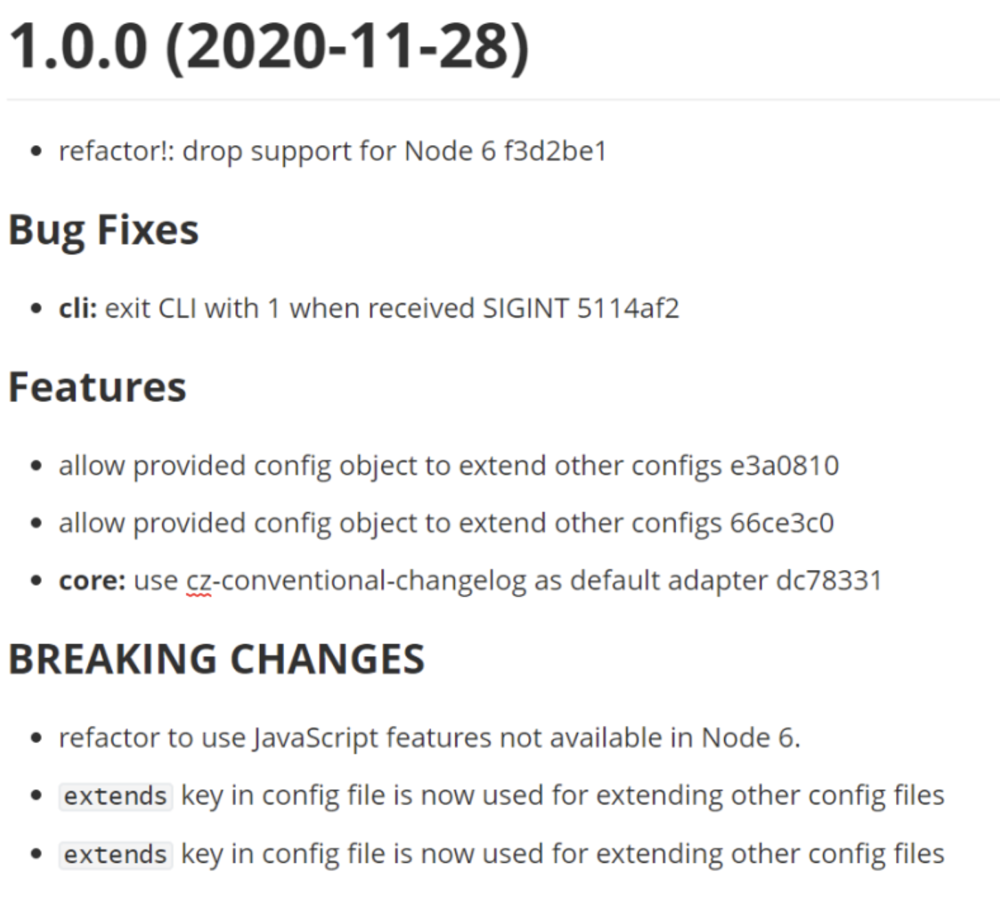

# Git 提交规范

- commitizen： [commitizen](https://github.com/commitizen/cz-cli) 是一款标准化 git commit 信息的工具。

```shell
pnpm i -D commitizen
// 初始化
commitizen init cz-conventional-changelog --save --save-exact
```

接着你可以看下你项目的 package.json ，会多出一部分配置

```json
"devDependencies": {
  "cz-conventional-changelog": "^3.2.0"
},
"config": {
  "commitizen": {
    "path": "./node_modules/cz-conventional-changelog"
  }
}
```

之后需要 `git commit` 的操作全部换成 `git cz`:

安装并添加完后，我们便可以使用 git cz 命令替换 git commit 来使用了。我们修改一个文件并 git add 后，通过 git cz 试一下：

<!--  -->

可以看到，git cz 给出了 commit 的几种类型选项，如下：

- feat 新功能
- fix Bug 修复
- docs 文档更新
- style 代码的格式，标点符号的更新
- refactor 代码重构
- [git commit-msg hook](https://github.com/typicode/husky)
- **changelog**

## #### **Commitlint**

- **Commitlint** 用于验证提交信息是否符合规范。

- 安装：

  `npm install --save-dev @commitlint/{config-conventional,cli}`

- 配置 `commitlint.config.js` 文件:

  `module.exports = {extends: ['@commitlint/config-conventional']};`

## commitlint.config

```json
// @see: https://cz-git.qbenben.com/zh/guide
const fs = require('fs')
const path = require('path')

const scopes = fs
  .readdirSync(path.resolve(__dirname, 'src'), { withFileTypes: true })
  .filter(dirent => dirent.isDirectory())
  .map(dirent => dirent.name.replace(/s$/, ''))

/** @type {import('cz-git').UserConfig} */
module.exports = {
  ignores: [commit => commit.includes('init')],
  extends: ['@commitlint/config-conventional'],
  rules: {
    // @see: https://commitlint.js.org/#/reference-rules
    'body-leading-blank': [2, 'always'],
    'footer-leading-blank': [1, 'always'],
    'header-max-length': [2, 'always', 108],
    'subject-empty': [2, 'never'],
    'type-empty': [2, 'never'],
    'subject-case': [0],
    'type-enum': [
      2,
      'always',
      [
        'feat',
        'fix',
        'docs',
        'style',
        'refactor',
        'perf',
        'test',
        'build',
        'ci',
        'chore',
        'revert',
        'wip',
        'workflow',
        'types',
        'release'
      ]
    ]
  },
  prompt: {
    messages: {
      // 中文版
      type: '选择你要提交的类型 :',
      scope: '选择一个提交范围（可选）:',
      customScope: '请输入自定义的提交范围 :',
      subject: '填写简短精炼的变更描述 :\n',
      body: '填写更加详细的变更描述（可选）。使用 "|" 换行 :\n',
      breaking: '列举非兼容性重大的变更（可选）。使用 "|" 换行 :\n',
      footerPrefixsSelect: '选择关联issue前缀（可选）:',
      customFooterPrefixs: '输入自定义issue前缀 :',
      footer: '列举关联issue (可选) 例如: #31, #I3244 :\n',
      confirmCommit: '是否提交或修改commit ?'
    },
    types: [
      // 中文版
      { value: 'feat', name: '特性:   🚀  新增功能', emoji: '🚀' },
      { value: 'fix', name: '修复:   🧩  修复缺陷', emoji: '🧩' },
      { value: 'docs', name: '文档:   📚  文档变更', emoji: '📚' },
      { value: 'style', name: '样式:   🎨  页面样式 代码格式（不影响功能，例如空格、分号等格式修正）', emoji: '🎨' },
      { value: 'refactor', name: '重构:   ♻️  代码重构（不包括 bug 修复、功能新增）', emoji: '♻️' },
      { value: 'perf', name: '性能:   ⚡️  性能优化', emoji: '⚡️' },
      { value: 'test', name: '测试:   ✅  添加疏漏测试或已有测试改动', emoji: '✅' },
      { value: 'build', name: '构建:   📦️  构建流程、外部依赖变更（如升级 npm 包、修改 webpack 配置等）', emoji: '📦️' },
      { value: 'ci', name: '集成:   🎡  修改 CI 配置、脚本', emoji: '🎡' },
      { value: 'revert', name: '回退:   ⏪️  回滚 commit', emoji: '⏪️' },
      { value: 'chore', name: '其他:   🔨  对构建过程或辅助工具和库的更改（不影响源文件、测试用例）', emoji: '🔨' },
      { value: 'wip', name: '开发:   🕔  正在开发中', emoji: '🕔' },
      { value: 'workflow', name: '工作流: 📋  工作流程改进', emoji: '📋' },
      { value: 'types', name: '类型:   🔰  类型定义文件修改', emoji: '🔰' }
    ],
    useEmoji: true,
    scopes: [...scopes],
    customScopesAlign: 'bottom',
    emptyScopesAlias: 'empty',
    customScopesAlias: 'custom',
    allowBreakingChanges: ['feat', 'fix']
  }
}
```

## lint-staged.config

```json
module.exports = {
  '*.{js,jsx,ts,tsx}': ['eslint --fix', 'prettier --write'],
  '{!(package)*.json,*.code-snippets,.!(browserslist)*rc}': ['prettier --write--parser json'],
  'package.json': ['prettier --write'],
  '*.vue': ['eslint --fix', 'prettier --write', 'stylelint --fix'],
  '*.{scss,less,styl,html}': ['stylelint --fix', 'prettier --write'],
  '*.md': ['prettier --write']
}
```

### **自动生成 Changelog**

使用工具如 **standard-changelog** 或 **auto-changelog** 自动生成 changelog。

#### **Standard Changelog**

- 安装：

  `npm install --save-dev standard-changelog`

- 配置 `package.json`:

  `"scripts": {   "changelog": "standard-changelog" }`

- 生成 changelog:

  `npm run changelog`

## husky

- **Husky** 可以在提交前运行 Git 钩子，确保提交信息符合规范。

- 安装：

  bash

  复制代码

  `npm install husky --save-dev`

- 配置 `.husky/commit-msg` 文件:

  bash

  复制代码

  `#!/bin/sh . "$(dirname "$0")/_/husky.sh"  npx commitlint --edit $1`
