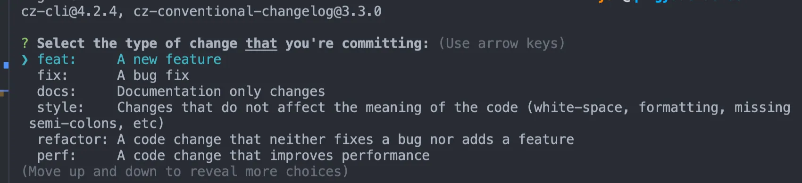

<!-- # 前端规范
## 一、统一开发环境和工具
### 1. VSCode

- Settings
  ```json
  {
    // 1 formatOnSave
    "editor.formatOnSave": true,

    // 2 prettier
    "editor.defaultFormatter": "esbenp.prettier-vscode",

    // 3 eslint
    "editor.codeActionsOnSave": {
      "source.fixAll.eslint": "explicit"
    },
    "eslint.validate": [
      "javascript",
      "javascriptreact",
      "typescript",
      "typescriptreact",
      "vue",
      "react"
    ]
  }
  ```

- 插件
    - 格式校验
        - **ESLint**: 帮助你在开发过程中遵循代码规范，并能够在保存时自动修复问题。

        ```jsx
        // eslint.config.js  -- 项目必须
        export default [
          {
            rules: {
              semi: "error",
              "prefer-const": "error",
            },
          },
        ];
        ```

        - **Prettier - Code formatter**: 一个流行的代码格式化工具，能自动格式化你的代码，使之符合规范。

        ```jsx
        // .prettierrc.cjs  非必须
        // @see: https://www.prettier.cn
        ```

        - **EditorConfig for VS Code**：帮助开发者在不同的代码编辑器和 IDE 中维护一致的编码风格的工具。

        ```jsx
        // .editorconfig  -- 项目必须
        # Top-most EditorConfig file
        root = true

        [*]
        # 适用于所有文件类型
        indent_style = tab          # 使用空格进行缩进
        indent_size = 2             # 缩进大小为4个空格
        end_of_line = lf            # 使用 LF 作为行结束符
        charset = utf-8             # 字符集为 UTF-8
        trim_trailing_whitespace = true # 删除行尾空格
        insert_final_newline = true # 文件末尾插入换行符

        [*.md]
        # 对于 Markdown 文件
        trim_trailing_whitespace = false # 保留行尾空格
        ```

    - **代码补全**
        - **Vue - Official**: 为 Vue 3 提供更强大的语法支持。
        - **Tailwind CSS IntelliSense：** 为 Tailwind CSS 提供智能提示和自动补全。
        - **Auto Rename Tag**: 修改 HTML 或 JSX 标签时，自动同步修改配对的标签。
        - **Path Intellisense**: 自动补全文件路径，减少手动输入路径的错误。
        - **Auto Close Tag：**
        - **Code Spell Checker：**
        - **Path Autocomplete**
    - **其他**
        - **Bracket Pair Colorizer**: 为配对的括号上色，帮助你更容易识别括号的范围。
        - **Live Server**: 本地开发时自动刷新浏览器，方便预览效果。
        - **GitLens**: 提供 Git 相关信息的可视化，如代码的作者和提交历史。
        - **Fitten Code（一定要装）！！！：专业AI编码助手**

- **Code Snippets 代码片段**
    - **~~JavaScript (ES6) Code Snippets：~~**
    - **Vue 3 Snippets**
    - 自定义 **Snippets：**

        ```jsx
        // 1. Ctrl + Shift + P（Windows/Linux）或 Cmd + Shift + P（macOS）打开命令面板。
        // 2. 输入 Preferences: Configure User Snippets 并选择该选项。
        // 3. 可以选择一个现有语言的 Snippet 文件（如 JavaScript、TypeScript 或 Vue）或选择 New Global Snippets file 创建一个全局 Snippet 文件。
        // 4. Snippets 文件的格式是 JSON，使用以下结构添加新的代码片段：
        // 举例如下配置后。 新建vue文件，输入‘@’ 后tab键，文件将根据如下模版填充
        {
        	"Print to console": {
        			"scope": "vue,javascript,typescript",
        			"prefix": "@",
        			"body": [
        					"<template>",
        					"<div class='${1:container}'>",
        					"新内容",
        					"</div>",
        					"</template>",
        					"<script setup lang='ts'>",
        					"  ",
        					"</script>",
        					"<style lang='scss' scoped>",
        					"  ",
        					"</style>",
        			],
        			"description": "vue3"
        	}
        }
        ```

- **Launch Configuration**
    - 配置调试环境，比如调试 Node.js 或前端代码：

### 2. 命令行工具
::: tip 命令行和命令行解释器之间的关系
可以比作「用户界面」与「操作系统」的关系
- 在 Windows 上，常见的命令行解释器有 cmd.exe、PowerShell。
- 在 Unix/Linux 系统上，常见的命令行解释器包括 bash、zsh、sh、ksh。
:::

- 解释器：Zsh
    - Oh My Zsh
        - 插件：zsh-autosuggestions：提供命令自动建议，基于历史记录和常用命令。
        - 插件：Zsh-syntax-highlighting
        - git：显示 Git 状态提示并提供简化的 Git 命令。
- **NVM: 管理 Node.js 版本的工具。通过 NVM，你可以轻松地安装、切换和管理多个 Node.js 版本**
- NRM:   用于管理 NPM（Node Package Manager）镜像源的工具。
- **Git 别名**
    - 可以在各自命令行解释器的配置文件如 `~/.bashrc` 或 `~/.zshr`c 文件中添加常用 Git 别名，以提高效率。例如：

    ```jsx
    alias g='git'
    alias gs='git status'
    alias ga='git add'
    alias gc='git commit'
    alias gp='git push'
    alias gl='git log --oneline --graph --decorate'
    ...
    ```


### 3. chrome 插件

- 解除跨域限制并生成快捷方式。
    - windows: https://juejin.cn/post/7280435431328710716
    - mac: https://juejin.cn/post/6844903929520586766
- [FEHelper](https://github.com/zxlie/FeHelper): 前端助手
    - JSON 格式化：
    - API 测试：
    - 字符串处理：
    - 前端性能监测：
    - 其它工具：
- [octotree](https://www.octotree.io/)： GitHub 页面旁边添加一个树状文件结构视图，允许用户更方便地浏览和导航 GitHub 上的项目和文件。

### 4. 其他工具

- supervisor：node项目的自动重启和保持运行
- http-server: 零配置命令行 HTTP 服务器，用于在本地开发环境中快速提供静态文件。


## 二、统一风格
### 命名规范

- 文件结构命名
```js
// 文件命名
helloWorld
// 组件命名
HelloWorld.vue
```
- CSS命名
```js
<!-- HTML -->

jdc.html
jdc_list.html
jdc_detail.html

<!-- SASS -->

jdc.scss
jdc_list.scss
jdc_detail.scss

````

ClassName的命名应该尽量精短、明确，必须以字母开头命名，且全部字母为小写，单词之间统一使用下划线 “_” 连接
- JS命名
- 图片命名

  图片命名建议以以下顺序命名：图片业务（可选） +（mod_）图片功能类别（必选）+ 图片模块名称（可选） + 图片精度（可选）
  图片业务：
    pp_：拍拍
    wx_：微信
    sq_：手Q
    jd_：京东商城
    …
    图片功能类别：

    mod_：是否公共，可选
    icon：模块类固化的图标
    logo：LOGO类
    spr：单页面各种元素合并集合
    btn：按钮
    bg：可平铺或者大背景
    …
    图片模块名称：

    goodslist：商品列表
    goodsinfo：商品信息
    userava tar：用户头像
    …
    图片精度：

    普清：@1x
    Retina：@2x | @3x
    …
    如下面例子：
```js
公共模块：
wx_mod_btn_goodlist@2x.png
wx_mod_btn_goodlist.png
mod_btn_goodlist.png

非公共模块：
wx_btn_goodlist@2x.png
wx_btn_goodlist.png
btn_goodlist.png
````

### 代码风格

- 变量命名
- 逻辑嵌套
- 函数式编程

### git 提交规范

- commitizen： [commitizen](https://github.com/commitizen/cz-cli) 是一款标准化 git commit 信息的工具。

```shell
pnpm i -D commitizen
// 初始化
commitizen init cz-conventional-changelog --save --save-exact
```

接着你可以看下你项目的 package.json ，会多出一部分配置

```json
"devDependencies": {
  "cz-conventional-changelog": "^3.2.0"
},
"config": {
  "commitizen": {
    "path": "./node_modules/cz-conventional-changelog"
  }
}
```

之后需要 git commit 的操作全部换成 git cz:

安装并添加完后，我们便可以使用 git cz 命令替换 git commit 来使用了。我们修改一个文件并 git add 后，通过 git cz 试一下：



可以看到，git cz 给出了 commit 的几种类型选项，如下：

- feat 新功能
- fix Bug 修复
- docs 文档更新
- style 代码的格式，标点符号的更新
- refactor 代码重构
- [git commit-msg hook](https://github.com/typicode/husky)
- **changelog**

### **4. 自定义 CLI**

- ESLint
- prettier
- ts-config
- .editorconfig
- 打包规则

### **5. 录入 AI**

## 三、统一分支控制

- 现状：
  - 分支混乱，且发布分支太过随意，功能 B 分支未拉取已发布的功能 A 分支代码， 导致线上的分支 A 的功能丢失。
  - 未建立合理 PR 流程，导致功能分支越来越多。
  - 未有合理的 Tag，导致在代码层面没有版本概念。

方案：

- gitFlow
  - **开始新功能**：
    - 从  `develop`  分支创建一个  `feature/awesome-feature`  分支。
    - 在  `feature/awesome-feature`  分支上开发新功能。
    - 功能完成后，将  `feature/awesome-feature`  分支合并回  `develop`  分支，并删除  `feature/awesome-feature`  分支。
  - **准备发布**：
    - 从  `develop`  分支创建一个  `release/1.0.0`  分支。
    - 在  `release/1.0.0`  分支上进行最后的 bug 修复和发布准备。
    - 发布准备完成后，将  `release/1.0.0`  分支合并到  `master`  分支，并打上  `1.0.0`  的版本标签，同时将其合并回  `develop`  分支以保持同步。
  - **修复紧急问题**：
    - 从  `master`  分支创建一个  `hotfix/urgent-bug`  分支。
    - 在  `hotfix/urgent-bug`  分支上修复紧急问题。
    - 修复完成后，将  `hotfix/urgent-bug`  分支合并回  `master`  分支，并打上新版本标签，然后合并回  `develop`  分支。

基于 gitflow 修改：

- master、feature、release
  - master： 主分支，线上代码。
  - feature：功能分支。 基于 master 创建。
  - release: 发布分支，发布后合并至 master，且删除
  - hotfix: bug 修复
- 多个功能分支并行的 case：
  - feature/A && feature/b
  - 基于各自分支开发，dev 随便部署， test 以及 prod 需要基于如上分支创建 release 分支，合并 master 分支代码，打 tag 发布。
  - 并在 release 中手动填写本次版本的主要内容。
  - 测试完成后，发布并合并到 master。
- 分支权限：
  - master、develop 都只有拉取权限， 合并代码必须经过 PR 流程。 好处在于，方便他人进行代码 review，以及之后自动删除该功能分支，避免分支无限累积。 -->
