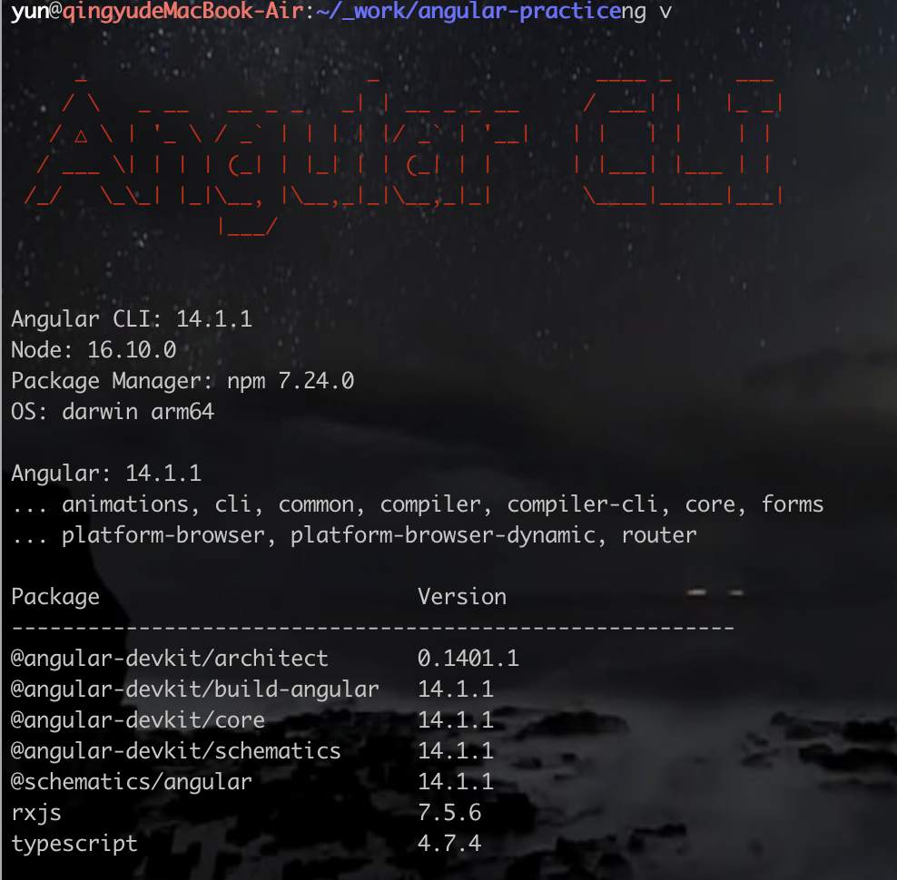
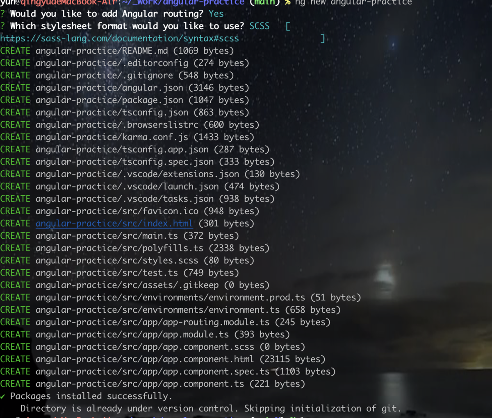
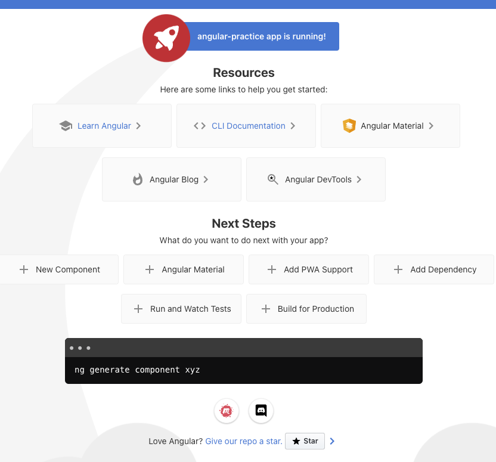

# 一、Angular CLI

## 一、安装

1. 全局安装 Angular CLI

```javascript
npm install -g @angular/cli
```

2. 验证是否成功

```shell
ng v
```



#####

> cnpm 安装会在初始化时报错 setTimeout is not defined。
> npm uninstall -g @angular/cli 而后重新安装

3. 通过 Angular CLI 命令来创建一个新的应用

```javascript
ng new angular-practive
```

常用命令参数

|               |                                          |
| ------------- | ---------------------------------------- |
| options       | 解释                                     |
| --force       | 强制覆盖现有文件                         |
| --skipInstall | 创建项目时跳过 npm install 命令          |
| --strict      | 在代码中使用更严格的 typescript 编译选项 |



4. 运行项目
   > ## 运行项目
   >
   > ng serve

常用命令参数:

|             |                    |
| ----------- | ------------------ |
| options     | 解释               |
| --open / -o | 是否直接打开浏览器 |
| --port      | 指定程序运行的端口 |



## 二、结构说明

- src - 根项目的源文件
  - app - 系统所提供的各种功能
    - app-routing.module.ts - 项目的路由模块，用来定义项目的前端路由信息
    - app.component.html - 项目的根组件所关联的 HTML 页面
    - app.component.scss - 项目的根组件 HTML 页面的样式信息
    - app.component.spec.ts - 项目的根组件单元测试文件
    - app.component.ts - 项目的根组件逻辑
    - app.module.ts - 应用的根模块
  - assets - 系统需要使用的静态资源文件
  - environments - 针对不同环境的构建配置选项
  - favicon.ico - 网站图标
  - index.html - 应用的主页面
  - main.ts - 应用的入口程序。
  - polyfills.ts - 针对不同浏览器对于原生 API 的支持程度不相同的情况，用来抹平不同浏览器之间的支持差异
  - styles.scss - 项目的全局样式文件
  - test.ts - 单元测试的主入口程序
- .editorconfig - 针对不同代码编辑器间的代码风格规范
- .gitignore - git 忽略的文件
- angular.json - 应用于当前工作空间的一些默认配置以及供 angular cli 和开发工具使用的配置信息
- browserslist - 项目所针对的目标浏览器
- karma.conf.js - 基于 node.js 的 javascript 测试执行过程管理工具
- package-lock.json - 针对当前工作空间使用到 npm 包，安装到 node_modules 时的版本信息
- package.json - 当前工作空间中所有项目会使用到的 npm 包依赖
- README.md - 当前工作空间最外层根应用的简介文件
- tsconfig.app.json - 当前工作空间最外层根应用的专属 typescript 配置文件
- tsconfig.json - 当前工作空间中各个项目的基础 typescript 配置文件
- tsconfig.spec.json - 当前工作空间最外层根应用的专属 tslint 配置文件
- tslint.json - 当前工作空间中各个项目的基础 tslint 配置文件

## 三、参考文档

- [搭建本地开发环境和工作空间](https://angular.cn/guide/setup-local)
- [ng new](https://angular.cn/cli/new)
- [ng serve](https://angular.cn/cli/serve)
- [工作区和项目文件结构](https://angular.cn/guide/file-structure)
- [预先（AOT）编译器](https://angular.cn/guide/aot-compiler#ahead-of-time-aot-compilation)
