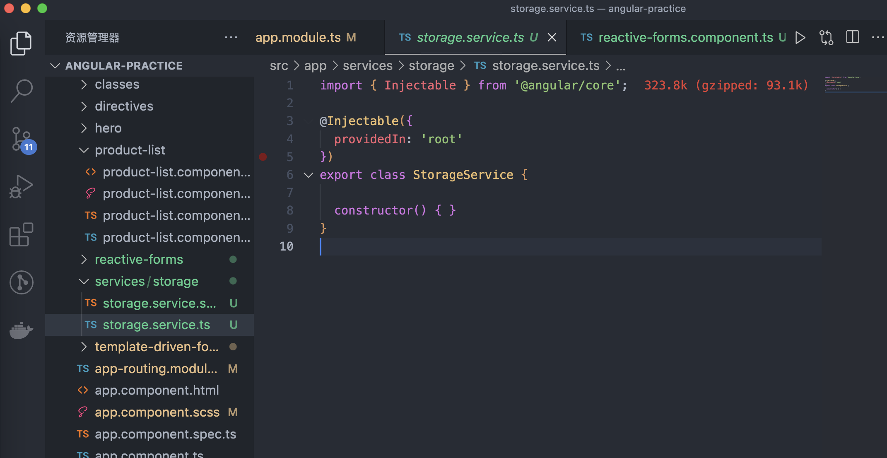
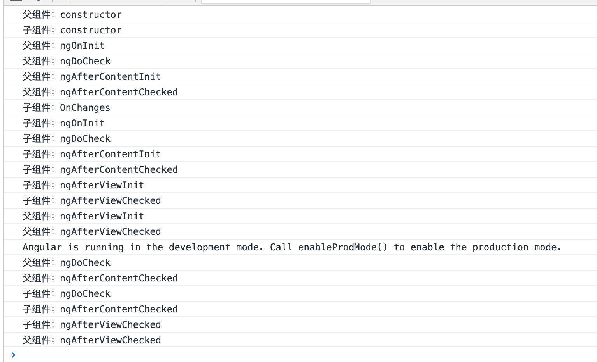

# 二、组件

## 1. 基本概念

组件包含了一组特定的功能，每个组件的功能都单一且独立，可以进行重复使用；组件可以通过 angular cli 进行创建，生成的组件位于工作空间的 src/app/ 路径下面

```shell
## 创建一个 product-list 组件
ng g component product-list
```

当需要将组件放置在某个指定的目录下时，可以直接在 ng g 命令中添加路径

```shell
## 将 hero 组件生成到 components 路径下
ng g component components/hero
```

ngular 应用就是通过一个个的组件所构成的组件树，一个组件包含了如下的四个部分

- product-list.component.ts：组件类，用来处理数据和功能，为视图呈现提供支持
- product-list.component.html：组件对应的页面 HTML 模板，用来呈现组件的功能
- product-list.component.scss：只针对当前组件的样式
- product-list.component.spec.ts：当前组件的单元测试文件（非必须）

当通过命令行创建一个新的组件之后，会自动将新创建的组件注册到应用的根模块（app.module.ts）中

在组件类中，通过使用 @Component 装饰器用来将类声明为组件类，并为这个组件类配置一些元数据 ，以决定该组件在运行期间该如何处理、实例化和使用

> 1. 元数据是用来描述数据的数据项，例如这里的 selector 是为了描述 Component 这个数据信息资源中抽取出来用于说明其特征的一个结构化的数据。

装饰器中存在三个基础的配置参数，用来完成组件与视图之间的关联

- selector：选择器，当我们在页面上添加了这个选择器指定的标签（<app-product-list></app-product-list>）后，就会在当前使用位置上创建并插入这个组件的一个实例
- templateUrl：该组件所对应的 HTML 模板文件地址
- styleUrls：该组件视图所特有的 css 样式文件地址


## 2. 模板绑定语法

在 angular 应用中，组件扮演着控制器或是视图模型的作用，在创建组件时会关联一个 html 文件，这个 html 文件则是一个基础的 angular 模板文件。
在这个模板文件中，可以通过 angular 内置的模板语法与 html 元素进行结合，从而告诉 angular 如何根据我们的应用逻辑和数据来渲染页面。

### 2.1 插值表达式

插值表达式可以将组件中的属性值或者是模板上的数据通过模板表达式运算符进行计算，最终将值渲染到视图页面上

```javascript
<p>title：{{title}}</p>

<p>1+2+3+4+5={{1+2+3+4+5}}</p>
```

模板表达式的变量来源

- 模板本身的变量
- 指令的上下文变量
- 组件的成员信息（属性 or 方法）

在使用模板表达式时，如果变量名在多个来源中都存在的话，则**模板变量是最优先**的，其次是**指令的上下文变量**，最后是**组件的成员**
在使用模板表达式时应该遵循如下的原则

- 简单：正常情况下，应该将业务逻辑或是数据运算放到组件中，模板表达式只作为属性或方法的调用
- 快速执行：模板表达式得出的数据应该快速结束，否则就会对于用户体验造成影响
- 没有可见的副作用：模板表达式只作为数据的展示，不应该改变任何的数据；应该构建出幂等的表达式，除非依赖的值发生变化，否则多次调用时，应该返回相同的数据信息

### 2.2 模板绑定语法

通过数据绑定机制，将数据源与视图进行绑定，从而实现源数据与用户呈现的一致性

- 从数据源到视图：插值、组件中的属性、dom 元素的 property [[3]](https://www.cnblogs.com/danvic712/p/angular-components-guide.html#fn3)、css 样式、css 类
- 从视图到数据源：事件
- 视图与数据源之间的双向绑定：数据对象

### 2.3 数据绑定

- 单向数据绑定

```javascript
<p>{{ title }}</p>
```

- 双向数据绑定

```html
<input type="text" id="userName" [(ngModel)]="name" />

<!-- 
当没有 NgModel 时，双向数据绑定等同于下面的写法
-->
<input type="text" id="userName" [value]="name" (input)="name=$event.target.value" />
```

### 2.4 属性、样式绑定

- dom 元素的 property 绑定

```html


```

- html 标签的 attribute 绑定 attribute 绑定的语法类似于 property 绑定，由前缀 attr、点（ . ）和 attribute 名称组成 attribute 绑定的主要用例之一是设置 ARIA attribute（给残障人士提供便利）

```html
<button [attr.aria-label]="actionName">{{actionName}} with Aria</button>
```

- style 内联样式绑定

```json
// 1、[style.width]="width" ：string | undefined | null
public width = "100px";

//2、[style.width.px]="width"：number | undefined | null
public width = "20";

// 3、[style]="styleExpr"：string
public styleExpr = "width: 100px; color:red";

// 4、[style]="styleExpr"：{key:value}
public styleExpr = {width: '100px', height: '100px'};

// 5、[style]="styleExpr"：array
public styleExpr = ["width", "100px"];
```

- class 属性绑定

```javascript
// 1、[class.foo]="hasFoo"：bool | undefined | null
public hasFoo = true;

// 2、[class]="classExpr"：string
public classExpr = "my-class1 my-class2";

// 3、[class]="classExpr"：{key:value}
public classExpr= {my-class1:  true, my-class2: true};

// 4、[class]="classExpr"：array
public classExpr= ["my-class1", "my-class2"];
```

### 2.4 事件绑定

在事件绑定中，可以通过 $event 参数获取到 dom 事件对象的属性从而获取到模板信息

```html
<input type="text" (keyup)="getMsg($event)" />
<p>输入的值：{{msg}}</p>
```

```javascript
import { Component, OnInit } from '@angular/core';

@Component({
  selector: 'app-product-list',
  templateUrl: './product-list.component.html',
  styleUrls: ['./product-list.component.scss']
})

export class ProductListComponent implements OnInit {

  public msg: string;

  constructor() { }

  ngOnInit(): void {
  }

  getMsg(event: KeyboardEvent) {
    console.log(event);
    this.msg = (event.target as HTMLInputElement).value;
  }
}
```

> 通过使用 $event 作为方法的参数会将许多用不到的模板信息传递到组件中，导致我们在仅仅是为了获取数据的前提下，却需要对于页面元素十分了解，违背了模板（用户所能看到的）与组件（应用如何去处理用户数据）之间的关注点分类的原则。因此，这里应该使用模板引用变量的方式获取数据信息。

模板引用变量是对模板中 DOM 元素的引用，提供了从模块中直接访问元素的能力。

```javascript
<input type="text" #refMsgInput (keyup)="getRefMsg(refMsgInput.value)">
<p>通过模板引入变量的方式获取到输入的值：{{refMsg}}</p>
```

```javascript
import { Component, OnInit } from '@angular/core';

@Component({
  selector: 'app-product-list',
  templateUrl: './product-list.component.html',
  styleUrls: ['./product-list.component.scss']
})

export class ProductListComponent implements OnInit {

  public refMsg: string;

  constructor() { }

  ngOnInit(): void {
  }

  getRefMes(msg: string) {
    this.refMsg = msg;
  }
}
```

模板引用变量的作用域是整个模板，因此要确保一个模板中的引用变量名称是唯一的，同时，在声明引用变量时，也可以使用 ref- 代替 #

```html
<input type="text" ref-refMsgInput (keyup)="getRefMsg(refMsgInput.value)" />
<p>通过模板引入变量的方式获取到输入的值：{{refMsg}}</p>
```

## 3. 指令

### 3.1 属性型指令

属性型指令被应用在视图 dom 元素上，用来改变 dom 元素的外观或行为

- **NgClass**：用来设置元素的多个 css 类属性，如果只设置一个 css 类，应该使用模板绑定语法中 class 类绑定。

```javascript
<p [ngClass]="inlineStyle">NgClass 属性指令</p>


import { Component, OnInit } from '@angular/core';

@Component({
  selector: 'app-product-list',
  templateUrl: './product-list.component.html',
  styleUrls: ['./product-list.component.scss']
})

export class ProductListComponent implements OnInit {

  public inlineStyle: {};

  constructor() { }

  ngOnInit(): void {
    this.setInlineStyle();
  }

  setInlineStyle() {
    this.inlineStyle = {
      'text-red': true,
      'bg-blue': false,
    };
  }
}
```

这里的 text-red、bg-blue 都是 css 类名，如果想要在指定的元素上添加该类，则 css 类名对应的值为 true，反之则为 false。

- **NgStyle**：用来设置元素的多个内联样式，如果只设置一个内联样式，应该使用模板绑定语法中的样式绑定

```javascript
<p [ngStyle]="currentStyles">NgStyle 属性指令</p>


import { Component, OnInit } from '@angular/core';

@Component({
  selector: 'app-product-list',
  templateUrl: './product-list.component.html',
  styleUrls: ['./product-list.component.scss']
})

export class ProductListComponent implements OnInit {

  public currentStyles: {};

  constructor() { }

  ngOnInit(): void {
    this.setCurrentStyles();
  }

  setCurrentStyles() {
    this.currentStyles = {
      'font-style': 'italic',
      'font-weight': 'bold',
      'font-size': '24px'
    };
  }
}
```

通过在组件的属性中设置多个内联样式对象的形式，完成对于页面元素样式的批量设置。

- **NgModel**：双向数据绑定

```html
<input type="text" id="userName" [(ngModel)]="name" />
```

### 3.2 结构型指令

结构型指令用来操作 dom 树，通过进行一些的逻辑判断，从而完成对于页面布局的修改。

- **NgIf**：根据表达式的值（true or false）来创建或者销毁 dom 元素

ngIf 指令并不是通过使用 css 样式来隐藏元素的，当值为 false 时，则这些元素会从 dom 中被销毁，并且所有监听该 dom 元素的事件会被取消，当重新显示该元素时，会重新执行初始化的过程。
与销毁元素不同，对于隐藏的元素来说，所有的元素监听事件还会执行监听的，再次显示时不用重新进行初始化过程。

- NgFor：通过定义单条数据的显示格式，angular 以此为模板，循环渲染出所有的数据。
  NgFor 指令上下文中的 index 属性在每次迭代中，会获取到条数据的索引值。当渲染的数据发生改变时，会导致 dom 元素的重新渲染，此时可以采用 trackBy 的方式，通过在组件中添加一个方法，指定循环需要跟踪的属性值，此时当渲染的数据发生改变时，只会重新渲染变更了指定的属性值的数据
- NgSwitch：根据条件切换，从候选的几个元素中选择匹配的，放到 dom 元素中

```html
<p>
  请选择配置
  <select [(ngModel)]="config">
    <option value="">请选择</option>
    <option value="r7-3700x">AMD Ryzen 7 3700X</option>
    <option value="i5-9400f">Intel i5 9400F</option>
    <option value="i5-9600kf">Intel i5 9600KF</option>
  </select>
</p>
<p>配置描述</p>
<div [ngSwitch]="config">
  <p *ngSwitchCase="'r7-3700x'">一个能打得都木的~~~</p>
  <p *ngSwitchCase="'i5-9400f'">挤牙膏的。。。</p>
  <p *ngSwitchCase="'i5-9600kf'">别看了，我不是开封菜。。。</p>
  <p *ngSwitchDefault>你选一个啊~~~</p>
</div>
```

NgSwitch 本身是一个属性型指令，它不会直接操作 dom 元素，而是通过它所控制的两个结构型指令（NgSwitchCase、ngSwitchDefault）来操作 dom 元素。

## 4. 管道

在使用模板表达式绑定数据时，可以使用管道对于表达式的结果进行转换管道是一种简单的函数，它们接受输入值并返回转换后的值。通过在模板表达式中使用管道运算符（|）则可以完成相应的结果转换

### 4.1 模板表达式中的特殊运算符

angular 模板表达式是 javascript 的子集，相对于常见的 javascript 运算符，添加了三个特殊的运算符

- 管道运算符管道是一种特殊的函数，可以把运算符（|）左边的数据转换成期望呈现给视图的数据格式，例如，将时间进行格式化、将数据转换成 json 字符串的形式等等可以针对一个数据使用多个管道进行串联，并且管道运算符的优先级比三元运算符（ ?: ）高
- 安全导航运算符
在视图中使用的属性值为 `null or undefined` 时，javascript 和 angular 会引发空指针异常并中断视图的渲染过程， 从而视图会渲染失败，而使用了安全导航运算符（?）后，视图依然会渲染，只是显示的值为空白
<!-- `<p>第五个专案的名称为：{{products[5]?.name}}</p>` -->

```html
<p>第五个专案的名称为：{{products[5]?.name}}</p>
```

- 非空断言运算符 !.
  在 tsconfig.json 中启用 strictNullChecks 属性，typescript 将会强制开启严格的空值检查，在这种模式下，所有定义了类型的属性是不允许赋值为 null 的，当将属性赋值为 null，则会编译报错。
  非空断言运算符用来告诉编译器对特定的属性不做严格的空值校验，当属性值为 null or undefined 时，不抛错误。在下面的代码中，在判断 obj 存在后，就不再针对 obj.name 进行校验

```javascript
<p *ngIf="obj">
  <span>{{obj!.name}}</span>
</p>
```

### 4.2 常用的管道函数

- 纯管道只有在它检测到输入值发生了纯变更时才会执行，但是会忽略对象内部的变更纯变更是指对原始类型值（String、Number、Boolean、Symbol）的更改， 或者对对象引用（Date、Array、Function、Object）的更改。
- 非纯管道每个组件的变更周期都会执行
  | JsonPipe | 将一个值转换成 json 字符串 |
  | ------------- | ---------------------------- |
  | DatePipe | 根据区域设置规则格式化日期值 |
  | UpperCasePipe | 把文本转换成全大写形式 |
  | LowerCasePipe | 把文本转换成全小写形式 |

```html
<h3>6.1、json 管道</h3>
<p>{{products | json}}</p>

<h3>6.2、date 管道</h3>
<p>现在时间：{{date | date:'yyyy-MM-dd HH:mm:ss'}}</p>

<h3>6.3、upper 管道</h3>
<p>转换成全大写：{{url | uppercase}}</p>

<h3>6.4、lower 管道</h3>
<p>转换成全小写：{{url | lowercase}}</p>
```

#### 

## 5. 组件通信

### 5.1 输入属性与输出属性

输入属性（@Input）和输出属性（@Output）用来在父子组件或指令中进行共享数据。@Input 用来获取数据，@Output 用来向外发送数据

### 5.2 子组件获取父组件信息

在父组件中，添加对于子组件的引用，并将需要传递的数据 or 方法绑定到子组件上。
**传递数据**直接将父组件中的属性值赋值给绑定在子组件上的属性就可以了。
**传递方法**时，绑定在子组件上的属性是父组件方法的名称，此处不能加 () ，否则就会直接执行该父组件的方法。
**在传递数据给子组件时**，也可以通过 this 来指代父组件，从而将整个父组件作为数据绑定子组件上。

```html
<h2>父组件内容：</h2>
<p>
  <label for="title">标题：</label>
  <input id="title" type="text" [(ngModel)]="title" />
</p>

<hr />

<h2>子组件内容：</h2>

<!--
  将父组件的数据绑定到子组件上
 -->
<app-child-component [parentTitle]="title" [parentGetMsg]="getMsg"></app-child-component>
```

在子组件中引入 Inupt，同时使用 @Input 装饰器来接收父组件传递的数据

```javascript
// 引入 Input 接口
import { Component, OnInit, Input } from '@angular/core';

@Component({
  selector: 'app-child-component',
  templateUrl: './child-component.component.html',
  styleUrls: ['./child-component.component.scss']
})
export class ChildComponentComponent implements OnInit {

  // 获取父组件的数据
  @Input() parentGetMsg: any;

  // 使用 setter 对父组件的数据进行深加工
  private _title: string;
  @Input()
  set parentTitle(title: string) {
    this._title = (title && title.trim()) || '父组件的 title 属性值为空';
  }
  get parentTitle(): string {
    return this._title;
  }

  constructor() { }

  ngOnInit(): void {
  }

  runParentFunc() {
    this.parentGetMsg();
  }
}
```

对于使用 @Input 装饰器获取到的父组件数据，可以通过输入属性中的 setter 方法中进行重新赋值

### 5.3 父组件获取子组件信息

使用 @ViewChild 装饰器获取
在子组件上定义一个模板引用变量

```html
<h2>父组件内容：</h2>

<h3>1、使用 @ViewChild 装饰器获取子组件数据</h3>

<p>
  <button (click)="getChildMsg()">获取子组件的 msg 数据</button>
</p>

<p>
  <button (click)="runChildFunc()">调用子组件的方法</button>
</p>

<hr />

<h2>子组件内容：</h2>

<!--
  在子组件上定义一个模板引用变量
 -->
<app-child-component #childComponent></app-child-component>
```

使用 @Output 装饰器配合 EventEmitter 实现
在父组件中添加对于 ViewChild 的引用，然后使用 @ViewChild 装饰器来接收子组件的 dom 信息，从而获取到子组件的数据或方法

```javascript
// 引入 ViewChild
import { Component, OnInit, ViewChild } from '@angular/core'

@Component({
  selector: 'app-parent-component',
  templateUrl: './parent-component.component.html',
  styleUrls: ['./parent-component.component.scss'],
})
export class ParentComponentComponent implements OnInit {
  // 通过 @ViewChild 装饰器来接收字组件的 dom 信息
  @ViewChild('childComponent') child: any

  constructor() {}

  ngOnInit(): void {}

  getMsg() {
    alert('我是父组件的 getMsg 方法')
  }

  getChildMsg() {
    alert(this.child.msg)
  }
}
```

在子组件中引入 Output 和 EventEmitter，通过 @Output 装饰器定义一个事件触发器，然后就可以通过这个事件触发器的 emit 方法进行事件广播。

```javascript
// 引入 Output、EventEmitter
import { Component, OnInit, Output, EventEmitter } from '@angular/core';

@Component({
  selector: 'app-child-component',
  templateUrl: './child-component.component.html',
  styleUrls: ['./child-component.component.scss']
})
export class ChildComponentComponent implements OnInit {

  public msg = 'child title';

  // 定义一个事件触发器
  @Output() childEmitter = new EventEmitter<string>();

  constructor() { }

  ngOnInit(): void {
  }

  runParentFunc() {
    this.parentGetMsg();
  }

  sendMsg() {
    this.childEmitter.emit(this.msg);
  }
}
```

当子组件进行事件广播时，就可以通过在子组件上使用事件绑定的方式绑定到一个父组件事件，通过 $event 获取到子组件传递的数据值

```javascript
<h2>父组件内容：</h2>

<h3>2、使用 @Output 装饰器配合 EventEmitter 获取子组件数据</h3>

<p>{{childMsg}}</p>

<hr>

<h2>子组件内容：</h2>

<!--
  将子组件的事件广播绑定到父组件事件上
 -->
<app-child-component (childEmitter)='childEmitMsg($event)'></app-child-component>
```

### 5.4 非父子组件之间的通信

不管组件之间是否具有关联关系，都可以通过共享一个服务的方式来进行数据交互，也可以将需要进行共享的数据存储到一些存储介质中，通过直接读取这个存储介质中的数据进行通信

- 创建一个服务，并添加到模块中

```shell
## 在 services/storage 路径下创建一个 storage 服务
ng g service services/storage/storage
```



> Injectable 元数据提供了一个 providedIn 属性告诉 Angular 注入器我们这个类的作用域以及他可以被注入到哪里。
> @Injectable 为标记性元数据，表示一个类可以由 Injector 创建。可以接受的选项有 providedIn，这个参数描述了这个类的注入等级。providedIn 接受的值有：
>
> - root 将服务注入到根组件中，这样它是全局共享的一个单例服务。
> - platform 页面所有应用程序共享的特殊单例平台注入器。
> - any 可以是任何 Angular Module

```javascript
import { BrowserModule } from '@angular/platform-browser'
import { NgModule } from '@angular/core'
import { AppRoutingModule } from './app-routing.module'
import { AppComponent } from './app.component'
import { ProductListComponent } from './product-list/product-list.component'
import { FormsModule } from '@angular/forms'
import { ParentComponentComponent } from './parent-component/parent-component.component'
import { ChildComponentComponent } from './child-component/child-component.component'

// 引入自定义的服务
import { StorageService } from './services/storage/storage.service'

@NgModule({
  declarations: [
    AppComponent,
    ProductListComponent,
    ParentComponentComponent,
    ChildComponentComponent,
  ],
  imports: [BrowserModule, AppRoutingModule, FormsModule],
  // 配置自定义的服务
  providers: [StorageService],
  bootstrap: [AppComponent],
})
export class AppModule {}
```

#### 在组件中使用服务

在需要使用的组件中引入服务，然后在组件的构造函数中通过依赖注入的方式注入这个服务，就可以在组件中完成对于这个服务的使用
在父组件中对数据进行赋值，然后调用服务的方法改变数据信息。

```javascript
import { Component, OnInit } from '@angular/core';

// 引入服务
import { StorageService } from '../services/storage/storage.service';

@Component({
  selector: 'app-parent-component',
  templateUrl: './parent-component.component.html',
  styleUrls: ['./parent-component.component.scss']
})
export class ParentComponentComponent implements OnInit {

  public msg = 'this is a service default value writen in parent component';

  constructor(private storage: StorageService) {
    this.storage.setMsg(this.msg);
  }

  ngOnInit(): void {
  }

  submit() {
    this.storage.setMsg(this.msg);
  }
}
```

在子组件中引入服务，从而同步获取到父组件修改后的服务中的数据信息

```javascript
import { Component, OnInit } from '@angular/core';

// 引入服务
import { StorageService } from '../services/storage/storage.service';

@Component({
  selector: 'app-child-component',
  templateUrl: './child-component.component.html',
  styleUrls: ['./child-component.component.scss']
})
export class ChildComponentComponent implements OnInit {

  public storageMsg: string;

  constructor(private storage: StorageService) {
  }

  ngOnInit(): void {
  }

  getServiceMsg() {
    this.storageMsg = this.storage.getMsg();
  }
}
```

## 6. 组件的生命周期钩子函数

当 angular 在创建、更新、销毁组件时都会触发组件的生命周期钩子函数，通过在组件中实现这些生命周期函数，从而介入到这些关键时刻。

| **钩子函数**          | **触发时机**                                                                         |
| --------------------- | ------------------------------------------------------------------------------------ |
| ngOnChanges           | 被绑定的输入属性值发生变化时触发，会调用多次；如果没有使用到父子组件传值，则不会触发 |
| ngOnInit              | 初始化组件时会调用一次，一般是用来在构造函数之后执行组件复杂的初始化逻辑             |
| ngDoCheck             | 只要数据发生改变就会被调用                                                           |
| ngAfterContentInit    | 组件内容渲染完成后调用一次                                                           |
| ngAfterContentChecked | 只要组件的内容发生改变就会被调用                                                     |
| ngAfterViewInit       | 视图加载完成后触发一次，一般用来对视图的 dom 元素进行操作                            |
| ngAfterViewChecked    | 视图发生变化时调用，在组件的生命周期中会调用多次                                     |
| ngOnDestroy           | 只在销毁组件时调用一次，一般用来在组件销毁前执行某些操作                             |

在组件加载过程中，会按照上面列出的钩子函数顺序，在组件的构造函数执行之后依次执行，在页面加载过程中会涉及绑定数据的操作，因此会再次出发 ngDoCheck、ngAfterContentChecked、ngAfterViewChecked 这三个生命周期钩子函数。后续只要页面数据有发生改变，都会触发这几个事件。
父子组件声明周期顺序

