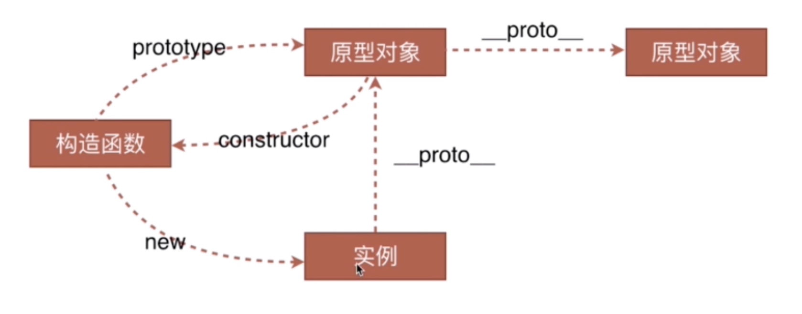

# 数据类型

## 一、数据类型

JavaScript 语言的每一个值都属于某一种数据类型。JavaScript 语言规定了 8 种语言类型。语言类型广泛用于变量、函数参数、表达式、函数返回值等场合。根据最新的语言标准，这 8 种语言类型是：
`Undefined`、`Null`、`Boolean`、`String`、`Number`、`Symbol`、`BigInt`、`Object`
其中 `Object`: `function、date、array、reg`

### 1. Undefined、Null

`Undefined` 类型表示未定义，它的类型只有一个值，就是 `undefined`。任何变量在赋值前是 `Undefined` 类型、值为 undefined，一般我们可以用全局变量 undefined（就是名为 `undefined ` 的这个变量）来表达这个值，或者 void 运算来把任意一个表达式变成 `undefined` 值。

但是，因为 JavaScript 的代码 `undefined` 是一个变量，而并非是一个关键字，这是 JavaScript 语言公认的设计失误之一，所以，我们为了避免无意中被篡改，建议使用 void 0 来获取 `undefined` 值。
「void 0」的执行结果永远是「undefined」, 即使在某些老旧浏览器 或者在某个函数中 `undefined` 被重新赋值，我们仍然可以通过 「void 0」 得到真正的「`undefined`」。

```javascript
var obj = {}
obj.undefined = '轻语'
console.log(obj.undefined) //  轻语
// 在标准浏览器下作为全局作用域下 window的一个属性， undefined 不可修改；
//但对于一个普通对象，undefined可作为属性且可以修改。

function fn() {
  var undefined = 100
  alert(undefined) //chrome: 100,  ie8: 100
}
fn()
// 不管是标准浏览器，还是老的 IE 浏览器，在函数内部 undefined 可作为局部变量重新赋值
```

`Undefined` 跟 `null` 有一定的表意差别，`null` 表示的是：“定义了但是为空”。所以，在实际编程时，我们一般不会把变量赋值为 `undefined`，这样可以保证所有值为 `undefined` 的变量，都是从未赋值的自然状态。
`Null` 类型也只有一个值，就是 `null`，它的语义表示空值，与 `undefined` 不同，`null` 是 JavaScript 关键字，所以在任何代码中，你都可以放心用 `null` 关键字来获取 `null` 值。

### 2. Boolean

Boolean 类型有两个值， `true` 和 `false`，它用于表示逻辑意义上的真和假，同样有关键字 `true` 和 `false` 来表示两个值。

拓展知识链接：

```javascript
// 函数参数默认值失效判断：
function log(x, y) {
  y = y || 'World'
  console.log(x, y)
}
log('Hello', '') // Hello World
```

> 如果参数 y 赋值了，但是对应的**布尔值为 false**，则该赋值不起作用。

### 3. String

String 用于表示文本数据。String 有最大长度是 **2^53 - 1**，这在一般开发中都是够用的，但是有趣的是，这个所谓最大长度，并不完全是你理解中的字符数。

因为 String 的意义并非“字符串”，而是字符串的 `UTF16` 编码，我们字符串的操作 `charAt`、`charCodeAt`、`length` 等方法针对的都是 `UTF16` 编码。所以，字符串的最大长度，实际上是受字符串的编码长度影响的。

JavaScript 中的字符串是永远无法变更的，一旦字符串构造出来，无法用任何方式改变字符串的内容，所以字符串具有值类型的特征。

JavaScript 字符串把每个 `UTF16` 单元当作一个字符来处理，所以处理非 `BMP`（超出 U+0000 - U+FFFF 范围）的字符时，你应该格外小心。

JavaScript 这个设计继承自 Java，最新标准中是这样解释的，这样设计是为了“性能和尽可能实现起来简单”。因为现实中很少用到 `BMP` 之外的字符。

:::tip 拓展链接

- 包装对象：每当读取一个基本类型的值的时候，后台就创建一个对应的基本包装类型的对象，从而让我们能够调用一些方法来操作这些数据。
- [utf 编码](https://segmentfault.com/a/1190000005794963) [码点](https://juejin.cn/post/6844904024215404558)
- javascript 程序是使用 Unicode 字符集编写的。Unicode 是 ASCII 和 Latin-1 的超集，并支持地球上几乎所有的语言。ECMAScript3 要求 JavaScript 必须支持 Unicode2.1 及后续版本，ECMAScript5 则要求支持 Unicode3 及后续版本。
  :::

### 4. Number

`Number` 类型表示我们通常意义上的“数字”。这个数字大致对应数学中的有理数，当然，在计算机中，我们有一定的精度限制。
JavaScript 的 `Number` 类型为[双精度 IEEE 754 64 位浮点](https://en.wikipedia.org/wiki/Floating-point_arithmetic)类型。

JavaScript 中最大的安全整数 (**2^53 - 1**)。  
JavaScript 中最小的安全整数 (-(**2^53 - 1**))。

JavaScript 中的 `Number` 类型有 18437736874454810627(即 2^64-2^53+3) 个值。
JavaScript 中的 `Number` 类型基本符合 IEEE 754-2008 规定的双精度浮点数规则，但是 JavaScript 为了表达几个额外的语言场景（比如不让除以 0 出错，而引入了无穷大的概念），规定了几个例外情况：

- NaN，占用了 9007199254740990，这原本是符合 IEEE 规则的数字；
- Infinity，无穷大；
- -Infinity，负无穷大。

另外，值得注意的是，JavaScript 中有 +0 和 -0，在加法类运算中它们没有区别，但是除法的场合则需要特别留意区分，“忘记检测除以 -0，而得到负无穷大”的情况经常会导致错误，而区分 +0 和 -0 的方式，正是检测 1/x 是 Infinity 还是 -Infinity。
根据双精度浮点数的定义，Number 类型中有效的整数范围是 -0x1fffffffffffff 至 0x1fffffffffffff，所以 Number 无法精确表示此范围外的整数。

:::tip 拓展链接

- 单精度浮点数在内存中占 4 个字节、有效数字 8 位、表示范围：-3.40E+38 ~ +3.40E+38
- 双精度浮点数在内存中占 8 个字节、有效数字 16 位、表示范围：-1.79E+308 ~ +1.79E+308
  **浮点型简单来说就是表示带有小数的数据，而恰恰小数点可以在相应的二进制的不同位置浮动，可能是这样就被定义成浮点型了**。

  JavaScript 中所有数字包括整数和小数都只有一种类型 即 Number 类型。它的实现遵循  **IEEE 754 标准**， 以 64 位双精度浮点数存储所有 Number 类型值 即计算机最多存储 64 位二进制数。

- 推导过程：
  0.2>>二进制>>>科学记数法>>实际存储时的形式 (64 位: 符号位+指数位+小数部分)
  :::

### 5. Symbol

起因是为对象增加不影响之前属性的新属性，保证属性名独一无二。

```javascript
// Symbol 可以具有字符串类型的描述，但是即使描述相同，Symbol 也不相等
Symbol('foo') !== Symbol('bar')
Symbol.for('foo') === Symbol.for('foo')
```

`Symbol` 作为属性名，遍历对象的时候，该属性不会出现在 for...in、for...of 循环中，也不会被 Object.keys()、Object.getOwnPropertyNames()、JSON.stringify()返回。

另一个新的 API，`Reflect.ownKeys()` 方法可以返回所有类型的键名，包括常规键名和 `Symbol` 键名。

拓展知识链接：

> - Symbol.iterator
>
> 任何数据结构在部署上了之后，都可以用 for...of 遍历

```javascript
var o = new Object()
o[Symbol.iterator] = function () {
  var v = 0
  return {
    next: function () {
      return { value: v++, done: v > 10 }
    },
  }
}

for (var v of o) console.log(v) // 0 1 2 3 ... 9
```

### 6. BigInt

BigInt  是一种内置对象，它提供了一种方法来表示大于 253 - 1  的整数。这原本是 Javascript 中可以用  [Number](https://developer.mozilla.org/zh-CN/docs/Web/JavaScript/Reference/Global_Objects/Number)  表示的最大数字。`BigInt`  可以表示任意大的整数。

可以用在一个整数字面量后面加  n  的方式定义一个  `BigInt` ，如：10n，或者调用函数 BigInt()。

它在某些方面类似于  [Number](https://developer.mozilla.org/zh-CN/docs/Web/JavaScript/Reference/Global_Objects/Number) ，但是也有几个关键的不同点：

- 不能用于  [Math](https://developer.mozilla.org/zh-CN/docs/Web/JavaScript/Reference/Global_Objects/Math)  对象中的方法；
- 不能和任何  [Number](https://developer.mozilla.org/zh-CN/docs/Web/JavaScript/Reference/Global_Objects/Number)  实例混合运算，两者必须转换成同一种类型。
- 在两种类型来回转换时要小心，因为  `BigInt`  变量在转换成  [Number](https://developer.mozilla.org/zh-CN/docs/Web/JavaScript/Reference/Global_Objects/Number)  变量时可能会丢失精度。

## 二、数据类型判断

### 1. typeof

typeof 是一个操作符，其右侧跟一个一元表达式，并返回这个表达式的数据类型。返回的结果用该类型的字符串(全小写字母)形式表示，包括以下 7 种：number、boolean、symbol、string、object、undefined、function 等。

```javascript
typeof '' // string 有效
typeof 1 // number 有效
typeof Symbol() // symbol 有效
typeof true //boolean 有效
typeof undefined //undefined 有效
typeof null //object 无效
typeof [] //object 无效
typeof new Function() // function 有效
typeof newDate() //object 无效
typeof newRegExp() //object 无效
```

有些时候，`typeof` 操作符会返回一些令人迷惑但技术上却正确的值：

- 对于基本类型，除 null 以外，均可以返回正确的结果。
- 对于引用类型，除 function 以外，一律返回 object 类型。
- 对于 null ，返回 object 类型。
- 对于 function 返回  function 类型。

其中，null 有属于自己的数据类型 `Null` ， 引用类型中的 数组、日期、正则 也都有属于自己的具体类型，而 `typeof` 对于这些类型的处理，只返回了处于其原型链最顶端的 `Object` 类型，没有错，但不是我们想要的结果。

### 2. instance

**instanceof 只能用来判断两个对象是否属于实例关系， 而不能判断一个对象实例具体属于哪种类型。**

```javascript
const instance = (A, B) => {
  const proto = A._proto_
  while (proto) {
    if (proto === B.prototype) {
      return true
    } else {
      proto = proto._proto_
    }
    return false
  }
}
```

```javascript
[] instanceof Array;// true
{} instanceof Object;// true
newDate() instanceof Date;// true

function Person(){};
newPerson() instanceof Person;

[] instanceof Object;// true
newDate() instanceof Object;// true
newPerson instanceof Object;// true
```

### 3. constructor

构造函数利用原型对象上的 `constructor` 引用了自身。 构造函数来创建对象时，原型上的 `constructor` 就被遗传到了新创建的对象上， 从原型链角度讲，构造函数 F 就是新对象的类型。这样做的意义是，让新对象在诞生以后，就具有可追溯的数据类型。
:::tip

1.  null 和 undefined 是无效的对象，因此是不会有 constructor 存在的，这两种类型的数据需要通过其他方式来判断。
2.  函数的 constructor 是不稳定的，这个主要体现在自定义对象上，当开发者重写 prototype 后，原有的 constructor 引用会丢失，constructor 会默认为 Object。
    因此，为了规范开发，在重写对象原型时一般都需要重新给 constructor 赋值，以保证对象实例的类型不被篡改。
    :::
    

### 4. toString

toString() 是 `Object` 的原型方法，调用该方法，默认返回当前对象的 [[Class]] 。这是一个内部属性，其格式为 [object Xxx] ，其中 Xxx 就是对象的类型。

```javascript
Object.prototype.toString.call('') // [object String]
Object.prototype.toString.call(1) // [object Number]
Object.prototype.toString.call(true) // [object Boolean]
Object.prototype.toString.call(Symbol()) //[object Symbol]
Object.prototype.toString.call(undefined) // [object Undefined]
Object.prototype.toString.call(null) // [object Null]
Object.prototype.toString.call(newFunction()) // [object Function]
Object.prototype.toString.call(newDate()) // [object Date]
Object.prototype.toString.call([]) // [object Array]
Object.prototype.toString.call(newRegExp()) // [object RegExp]
Object.prototype.toString.call(newError()) // [object Error]
Object.prototype.toString.call(document) // [object HTMLDocument]
Object.prototype.toString.call(window) //[object global] window 是全局对象 global 的引用
```

```javascript
function _typeof(obj) {
  var s = Object.prototype.toString.call(obj)
  return s.match(/\[object (.*?)\]/)[1].toLowerCase()
}
```

## 三、数据类型转换

- [17 道题彻底理解 JavaScript 中的类型转换](https://cnodejs.org/topic/5d499b14697873456c6bb6a3)

::: 关于隐式类型转换

- JS 的类型设计本身就存在很多问题，把时间花在学习这些错误上，得不偿失。
- `===` 在某种程度上直接或间接的绕开了本来就属于设计失误的类型转换上。
- 显示类型转换需要多了解，隐式类型转换将常用的小技巧记下就够。
  :::

```javascript
// 隐式类型转换
var a = '1';  +a = 1; // +可以将其他类型转为  number  类型
var a = 1; '' + a = '1'; || `${a}` = '1'; // 将 number 转成 string
```

实在有兴趣，可翻阅《You Don't Know JS》第六章类型转换。
