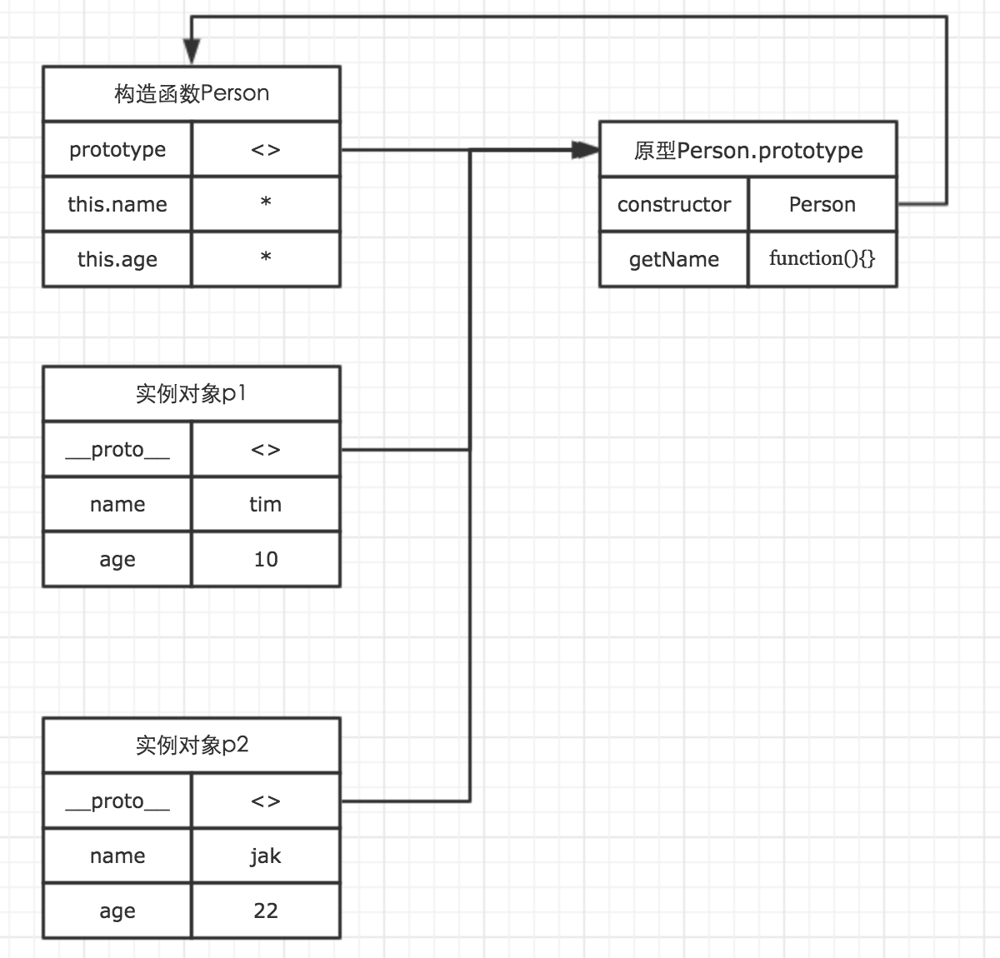
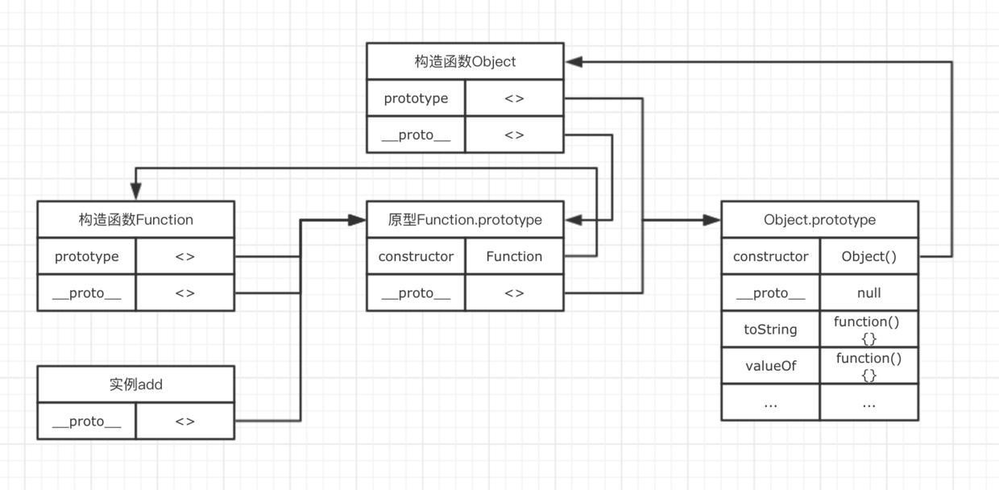
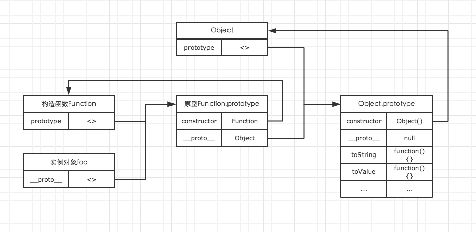

# 面向对象

## 一、对象的定义

在 ECMAScript-262 中，对象被定义为 **“无序属性的集合，其属性可以包含基本值，对象或者函数”** 。
也就是说，在 JavaScript 中，对象无非就是由一些列无序的 key-value 对组成。其中 value 可以是基本值，对象或者函数。

```javascript
// 这里的person就是一个对象
var person = {
  name: 'Tom',
  age: 18,
  getName: function () {},
  parent: {},
}
```

## 二、创建对象

### 2.1 Object 构造函数创建

```javascript
var Person = new Object()
Person.name = 'Jason'
Person.age = 21
```

### 2.2 使用对象字面量表示法来创建对象

```javascript
var Person = {} //等同于var Person =new Object();
var Person = { name: 'Jason', age: 21 }
```

对象字面量是对象定义的一种简写形式，第一种和第二种创建形式的缺点就是：**他们用同一个接口创建很多对象和，会产生大量的重复代码，如果你有 500 个对象，那么你就要输入 500 次很多相同的代码。**

### 2.3 使用工厂模式创建对象

```javascript
function createPerson(name, age, job) {
  var o = new Object()
  o.name = name
  o.age = age
  o.job = job
  o.sayName = function () {
    alert(this.name)
  }
  return o
}
var person1 = createPerson('Nike', 29, 'teacher')
var person2 = createPerson('Arvin', 20, 'student')
```

在使用工厂模式创建对象的时候，我们都可以注意到，在 createPerson 函数中，返回的是一个对象。那么我们就无法判断返回的对象究竟是一个什么样的类型。于是就出现了第四种创建对象的模式

### 2.4 使用构造函数创建对象

```javascript
function Person(name, age, job) {
  this.name = name
  this.age = age
  this.job = job
  this.sayName = function () {
    alert(this.name)
  }
}
var person1 = new Person('Nike', 29, 'teacher')
var person2 = new Person('Arvin', 20, 'student')
```

- 与普通函数相比，构造函数并没有任何特别的地方，首字母大写只是我们约定的小规定，用于区分普通函数；
- new 关键字让构造函数具有了与普通函数不同的许多特点，而 new 的过程中，执行了如下过程：
  1.  声明一个中间对象；
  2.  将该中间对象的原型指向构造函数的原型；
  3.  将构造函数的 this，指向该中间对象；
  4.  返回该中间对象，即返回实例对象。

## 三、原型

我们创建的每一个函数，都可以有一个 prototype 属性，该属性指向一个对象。这个对象，就是我们这里说的原型。
当我们在创建对象时，可以根据自己的需求，选择性的将一些属性和方法通过 prototype 属性，挂载在原型对象上。而每一个 new 出来的实例，都有一个**proto**属性，该属性指向构造函数的原型对象，通过这个属性，让实例对象也能够访问原型对象上的方法。因此，当所有的实例都能够通过**proto**访问到原型对象时，原型对象的方法与属性就变成了共有方法与属性。

## 

通过图示我们可以看出，构造函数的 prototype 与所有实例对象的**proto**都指向原型对象。而原型对象的 constructor 指向构造函数。
除此之外，还可以从图中看出，实例对象实际上对前面我们所说的中间对象的复制，而中间对象中的属性与方法都在构造函数中添加。于是根据构造函数与原型的特性，我们就可以将在构造函数中，通过 this 声明的属性与方法称为私有变量与方法，它们被当前被某一个实例对象所独有。而通过原型声明的属性与方法，我们可以称之为共有属性与方法，它们可以被所有的实例对象访问。
**当我们访问实例对象中的属性或者方法时，会优先访问实例对象自身的属性和方法。**
我们还可以通过 in 来判断，一个对象是否拥有某一个属性/方法，无论是该属性/方法存在与实例对象还是原型对象。
in 的这种特性最常用的场景之一，就是判断当前页面是否在移动端打开。

```javascript
isMobile = 'ontouchstart' in document

// 很多人喜欢用浏览器UA的方式来判断，但并不是很好的方式
```

## 四、原型链

原型对象其实也是普通的对象。几乎所有的对象都可能是原型对象，也可能是实例对象，而且还可以同时是原型对象与实例对象。这样的一个对象，正是构成原型链的一个节点。因此理解了原型，那么原型链并不是一个多么复杂的概念。
我们知道所有的函数都有一个叫做 toString 的方法。那么这个方法到底是在哪里的呢？
先随意声明一个函数：
function add() {}
那么我们可以用如下的图来表示这个函数的原型链。

其中 add 是 Function 对象的实例。而 Function 的原型对象同时又是 Object 原型的实例。这样就构成了一条原型链。原型链的访问，其实跟作用域链有很大的相似之处，他们都是一次单向的查找过程。因此实例对象能够通过原型链，访问到处于原型链上对象的所有属性与方法。这也是 foo 最终能够访问到处于 Object 原型对象上的 toString 方法的原因。
基于原型链的特性，我们可以很轻松的实现**继承**。

## 五、继承

我们常常结合构造函数与原型来创建一个对象。因为构造函数与原型的不同特性，分别解决了我们不同的困扰。因此当我们想要实现继承时，就必须得根据构造函数与原型的不同而采取不同的策略。
我们声明一个 Person 对象，该对象将作为父级，而子级 cPerson 将要继承 Person 的所有属性与方法。

```javascript
function Person(name, age) {
  this.name = name
  this.age = age
}

Person.prototype.getName = function () {
  return this.name
}
```

首先我们来看构造函数的继承。在上面我们已经理解了构造函数的本质，它其实是在 new 内部实现的一个复制过程。而我们在继承时想要的，就是想父级构造函数中的操作在子级的构造函数中重现一遍即可。我们可以通过 call 方法来达到目的。

```javascript
// 构造函数的继承
function cPerson(name, age, job) {
  Person.call(this, name, age)
  this.job = job
}
```

而原型的继承，则只需要将子级的原型对象设置为父级的一个实例，加入到原型链中即可。

```javascript
// 继承原型
cPerson.prototype = new Person(name, age)

// 添加更多方法
cPerson.prototype.getLive = function () {}
```


当然关于继承还有更好的方式。

## 六、更好的继承

假设原型链的终点 Object.prototype 为原型链的 E(end)端，原型链的起点为 S(start)端。
通过前面原型链的学习我们知道，处于 S 端的对象，可以通过 S -> E 的单向查找，访问到原型链上的所有方法与属性。因此这给继承提供了理论基础。我们只需要在 S 端添加新的对象，那么新对象就能够通过原型链访问到父级的方法与属性。因此想要实现继承，是一件非常简单的事情。
因为封装一个对象由构造函数与原型共同组成，因此继承也会分别有构造函数的继承与原型的继承。
假设我们已经封装好了一个父类对象 Person。如下。

```javascript
var Person = function (name, age) {
  this.name = name
  this.age = age
}

Person.prototype.getName = function () {
  return this.name
}

Person.prototype.getAge = function () {
  return this.age
}
```

构造函数的继承比较简单，我们可以借助 call/apply 来实现。假设我们要通过继承封装一个 Student 的子类对象。那么构造函数可以如下实现。

```javascript
var Student = function (name, age, grade) {
  // 通过call方法还原Person构造函数中的所有处理逻辑
  Student.call(Person, name, age)
  this.grade = grade
}

// 等价于
var Student = function (name, age, grade) {
  this.name = name
  this.age = age
  this.grade = grade
}
```

原型的继承则稍微需要一点思考。首先我们应该考虑，如何将子类对象的原型加入到原型链中？我们只需要让子类对象的原型，成为父类对象的一个实例，然后通过**proto**就可以访问父类对象的原型。这样就继承了父类原型中的方法与属性了。
因此我们可以先封装一个方法，该方法根据父类对象的原型创建一个实例，该实例将会作为子类对象的原型。

```javascript
function create(proto, options) {
  // 创建一个空对象
  var tmp = {}

  // 让这个新的空对象成为父类对象的实例
  tmp.__proto__ = proto

  // 传入的方法都挂载到新对象上，新的对象将作为子类对象的原型
  Object.defineProperties(tmp, options)
  return tmp
}
```

简单封装了 create 对象之后，我们就可以使用该方法来实现原型的继承了。

```javascript
Student.prototype = create(Person.prototype, {
    // 不要忘了重新指定构造函数
    constructor: {
        value: Student
    }
    getGrade: {
        value: function() {
            return this.grade
        }
    }
})
```

那么我们来验证一下我们这里实现的继承是否正确。

```javascript
var s1 = new Student('ming', 22, 5)

console.log(s1.getName()) // ming
console.log(s1.getAge()) // 22
console.log(s1.getGrade()) // 5
```

全部都能正常访问，没问题。在 ECMAScript5 中直接提供了一个 Object.create 方法来完成我们上面自己封装的 create 的功能。因此我们可以直接使用 Object.create.

```javascript
Student.prototype = create(Person.prototype, {
    // 不要忘了重新指定构造函数
    constructor: {
        value: Student
    }
    getGrade: {
        value: function() {
            return this.grade
        }
    }
})
```

完整代码如下：

```javascript
function Person(name, age) {
    this.name = name;
    this.age = age;
}
Person.prototype.getName = function() {
    return this.name
}
Person.prototype.getAge = function() {
    return this.age;
}

function Student(name, age, grade) {
    // 构造函数继承
    Person.call(this, name, age);
    this.grade = grade;
}

// 原型继承
Student.prototype = Object.create(Person.prototype, {
    // 不要忘了重新指定构造函数
    constructor: {
        value: Student
    }
    getGrade: {
        value: function() {
            return this.grade
        }
    }
})


var s1 = new Student('ming', 22, 5);

console.log(s1.getName());  // ming
console.log(s1.getAge());   // 22
console.log(s1.getGrade()); // 5
```

在 ECMAScript5 中，对每个属性都添加了几个属性类型，来描述这些属性的特点。他们分别是

- **configurable**: 表示该属性是否能被 delete 删除。当其值为 false 时，其他的特性也不能被改变。默认值为 true
- **enumerable**: 是否能枚举。也就是是否能被 for-in 遍历。默认值为 true
- **writable**: 是否能修改值。默认为 true
- **value**: 该属性的具体值是多少。默认为 undefined
- **get**: 当我们通过 person.name 访问 name 的值时，get 将被调用。该方法可以自定义返回的具体值时多少。get 默认值为 undefined
- **set**: 当我们通过 person.name = 'Jake'设置 name 的值时，set 方法将被调用。该方法可以自定义设置值的具体方式。set 默认值为 undefined
