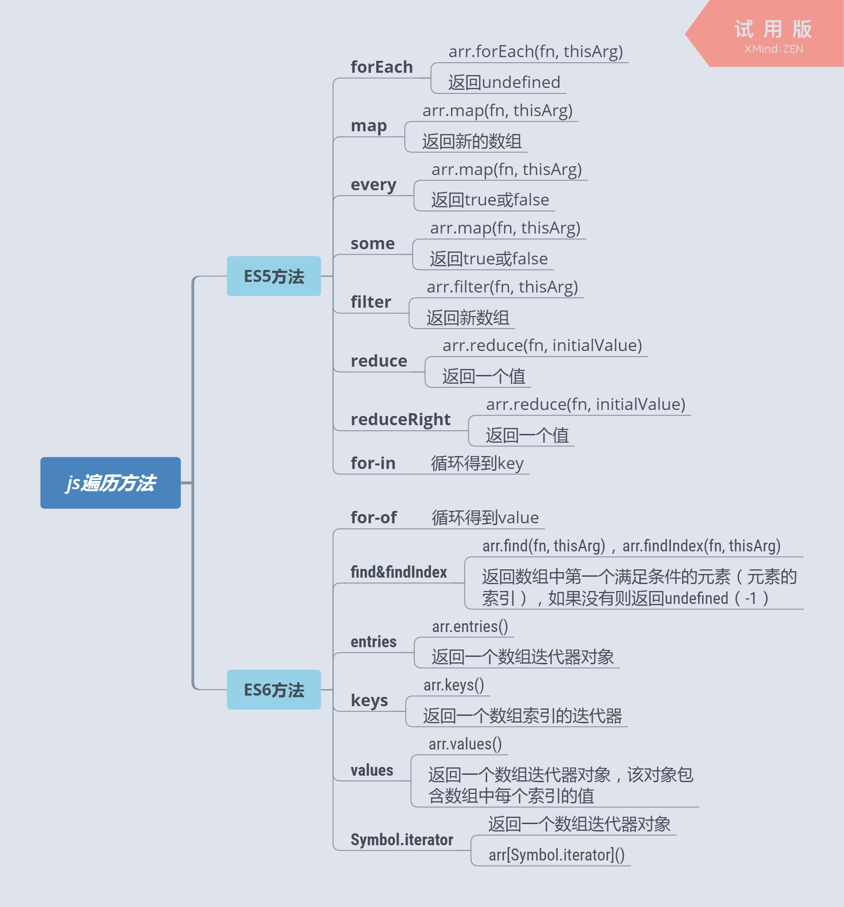

# 迭代方法



## 1. for

```javascript
for ([initialization]; [condition]; [final - expression]) statement
```

> initialization 一个表达式 (包含赋值语句) 或者变量声明。典型地被用于初始化一个计数器。该表达式可以使用 var 或 let 关键字声明新的变量，使用 var 声明的变量不是该循环的局部变量，而是与 for 循环处在同样的作用域中。用 let 声明的变量是语句的局部变量。该表达式的结果无意义。

### 1.1 无语句的 for

以下 for 循环计算 final-expression 部分中节点的偏移位置，它不需要执行一个 statement 或者一组 block statement ，因此使用了空语句。

```javascript
for (
  var oItNode = document.getElementById(sId) /* initialization */;
  oItNode /* condition */;
  nLeft += oItNode.offsetLeft,
    nTop += oItNode.offsetTop,
    oItNode = oItNode.offsetParent /* final-expression */
); /* 分号 semicolon */

console.log(
  "Offset position of '" + sId + "' element:\n left: " + nLeft + 'px;\n top: ' + nTop + 'px;',
)
```

### 1.2 循环退出

continue 用于退出本次循环，break 用于退出整个循环，这两个语句可以指定 label 从而可以退出特定的循环。

```javascript
var num = 0
outermost: for (var i = 0; i < 10; i++) {
  for (var j = 0; j < 10; j++) {
    if (i == 5 && j == 5) {
      break outermost
    }
    num++
  }
}
alert(num) //55
```

return 直接跳出整个循环。 与 return 不同的是，在多层循环中，break 不是跳出函数，而是跳出最里层的 for 循环，外面的循环和最外层 for 循环后面的语句也将继续执行。

## 2. forEach

> - arr.forEach(callback(currentValue [, index [, array]])[, thisArg])
> - return undefined

### 2.1 基础用法

- **forEach()  遍历的范围在第一次调用  callback  前就会确定。调用  forEach  后添加到数组中的项不会被  callback  访问到。**
- **forEach  不会直接改变调用它的对象，但是那个对象可能会被  callback  函数改变。**

```javascript
;[1, 2, 3, 4, 5].forEach((item) => {
  item === 1 && arr.push(6)
  console.log(item)
})
// output
// 1,2,3,4,5,6
```

- forEach 循环中 return、retrun true、return false 只能跳出本次循环，不能跳出整个循环

```javascript
;[1, 2, 3, 4, 5].forEach((item) => {
  if (item === 2) return
  console.log(item)
})
// output 1,3,4,5
```

- 不对未初始化的值进行任何操作（稀疏数组）

```javascript
const arraySparse = [1, 3, , 7]
let numCallbackRuns = 0

arraySparse.forEach(function (element) {
  console.log(element)
  numCallbackRuns++
})

console.log('numCallbackRuns: ', numCallbackRuns)

// 1
// 3
// 7
// numCallbackRuns: 3
```

- 使用 thisArg

```javascript
function Counter() {
  this.sum = 0
  this.count = 0
}
Counter.prototype.add = function (array) {
  array.forEach(function (entry) {
    this.sum += entry
    ++this.count
  }, this)
  // ^---- Note
}

const obj = new Counter()
obj.add([2, 5, 9])
obj.count
// 3 === (1 + 1 + 1)
obj.sum
// 16 === (2 + 5 + 9)
```

因为  thisArg  参数（this）传给了  forEach()，每次调用时，它都被传给  callback  函数，作为它的  this  值。

> **注意：**如果使用[箭头函数表达式](https://developer.mozilla.org/zh-CN/docs/Web/JavaScript/Reference/Functions/Arrow_functions)来传入函数参数， thisArg  参数会被忽略，因为箭头函数在词法上绑定了  [this](https://developer.mozilla.org/zh-CN/docs/Web/JavaScript/Reference/Operators/this)  值。

### 2.2 拓展

#### 2.2.1 对象复制器函数

下面的代码会创建一个给定对象的副本。   创建对象的副本有不同的方法，以下是只是一种方法，并解释了  Array.prototype.forEach()  是如何使用 ECMAScript 5 Object.\*  元属性（meta property）函数工作的。

```javascript
function copy(obj) {
  const copy = Object.create(Object.getPrototypeOf(obj))
  const propNames = Object.getOwnPropertyNames(obj)

  propNames.forEach(function (name) {
    const desc = Object.getOwnPropertyDescriptor(obj, name)
    Object.defineProperty(copy, name, desc)
  })
  return copy
}

const obj1 = { a: 1, b: 2 }
const obj2 = copy(obj1) // 现在 obj2 看起来和 obj1 一模一样了
```

#### 2.2.2 如果数组在迭代时被修改了，则其他元素会被跳过。

下面的例子会输出 "one", "two", "four"。当到达包含值 "two" 的项时，整个数组的第一个项被移除了，这导致所有剩下的项上移一个位置。因为元素 "four" 正位于在数组更前的位置，所以 "three" 会被跳过。 `**forEach()**`** 不会在迭代之前创建数组的副本。**

```javascript
var words = ['one', 'two', 'three', 'four']
words.forEach(function (word) {
  console.log(word)
  if (word === 'two') {
    words.shift()
  }
})
// one
// two
// four
```

#### 2.2.3 扁平化数组

下面的示例仅用于学习目的。如果你想使用内置方法来扁平化数组，你可以考虑使用 [Array.prototype.flat()](https://developer.mozilla.org/zh-CN/docs/Web/JavaScript/Reference/Global_Objects/Array/flat)（预计将成为 ES2019 的一部分，并且已在主要浏览器中实现）或参考其 polyfill。

```javascript
/**
 * Flattens passed array in one dimensional array
 *
 * @params {array} arr
 * @returns {array}
 */
function flatten(arr) {
  const result = []
  arr.forEach((i) => {
    if (Array.isArray(i)) result.push(...flatten(i))
    else result.push(i)
  })
  return result
}
// Usage
const problem = [1, 2, 3, [4, 5, [6, 7], 8, 9]]
flatten(problem) // [1, 2, 3, 4, 5, 6, 7, 8, 9]
```

####

#### 2.2.4 针对 promise 或 async 函数的使用备注

如果使用 promise 或 async 函数作为 `forEach()` 等类似方法的 `callback` 参数，最好对造成的执行顺序影响多加考虑，否则容易出现错误。

```javascript
let ratings = [5, 4, 5]

let sum = 0

let sumFunction = async function (a, b) {
  return a + b
}

ratings.forEach(async function (rating) {
  sum = await sumFunction(sum, rating)
})

console.log(sum)
// Expected output: 14
// Actual output: 0
```

#### 2.2.5 通过抛出异常的方式跳出整个循环

```javascript
try {
  var array = ['liy', 'yang', 'cong', 'ming']
  // 执行到第3次，结束循环
  array.forEach(function (item, index) {
    if (item == 'cong') {
      throw new Error('EndIterative')
    }
    alert(item)
  })
} catch (e) {
  if (e.message != 'EndIterative') throw e
}
// 下面的代码不影响继续执行
console.log('haha')
```

## 3. map

> var new_array = arr.map(function callback(currentValue[, index[, array]]) {
>  // Return element for new_array 
> }[, thisArg])

- callback  函数只会在有值的索引上被调用；那些从来没被赋过值或者使用  delete  删除的索引则不会被调用。

```javascript
;['1', '2', '3'].map(parseInt) // [1, NaN, NaN].
```

```javascript
// parseInt(string, radix) -> map(parseInt(value, index))
/*  first iteration (index is 0): */ parseInt('1', 0) // 1
/* second iteration (index is 1): */ parseInt('2', 1) // NaN
/*  third iteration (index is 2): */ parseInt('3', 2) // NaN
```

## 4. every

every() 方法测试一个数组内的所有元素是否都能通过某个指定函数的测试。它返回一个布尔值。
**注意：**若收到一个空数组，此方法在一切情况下都会返回 true。

every  遍历的元素范围在第一次调用  callback  之前就已确定了。在调用  every  之后添加到数组中的元素不会被  callback  访问到。
如果数组中存在的元素被更改，则他们传入  callback  的值是  every  访问到他们那一刻的值。
那些被删除的元素或从来未被赋值的元素将不会被访问到。

```javascript
Array.erery()
var a = [1, 2, 3, 4].every(function (item, i) {
  return item < 3
})
// 4 > 3 所以 a 值为 false
// 函数体内return false跳出整个循环，return true跳出本次循环，继续循环；
// every:一假即假:
// some:一真即真
```

## 5. some

> arr.some(callback(element[, index[, array]])[, thisArg])

some() 方法测试数组中是不是至少有 1 个元素通过了被提供的函数测试。它返回的是一个 Boolean 类型的值。
注意：如果用一个空数组进行测试，在任何情况下它返回的都是 false。

`some()`  遍历的元素的范围在第一次调用  `callback`. 前就已经确定了。在调用  `some()`  后被添加到数组中的值不会被  `callback`  访问到。如果数组中存在且还未被访问到的元素被  `callback`  改变了，则其传递给  `callback`  的值是  `some()`  访问到它那一刻的值。已经被删除的元素不会被访问到。

### 5.1 拓展

#### 5.1.1 将任意值转换为布尔类型

```javascript
var TRUTHY_VALUES = [true, 'true', 1]
function getBoolean(value) {
  'use strict'
  if (typeof value === 'string') {
    value = value.toLowerCase().trim()
  }
  return TRUTHY_VALUES.some(function (t) {
    return t === value
  })
}
getBoolean(false) // false
getBoolean('false') // false
getBoolean(1) // true
getBoolean('true') // true
```

## 6. filter

> var newArray = arr.filter(callback(element[, index[, array]])[, thisArg])

filter 遍历的元素范围在第一次调用 callback 之前就已经确定了。在调用 filter 之后被添加到数组中的元素不会被 filter 遍历到。如果已经存在的元素被改变了，则他们传入 callback 的值是 filter 遍历到它们那一刻的值。被删除或从来未被赋值的元素不会被遍历到。

## 7. reduce()

> arr.reduce(callback(accumulator, currentValue[, index[, array]])[, initialValue])

callback 执行数组中每个值  (如果没有提供 initialValue 则第一个值除外)的函数，包含四个参数：

- **accumulator**: 累计器累计回调的返回值; 它是上一次调用回调时返回的累积值，或 initialValue（见于下方）。
- currentValue: 数组中正在处理的元素。
- index: (可选) 数组中正在处理的当前元素的索引。 如果提供了 initialValue，则起始索引号为 0，否则从索引 1 起始。
- array: (可选) 调用 reduce()的数组 initialValue 可选作为第一次调用 callback 函数时的第一个参数的值。

如果没有提供初始值，则将使用数组中的第一个元素。 在没有初始值的空数组上调用 reduce 将报错。
**注意：**如果没有提供 initialValue，reduce 会从索引 1 的地方开始执行 callback 方法，跳过第一个索引。如果提供 initialValue，从索引 0 开始。

```javascript
;[1, 2, 3, 10, 3].reduce((k, v) => Math.max(k, v))
```

### 7.1 将二维数组转化为一维

```javascript
var flattened = [
  [0, 1],
  [2, 3],
  [4, 5],
].reduce((acc, cur) => acc.concat(cur), [])
```

### 7.2 按属性对 object 分类

```javascript
var people = [
  { name: 'Alice', age: 21 },
  { name: 'Max', age: 20 },
  { name: 'Jane', age: 20 },
]

function groupBy(objectArray, property) {
  return objectArray.reduce(function (acc, obj) {
    var key = obj[property]
    if (!acc[key]) {
      acc[key] = []
    }
    acc[key].push(obj)
    return acc
  }, {})
}

var groupedPeople = groupBy(people, 'age')
// groupedPeople is:
// {
//   20: [
//     { name: 'Max', age: 20 },
//     { name: 'Jane', age: 20 }
//   ],
//   21: [{ name: 'Alice', age: 21 }]
// }
```

### 7.3 字符串合并

```javascript
;[1, 2, 3, 4].reduce(
  (k, v, i) => ((k += `${String.fromCharCode(64 + parseInt(i + 1))}： ${v}\n`), k),
  '',
)
;('A： 1\nB： 2\nC： 3\nD： 4\n')
```

### 7.4 数组去重

```javascript
let arr = [1, 2, 1, 2, 3, 5, 4, 5, 3, 4, 4, 4, 4]
let result = arr.sort().reduce((init, current) => {
  if (init.length === 0 || init[init.length - 1] !== current) {
    init.push(current)
  }
  return init
}, [])
console.log(result) //[1,2,3,4,5]
```

### 7.5 按顺序运行 Promise

```javascript
/**
 * Runs promises from array of functions that can return promises
 * in chained manner
 *
 * @param {array} arr - promise arr
 * @return {Object} promise object
 */
function runPromiseInSequence(arr, input) {
  return arr.reduce(
    (promiseChain, currentFunction) => promiseChain.then(currentFunction),
    Promise.resolve(input),
  )
}

// promise function 1
function p1(a) {
  return new Promise((resolve, reject) => {
    resolve(a * 5)
  })
}

// promise function 2
function p2(a) {
  return new Promise((resolve, reject) => {
    resolve(a * 2)
  })
}

// function 3  - will be wrapped in a resolved promise by .then()
function f3(a) {
  return a * 3
}

// promise function 4
function p4(a) {
  return new Promise((resolve, reject) => {
    resolve(a * 4)
  })
}

const promiseArr = [p1, p2, f3, p4]
runPromiseInSequence(promiseArr, 10).then(console.log) // 1200
```

### 7. 6 使用  reduce 实现 map

```javascript
if (!Array.prototype.mapUsingReduce) {
  Array.prototype.mapUsingReduce = function (callback, thisArg) {
    return this.reduce(function (mappedArray, currentValue, index, array) {
      mappedArray[index] = callback.call(thisArg, currentValue, index, array)
      return mappedArray
    }, [])
  }
}
;[1, 2, , 3].mapUsingReduce((currentValue, index, array) => currentValue + index + array.length) // [5, 7, , 10]
```

## 8. reduceRight()

> arr.reduceRight(callback(accumulator, currentValue[, index[, array]])[, initialValue])

### 8.1 运行一个带有回调每个函数将其结果传给下一个的异步函数列表

```javascript
const waterfall =
  (...functions) =>
  (callback, ...args) =>
    functions.reduceRight(
      (composition, fn) =>
        (...results) =>
          fn(composition, ...results),
      callback,
    )(...args)
const randInt = (max) => Math.floor(Math.random() * max)
const add5 = (callback, x) => {
  setTimeout(callback, randInt(1000), x + 5)
}
const mult3 = (callback, x) => {
  setTimeout(callback, randInt(1000), x * 3)
}
const sub2 = (callback, x) => {
  setTimeout(callback, randInt(1000), x - 2)
}
const split = (callback, x) => {
  setTimeout(callback, randInt(1000), x, x)
}
const add = (callback, x, y) => {
  setTimeout(callback, randInt(1000), x + y)
}
const div4 = (callback, x) => {
  setTimeout(callback, randInt(1000), x / 4)
}
const computation = waterfall(add5, mult3, sub2, split, add, div4)
computation(console.log, 5) // -> 14
// same as:
const computation2 = (input, callback) => {
  const f6 = (x) => div4(callback, x)
  const f5 = (x, y) => add(f6, x, y)
  const f4 = (x) => split(f5, x)
  const f3 = (x) => sub2(f4, x)
  const f2 = (x) => mult3(f3, x)
  add5(f2, input)
}
```

### 8.2 定义可组合函数

组合函数的概念简单，它只是简单地结合了多个函数。它是一个从右向左流动的函数，用上一个函数的输出调用每个函数。

```javascript
/**
 * Function Composition is way in which result of one function can
 * be passed to another and so on.
 *
 * h(x) = f(g(x))
 *
 * Function execution happens right to left
 *
 * https://en.wikipedia.org/wiki/Function_composition
 */
const compose =
  (...args) =>
  (value) =>
    args.reduceRight((acc, fn) => fn(acc), value)
// Increament passed number
const inc = (n) => n + 1
// Doubles the passed value
const double = (n) => n * 2
// using composition function
console.log(compose(double, inc)(2)) // 6
// using composition function
console.log(compose(inc, double)(2)) // 5
```

## 9. for...in

`**for...in**`**语句**以任意顺序遍历一个对象的除[Symbol](https://developer.mozilla.org/en-US/docs/Web/JavaScript/Reference/Global_Objects/Symbol)以外的[可枚举](https://developer.mozilla.org/zh-CN/docs/Web/JavaScript/Enumerability_and_ownership_of_properties)属性。

### 9.1 仅迭代自身的属性

如果你只要考虑对象本身的属性，而不是它的原型，那么使用 `getOwnPropertyNames()` 或执行 `hasOwnProperty()` 来确定某属性是否是对象本身的属性（也能使用`propertyIsEnumerable`）。或者，如果你知道不会有任何外部代码干扰，您可以使用检查方法扩展内置原型。

## 10. for...of

`**for...of**`**语句**在[可迭代对象](https://developer.mozilla.org/zh-CN/docs/Web/JavaScript/Reference/Iteration_protocols)（包括  `[Array](https://developer.mozilla.org/zh-CN/docs/Web/JavaScript/Reference/Global_Objects/Array)`，`[Map](https://developer.mozilla.org/zh-CN/docs/Web/JavaScript/Reference/Global_Objects/Map)`，`[Set](https://developer.mozilla.org/zh-CN/docs/Web/JavaScript/Reference/Global_Objects/Set)`，`[String](https://developer.mozilla.org/zh-CN/docs/Web/JavaScript/Reference/Global_Objects/String)`，`[TypedArray](https://developer.mozilla.org/zh-CN/docs/Web/JavaScript/Reference/Global_Objects/TypedArray)`，[arguments](https://developer.mozilla.org/en-US/docs/Web/JavaScript/Reference/Functions_and_function_scope/arguments)  对象等等）上创建一个迭代循环，调用自定义迭代钩子，并为每个不同属性的值执行语句。

```javascript
let iterable = [10, 20, 30]
for (let value of iterable) {
  value += 1
  console.log(value)
}
// 11
// 21
// 31
;(iterable) => [10, 20, 30]

value为浅拷贝
```

### 10.2 与 for in 比较

无论是`for...in`还是`for...of`语句都是迭代一些东西。它们之间的主要区别在于它们的迭代方式。
`[for...in](https://developer.mozilla.org/zh-CN/docs/Web/JavaScript/Reference/Statements/for...in)` 语句以任意顺序迭代对象的[可枚举属性](https://developer.mozilla.org/zh-CN/docs/Web/JavaScript/Enumerability_and_ownership_of_properties)。
`for...of` 语句遍历[可迭代对象](https://developer.mozilla.org/zh-CN/docs/Web/JavaScript/Guide/Iterators_and_Generators#iterables)定义要迭代的数据。
以下示例显示了与`[Array](https://developer.mozilla.org/zh-CN/docs/Web/JavaScript/Reference/Global_Objects/Array)`一起使用时，`for...of`循环和`for...in`循环之间的区别。

```javascript
Object.prototype.objCustom = function () {}
Array.prototype.arrCustom = function () {}
let iterable = [3, 5, 7]
iterable.foo = 'hello'
for (let i in iterable) {
  console.log(i) // logs 0, 1, 2, "foo", "arrCustom", "objCustom"
}
for (let i in iterable) {
  if (iterable.hasOwnProperty(i)) {
    console.log(i) // logs 0, 1, 2, "foo"
  }
}
for (let i of iterable) {
  console.log(i) // logs 3, 5, 7
}
```

## 11. find

```
arr.find(callback[, thisArg])
```

数组中第一个满足所提供测试函数的元素的值，否则返回  `[undefined](https://developer.mozilla.org/zh-CN/docs/Web/JavaScript/Reference/Global_Objects/undefined)`。
注意 `callback `函数会为数组中的每个索引调用即从 `0 `到 `length - 1`，而不仅仅是那些被赋值的索引，这意味着对于稀疏数组来说，该方法的效率要低于那些只遍历有值的索引的方法。

如果数组中一个尚未被`callback`函数访问到的元素的值被`callback`函数所改变，那么当`callback`函数访问到它时，它的值是将是根据它在数组中的索引所访问到的当前值。被删除的元素仍旧会被访问到，但是其值已经是 undefined 了。

如果数组中一个尚未被`callback`函数访问到的元素的值被`callback`函数所改变，那么当`callback`函数访问到它时，它的值是将是根据它在数组中的索引所访问到的当前值。被删除的元素仍然会被访问到。

## 12. findIndex

它的值是将是根据它在数组中的索引所访问到的当前值。被删除的元素仍然会被访问到。

## 13. entries

## 14. keys()

`**keys() **`方法返回一个包含数组中每个索引键的`**Array Iterator**`对象。

```javascript
var arr = ['a', , 'c']
var sparseKeys = Object.keys(arr)
var denseKeys = [...arr.keys()]
console.log(sparseKeys) // ['0', '2']
console.log(denseKeys) // [0, 1, 2]
```

## 15. values()

`**values()**`  方法返回一个新的  `**Array Iterator**`  对象，该对象包含数组每个索引的值

**Array.prototype.values** 是 **Array.prototype[Symbol.iterator] **的默认实现。
Array.prototype.values === Array.prototype[Symbol.iterator]  // true

**值**: 数组迭代器中存储的是原数组的地址，而不是数组元素值。

```javascript
var arr = ['a', 'b', 'c', 'd', 'e']
var iterator = arr.values()
console.log(iterator) // Array Iterator {  }
iterator.next().value // "a"
arr[1] = 'n'
iterator.next().value //  "n"
```

如果数组中元素改变，那么迭代器的值也会改变

## 17. Symbol.iterator

**Symbol.iterator **为每一个对象定义了默认的迭代器。该迭代器可以被 `[for...of](https://developer.mozilla.org/zh-CN/docs/Web/JavaScript/Reference/Statements/for...of)` 循环使用。
当需要对一个对象进行迭代时（比如开始用于一个`for..of`循环中），它的`@@iterator`方法都会在不传参情况下被调用，返回的**迭代器**用于获取要迭代的值。

### 17.1 自定义迭代器

我们可以像下面这样创建自定义的迭代器：

```javascript
var myIterable = {}
myIterable[Symbol.iterator] = function* () {
  yield 1
  yield 2
  yield 3
}
;[...myIterable] // [1, 2, 3]
```

> 原文: <https://www.yuque.com/liuxia-1onjl/ebooks/gz39y6>
