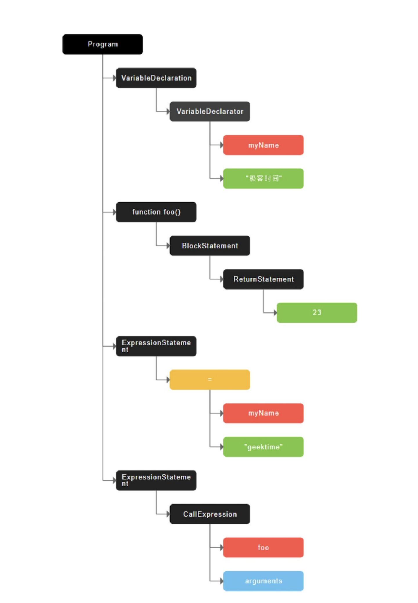

# V8 如何执行 JS 代码

## 编译器和解释器

As we all konw, 机器不能直接理解我们所写的代码，所以在执⾏程序之前，需要将我们所写的代码“翻译”成机器能读懂的机器语⾔。按语⾔的执⾏流程，可以把语⾔划分为**编译型语⾔**和**解释型**语⾔。 而对源代码的“翻译”，编译型语言如 C/C++、GO，需要借助**编译器，**解释型语言如 Python、JavaScript 则需要**解释器**。 大体流程如下：


1. 在编译型语⾔的编译过程中，编译器⾸先会依次对源代码进⾏**词法分析**、**语法分析**，⽣成**抽象语法树**（AST），然后是**优化代码**，最后再⽣成处理器能够理解的机器码。**如果编译成功，将会⽣成⼀个可执⾏的⽂件**。但如果编译过程发⽣了语法或者其他的错误，那么编译器就会抛出异常，最后的⼆进制⽂件也不会⽣成成功。

2. 在解释型语⾔的解释过程中，同样解释器也会对源代码进⾏词法分析、语法分析，并⽣成**抽象语法树（AST**），不过它会再基于抽象语法树⽣成字节码，最后再根据字节码来执⾏程序、输出结果。

## V8 执⾏ JavaScript 代码具体流程


### 1. ⽣成抽象语法树（AST）和执⾏上下⽂

假设有如下代码：

```javascript
var myName = '极客时间'
function foo() {
  return 23
}
myName = 'geektime'
foo()
```

此段代码最终生成的 AST 树为：

从图中可以看出，AST 的结构和代码的结构⾮常相似，其实你也可以把 AST 看成代码的结构化的表⽰，**解释器后续的⼯作都需要依赖于 AST，⽽不是源代码。**

> AST 是⾮常重要的⼀种数据结构，在很多项⽬中有着⼴泛的应⽤。其中最著名的⼀个项⽬是**Babel**。Babel 是⼀个被⼴泛使⽤的代码转码器，可以将 ES6 代码转为 ES5 代码，这意味着你可以现在就⽤ ES6 编写程序，⽽不⽤担⼼现有环境是否⽀持 ES6。**Babel 的⼯作原理就是先将 ES6 源码转换为 AST，然后再将 ES6 语法的 AST 转换为 ES5 语法的 AST，最后利⽤ ES5 的 AST ⽣成 JavaScript 源代码。**
>
> 除了 Babel 外，还有**ESLint**也使⽤ AST。ESLint 是⼀个⽤来检查 JavaScript 编写规范的插件，其检测流程也是需要将源码转换为 AST，然后再利⽤ AST 来检查代码规范化的问题。

那接下来我们再来看下 AST 是如何⽣成的。通常，⽣成 AST 需要经过两个阶段。

**第⼀阶段是分词（tokenize），⼜称为词法分析**。其作⽤是将⼀⾏⾏的源码拆解成⼀个个**token**。所谓**token**，指的是语法上不可能再分的、最⼩的单个字符或字符串。你可以参考下图来更好地理解什么 token。

从图中可以看出，通过 var myName = “极客时间”简单地定义了⼀个变量，其中关键字“var”、标识符“myName” 、赋值运算符“=”、字符串“极客时间”四个都是 token，⽽且它们代表的属性还不⼀样。

**第⼆阶段是解析（parse），⼜称为语法分析**，其作⽤是将上⼀步⽣成的 token 数据，根据语法规则转为 AST。如果源码符合语法规则，这⼀步就会顺利完成。但如果源码存在语法错误，这⼀步就会终⽌，并抛出⼀个“语法错误”。

这就是 AST 的⽣成过程，先分词，再解析。

有了 AST 后，那接下来 V8 就会⽣成该段代码的**执⾏上下⽂(单开细聊)**。

### 2、⽣成字节码

有了 AST 和执⾏上下⽂后，那接下来的第⼆步，解释器 Ignition 就登场了，它会根据 AST ⽣成字节码，并解释执⾏字节码。

**字节码就是介于 AST 和机器码之间的⼀种代码。但是与特定类型的机器码⽆关，字节码需要通过解释器将其转换为机器码后才能执⾏。**

从图中可以看出，机器码所占⽤的空间远远超过了字节码，所以使⽤字节码可以减少系统的内存使⽤。

### 3. 执⾏代码

⽣成字节码之后，接下来就要进⼊执⾏阶段了。

> 通常，如果有⼀段第⼀次执⾏的字节码，解释器 Ignition 会逐条解释执⾏。在执⾏字节码的过程中，如果发 现有热点代码（HotSpot），⽐如⼀段代码被重复执⾏多次，这种就称为**热点代码**，那么后台的编译器 TurboFan 就会把该段热点的字节码编译为⾼效的机器码，然后当再次执⾏这段被优化的代码时，只需要执⾏编译后的机器码就可以了，这样就⼤⼤提升了代码的执⾏效率。 此之谓**即时编译（JIT）**


###

以上。

> 参考：浏览器工作原理与实践
