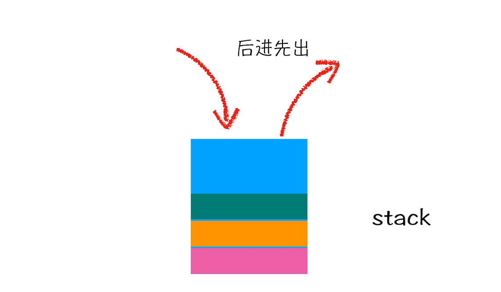
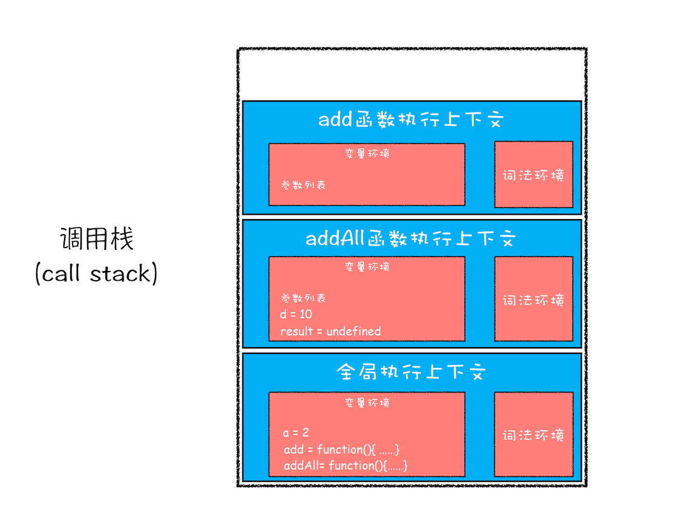
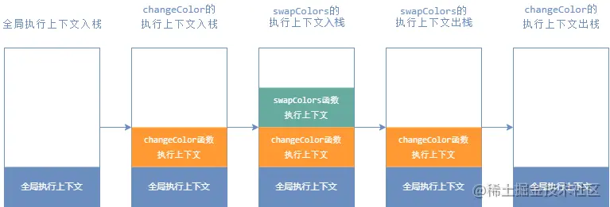
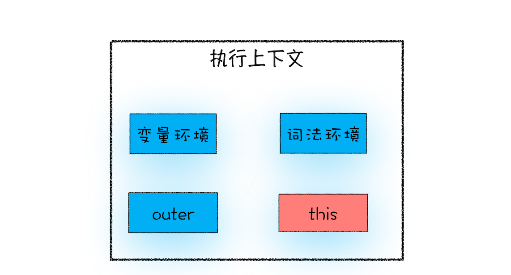
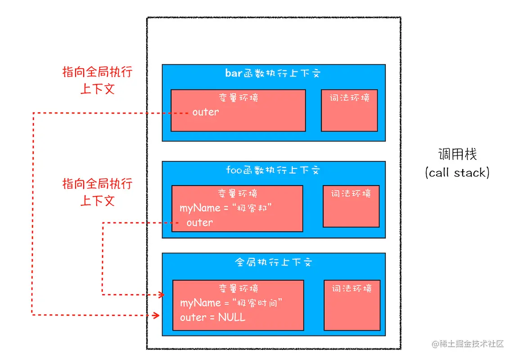
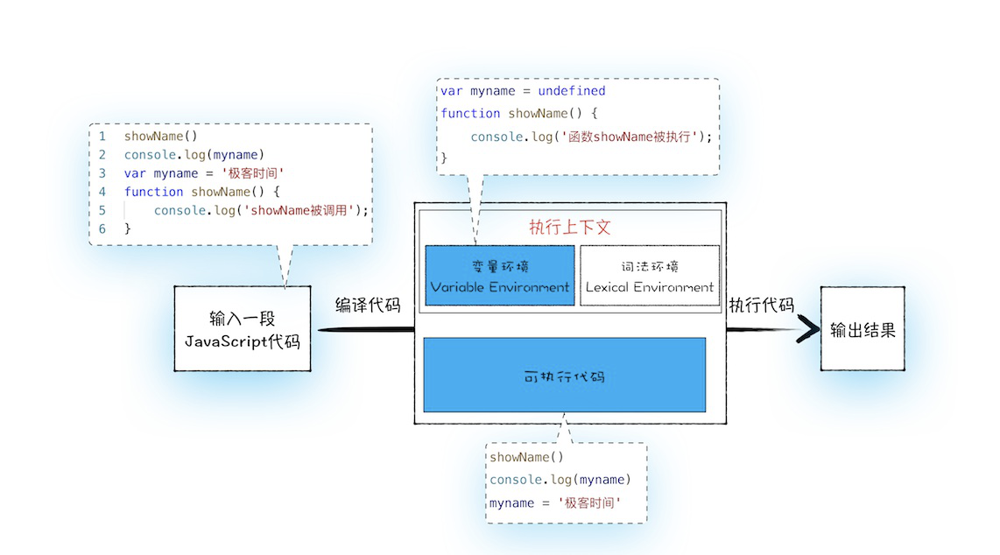
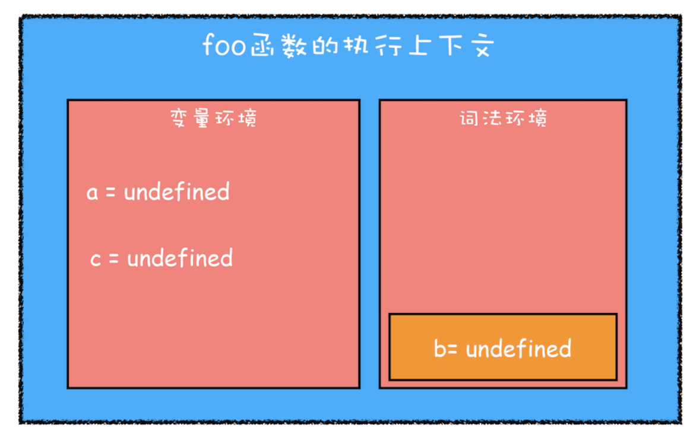
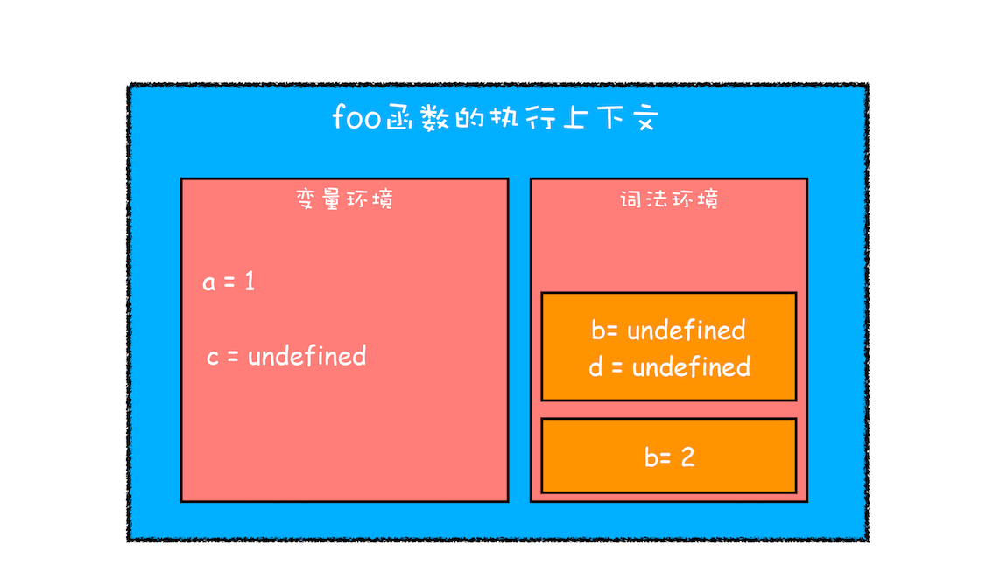
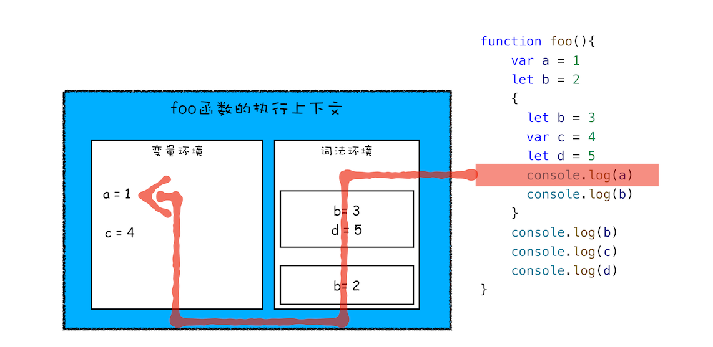

# 从执行上下文到变量提升

## 一、执行上下文栈

执行上下文栈（Execution context stack，ECS），也叫函数调用栈(call stack)，是一种拥有 LIFO（后进先出）数据结构的栈，用于存储代码执行时创建的**执行上下文。**


JS 引擎第一次执行脚本时，会创建一个全局执行上下文压到栈底，然后随着每次函数的调用都会创建一个新的执行上下文放入到栈顶中，随着函数执行完毕后被执行上下文栈顶弹出，直到回到全局的执行上下文中。



假设有如下代码

```javascript
var color = 'blue'

function changeColor() {
  var anotherColor = 'red'

  function swapColors() {
    var tempColor = anotherColor
    anotherColor = color
    color = tempColor
  }

  swapColors()
}

changeColor()

console.log(color) // red
```



执行过程：

1. 首先创建了全局执行上下文，压入执行栈，其中的可执行代码开始执行。
2. 然后调用 changeColor 函数，JS 引擎停止执行全局执行上下文，激活函数 changeColor 创建它自己的执行上下文，且把该函数上下文放入执行上下文栈顶，其中的可执行代码开始执行。
3. changeColor 调用了 swapColors 函数，此时暂停了 changeColor 的执行上下文，创建了 swapColors 函数的新执行上下文，且把该函数执行上下文放入执行上下文栈顶。
4. 当 swapColors 函数执行完后，其执行上下文从栈顶出栈，回到了 changeColor 执行上下文中继续执行。
5. changeColor 没有可执行代码，也没有再遇到其他执行上下文了，将其执行上下文从栈顶出栈，回到了 全局执行上下文 中继续执行。
6. 一旦所有代码执行完毕，JS 引擎将从当前栈中移除 全局执行上下文。

调用栈用来管理执行上下文，那么上下文是什么呢？

## 执行上下文（ES5 版）

> 执行上下文 ES3 版由 变量对象 VO（variable object）+ 作用域链（scope chain） + this 组成。 此处不再赘述，以 ES5 为准。
> ES5 由 变量环境、词法环境、outer、this 组成

- 执行上下文是 JavaScript 执行一段代码时的运行环境，比如调用一个函数，就会进入这个函数的执行上下文，确定该函数在执行期间用到的诸如 this、变量以及函数等。
- 同一个函数在不同的环境中执行，会因为访问数据的不同产生不一样的结果。

**执行上下文一般分为三种：全局、函数、以及 eval。**

1. 当 JavaScript 执行全局代码的时候，会编译全局代码并创建全局执行上下文，而且在整个页面的生存周期内，全局执行上下文只有一份。
2. 当调用一个函数的时候，函数体内的代码会被编译，并创建函数执行上下文，一般情况下，函数执行结束之后，创建的函数执行上下文会被销毁。
3. 当使用 eval 函数的时候，eval 的代码也会被编译，并创建执行上下文。

完整的执行上下文应包含如下内容，**其中『outer』是包含在变量环境与词法环境之中的。**


执行上下文在创建阶段一共做了三件事：

- 确定 this 的值，也被称为 **This Binding**
- LexicalEnvironment（词法环境） 组件被创建
- VariableEnvironment（变量环境） 组件被创建

### This Binding

ThisBinding 是和执行上下文绑定的，也就是说每个执行上下文中都有一个 this，this 的值是在执行的时候才能确认，定义的时候不能确认。

> 既然 this 在执行行确认，又在执行上下文创建阶段产生。 能否这么理解：最开始生成的只是全局上下文，之后被任务队列逐一推送到执行上下文栈之后，才生成各自函数上下文，从而确定 this 绑定。

### 词法环境：

**词法环境有两种类型 ：**

- **全局环境**：是一个没有外部环境的词法环境，其外部环境引用为 null。拥有一个全局对象（window 对象）及其关联的方法和属性（例如数组方法）以及任何用户自定义的全局变量，**this 的值指向这个全局对象**。
- **函数环境**：用户在函数中定义的变量被存储在环境记录中，包含了 arguments 对象。对外部环境的引用可以是全局环境，也可以是包含内部函数的外部函数环境。

**词法环境有两个组件 ：**

- **环境记录器** ：存储变量和函数声明的实际位置。
- **外部环境的引用（outer）** ：它指向作用域链的下一个对象，可以访问其父级词法环境（作用域）。

### 变量环境

**变量环境也是一个词法环境**，因此它具有上面定义的词法环境的所有属性。
**在 ES6 中，词法环境和 变量环境的区别在于前者用于存储函数声明和变量（ let 和 const 关键字）绑定，而后者仅用于存储变量（ var ）绑定，因此变量环境实现函数级作用域，通过词法环境在函数作用域的基础上实现块级作用域。实现 JS 中的 let、const 与 var 共存。**

> 使用 let / const 声明的全局变量，会被绑定到 Script 对象而不是 Window 对象，不能以 Window.xx 的形式使用；使用 var 声明的全局变量 11 会被绑定到 Window 对象；使用 var / let / const 声明的局部变量都会被绑定到 Local 对象。注：Script 对象、Window 对象、Local 对象三者是平行并列关系。

> 箭头函数没有自己的上下文，没有 arguments，也不存在变量提升。

假设有如下代码：

```javascript
let a = 20
const b = 30
var c

function multiply(e, f) {
  var g = 20
  return e * f * g
}

c = multiply(20, 30)
```

**遇到调用函数 multiply 时，函数执行上下文开始被创建：**

```javascript
GlobalExectionContext = {

  ThisBinding: <Global Object>,

  LexicalEnvironment: {
    EnvironmentRecord: {
      Type: "Object",
      // 标识符绑定在这里
      a: < uninitialized >,
      b: < uninitialized >,
      multiply: < func >
    }
    outer: <null>
  },

  VariableEnvironment: {
    EnvironmentRecord: {
      Type: "Object",
      // 标识符绑定在这里
      c: undefined,
    }
    outer: <null>
  }
}

FunctionExectionContext = {

  ThisBinding: <Global Object>,

  LexicalEnvironment: {
    EnvironmentRecord: {
      Type: "Declarative",
      // 标识符绑定在这里
      Arguments: {0: 20, 1: 30, length: 2},
    },
    outer: <GlobalLexicalEnvironment>
  },

  VariableEnvironment: {
    EnvironmentRecord: {
      Type: "Declarative",
      // 标识符绑定在这里
      g: undefined
    },
    outer: <GlobalLexicalEnvironment>
  }
}

```

变量提升的原因：在创建阶段，函数声明存储在环境中，而变量会被设置为 **undefined**（**在 var 的情况下**）或保持未初始化 **uninitialized**（**在 let 和 const 的情况下**）。所以这就是为什么可以在声明之前访问 var 定义的变量（尽管是 undefined ），但如果在声明之前访问 let 和 const 定义的变量就会提示引用错误的原因。这就是所谓的变量提升。下文仔细聊聊。

### outer 引用

> **outer** 是一个外部引用，用来指向外部的执行上下文，其是由词法作用域指定的

创建全局上下文的词法环境使用 **对象环境记录器** ,outer 值为 null;
创建函数上下文的词法环境时使用 **声明式环境记录器** ,outer 值为全局对象，或者为父级词法环境（作用域）

#### 

outer 线性引用就构成了整个作用域链。

> 私以为，作用域是一套规则，规定执行上下文的保存的变量范围。同样，作用域链某种程度来讲 也就是执行上下文中的（当前变量环境 + outer -> outer -> ...) 构成的逻辑链

再回头看看变量提升。

## 变量提升

假设有如下代码

```javascript
showName() // '函数showName被执行'
console.log(myname) // undefined

var myname = '极客时间'
function showName() {
  console.log('函数showName被执行')
}
```

我们都知道，JS 是按照顺序执行的。 那如上代码的执行结果当如何理解？

- 分明在『**showName**』执行时，函数『**showName**』 尚未定义，却能正常返回；
- 『**console.log(myname) **』时，『**myname**』 尚未定义，却返回 `undefined` 而不是预想的 `not defined`

这一切缘起于『**变量提升』。 **

### 声明与赋值

介绍变量提升之前，我们先通过下面这段代码，来看看什么是 JavaScript 中的**声明**和**赋值**。

```javascript
var myname = '极客时间'
```

这段代码你可以把它看成是两行代码组成的：

```javascript
var myname //声明部分
myname = '极客时间' //赋值部分
```

如下图所示：
这便是**声明和赋值**，而所谓变量提示，即是在 JS 代码执行过程中，JS 引擎把变量的**声明部分**和函数的**声明部分**提升到代码开头的“行为”。 **变量被提升后，会给变量设置默认值，这个默认值即为 undefined。**(单指 var 声明的变量)

```javascript
/*
 * 变量提升部分
 */
// 把变量 myname提升到开头，
// 同时给myname赋值为undefined
var myname = undefined
// 把函数showName提升到开头
function showName() {
  console.log('showName被调用')
}

/*
 * 可执行代码部分
 */
showName()
console.log(myname)
// 去掉var声明部分，保留赋值语句
myname = '极客时间'
```

由此机制，使得你可以在变量和函数声明之前使用它们。就好像是变量声明和函数声明在物理层面被**提升**了代码的最前面一样。但事实上，实际变量和函数声明在代码里的位置是不会改变的，而是被 JavaScript 引擎放入**执行上下文的变量环境**中。



##

## 变量提升的弊端

> 变量提升的设计其实是低劣的，或者是语言实现时的一个副作用。它允许变量不声明就可以访问，或声明在后使用在前。新手对于此则很迷惑，甚至许多使用 JS 多年老手也比较迷惑。但在 ES6 加入 let/const 后，变量 Hoisting 就不存在了。

1. **变量容易在不被察觉的情况下被覆盖掉**

```javascript
var myname = '极客时间'
function showName() {
  console.log(myname)
  if (0) {
    var myname = '极客邦'
  }
  console.log(myname)
}
showName()
```

JavaScript 会优先从当前的执行上下文中查找变量，由于变量提升，当前的执行上下文中就包含了变量 myname，而值是 undefined，所以获取到的 myname 的值就是 undefined。 这输出的结果和其他大部分支持块级作用域的语言都不一样。

2. **本应销毁的变量没有被销毁**

```javascript
function foo() {
  for (var i = 0; i < 7; i++) {}
  console.log(i)
}
foo()
```

如果你使用 C 语言或者其他的大部分语言实现类似代码，在 for 循环结束之后， i 就已经被销毁了，但是在 JavaScript 代码中，i 的值并未被销毁，所以最后打印出来的是 7。

这同样也是由变量提升而导致的，**在创建执行上下文阶段，变量 i 就已经被提升了，所以当 for 循环结束之后，变量 i 并没有被销毁。**

这依旧和其他支持块级作用域的语言表现是不一致的，所以必然会给一些人造成误解。

### ES6 是如何解决变量提升带来的缺陷

为了解决变量提升带来的这些问题，** ES6 引入了 let 和 const 关键字**，从而使 JavaScript 也能像其他语言一样拥有了块级作用域。

```javascript
function foo() {
  var a = 1
  let b = 2
  {
    let b = 3
    var c = 4
    let d = 5
    console.log(a)
    console.log(b)
  }
  console.log(b)
  console.log(c)
  console.log(d)
}
foo()
```

一步步分析上面这段代码的执行流程。

1. **第一步是编译并创建执行上下**


通过上图，我们可以得出以下结论：

- 函数内部通过 var 声明的变量，在编译阶段全都被存放到**变量环境**里面了。
- 通过 let 声明的变量，在编译阶段会被存放到**词法环境（Lexical Environment）**中。
- 在函数的作用域内部，通过 let 声明的变量并没有被存放到词法环境中。

接下来，第二步继续执行代码，当执行到代码块里面时，变量环境中 a 的值已经被设置成了 1，词法环境中 b 的值已经被设置成了 2，这时候函数的执行上下文就如下图所示：

从图中可以看出，当进入函数的作用域块时，**作用域块中通过 let 声明的变量，会被存放在词法环境的一个单独的区域中**，这个区域中的变量并不影响作用域块外面的变量，比如在作用域外面声明了变量 b ，在该作用域块内部也声明了变量 b，当执行到作用域内部时，他们都是独立的存在。

其实，**在词法环境内部，维护了一个小型栈结构**，栈底是函数最外层的变量，进入一个作用域块后，就会把该作用域块内部的变量压到栈顶；当作用域执行完成之后，该作用域的信息就会从栈顶弹出，这就是词法环境的结构。需要注意下，我这里所讲的变量是指通过 let 或 const 声明的变量。

再接下来，当执行到作用域块中的 console.log(a) 这行代码时，就需要在词法环境和变量环境中查找变量 a 的值了，具体查找方式是：沿着词法环境的栈顶向下查询，如果在词法环境中的某个块中查找到了，就直接返回给 JavaScript 引擎，如果没有查找到，那么继续在变量环境中查找。

这样一个变量查找过程就完成了，你可以参考下图：


**也就实现了 var、与 let、const 共存，函数作用域与块级作用域共存。**

## 参考

[(ES5 版)深入理解 JavaScript 执行上下文和执行栈](https://cloud.tencent.com/developer/article/1604839)
极客学院-浏览器底层原理与实践

[

](https://cloud.tencent.com/developer/article/1604839)
