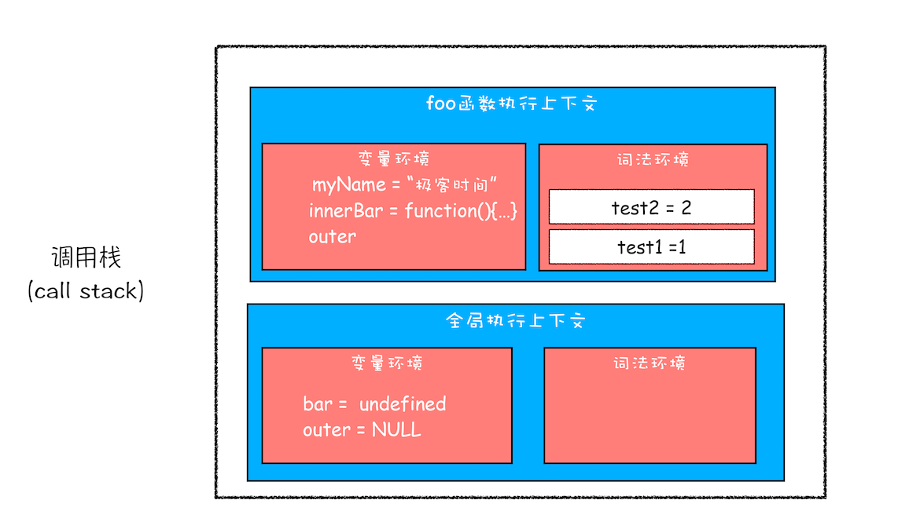
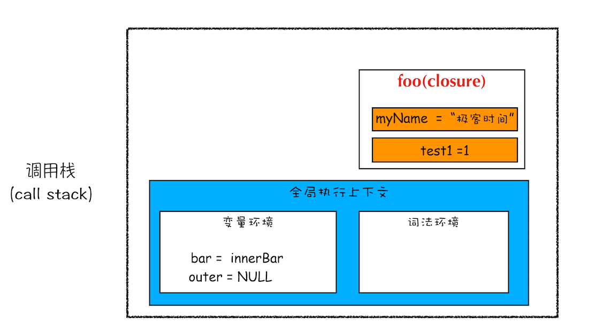

# 闭包

**讲闭包前回顾下词法作用域的两条特质：**

- 当前执行代码对变量的访问权限在定义的时候就决定了。
- **内部函数总是可以访问它们的外部函数中的变量。**

其中第二条便是闭包一切的起因。

## 概念

```javascript
function foo() {
  var myName = '极客时间'
  let test1 = 1
  const test2 = 2
  var innerBar = {
    getName: function () {
      console.log(test1)
      return myName
    },
    setName: function (newName) {
      myName = newName
    },
  }
  return innerBar
}
var bar = foo()
bar.setName('极客邦')
bar.getName()
console.log(bar.getName())
```

当执行到 foo 函数内部的 return innerBar 这行代码时调用栈的情况，参考下图：

从上面的代码可以看出，innerBar 是一个对象(注：图中有点问题：在 foo 函数执行上下文中，innerBar 不应该是一个 function，而应该是一个对象)，包含了 getName 和 setName 的两个方法（通常我们把对象内部的函数称为方法）。你可以看到，这两个方法都是在 foo 函数内部定义的，并且这两个方法内部都使用了 myName 和 test1 两个变量。

**根据词法作用域的规则，内部函数 getName 和 setName 总是可以访问它们的外部函数 foo 中的变量**，所以当 innerBar 对象返回给全局变量 bar 时，虽然 foo 函数已经执行结束，但是 getName 和 setName 函数依然可以使用 foo 函数中的变量 myName 和 test1。所以当 foo 函数执行完成之后，其整个调用栈的状态如下图所示：

从上图可以看出，foo 函数执行完成之后，其执行上下文从栈顶弹出了，但是由于返回的 setName 和 getName 方法中使用了 foo 函数内部的变量 myName 和 test1，所以这两个变量依然保存在内存中。这像极了 setName 和 getName 方法背的一个专属背包，无论在哪里调用了 setName 和 getName 方法，它们都会背着这个 foo 函数的**专属背包**。

之所以是**专属背包**，是因为除了 setName 和 getName 函数之外，其他任何地方都是无法访问该背包的，我们就可以把这个背包称为 foo 函数的**闭包**。

好了，现在我们终于可以给闭包一个正式的定义了。**在 JavaScript 中，根据词法作用域的规则，内部函数总是可以访问其外部函数中声明的变量，当通过调用一个外部函数返回一个内部函数后，即使该外部函数已经执行结束了，但是内部函数引用外部函数的变量依然保存在内存中，我们就把这些变量的集合称为闭包。比如外部函数是 foo，那么这些变量的集合就称为 foo 函数的闭包**。
那这些闭包是如何使用的呢？当执行到 bar.setName 方法中的 myName = "极客邦" 这句代码时，JavaScript 引擎会沿着 "当前执行上下文 -> foo 函数闭包 -> 全局执行上下文" 的顺序来查找 myName 变量，你可以参考下面的调用栈状态图：

执行 bar 时调用栈状态

从图中可以看出，setName 的执行上下文中没有 myName 变量，foo 函数的闭包中包含了变量 myName，所以调用 setName 时，会修改 foo 闭包中的 myName 变量的值。

同样的流程，当调用 bar.getName 的时候，所访问的变量 myName 也是位于 foo 函数闭包中的。

你也可以通过 “开发者工具” 来看看闭包的情况，打开 chrome 的 “开发者工具”，在 bar 函数任意地方打上断点，然后刷新页面，可以看到如下内容：

开发者工具中的闭包展示

从图中可以看出来，当调用 bar.getName 的时候，右边 Scope 项就体现出了作用域链的情况： Local 就是当前的 getName 函数的作用域，Closure(foo) 是指 foo 函数的闭包，最下面的 Global 就是指全局作用域，从 “Local -> Closure(foo) -> Global ” 就是一个完整的作用域链。

注：

> 当闭包函数执行结束之后，执行上下文都从栈中弹出来，只不过被内部函数引用的变量不会被垃圾回收
> 闭包是并不包含整个变量环境和词法环境,而是只是包含用到的变量。

## 应用

1. ** 模块化**

封装的一个作用就是实现模块管理，通过闭包我们可以很好地运用模块模式，隐藏一些不必要的细节，暴露一些必要的接口：

```javascript
function myModule() {
  var name = 'coolModule'
  var version = '1.0.0'

  function getInfo() {
    return 'name: ' + name + 'ver' + version
  }

  function update() {
    version += 1
    console.log('update to ' + version + 'successfully!')
  }

  return {
    getInfo: getInfo,
    update: update,
  }
}
```

myMosule 函数封装了两个私有变量以及两个私有函数，外界是访问不到的，我们通过调用 myModule 函数，返回一个持有内部函数引用的对象来操作内部数据。在运行时，返回的对象中的两个方法持有了 myModule 函数作用域的闭包。

2. **单例模式**

单例模式是一种常见的设计模式，它保证了一个类只有一个实例。实现方法一般是先判断实例是否存在，如果存在就直接返回，否则就创建了再返回。单例模式的好处就是避免了重复实例化带来的内存开销：

```javascript
// 单例模式
function Singleton() {
  this.data = 'singleton'
}

Singleton.getInstance = (function () {
  var instance

  return function () {
    if (instance) {
      return instance
    } else {
      instance = new Singleton()
      return instance
    }
  }
})()

var sa = Singleton.getInstance()
var sb = Singleton.getInstance()
console.log(sa === sb) // true
console.log(sa.data) // 'singleton'
```

**3. 柯里化**
柯里化（currying），是把接受多个参数的函数变换成接受一个单一参数（最初函数的第一个参数）的函数，并且返回接受余下的参数而且返回结果的新函数的技术。
这个概念有点抽象，实际上柯里化是高阶函数的一个用法，javascript 中常见的 bind 方法就可以用柯里化的方法来实现：

```javascript
Function.prototype.myBind = function (context = window) {
  if (typeof this !== 'function') throw new Error('Error')
  let selfFunc = this
  let args = [...arguments].slice(1)

  return function F() {
    // 因为返回了一个函数，可以 new F()，所以需要判断
    if (this instanceof F) {
      return new selfFunc(...args, arguments)
    } else {
      // bind 可以实现类似这样的代码 f.bind(obj, 1)(2)，所以需要将两边的参数拼接起来
      return selfFunc.apply(context, args.concat(arguments))
    }
  }
}
```

闭包的执行看起来像是开发者使用的一个小小的 “作弊手段” ——**绕过了作用域的监管机制，从外部也能获取到内部作用域的信息**。

####

> 原文: <https://www.yuque.com/liuxia-1onjl/ebooks/eb08nm>
