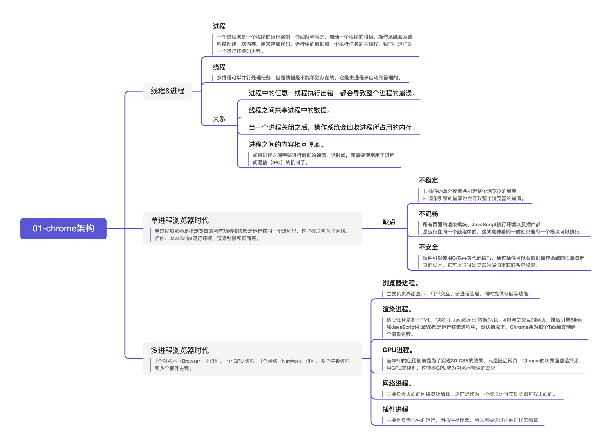
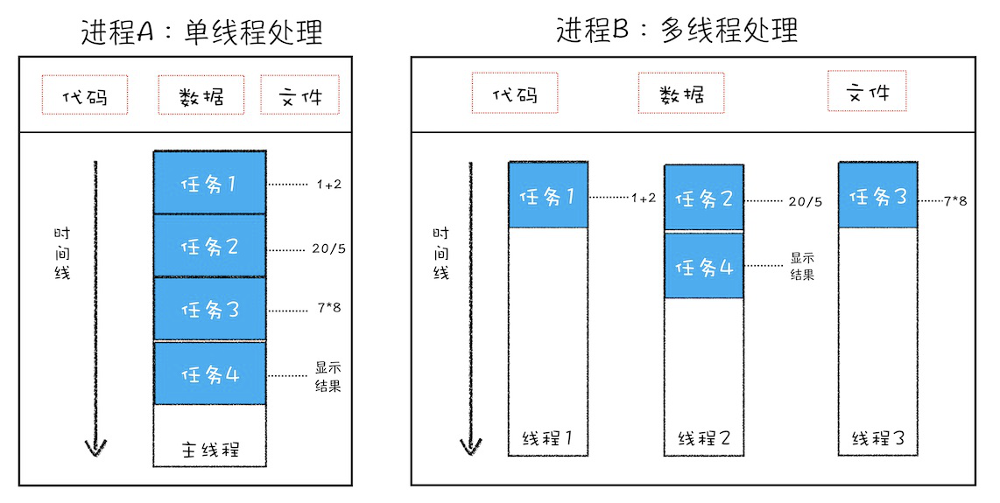
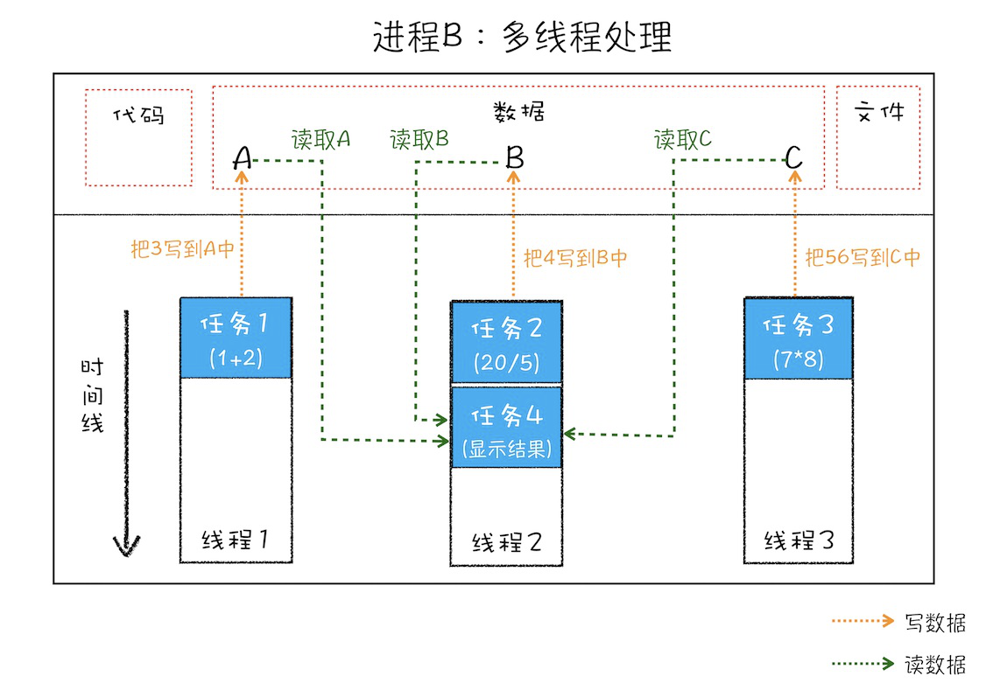
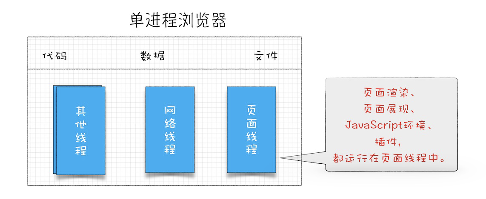
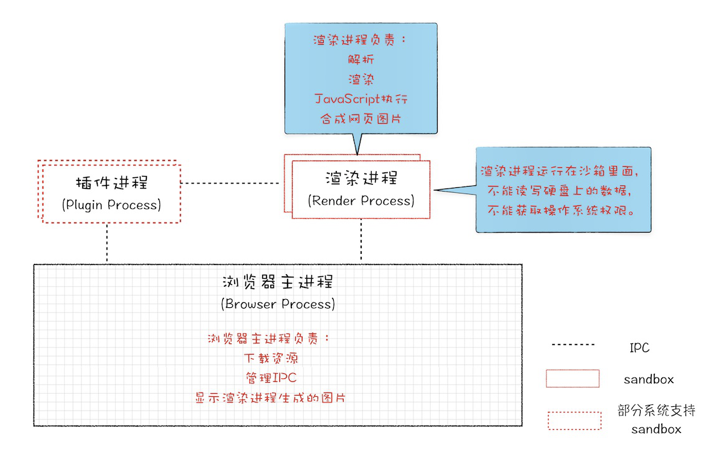
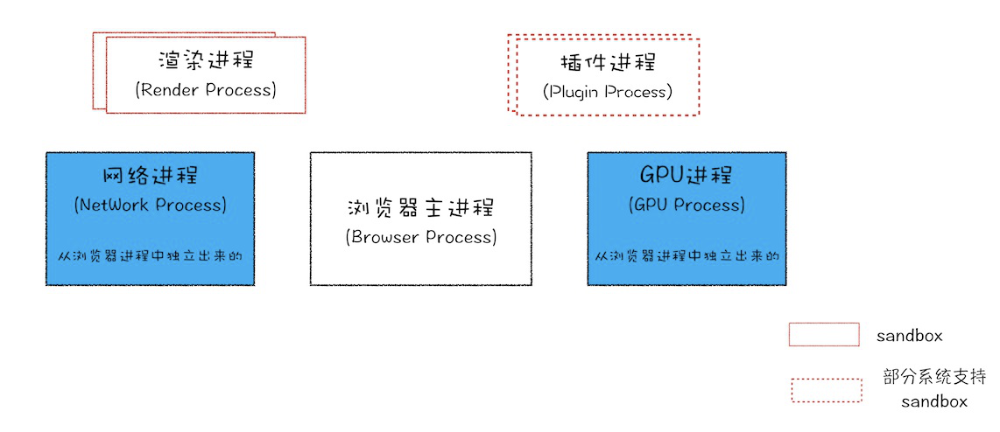
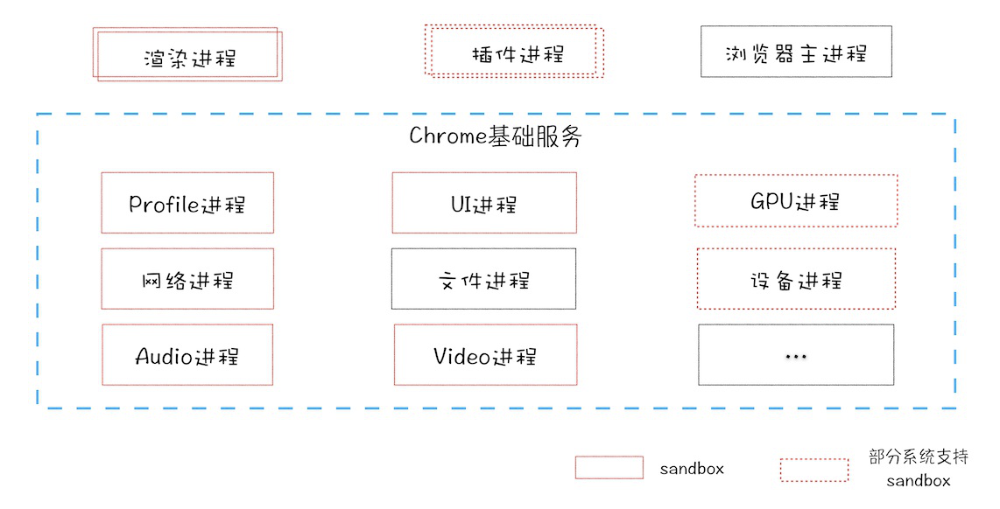
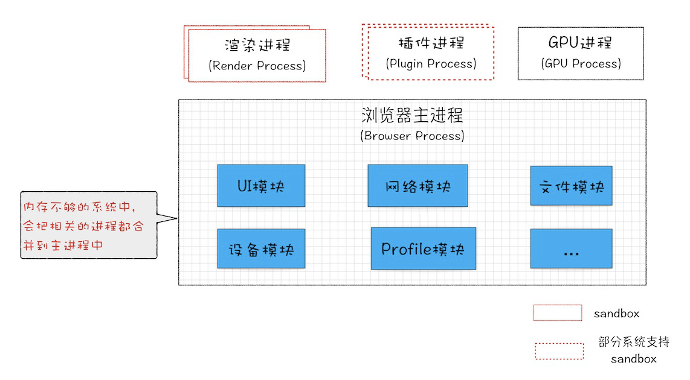

# 从 Chrome 架构到新 tab 的进程协作

# 进程和线程

## 1. 并⾏处理

计算机中的并⾏处理就是同⼀时刻处理多个任务，⽐如我们要计算下⾯这三个表达式的值，并显⽰出结果。

```javascript
A = 1 + 2
B = 20 / 5
c = 7 * 8
```

在编写代码的时候，我们可以把这个过程拆分为四个任务：

- 任务 1 是计算 A=1+2；
- 任务 2 是计算 B=20/5；
- 任务 3 是计算 C=7\*8；
- 任务 4 是显⽰最后计算的结果。

正常情况下程序可以使⽤**单线程**来处理，也就是**分四步按照顺序分别执⾏**这四个任务。

如果**采⽤多线程**，会怎么样呢？我们只需分“**两步⾛**”：

- 第⼀步，使⽤三个线程同时执⾏前三个任务；
- 第⼆步，再执⾏第四个显⽰任务。

通过对⽐分析，你会发现⽤单线程执⾏需要四步，⽽使⽤多线程只需要两步。因此，使⽤并⾏处理能⼤⼤提升性能。

## 2. 线程 VS 进程

多线程可以并⾏处理任务，但是线程是不能单独存在的，它是由进程来启动和管理的。

**那什么⼜是进程呢？**
**⼀个进程就是⼀个程序的运⾏实例**。详细解释就是，**启动⼀个程序的时候，操作系统会为该程序创建⼀块内存，⽤来存放代码、运⾏中的数据和⼀个执⾏任务的主线程**，我们把这样的⼀个运⾏环境叫进程。


单线程与多线程的进程对⽐图

从图中可以看到，线程是依附于进程的，⽽进程中使⽤多线程并⾏处理能提升运算效率。总结来说，进程和线程之间的关系有以下 4 个特点。

1.  **进程中的任意⼀线程执⾏出错，都会导致整个进程的崩溃。**

        我们可以模拟以下场景：

    把上述三个表达式稍作修改，在计算 B 的值的时候，我把表达式的分⺟改成 0，当线程执⾏到 B = 20/0 时，由于分⺟为 0，线程会执⾏出错，这样就会导致整个进程的崩溃，当然另外两个线程执⾏的结果也没有了。

2.  **线程之间共享进程中的数据。**

如下图所⽰，线程之间可以对进程的公共数据进⾏读写操作。

线程之间共享进程中的数据⽰意图

从上图可以看出，线程 1、线程 2、线程 3 分别把执⾏的结果写⼊ A、B、C 中，然后线程 2 继续从 A、B、C 中读取数据，⽤来显⽰执⾏结果。

3. **当⼀个进程关闭之后，操作系统会回收进程所占⽤的内存。**

当⼀个进程退出时，操作系统会回收该进程所申请的所有资源；即使其中任意线程因为操作不当导致内存泄漏，当进程退出时，这些内存也会被正确回收。
⽐如之前的 IE 浏览器，⽀持很多插件，⽽这些插件很容易导致内存泄漏，这意味着只要浏览器开着，内存占⽤就有可能会越来越多，但是当关闭浏览器进程时，这些内存就都会被系统回收掉。

4. **进程之间的内容相互隔离。**

进程隔离是为保护操作系统中进程互不⼲扰的技术，每⼀个进程只能访问⾃⼰占有的数据，也就避免出现进程 A 写⼊数据到进程 B 的情况。正是因为进程之间的数据是严格隔离的，所以⼀个进程如果崩溃了，或者挂起了，是不会影响到其他进程的。**如果进程之间需要进⾏数据的通信，这时候，就需要使⽤⽤于进程间通信（IPC）的机制了。**

# 单进程浏览器时代

**单进程浏览器是指浏览器的所有功能模块都是运⾏在同⼀个进程⾥**，这些模块包含了⽹络、插件、JavaScript 运⾏环境、渲染引擎和⻚⾯等。其实早在 2007 年之前，市⾯上浏览器都是单进程的。单进程浏览器的架构如下图所⽰：

单进程浏览器架构⽰意图

**如此多的功能模块运⾏在⼀个进程⾥，是导致单进程浏览器不稳定、不流畅和不安全的⼀个主要因素**。

- **问题 1：不稳定**

早期浏览器需要借助于插件来实现诸如 Web 视频、Web 游戏等各种强⼤的功能，但是插件是最容易出问
题的模块，并且还运⾏在浏览器进程之中，所以⼀个插件的意外崩溃会引起整个浏览器的崩溃。
除了插件之外，渲染引擎模块也是不稳定的，通常⼀些复杂的 JavaScript 代码就有可能引起渲染引擎模块的崩溃。和插件⼀样，渲染引擎的崩溃也会导致整个浏览器的崩溃。

- **问题 2：不流畅**

从上⾯的“单进程浏览器架构⽰意图”可以看出，**所有⻚⾯的渲染模块、JavaScript 执⾏环境以及插件都**
**是运⾏在同⼀个线程中的，这就意味着同⼀时刻只能有⼀个模块可以执⾏。**

⽐如，下⾯这个⽆限循环的脚本：

```javascript
function freeze() {
  while (1) {
    console.log('freeze')
  }
}
freeze()
```

如果让这个脚本运⾏在⼀个单进程浏览器的⻚⾯⾥，你感觉会发⽣什么？

因为这个脚本是⽆限循环的，所以当其执⾏时，它会**独占整个线程**，这样导致其他运⾏在该线程中的模块就没有机会被执⾏。因为**浏览器中所有的⻚⾯都运⾏在该线程中**，所以这些⻚⾯都没有机会去执⾏任务，
这样就会导致整个浏览器失去响应，变卡顿。

除了上述脚本或者插件会让单进程浏览器变卡顿外，**⻚⾯的内存泄漏也是单进程变慢的⼀个重要原因**。通常浏览器的内核都是⾮常复杂的，运⾏⼀个复杂点的⻚⾯再关闭⻚⾯，会存在内存不能完全回收的情况，
这样导致的问题是使⽤时间越⻓，**内存占⽤越⾼，浏览器会变得越慢。**

- **问题 3：不安全**

这⾥依然可以从插件和⻚⾯脚本两个⽅⾯来解释该原因。
**插件可以使⽤ C/C++等代码编写，通过插件可以获取到操作系统的任意资源**，当你在⻚⾯运⾏⼀个插件
时也就意味着这个插件能完全操作你的电脑。如果是个恶意插件，那么它就可以释放病毒、窃取你的账号密码， 引发安全性问题。

⾄于⻚⾯脚本，它可以通过浏览器的漏洞来获取系统权限，这些脚本获取系统权限之后也可以对你的电做⼀些恶意的事情，同样也会引发安全问题。
以上这些就是当时浏览器的特点，不稳定，不流畅，⽽且不安全。

# 多进程浏览器时代

好在现代浏览器已经解决了这些问题，是如何解决的呢？这就得聊聊我们这个“多进程浏览器时代”了。

## 早期多进程架构

你可以先看看下⾯这张图，这是 2008 年 Chrome 发布时的进程架构。

早期 Chrome 进程架构图

从图中可以看出，**Chrome 的⻚⾯是运⾏在单独的渲染进程中的，同时⻚⾯⾥的插件也是运⾏在单独的插件**
**进程之中，⽽进程之间是通过 IPC 机制进⾏通信**（如图中虚线部分）。

我们先看看如何解决不稳定的问题。**由于进程是相互隔离的，所以当⼀个⻚⾯或者插件崩溃时，影响到的仅 仅是当前的⻚⾯进程或者插件进程，并不会影响到浏览器和其他⻚⾯**，这就完美地解决了⻚⾯或者插件的崩 溃会导致整个浏览器崩溃，也就是不稳定的问题。

接下来再来看看不流畅的问题是如何解决的。**同样，JavaScript 也是运⾏在渲染进程中的，所以即使 JavaScript 阻塞了渲染进程，影响到的也只是当前的渲染⻚⾯，⽽并不会影响浏览器和其他⻚⾯**，因为其他
⻚⾯的脚本是运⾏在它们⾃⼰的渲染进程中的。所以当我们再在 Chrome 中运⾏上⾯那个死循环的脚本时， 没有响应的仅仅是当前的⻚⾯。

对于内存泄漏的解决⽅法那就更简单了，因为**当关闭⼀个⻚⾯时，整个渲染进程也会被关闭，之后该进程所 占⽤的内存都会被系统回收**，这样就轻松解决了浏览器⻚⾯的内存泄漏问题。

最后我们再来看看上⾯的两个安全问题是怎么解决的。**采⽤多进程架构的额外好处是可以使⽤安全沙箱，你 可以把沙箱看成是操作系统给进程上了⼀把锁，沙箱⾥⾯的程序可以运⾏，但是不能在你的硬盘上写⼊任何 数据，也不能在敏感位置读取任何数据，例如你的⽂档和桌⾯**。Chrome 把插件进程和渲染进程锁在沙箱⾥
⾯，这样即使在渲染进程或者插件进程⾥⾯执⾏了恶意程序，恶意程序也⽆法突破沙箱去获取系统权限。

好了，分析完早期的 Chrome 浏览器后，相信你已经了解了浏览器采⽤多进程架构的必要性。

## ⽬前多进程架构

不过 Chrome 的发展是滚滚向前的，相较之前，⽬前的架构⼜有了很多新的变化。我们先看看最新的 Chrome 进程架构，你可以参考下图：

最新的 Chrome 进程架构图

从图中可以看出，最新的 Chrome 浏览器包括：**1 个浏览器（Browser）主进程、1 个 GPU 进程、1 个⽹络**
**（NetWork）进程、多个渲染进程和多个插件进程。**

1. **浏览器进程。**

主要负责界⾯显⽰、⽤⼾交互、⼦进程管理，同时提供存储等功能。

2. **渲染进程。**
   核⼼任务是将 HTML、CSS 和 JavaScript 转换为⽤⼾可以与之交互的⽹⻚，**排版引擎 Blink 和 JavaScript 引擎 V8 都是运⾏在该进程中，默认情况下，Chrome 会为每个 Tab 标签创建⼀个渲染进程**。出于安全考虑，渲染进程都是运⾏在沙箱模式下。
3. **GPU 进程。
   **其实，Chrome 刚开始发布的时候是没有 GPU 进程的。⽽**GPU 的使⽤初衷是为了实现 3D CSS 的效果**，只是随后⽹⻚、Chrome 的 UI 界⾯都选择采⽤ GPU 来绘制，这使得 GPU 成为浏览器普遍的需求。最后，Chrome 在其多进程架构上也引⼊了 GPU 进程。
4. **⽹络进程。
   **主要负责⻚⾯的⽹络资源加载，之前是作为⼀个模块运⾏在浏览器进程⾥⾯的，直⾄最近才独⽴出来，成为⼀个单独的进程。
5. **插件进程。**
   主要是负责插件的运⾏，因插件易崩溃，所以需要通过插件进程来隔离，以保证插件进程崩溃不会对浏览器和⻚⾯造成影响。

**因此打开 1 个⻚⾯，⾄少需要 1 个⽹络进程、1 个浏览器进程、1 个 GPU 进程以及 1 个渲染进程，共 4 个；如果打开的⻚⾯有运⾏插件的话，还需要再加上 1 个插件进程。**

不过凡事都有两⾯性，虽然多进程模型提升了浏览器的稳定性、流畅性和安全性，但同样不可避免地带来了
⼀些问题：

- 更⾼的资源占⽤。因为每个进程都会包含公共基础结构的副本（如 JavaScript 运⾏环境），这就意味着浏 览器会消耗更多的内存资源。
- 更复杂的体系架构。浏览器各模块之间耦合性⾼、扩展性差等问题，会导致现在的架构已经很难适应新的 需求了。

对于上⾯这两个问题，Chrome 团队⼀直在寻求⼀种弹性⽅案，既可以解决资源占⽤⾼的问题，也可以解决复杂的体系架构的问题。

## 未来⾯向服务的架构

为了解决这些问题，在 2016 年，Chrome 官⽅团队使⽤“**⾯向服务的架构**”（Services Oriented Architecture，简称 SOA）的思想设计了新的 Chrome 架构。也就是说 Chrome 整体架构会朝向现代操作系统所采⽤的“⾯向服务的架构” ⽅向发展，原来的各种模块会被重构成独⽴的服务（Service），每个服务
（Service）都可以在独⽴的进程中运⾏，访问服务（Service）必须使⽤定义好的接⼝，通过 IPC 来通信，   从⽽构建⼀个更内聚、松耦合、易于维护和扩展的系统，更好实现 Chrome 简单、稳定、⾼速、安全的⽬标。

Chrome 最终要把 UI、数据库、⽂件、设备、⽹络等模块重构为基础服务，类似操作系统底层服务，下⾯是 Chrome“⾯向服务的架构”的进程模型图：

Chrome“⾯向服务的架构”进程模型图

⽬前 Chrome 正处在⽼的架构向服务化架构过渡阶段，这将是⼀个漫⻓的迭代过程。
Chrome 正在逐步构建 Chrome 基础服务（Chrome Foundation  Service），如果你认为 Chrome 是“便携式操作系统”，那么 Chrome 基础服务便可以被视为该操作系统的“基础”系统服务层。
同时 Chrome 还提供灵活的弹性架构，在强⼤性能设备上会以多进程的⽅式运⾏基础服务，但是如果在资源受限的设备上（如下图），Chrome 会将很多服务整合到⼀个进程中，从⽽节省内存占⽤。

在资源不⾜的设备上，将服务合并到浏览器进程中
