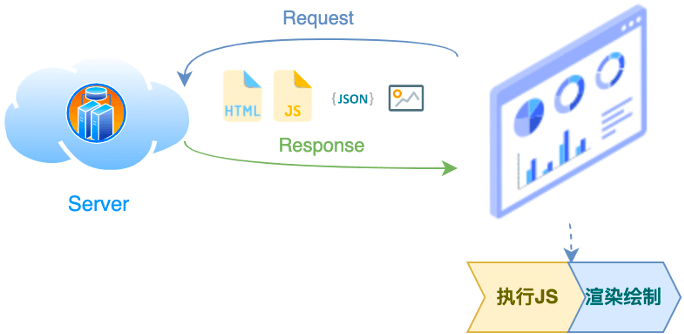

<!-- # 性能优化

## 概念

从用户**开始访问网站到整个页面完整地展现出来**的过程中，通过各种优化策略和优化方法，让页面加载的更快，让用户的操作响应更及时，给用户更好的使用体验。

现代 Web 前端框架的应用，其原理是通过浏览器向服务器发送网络请求，获取必要的 index.html 和打包好的 JS、CSS 等资源，在浏览器内执行 JS，动态获取数据并渲染页面，从而将结果呈现给用户。



在这个过程中，有**两个步骤**较为耗时，一个是**网络资源获取**，另一个是浏**览器内代码执行和 DOM 渲染**。而耗时的增加会导致页面响应慢，卡顿，影响用户体验。
针对上述两种耗时的情况，常见的优化方向有：

- **资源获取层面**
  - 减少请求次数
  - 减小请求体积
- **资源渲染层面**
  - 减小渲染压力
  - 减少回流重绘

资源获取层面我们会从

- **webpack 配置**
- **图片类型的考量**
- **缓存的原理与应用**
  几个层面展开。

资源渲染层面将从

- **C、S 两端渲染原理**
- **DOM 优化原理**
  等展开。

## 一、资源获取层面优化

事实上，**减少请求次数与体积**正是我们每天用构建工具在做的事。 而时下最主流的构建工具无疑是 webpack，所以我们来探讨下 webpack 相关配置。

### 1.1 资源压缩合并-webpack 配置

webpack 的优化配置主要有以下层面

- ~~构建速度~~
- ~~speed-measure-webpack-plugin~~
- ~~优化 resolve 配置~~
- ~~alias~~
- ~~extensions~~
- ~~externals~~
- ~~include~~~~ 和 ~~~~exclude 缩小范围~~
- ~~noParse~~
- ~~IgnorePlugin~~
- ~~thread-loader~~
- ~~babel-loader 缓存~~
- ~~cache-loader~~
- ~~cache 持久化缓存~~
- ~~优化运行时体验~~
- ~~入口点分割~~
- ~~splitChunks 分包配置~~
- ~~代码懒加载~~
- ~~prefetch 与 preload~~
- 构建结果
- webpack-bundle-analyzer
- 压缩 CSS： [optimize-css-assets-webpack-plugin](https://link.juejin.cn/?target=https%3A%2F%2Fwww.npmjs.com%2Fpackage%2Foptimize-css-assets-webpack-plugin)
- 压缩 JS: terser-webpack-plugin
- 清除无用的 CSS: purgecss-webpack-plugin
- Tree-shaking
- Scope Hoisting

#### 1. 构建结果分析

借助插件 [webpack-bundle-analyzer](https://link.juejin.cn/?target=https%3A%2F%2Fwww.npmjs.com%2Fpackage%2Fwebpack-bundle-analyzer) 我们可以直观的看到打包结果中，文件的体积大小、各模块依赖关系、文件是够重复等问题，极大的方便我们在进行项目优化的时候，进行问题诊断。

```javascript
// 1. 安装
npm i -D webpack-bundle-analyzer


// 2. 配置插件
const BundleAnalyzerPlugin = require('webpack-bundle-analyzer').BundleAnalyzerPlugin
const config = {
  // ...
  plugins:[
    // ...
    // 配置插件
    new BundleAnalyzerPlugin({
      // analyzerMode: 'disabled',  // 不启动展示打包报告的http服务器
      // generateStatsFile: true, // 是否生成stats.json文件
    })
  ],
};

// 3. 修改启动命令
"scripts": {
    // ...
    "analyzer": "cross-env NODE_ENV=prod webpack --progress --mode production"
  },
```

执行编译命令 npm run analyzer。 打包结束后，会自行启动地址为 http://127.0.0.1:8888 的 web 服务，访问地址就可以看到


#### 2. 压缩 CSS

webpack 插件`optimize-css-assets-webpack-plugin `可用于优化或者压缩 CSS 资源

```javascript

// 1. 安装 optimize-css-assets-webpack-plugin
npm install -D optimize-css-assets-webpack-plugin


// 2. 修改 webapck.config.js 配置
// ...
// 压缩css
const OptimizeCssAssetsPlugin = require('optimize-css-assets-webpack-plugin')
// ...

const config = {
  // ...
  optimization: {
    minimize: true,
    minimizer: [
      // 添加 css 压缩配置
      new OptimizeCssAssetsPlugin({}),
    ]
  },
 // ...
}

// ...

```

打包结果


#### 3. 清除无用的 CSS

[purgecss-webpack-plugin](https://link.juejin.cn/?target=https%3A%2F%2Fwww.purgecss.cn%2Fplugins%2Fwebpack.html%23%25E7%2594%25A8%25E6%25B3%2595) : 清除用不到的 CSS

```javascript
// 1. 安装插件 npm i -D purgecss-webpack-plugin

// 2. 添加配置
// ...
const PurgecssWebpackPlugin = require('purgecss-webpack-plugin')
const glob = require('glob') // 文件匹配模式
// ...

function resolve(dir) {
  return path.join(__dirname, dir)
}

const PATHS = {
  src: resolve('src'),
}

const config = {
  plugins: [
    // 配置插件
    // ...
    new PurgecssPlugin({
      paths: glob.sync(`${PATHS.src}/**/*`, { nodir: true }),
    }),
  ],
}
```

#### 4. Tree-shaking

Tree-shaking 作用是剔除没有使用的代码，以降低包的体积。webpack 默认生产环境支持。

```javascript
module.exports = {
  presets: [
    [
      '@babel/preset-env',
      {
        module: false,
        useBuiltIns: 'entry',
        corejs: '3.9.1',
        targets: {
          chrome: '58',
          ie: '11',
        },
      },
    ],
  ],
  plugins: [
    ['@babel/plugin-proposal-decorators', { legacy: true }],
    ['@babel/plugin-proposal-class-properties', { loose: true }],
  ],
}
```

#### 5. Scope Hoisting

Scope Hoisting: **「作用域提升」**"，可以让 webpack 打包出来的**「代码文件更小」**，**「运行更快」**。
在 JavaScript 中，还有“变量提升”和“函数提升”，JavaScript 会将变量和函数的声明提升到当前作用域顶部，而“作用域提升”也类似，webpack 将引入到 JS 文件“提升到”它的引入者的顶部。
首先回顾下在没有 Scope Hoisting 时用 webpack 打包下面两个文件：

```javascript
// main.js
export default 'hello leo~'

// index.js
import str from './main.js'
console.log(str)
```

使用 webpack 打包后输出文件内容如下：

```javascript
;[
  function (module, __webpack_exports__, __webpack_require__) {
    var __WEBPACK_IMPORTED_MODULE_0__main_js__ = __webpack_require__(1)
    console.log(__WEBPACK_IMPORTED_MODULE_0__main_js__['a'])
  },
  function (module, __webpack_exports__, __webpack_require__) {
    __webpack_exports__['a'] = 'hello leo~'
  },
]
```

再开启 Scope Hoisting 后，相同源码打包输出结果变为：

```javascript
;[
  function (module, __webpack_exports__, __webpack_require__) {
    var main = 'hello leo~'
    console.log(main)
  },
]
```

对比两种打包方式输出的代码，可以看出，启用 Scope Hoisting 后，函数声明变成一个， main.js 中定义的内容被直接注入到 main.js 对应模块中，这样做的好处：

- **「代码体积更小」**，因为函数申明语句会产生大量代码，导致包体积增大（模块越多越明显）；
- 代码在运行时因为创建的函数作用域更少，**「内存开销也随之变小」**。

#### 6. Gzip 压缩

compression-webpack-plugin：引入该插件后，npm run build 除了会生成压缩后的静态资源（JS、css），还会生成 gz 形式的 JS、CSS。

```javascript
const CompressionWebpackPlugin = require("compression-webpack-plugin");

plugins: [
  new CompressionPlugin({
      filename: "[path][base].gz",
      algorithm: "gzip",
      test: /\.js$|\.css$|\.html$/,
      threshold: 10240,
      minRatio: 0.8,
    }),
  ],
```

> Gzip 是高效的，压缩后通常能帮我们减少响应 70% 左右的大小。
> 但它并非万能。Gzip 并不保证针对每一个文件的压缩都会使其变小。
> Gzip 压缩背后的原理，是在一个文本文件中找出一些重复出现的字符串、临时替换它们，从而使整个文件变小。根据这个原理，文件中代码的重复率越高，那么压缩的效率就越高，使用 Gzip 的收益也就越大。反之亦然。

一般来说，Gzip 压缩是服务器的活儿：服务器了解到我们这边有一个 Gzip 压缩的需求，它会启动自己的 CPU 去为我们完成这个任务。Webpack 中 Gzip 压缩操作的存在，事实上就是为了在构建过程中去做一部分服务器的工作，为服务器分压。

### 1.2 图片优化——质量与性能的取舍

图片这块来说，与其说我们是在做“优化”，不如说我们是在做“权衡”。因为我们要做的事情，就是去压缩图片的体积（或者一开始就选取体积较小的图片格式）。但这个优化操作，是以牺牲一部分成像质量为代价的。因此我们的主要任务，是尽可能地去寻求一个质量与性能之间的平衡点。

### 1. JPG/JPEG

关键字：**有损压缩、体积小、加载快、不支持透明**

#### JPG 的优点

JPG 最大的特点是**有损压缩**。这种高效的压缩算法使它成为了一种非常轻巧的图片格式。另一方面，即使被称为“有损”压缩，JPG 的压缩方式仍然是一种高质量的压缩方式：当我们把图片体积压缩至原有体积的 50% 以下时，JPG 仍然可以保持住 60% 的品质。此外，JPG 格式以 24 位存储单个图，可以呈现多达 1600 万种颜色，足以应对大多数场景下对色彩的要求，这一点决定了它压缩前后的质量损耗并不容易被我们人类的肉眼所察觉——前提是你用对了业务场景。

#### 使用场景

JPG 适用于呈现色彩丰富的图片，在我们日常开发中，JPG 图片经常作为大的背景图、轮播图或 Banner 图出现。


使用 JPG 呈现大图，既可以保住图片的质量，又不会带来令人头疼的图片体积，是当下比较推崇的一种方案。

#### JPG 的缺陷

有损压缩在上文所展示的轮播图上确实很难露出马脚，但当它处理**矢量图形**和 **Logo** 等线条感较强、颜色对比强烈的图像时，人为压缩导致的图片模糊会相当明显。
此外，JPEG 图像**不支持透明度处理**，透明图片需要召唤 PNG 来呈现。

### 2. PNG

关键字：**无损压缩、质量高、体积大、支持透明**

PNG（可移植网络图形格式）是一种无损压缩的高保真的图片格式。
PNG 图片具有比 JPG 更强的色彩表现力，对线条的处理更加细腻，对透明度有良好的支持。它弥补了上文我们提到的 JPG 的局限性，唯一的 BUG 就是**体积太大**。

#### 应用场景

前面我们提到，复杂的、色彩层次丰富的图片，用 PNG 来处理的话，成本会比较高，我们一般会交给 JPG 去存储。
考虑到 PNG 在处理线条和颜色对比度方面的优势，我们主要用它来呈现小的 Logo、颜色简单且对比强烈的图片或背景等。
此时我们再次把目光转向性能方面堪称业界楷模的淘宝首页，我们会发现它页面上的 Logo，无论大小，还真的都是 PNG 格式：


#### SVG

关键字：**文本文件、体积小、不失真、兼容性好**
SVG（可缩放矢量图形）是一种基于 XML 语法的图像格式。它和本文提及的其它图片种类有着本质的不同：SVG 对图像的处理不是基于像素点，而是是基于对图像的形状描述。

#### SVG 的特性

和性能关系最密切的一点就是：SVG 与 PNG 和 JPG 相比，**文件体积更小，可压缩性更强**。
当然，作为矢量图，它最显著的优势还是在于**图片可无限放大而不失真**这一点上。这使得 SVG 即使是被放到视网膜屏幕上，也可以一如既往地展现出较好的成像品质——1 张 SVG 足以适配 n 种分辨率。
此外，**SVG 是文本文件**。我们既可以像写代码一样定义 SVG，把它写在 HTML 里、成为 DOM 的一部分，也可以把对图形的描述写入以 .svg 为后缀的独立文件（SVG 文件在使用上与普通图片文件无异）。这使得 SVG 文件可以被非常多的工具读取和修改，具有较强的**灵活性**。
SVG 的局限性主要有两个方面，一方面是它的渲染成本比较高，这点对性能来说是很不利的。另一方面，SVG 存在着其它图片格式所没有的学习成本（它是可编程的）。

#### SVG 的使用方式与应用场景

SVG 是文本文件，我们既可以像写代码一样定义 SVG，把它写在 HTML 里、成为 DOM 的一部分，也可以把对图形的描述写入以 .svg 为后缀的独立文件（SVG 文件在使用上与普通图片文件无异）。

- 将 SVG 写入 HTML：

```html
<!DOCTYPE html>
<html lang="en">
  <head>
    <meta charset="UTF-8" />
    <title></title>
  </head>
  <body>
    <svg xmlns="http://www.w3.org/2000/svg" width="200" height="200">
      <circle cx="50" cy="50" r="50" />
    </svg>
  </body>
</html>
```

- 将 SVG 写入独立文件后引入 HTML:

```javascript

```

#### Base64

关键字：**文本文件、依赖编码、小图标解决方案**

**Base64 是一种用于传输 8Bit 字节码的编码方式，通过对图片进行 Base64 编码，我们可以直接将编码结果写入 HTML 或者写入 CSS，从而减少 HTTP 请求的次数。**
我们来一起看一个实例，现在我有这么一个小小的放大镜 Logo：

它对应的链接如下：

```javascript

```

浏览器就会针对我们的图片链接去发起一个资源请求。
但是如果我们对这个图片进行 Base64 编码，我们会得到一个这样的字符串：

```javascript
data:image/png;base64,iVBORw0KGgoAAAANSUhEUgAAABYAAAAWCAYAAADEtGw7AAAMJGlDQ1BJQ0MgUHJvZmlsZQAASImVlwdUU8kagOeWJCQktEAEpITeBCnSpdfQpQo2QhJIKDEkBBU7uqjgWlARwYquitjWAshiw14Wwd4fiKgo62LBhsqbFNDV89477z9n7v3yzz9/mcydMwOAehxbJMpFNQDIExaI48MCmeNT05ikR4AECIAKRgEamyMRBcTFRQEoQ+9/yrubAJG9r9nLfP3c/19Fk8uTcABA4iBncCWcPMiHAMDdOCJxAQCEXqg3m1YggkyEWQJtMUwQsrmMsxTsIeMMBUfJbRLjgyCnA6BCZbPFWQCoyfJiFnKyoB+1pZAdhVyBEHIzZF8On82F/BnyqLy8qZDVrSFbZ3znJ+sfPjOGfbLZWcOsqEUuKsECiSiXPeP/nI7/LXm50qEYZrBR+eLweFnNsnnLmRopYyrk88KMmFjIWpCvC7hyexk/4UvDk5T2HziSIDhngAEASuWygyMhG0A2FebGRCn1vpmCUBZkOPdooqCAlagYi3LFU+OV/tHpPElIwhCzxfJYMptSaU5SgNLnRj6PNeSzqYifmKLIE20rFCTHQFaDfF+SkxCptHlexA+KGbIRS+NlOcP/HAOZ4tB4hQ1mnicZqgvz4gtYMUqO4rDl+ehCnlzATwxX+MEKeZLxUUN5cnnBIYq6sGKeMEmZP1YuKgiMV47dJsqNU9pjzbzcMJneFHKrpDBhaGxfAVxsinpxICqIS1TkhmtnsyPiFHFxWxAFgkAwYAIpbBlgKsgGgtbehl74S9ETCthADLIAD9grNUMjUuQ9QvhMAEXgL0g8IBkeFyjv5YFCqP8yrFU87UGmvLdQPiIHPIGcByJBLvwtlY8SDkdLBo+hRvBTdA7MNRc2Wd9POqb6kI4YQgwmhhNDiTa4Pu6Le+NR8OkPmzPugXsO5fXNnvCE0E54RLhB6CDcmSIoFv+QORNEgw6YY6iyuozvq8MtoVdXPBD3gf6hb5yB6wN7fAyMFID7wdiuUPt9rtLhir/NpdIX2ZGMkkeQ/cnWP2Ugm53v61fq1WzVXJV5ZQzPVtCw1Y9egr6bPy58R/5oiS3GDmLnsJPYBawZawBM7DjWiF3Gjsp4eG08lq+NoWjx8txyoB/BT/HYypiyWZM41jn2OH5W9oEC3vQC2ccSNFU0QyzI4hcwA+BuzWOyhByHUUxnRye4i8r2fsXW8oYh39MRxsVvuvwTAHiWQmXWNx0b7kFHngBAf/dNZ/YaLvsVABxt40jFhQodLnsQAAWowy9FDxjBvcsaVuQM3IA38AchIALEgkSQCibDOefDdSoG08AsMB+UgDKwAqwBVWAT2Ap2gj3gAGgAzeAkOAsugTZwA9yDa6UbvAB94B0YQBCEhNAQOqKHGCMWiB3ijHggvkgIEoXEI6lIOpKFCBEpMgtZgJQh5UgVsgWpRX5HjiAnkQtIO3IH6UR6kNfIJxRDqag2aohaoqNRDzQAjUQT0UloFpqPFqEL0WVoJVqD7kbr0ZPoJfQG2oG+QPsxgKliDMwEs8c8sCAsFkvDMjExNgcrxSqwGmwv1gT/6WtYB9aLfcSJOB1n4vZwvYbjSTgHz8fn4EvxKnwnXo+fxq/hnXgf/pVAIxgQ7AheBBZhPCGLMI1QQqggbCccJpyB30434R2RSGQQrYju8NtLJWYTZxKXEjcQ9xFPENuJXcR+EomkR7Ij+ZBiSWxSAamEtI60m3ScdJXUTfqgoqpirOKsEqqSpiJUKVapUNmlckzlqspTlQGyBtmC7EWOJXPJM8jLydvITeQr5G7yAEWTYkXxoSRSsinzKZWUvZQzlPuUN6qqqqaqnqrjVAWq81QrVfernlftVP1I1aLaUoOoE6lS6jLqDuoJ6h3qGxqNZknzp6XRCmjLaLW0U7SHtA9qdDUHNZYaV22uWrVavdpVtZfqZHUL9QD1yepF6hXqB9WvqPdqkDUsNYI02BpzNKo1jmjc0ujXpGs6acZq5mku1dyleUHzmRZJy1IrRIurtVBrq9YprS46RjejB9E59AX0bfQz9G5toraVNks7W7tMe492q3afjpbOGJ1knek61TpHdToYGMOSwWLkMpYzDjBuMj6NMBwRMII3YsmIvSOujnivO1LXX5enW6q7T/eG7ic9pl6IXo7eSr0GvQf6uL6t/jj9afob9c/o947UHuk9kjOydOSBkXcNUANbg3iDmQZbDS4b9BsaGYYZigzXGZ4y7DViGPkbZRutNjpm1GNMN/Y1FhivNj5u/Jypwwxg5jIrmaeZfSYGJuEmUpMtJq0mA6ZWpkmmxab7TB+YUcw8zDLNVpu1mPWZG5tHm88yrzO/a0G28LDgW6y1OGfx3tLKMsVykWWD5TMrXSuWVZFVndV9a5q1n3W+dY31dRuijYdNjs0GmzZb1NbVlm9bbXvFDrVzsxPYbbBrH0UY5TlKOKpm1C17qn2AfaF9nX2nA8MhyqHYocHh5Wjz0WmjV44+N/qro6tjruM2x3tOWk4RTsVOTU6vnW2dOc7VztddaC6hLnNdGl1ejbEbwxuzccxtV7prtOsi1xbXL27ubmK3vW497ubu6e7r3W95aHvEeSz1OO9J8Az0nOvZ7PnRy82rwOuA19/e9t453ru8n421Gssbu21sl4+pD9tni0+HL9M33Xezb4efiR/br8bvkb+ZP9d/u//TAJuA7IDdAS8DHQPFgYcD3wd5Bc0OOhGMBYcFlwa3hmiFJIVUhTwMNQ3NCq0L7QtzDZsZdiKcEB4ZvjL8FsuQxWHVsvoi3CNmR5yOpEYmRFZFPoqyjRJHNUWj0RHRq6Lvx1jECGMaYkEsK3ZV7IM4q7j8uD/GEcfFjase9yTeKX5W/LkEesKUhF0J7xIDE5cn3kuyTpImtSSrJ09Mrk1+nxKcUp7SMX70+NnjL6XqpwpSG9NIaclp29P6J4RMWDOhe6LrxJKJNydZTZo+6cJk/cm5k49OUZ/CnnIwnZCekr4r/TM7ll3D7s9gZazP6OMEcdZyXnD9uau5PTwfXjnvaaZPZnnmsyyfrFVZPXw/fgW/VxAkqBK8yg7P3pT9Pic2Z0fOYG5K7r48lbz0vCNCLWGO8PRUo6nTp7aL7EQloo58r/w1+X3iSPF2CSKZJGks0IaH7MtSa+kv0s5C38Lqwg/TkqcdnK45XTj98gzbGUtmPC0KLfptJj6TM7Nllsms+bM6ZwfM3jIHmZMxp2Wu2dyFc7vnhc3bOZ8yP2f+n8WOxeXFbxekLGhaaLhw3sKuX8J+qStRKxGX3FrkvWjTYnyxYHHrEpcl65Z8LeWWXixzLKso+7yUs/Tir06/Vv46uCxzWetyt+UbVxBXCFfcXOm3cme5ZnlRedeq6FX1q5mrS1e/XTNlzYWKMRWb1lLWStd2VEZVNq4zX7di3ecqftWN6sDqfesN1i9Z/34Dd8PVjf4b924y3FS26dNmwebbW8K21NdY1lRsJW4t3PpkW/K2c795/Fa7XX972fYvO4Q7OnbG7zxd615bu8tg1/I6tE5a17N74u62PcF7Gvfa792yj7GvbD/YL93//Pf0328eiDzQctDj4N5DFofWH6YfLq1H6mfU9zXwGzoaUxvbj0QcaWnybjr8h8MfO5pNmquP6hxdfoxybOGxweNFx/tPiE70nsw62dUypeXeqfGnrp8ed7r1TOSZ82dDz546F3Du+Hmf880XvC4cuehxseGS26X6y66XD//p+ufhVrfW+ivuVxrbPNua2se2H7vqd/XkteBrZ6+zrl+6EXOj/WbSzdu3Jt7quM29/exO7p1XdwvvDtybd59wv/SBxoOKhwYPa/5l8699HW4dRzuDOy8/Snh0r4vT9eKx5PHn7oVPaE8qnho/rX3m/Ky5J7Sn7fmE590vRC8Gekv+0vxr/Uvrl4f+9v/7ct/4vu5X4leDr5e+0Xuz4+2Yty39cf0P3+W9G3hf+kHvw86PHh/PfUr59HRg2mfS58ovNl+avkZ+vT+YNzgoYovZ8qMABhuamQnA6x0A0FLh2aENAMoExd1MLojiPikn8J9YcX+TixsAO/wBSJoHQBQ8o2yEzQIyFb5lR/BEf4C6uAw3pUgyXZwVvqjwxkL4MDj4xhAAUhMAX8SDgwMbBge/bIPJ3gHgRL7iTigT2R10s4OM2rpfgh/l34RUcT2MnhaNAAAB90lEQVQ4Ee1Tv0tbURQ+5yVqFVHs4pBioSAp1mAxUdq05sfoKrh072QXN6HdnMTVyboLShH8D+xLg8UkhjY/tJlERIQilCpKfbmn3w08eOTdl83Nu5x7z/m+737vnHeJHtZ9d4CDLhARK1esfSChWWF6TSQnRLwnSq2mp2OnQTw3bxS2D349I77bAijuAt0oJNfEtJiKj392c6ZotSfhFJfdfUE+jn1eWZwe6HL6Q0yjqHyE6zALr+eK9bl2rvfsc2wXKwskvAZQbibxYsYL1nu7UJ1H2BKiq+bfsaFslp12jD4bHHPLCdwumQi4bBuiP+Gov3vwaMqEMQqz6EER9fHjwyASMGVdU6KeB2F8jjH9cw2+sS5Hg0jodUTXRNFlEMYvzPyjBVa0YCLZpcoE2pBBTYmokgmjcz5hZl7RJEz/vV2oLDcajR6XvHdYT0qTdzQPfd7s9D/7/gotYhdqn/Chy3ovQrfMVMUwh3HpE51rLaGqw+FMNhH97aa80SisAblC9R1EN/AYej0EpGgXpARyEbzKY4i/NYkHCmux/f3GgBP6l8EjiVp40nD8/c3k2Mm3Uu2pUvIVkBEt3vVIpV/FYhea466Owi7IFPPl40jTcfKojaBNB6mp8Wkvzjc8b7HTPvkyehYKh5NwXGbiP52wD7X76cB/EiWtaCMHwyUAAAAASUVORK5CYII=
```

字符串比较长，我们可以直接用这个字符串替换掉上文中的链接地址。你会发现浏览器原来是可以理解这个字符串的，它自动就将这个字符串解码为了一个图片，而不需再去发送 HTTP 请求。

#### Base64 的应用场景

Base64 编码后，图片大小会膨胀为**原文件的 4/3**（这是由 Base64 的编码原理决定的）。如果我们把大图也编码到 HTML 或 CSS 文件中，后者的体积会明显增加，即便我们减少了 HTTP 请求，也无法弥补这庞大的体积带来的性能开销，得不偿失。
在传输非常小的图片的时候，Base64 带来的文件体积膨胀、以及浏览器解析 Base64 的时间开销，与它节省掉的 HTTP 请求开销相比，可以忽略不计，这时候才能真正体现出它在性能方面的优势。
因此，Base64 并非万全之策，我们往往在一张图片满足以下条件时会对它应用 Base64 编码：

- 图片的更新频率非常低（不需我们重复编码和修改文件内容，维护成本较低）
- 图片的实际尺寸很小.

#### WebP

关键字：**年轻的全能型选手**
WebP 是各类图片格式中最年轻的一位，它于 2010 年被提出， 是 Google 专为 Web 开发的一种**旨在加快图片加载速度**的图片格式，它支持有损压缩和无损压缩。

#### WebP 的优点

WebP 像 JPEG 一样对细节丰富的图片信手拈来，像 PNG 一样支持透明，像 GIF 一样可以显示动态图片——它集多种图片文件格式的优点于一身。
WebP 的官方介绍对这一点有着更权威的阐述：

> 与 PNG 相比，WebP 无损图像的尺寸缩小了 26％。在等效的 SSIM 质量指数下，WebP 有损图像比同类 JPEG 图像小 25-34％。 无损 WebP 支持透明度（也称为 alpha 通道），仅需 22％ 的额外字节。对于有损 RGB 压缩可接受的情况，有损 WebP 也支持透明度，与 PNG 相比，通常提供 3 倍的文件大小。


降级方案：
目前真正把 WebP 格式落地到网页中的网站并不是很多，这其中淘宝首页对 WebP 兼容性问题的处理方式就非常有趣。我们可以打开 Chrome 的开发者工具搜索其源码里的 WebP 关键字：


这个图片应该至少存在 jpg 和 webp 两种格式，程序会根据浏览器的型号、以及该型号是否支持 WebP 这些信息来决定当前浏览器显示的是 .webp 后缀还是 .jpg 后缀。

```javascript
function isSupportWebp(cb) {
  let img = new Image()
  img.src = webpPath
  img.onload = function () {
    cb(true)
  }
  img.onerror = function () {
    //浏览器不支持该图片格式时会触发
    cb(false)
  }
}
```

### AVIF

### [https://zhuanlan.zhihu.com/p/355256489](https://zhuanlan.zhihu.com/p/355256489)

### [https://www.zhangxinxu.com/wordpress/2020/04/avif-image-format/](https://www.zhangxinxu.com/wordpress/2020/04/avif-image-format/)

### 缓存

- 浏览器缓存
- 本地缓存

#### 浏览器缓存

缓存可以减少网络 IO 消耗，提高访问速度。浏览器缓存是一种操作简单、效果显著的前端性能优化手段。对于这个操作的必要性，Chrome 官方给出的解释似乎更有说服力一些：

> 通过网络获取内容既速度缓慢又开销巨大。较大的响应需要在客户端与服务器之间进行多次往返通信，这会延迟浏览器获得和处理内容的时间，还会增加访问者的流量费用。因此，缓存并重复利用之前获取的资源的能力成为性能优化的一个关键方面。

#### 1、基本原理

- 1）浏览器在加载资源时，根据请求头的 expires 和 cache-control 判断是否命中强缓存，是则直接从缓存读取资源，不会发请求到服务器。
- 2）如果没有命中强缓存，浏览器一定会发送一个请求到服务器，通过 last-modified 和 etag 验证资源是否命中协商缓存，如果命中，服务器会将这个请求返回，但是不会返回这个资源的数据，依然是从缓存中读取资源
- 3）如果前面两者都没有命中，直接从服务器加载资源

#### 2、相同点

如果命中，都是从客户端缓存中加载资源，而不是从服务器加载资源数据；

#### 3、不同点

强缓存不发请求到服务器，协商缓存会发请求到服务器。 -->
