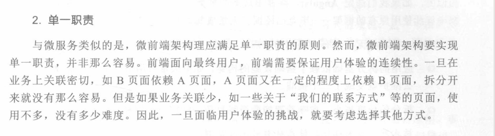
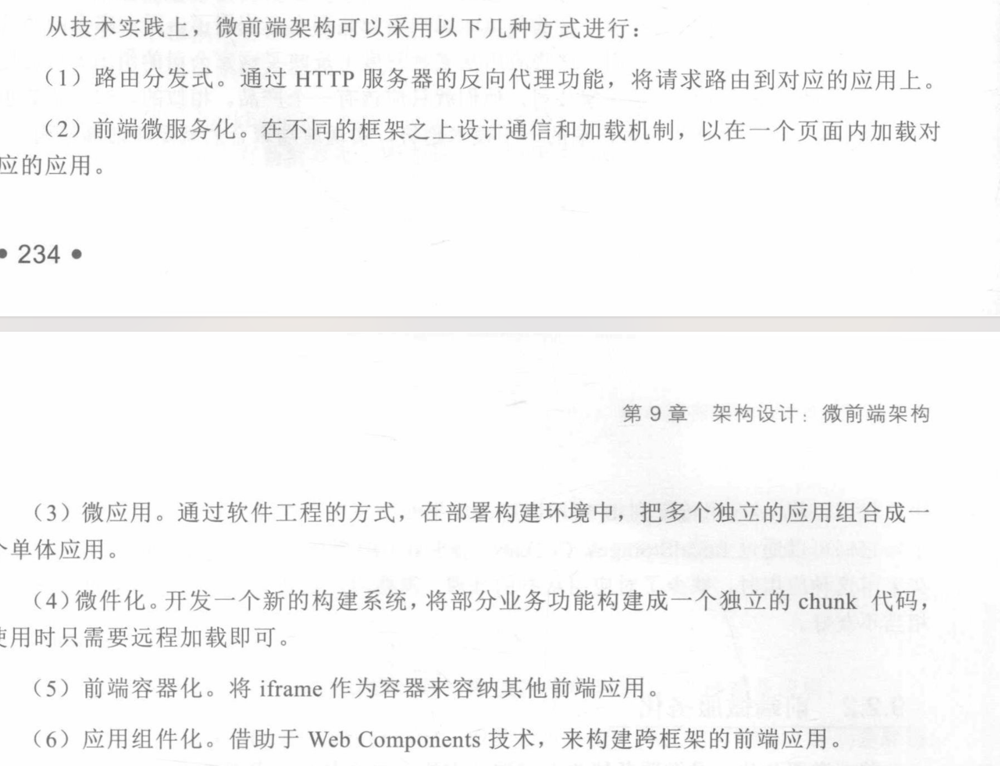
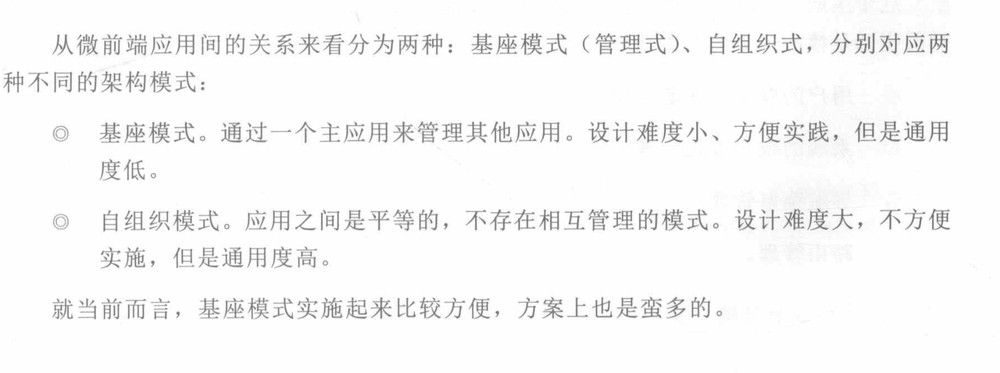
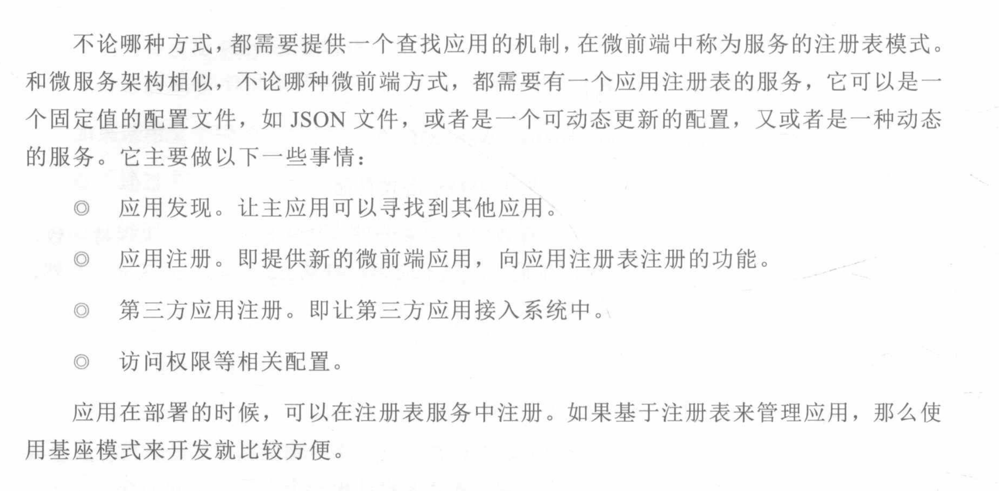

# 微前端

目标是平台聚合。

## 特点

- 应用自治
- 单一职责
- 技术栈无关

https://woai3c.github.io/introduction-to-front-end-engineering/02.html#git

- https://mp.weixin.qq.com/s/0YEcsVx0cpABnIH92iF4_A

## 概述

而微前端指的是一个 html 页面上，需要同时展示多个前端应用，天然就是聚合的，需要有一个主应用来管理这些子应用，负责将他们放在对应的地方。

看了 What are Micro Frontends 这篇文章，我感觉提到的微前端更像是一个端到端的技术：每个技术团队独立负责各自功能的后端和前端工作，最后组成应用；而不是现在传统的后端负责数据和逻辑、前端负责 UI 的分工。

那么，什么场景下会出现一个 HTML 页面上，会展示多个前端应用呢？微前端让我们可以根据业务本身的内在边界来分割子应用，实现解耦和独立演进。下面是一些也许可以使用微前端的应用场景

https://www.shymean.com/article/%E5%88%9D%E8%AF%86%E5%BE%AE%E5%89%8D%E7%AB%AF
https://zhuanlan.zhihu.com/p/391248835

微前端的核心在于资源加载与渲染，只要能够实现一种元素隔离的功能并且路由符合要求，子应用理论上不需要修改代码就可以嵌入另外一个页面渲染，

类 WebComponent + HTML Entry。
HTML Entry：是指设置 html 作为资源入口，通过加载远程 html，解析其 DOM 结构从而获取 js、css 等静态资源来实现微前端的渲染，这也是 qiankun 目前采用的渲染方案。

WebComponent：web 原生组件，它有两个核心组成部分：CustomElement 和 ShadowDom。CustomElement 用于创建自定义标签，ShadowDom 用于创建阴影 DOM，阴影 DOM 具有天然的样式隔离和元素隔离属性。由于 WebComponent 是原生组件，它可以在任何框架中使用，理论上是实现微前端最优的方案。但 WebComponent 有一个无法解决的问题 - ShadowDom 的兼容性非常不好，一些前端框架在 ShadowDom 环境下无法正常运行，尤其是 react 框架。

类 WebComponent：就是使用 CustomElement 结合自定义的 ShadowDom 实现 WebComponent 基本一致的功能。

MicroApp 的核心功能在 CustomElement 基础上进行构建，CustomElement 用于创建自定义标签，并提供了元素的渲染、卸载、属性修改等钩子函数，我们通过钩子函数获知微应用的渲染时机，并将自定义标签作为容器，微应用的所有元素和样式作用域都无法逃离容器边界，从而形成一个封闭的环境。
