<!-- # 微前端

目标是平台聚合。

## 特点

- 应用自治
- 单一职责
- 技术栈无关

https://woai3c.github.io/introduction-to-front-end-engineering/02.html#git

- https://mp.weixin.qq.com/s/0YEcsVx0cpABnIH92iF4_A


## 概述

而微前端指的是一个 html 页面上，需要同时展示多个前端应用，天然就是聚合的，需要有一个主应用来管理这些子应用，负责将他们放在对应的地方。

看了 What are Micro Frontends 这篇文章，我感觉提到的微前端更像是一个端到端的技术：每个技术团队独立负责各自功能的后端和前端工作，最后组成应用；而不是现在传统的后端负责数据和逻辑、前端负责 UI 的分工。

那么，什么场景下会出现一个 HTML 页面上，会展示多个前端应用呢？微前端让我们可以根据业务本身的内在边界来分割子应用，实现解耦和独立演进。下面是一些也许可以使用微前端的应用场景

https://www.shymean.com/article/%E5%88%9D%E8%AF%86%E5%BE%AE%E5%89%8D%E7%AB%AF
https://zhuanlan.zhihu.com/p/391248835

微前端的核心在于资源加载与渲染，只要能够实现一种元素隔离的功能并且路由符合要求，子应用理论上不需要修改代码就可以嵌入另外一个页面渲染，

类 WebComponent + HTML Entry。
HTML Entry：是指设置 html 作为资源入口，通过加载远程 html，解析其 DOM 结构从而获取 js、css 等静态资源来实现微前端的渲染，这也是 qiankun 目前采用的渲染方案。

WebComponent：web 原生组件，它有两个核心组成部分：CustomElement 和 ShadowDom。CustomElement 用于创建自定义标签，ShadowDom 用于创建阴影 DOM，阴影 DOM 具有天然的样式隔离和元素隔离属性。由于 WebComponent 是原生组件，它可以在任何框架中使用，理论上是实现微前端最优的方案。但 WebComponent 有一个无法解决的问题 - ShadowDom 的兼容性非常不好，一些前端框架在 ShadowDom 环境下无法正常运行，尤其是 react 框架。

类 WebComponent：就是使用 CustomElement 结合自定义的 ShadowDom 实现 WebComponent 基本一致的功能。

MicroApp 的核心功能在 CustomElement 基础上进行构建，CustomElement 用于创建自定义标签，并提供了元素的渲染、卸载、属性修改等钩子函数，我们通过钩子函数获知微应用的渲染时机，并将自定义标签作为容器，微应用的所有元素和样式作用域都无法逃离容器边界，从而形成一个封闭的环境。


## 集成需考虑的问题

- 样式隔离
- 资源加载
- 应用通信
- 应用更新
- 应用卸载
- 应用生命周期
- 依赖共享？


## 拆分原则

在拆分时，希望不同应用之间的交互最小为原则，最大程度解耦，以方便不同应用之间的通信，否则导致应用难以测试、问题难以定 位。

按照业务划分，相同的业务拆分到同一个微应用中。

按照权限划分，根据用户的权限，不同用户使用使用的功能划分到一起。

按照后台微服务划分，有的团队，后台使用微服务架构，可考虑按照微服务划分。
 -->
<!--
# 微前端

微前端背后的想法是将网站或网络应用程序视为独立团队拥有的功能的组合。每个团队都有其关心和擅长的不同业务或任务领域。团队是跨职能的，并从数据库到用户界面端到端地开发其功能。

## 简介

> 微前端是一种由独立交付的多个前端应用组成整体的**架构风格**，将前端应用分解成一些更小、更简单的能够独立开发、测试、部署的应用，而在用户看来仍然是内聚的单个产品。

需要注意的是：

1. 微前端不是一门具体的技术，而是整合了技术、策略和方法，可能会以脚手架、配套工具和规范约束等等成体系的形式综合呈现，是一种宏观上的**架构**。这种架构目前有多种方案，各有利弊。

- 微前端本身并没有技术栈的约束（但技术栈无关不是微前端的必然要求）。

- 微前端要求各个应用能独立开发、测试、部署，但并不要求各个应用能独立运行。也就是说，微前端的粒度不一定是应用级的，也有可能是页面级，甚至组件级。

目的上是聚合，但实现上可以是分而治之。 应用自治，但业务形态高度统一，能减小获客以及使用客户使用的心智成本（高度相似的交互与 UI 风格）。

## 发展

“微前端（Micro Frontends）”这个概念由 `thoughtworks` 于 2016 年 11 月在 [TECHNOLOGY RADAR](https://www.thoughtworks.com/radar/techniques/micro-frontends) 文章中率先提出。

如果再往前追溯，“微前端”其实是受到了 2014 年正式提出的“微服务（Microservices）”概念的启发。

> 微服务是指一种软件架构风格，以专注于单一责任与功能的小型功能区块 (Small Building Blocks) 为基础，利用模块化的方式组合出复杂的大型应用程序，各功能区块使用与语言无关 (Language-Independent/Language agnostic）的 API 集相互通信。

“微前端”和“微服务”需要解决的问题是共通的，简单说起来就是：应用随着项目迭代越来越庞大，耦合度升高，以致缺乏灵活性，难以维护。


在团队协作上：

康威定律指出，设计系统的架构受制于产生这些设计的组织的沟通结构。它指出了组织架构越庞大，其系统间沟通成本越高的问题。
解决这一问题的有效手段就是，将大的系统拆分成一个个微小的，可以独立自治的子系统。一旦系统的依赖限制在了内部，功能上更加内聚，对外部的依赖变少，那么就能显著的减少跨系统之间的沟通成本了。
简单来说，康威定律的指导思想就是：既然沟通是大问题，那么就不要沟通就好了。所以，微前端(微服务架构)也关注如何解决组织和团队间协作带来的工程问题，而不是单纯的某个技术问题。

而在业务上：

选择前端微服务化的原因却刚好与“解耦”、“拆分”相反——人们更想要的结果是聚合，尤其是那些 To B 的应用。比如大家熟悉的各类云服务网站、以及大部分的中台应用。
在“聚合”这一目标上，面临的另一个重大困难来自遗留系统。在既不重写原有系统的基础之下，又可以抽出人力来开发新的业务，对于业务和技术人员来说， 是一个相当吸引力的特性。这也是微前端大受欢迎的主要原因之一。

## 历史

单体应用 -> 前后端分离 -> 微服务化 -> 微前端化。
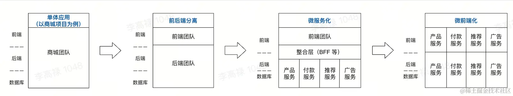

## 价值

- 技术栈无关 主框架不限制接入应用的技术栈，子应用具备完全自主权
- 独立开发、独立部署 子应用仓库独立，前后端可独立开发，部署完成后主框架自动完成同步更新
- 独立运行时 每个子应用之间状态隔离，运行时状态不共享
  微前端架构旨在解决单体应用在一个相对长的时间跨度下，由于参与的人员、团队的增多、变迁，从一个普通应用演变成一个巨石应用(Frontend Monolith)后，随之而来的应用不可维护的问题。这类问题在企业级 Web 应用中尤其常见。

## 核心思想

## 实现要求

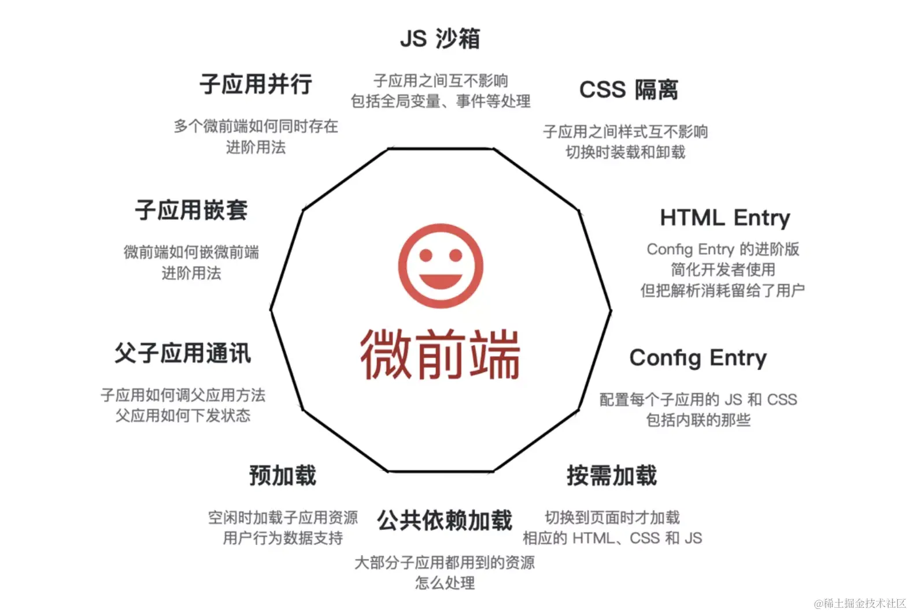

## 呈现方式

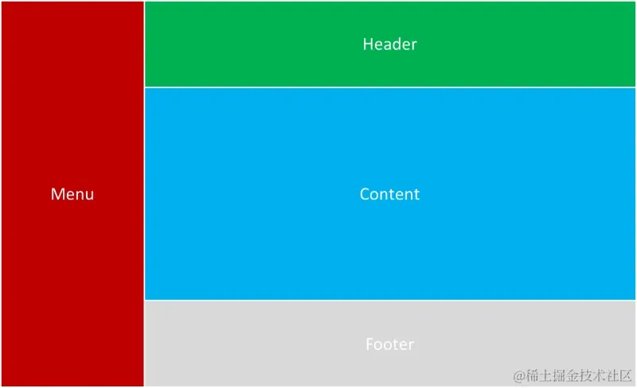

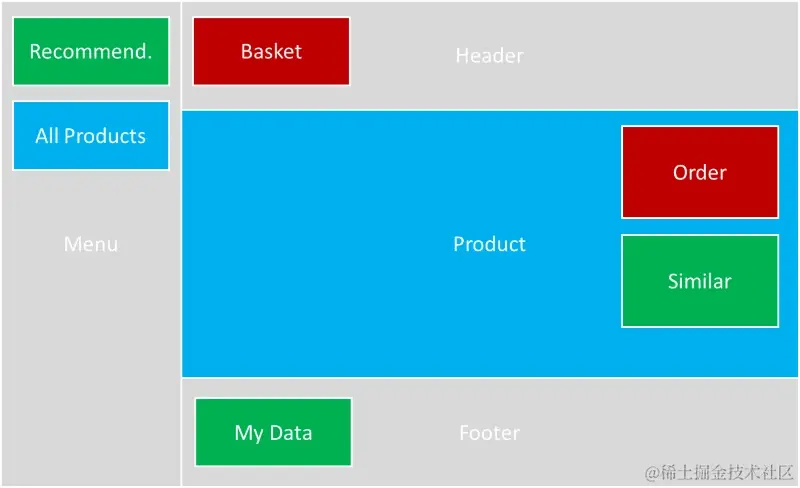

## 集成方式

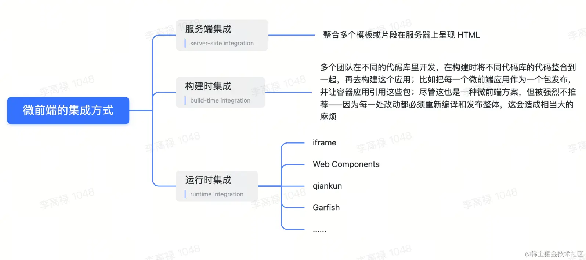

## 体系

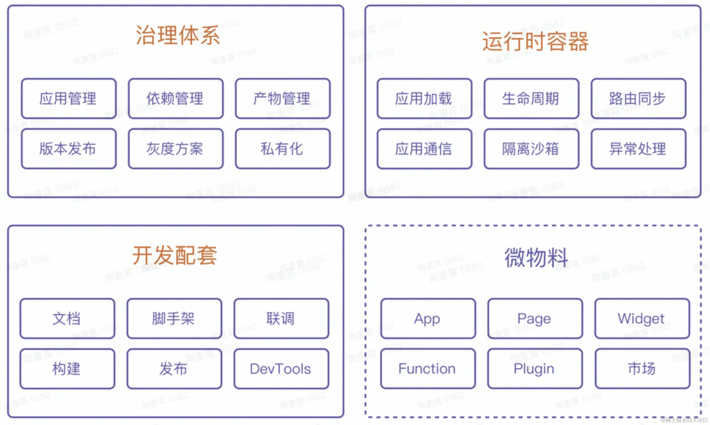

治理体系」简单看可以视为一个上线管理平台 + 上线发布流程。业界的管理平台大体实现这两个功能：

应用管理 - 能上线各种主应用、子应用不同版本，列出上线应用不同版本的入口地址
依赖管理 - 明确管理父子应用依赖关系，将子应用入口地址注入父应用

## 应用场景

### 业务场景

满足以下几点，你可能就不需要 微前端 ❌：

1. 你/你的团队具备系统内所有架构组件的话语权：简单来说就是，系统里的所有组件都是由一个小的团队开发的。
2. 你/你的团队有足够动力去治理、改造这个系统中的所有组件：直接改造存量系统的收益大于新老系统混杂带来的问题。
3. 系统及组织架构上，各部件之间本身就是强耦合、自洽、不可分离的。系统本身就是一个最小单元的「架构量子」，拆分的成本高于治理的成本。
   满足以下几点，你才确实可能需要 微前端 ✅：
4. 系统本身是需要集成和被集成的，一般有两种情况：

   - 旧的系统不能下，新的需求还在来。
   - 系统需要有一套支持动态插拔的机制。

5. 系统中的部件具备足够清晰的服务边界。

### 产品形态场景

微前端架构解决方案大概分为两类场景：

- 单实例：即同一时刻，只有一个子应用被展示，子应用具备一个完整的应用生命周期。通常基于 url 的变化来做子应用的切换。
- 多实例：同一时刻可展示多个子应用。通常使用 Web Components 方案来做子应用封装，子应用更像是一个业务组件而不是应用。

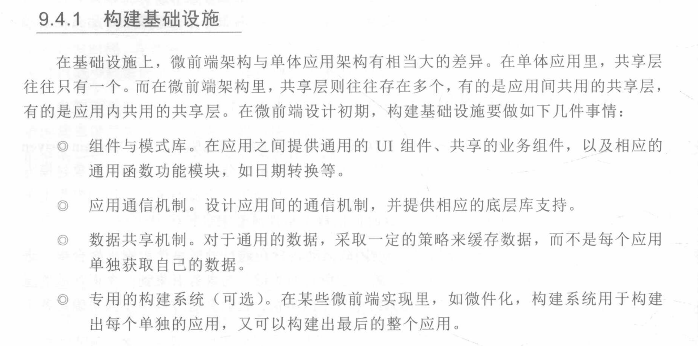

## 拆分方式


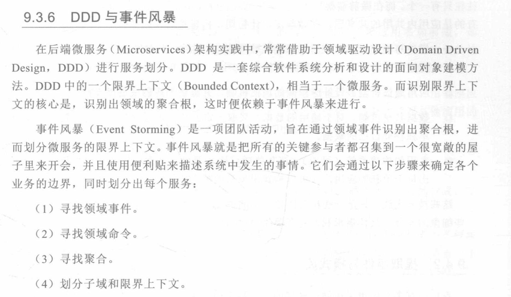

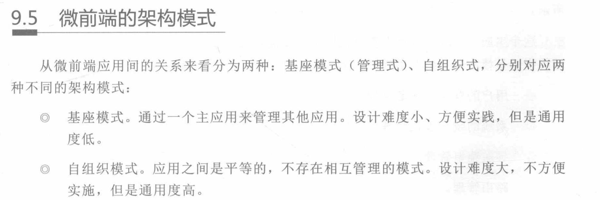
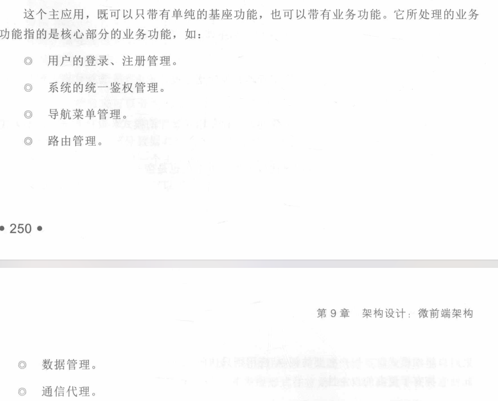
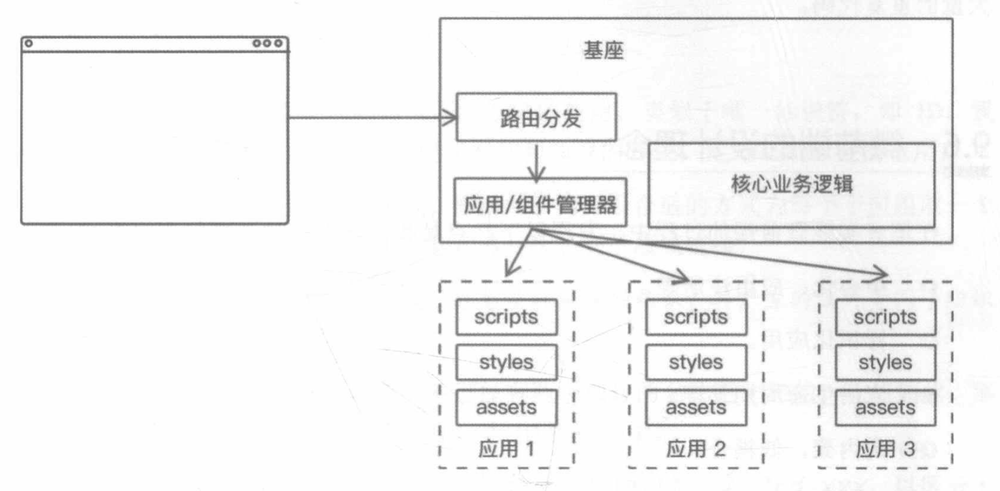
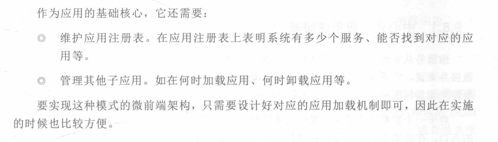

- 导航路由 + 资源加载框架。

生命周期’
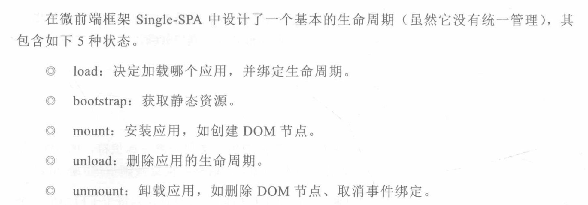

## 利弊权衡

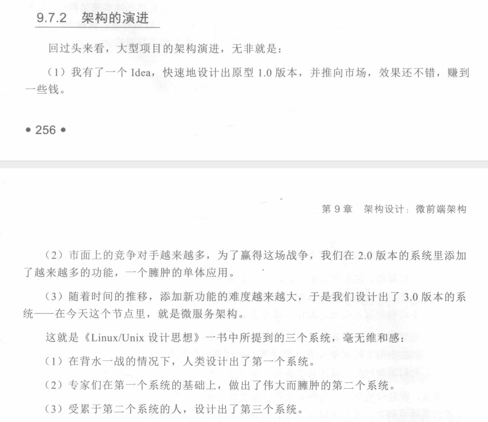

> 均衡存乎万物之间

## 主流方案

- iframe
  iframe 最大的特性就是提供了浏览器原生的硬隔离方案，不论是样式隔离、js 隔离这类问题统统都能被完美解决。但他的最大问题也在于他的隔离性无法被突破，导致应用间上下文无法被共享，随之带来的开发体验、产品体验的问题。

- wujie
- qiankun
- single-spa
- Module Federation
  - https://juejin.cn/post/7210746685802512443?searchId=202411041657489682EFEF26F691131504#heading-27
- Web Components
  - MicroApp
    1.single-spa 是一个将多个单页面应用聚合为一个整体应用的 JavaScript 微前端框架。
    2.qiankun 是一款基于 single-spa 封装的微前端框架。
    3.MicroApp 京东出品，一款基于 WebComponent 的思想，轻量、高效、功能强大的微前端框架。

### MicroApp

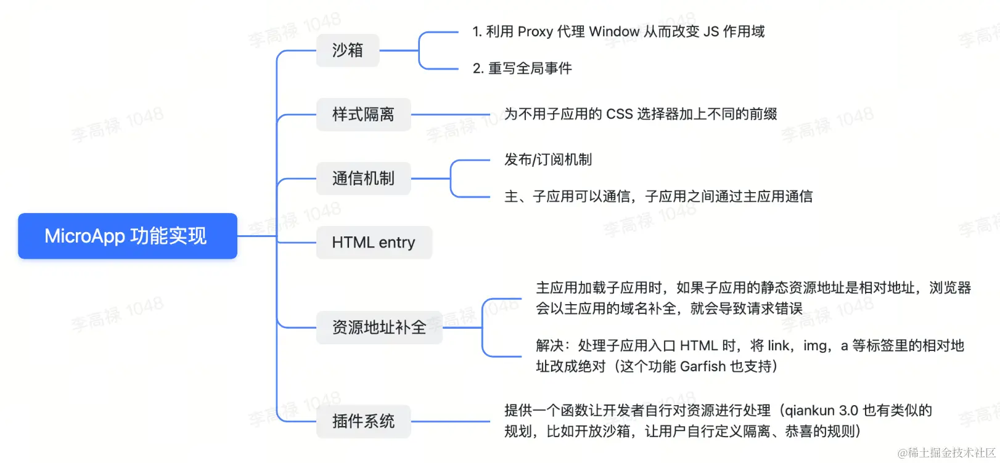
1、使用起来成本最低，将所有的封装到一个类 WebComponent 组件中，从而实现在主应用基座中嵌入一行代码即可渲染一个微前端应用。
2、不需要像 single-spa 和 qiankun 一样要求子应用修改渲染逻辑并暴露出方法，也不需要修改 webpack 配置，是目前市面上接入微前端成本最低的方案。
3、提供了 js 沙箱、样式隔离、元素隔离、预加载、数据通信、静态资源补全等一系列完善的功能。
4、没有任何依赖，这赋予它小巧的体积和更高的扩展性。
5、为了保证各个业务之间独立开发、独立部署的能力，micro-app 做了诸多兼容，在任何技术框架中都可以正常运行。
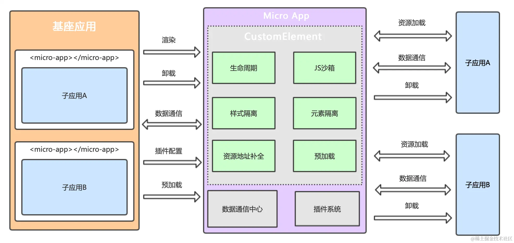

（1）子应用集成，给子应用提供渲染容器

（2）权限管理

（3）会话管理

（4）路由、菜单管理

（5）主题管理

（6）共享依赖

（7）多语言管理（最重要的一点）等

content 里面可以任意放不同技术的子应用，我们只需要开发一个主应用（主应用也可以自由选择语言，目前支持 react、vue、vite、angular、next.js、nuxt.js），将一些分散的应用接进来，主应用还可以通过控制权限，让不同的账号看到的菜单不一样，即看到不同系统的页面，通过同一个地址访问到不同的子应用。

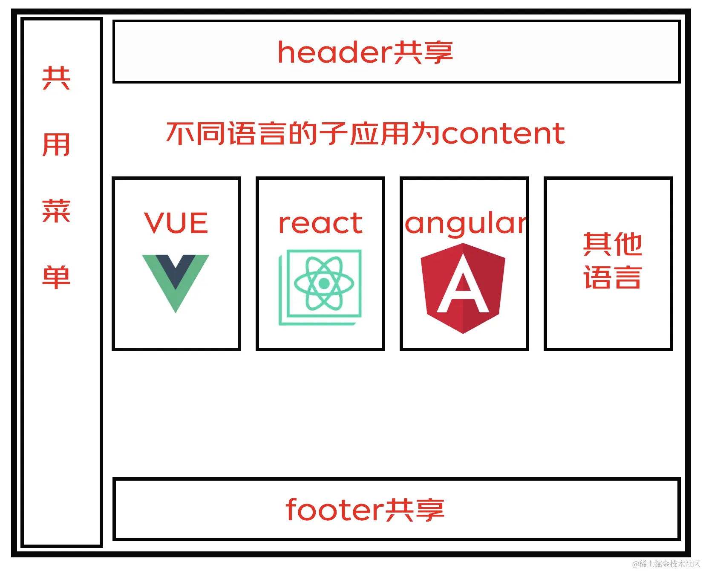

## 参考

- https://juejin.cn/post/7338230967390224435#heading-25

## 问题

### 关于路由

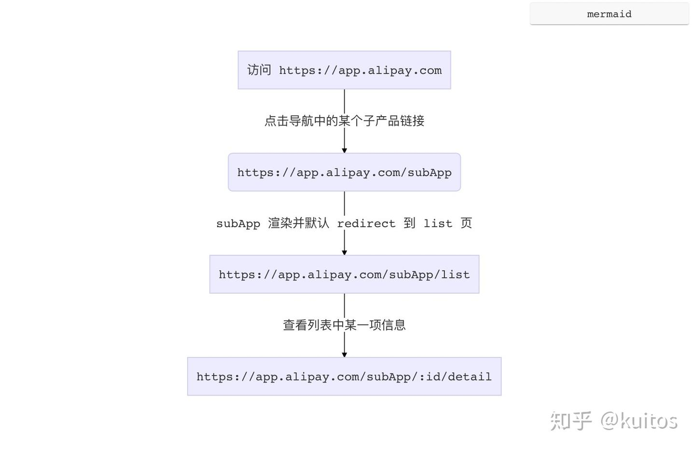
此时浏览器的地址可能是 https://app.alipay.com/subApp/123/detail，想象一下，此时我们手动刷新一下浏览器，会发生什么情况？

由于我们的子应用都是 lazy load 的，当浏览器重新刷新时，主框架的资源会被重新加载，同时异步 load 子应用的静态资源，由于此时主应用的路由系统已经激活，但子应用的资源可能还没有完全加载完毕，从而导致路由注册表里发现没有能匹配子应用 /subApp/123/detail 的规则，这时候就会导致跳 NotFound 页或者直接路由报错。

这个问题在所有 lazy load 方式加载子应用的方案中都会碰到，早些年前 angularjs 社区把这个问题统一称之为 Future State。

解决的思路也很简单，我们需要设计这样一套路由机制：

主框架配置子应用的路由为 subApp: { url: '/subApp/\*\*', entry: './subApp.js' }，则当浏览器的地址为 /subApp/abc 时，框架需要先加载 entry 资源，待 entry 资源加载完毕，确保子应用的路由系统注册进主框架之后后，再去由子应用的路由系统接管 url change 事件。同时在子应用路由切出时，主框架需要触发相应的 destroy 事件，子应用在监听到该事件时，调用自己的卸载方法卸载应用，如 React 场景下 destroy = () => ReactDOM.unmountAtNode(container)。

要实现这样一套机制，我们可以自己去劫持 url change 事件从而实现自己的路由系统，也可以基于社区已有的 ui router library，尤其是 react-router 在 v4 之后实现了 Dynamic Routing 能力，我们只需要复写一部分路由发现的逻辑即可。这里我们推荐直接选择社区比较完善的相关实践 single-spa。

### App Entry

解决了路由问题后，主框架与子应用集成的方式，也会成为一个需要重点关注的技术决策。

构建时组合 VS 运行时组合
微前端架构模式下，子应用打包的方式，基本分为两种：
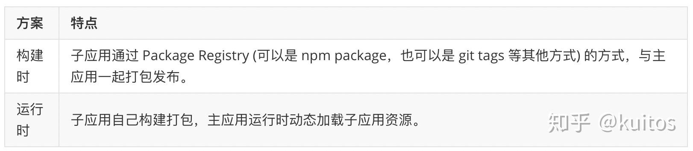

两者的优缺点也很明显：

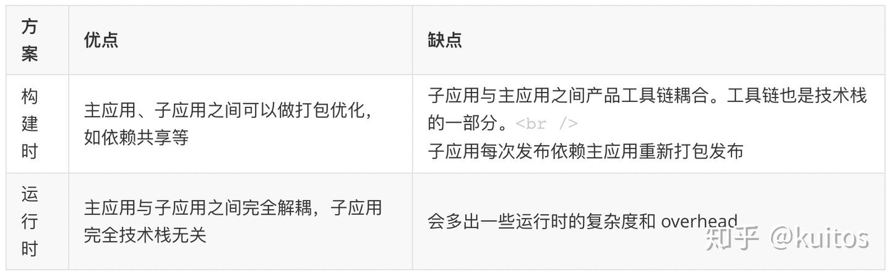
很显然，要实现真正的技术栈无关跟独立部署两个核心目标，大部分场景下我们需要使用运行时加载子应用这种方案。

### JS Entry vs HTML Entry

在确定了运行时载入的方案后，另一个需要决策的点是，我们需要子应用提供什么形式的资源作为渲染入口？

JS Entry 的方式通常是子应用将资源打成一个 entry script，比如 single-spa 的 example 中的方式。但这个方案的限制也颇多，如要求子应用的所有资源打包到一个 js bundle 里，包括 css、图片等资源。除了打出来的包可能体积庞大之外的问题之外，资源的并行加载等特性也无法利用上。

HTML Entry 则更加灵活，直接将子应用打出来 HTML 作为入口，主框架可以通过 fetch html 的方式获取子应用的静态资源，同时将 HTML document 作为子节点塞到主框架的容器中。这样不仅可以极大的减少主应用的接入成本，子应用的开发方式及打包方式基本上也不需要调整，而且可以天然的解决子应用之间样式隔离的问题(后面提到)。想象一下这样一个场景：

```html
<script src="//unpkg/antd.min.js"></script>
<body>
  <main id="root"></main>
</body>
// 子应用入口 ReactDOM.render(
<App />
, document.getElementById('root'))
```

如果是 JS Entry 方案，主框架需要在子应用加载之前构建好相应的容器节点(比如这里的 "#root" 节点)，不然子应用加载时会因为找不到 container 报错。但问题在于，主应用并不能保证子应用使用的容器节点为某一特定标记元素。而 HTML Entry 的方案则天然能解决这一问题，保留子应用完整的环境上下文，从而确保子应用有良好的开发体验。

HTML Entry 方案下，主框架注册子应用的方式则变成：

```
framework.registerApp('subApp1', { entry: '//abc.alipay.com/index.html'})
```

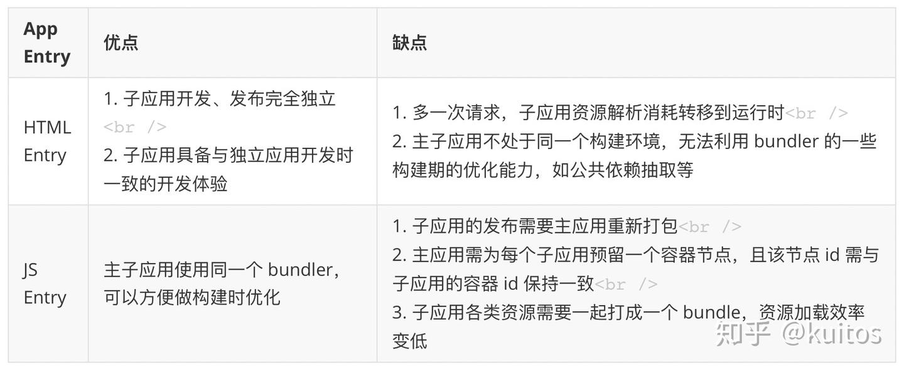

### 模块导入 生命周期

微前端架构下，我们需要获取到子应用暴露出的一些钩子引用，如 bootstrap、mount、unmout 等(参考 single-spa)，从而能对接入应用有一个完整的生命周期控制。而由于子应用通常又有集成部署、独立部署两种模式同时支持的需求，使得我们只能选择 umd 这种兼容性的模块格式打包我们的子应用。如何在浏览器运行时获取远程脚本中导出的模块引用也是一个需要解决的问题。

通常我们第一反应的解法，也是最简单的解法就是与子应用与主框架之间约定好一个全局变量，把导出的钩子引用挂载到这个全局变量上，然后主应用从这里面取生命周期函数。

这个方案很好用，但是最大的问题是，主应用与子应用之间存在一种强约定的打包协议。那我们是否能找出一种松耦合的解决方案呢？

很简单，我们只需要走 umd 包格式中的 global export 方式获取子应用的导出即可，大体的思路是通过给 window 变量打标记，记住每次最后添加的全局变量，这个变量一般就是应用 export 后挂载到 global 上的变量。实现方式可以参考 systemjs global import，这里不再赘述。

### 应用隔离

微前端架构方案中有两个非常关键的问题，有没有解决这两个问题将直接标志你的方案是否真的生产可用。比较遗憾的是此前社区在这个问题上的处理都会不约而同选择”绕道“的方式，比如通过主子应用之间的一些默认约定去规避冲突。而今天我们会尝试从纯技术角度，更智能的解决应用之间可能冲突的问题。

样式隔离
由于微前端场景下，不同技术栈的子应用会被集成到同一个运行时中，所以我们必须在框架层确保各个子应用之间不会出现样式互相干扰的问题。

Shadow DOM？
针对 "Isolated Styles" 这个问题，如果不考虑浏览器兼容性，通常第一个浮现到我们脑海里的方案会是 Web Components。基于 Web Components 的 Shadow DOM 能力，我们可以将每个子应用包裹到一个 Shadow DOM 中，保证其运行时的样式的绝对隔离。

但 Shadow DOM 方案在工程实践中会碰到一个常见问题，比如我们这样去构建了一个在 Shadow DOM 里渲染的子应用：

```js
const shadow = document.querySelector('#hostElement').attachShadow({ mode: 'open' })
shadow.innerHTML =
  '<sub-app>Here is some new text</sub-app><link rel="stylesheet" href="//unpkg.com/antd/antd.min.css">'
```

由于子应用的样式作用域仅在 shadow 元素下，那么一旦子应用中出现运行时越界跑到外面构建 DOM 的场景，必定会导致构建出来的 DOM 无法应用子应用的样式的情况。

比如 sub-app 里调用了 antd modal 组件，由于 modal 是动态挂载到 document.body 的，而由于 Shadow DOM 的特性 antd 的样式只会在 shadow 这个作用域下生效，结果就是弹出框无法应用到 antd 的样式。解决的办法是把 antd 样式上浮一层，丢到主文档里，但这么做意味着子应用的样式直接泄露到主文档了。gg...

CSS Module? BEM?
社区通常的实践是通过约定 css 前缀的方式来避免样式冲突，即各个子应用使用特定的前缀来命名 class，或者直接基于 css module 方案写样式。对于一个全新的项目，这样当然是可行，但是通常微前端架构更多的目标是解决存量/遗产 应用的接入问题。很显然遗产应用通常是很难有动力做大幅改造的。

最主要的是，约定的方式有一个无法解决的问题，假如子应用中使用了三方的组件库，三方库在写入了大量的全局样式的同时又不支持定制化前缀？比如 a 应用引入了 antd 2.x，而 b 应用引入了 antd 3.x，两个版本的 antd 都写入了全局的 .menu class，但又彼此不兼容怎么办？

Dynamic Stylesheet !
解决方案其实很简单，我们只需要在应用切出/卸载后，同时卸载掉其样式表即可，原理是浏览器会对所有的样式表的插入、移除做整个 CSSOM 的重构，从而达到 插入、卸载 样式的目的。这样即能保证，在一个时间点里，只有一个应用的样式表是生效的。

上文提到的 HTML Entry 方案则天生具备样式隔离的特性，因为应用卸载后会直接移除去 HTML 结构，从而自动移除了其样式表。

比如 HTML Entry 模式下，子应用加载完成的后的 DOM 结构可能长这样：

```html
<html>
  <body>
    <main id="subApp">
      // 子应用完整的 html 结构
      <link rel="stylesheet" href="//alipay.com/subapp.css" />
      <div id="root">....</div>
    </main>
  </body>
</html>
```

当子应用被替换或卸载时，subApp 节点的 innerHTML 也会被复写，//alipay.com/subapp.css 也就自然被移除样式也随之卸载了。

### JS 隔离

解决了样式隔离的问题后，有一个更关键的问题我们还没有解决：如何确保各个子应用之间的全局变量不会互相干扰，从而保证每个子应用之间的软隔离？

这个问题比样式隔离的问题更棘手，社区的普遍玩法是给一些全局副作用加各种前缀从而避免冲突。但其实我们都明白，这种通过团队间的”口头“约定的方式往往低效且易碎，所有依赖人为约束的方案都很难避免由于人的疏忽导致的线上 bug。那么我们是否有可能打造出一个好用的且完全无约束的 JS 隔离方案呢？

针对 JS 隔离的问题，我们独创了一个运行时的 JS 沙箱。简单画了个架构图：
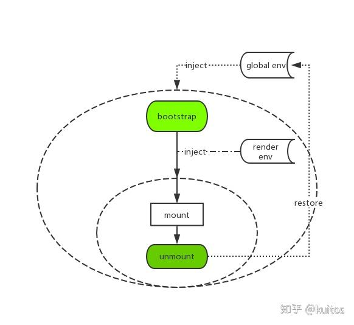

即在应用的 bootstrap 及 mount 两个生命周期开始之前分别给全局状态打下快照，然后当应用切出/卸载时，将状态回滚至 bootstrap 开始之前的阶段，确保应用对全局状态的污染全部清零。而当应用二次进入时则再恢复至 mount 前的状态的，从而确保应用在 remount 时拥有跟第一次 mount 时一致的全局上下文。

当然沙箱里做的事情还远不止这些，其他的还包括一些对全局事件监听的劫持等，以确保应用在切出之后，对全局事件的监听能得到完整的卸载，同时也会在 remount 时重新监听这些全局事件，从而模拟出与应用独立运行时一致的沙箱环境。

## 参考

- 乾坤介绍：https://zhuanlan.zhihu.com/p/78362028
- [qiankun 落地](https://juejin.cn/post/7114589692560932878?searchId=202411041657489682EFEF26F691131504)
- [qiankun 微应用之间、主微应用之间相互跳转方式总结与实践](https://blog.csdn.net/qq_41885295/article/details/126086661)
- 从零到一实现企业级微前端框架，保姆级教学： https://juejin.cn/post/7004661323124441102
- [软件工程的最大难题](https://www.ruanyifeng.com/blog/2021/05/scaling-problem.html)
- [乾坤踩坑](https://juejin.cn/post/7252342216843296828?searchId=202411041657489682EFEF26F691131504)
- [微前端五大门派大 Battle](https://juejin.cn/post/7338230967390224435?searchId=202411041657489682EFEF26F691131504#heading-2)
- [Vite 模块联邦](https://juejin.cn/post/7288154646991749139)
- [微前端在美团外卖的实践](https://tech.meituan.com/2020/02/27/meituan-waimai-micro-frontends-practice.html)
- https://github.com/d2forum/14th/blob/master/PPT/%E5%BE%AE%E5%89%8D%E7%AB%AF%E6%9E%B6%E6%9E%84%E4%BD%93%E7%B3%BB--%E5%85%8B%E5%86%9B.pdf
- https://docs.aws.amazon.com/zh_cn/prescriptive-guidance/latest/micro-frontends-aws/micro-frontends-aws.pdf
- [微前端架构设计](https://www.garfishjs.org/blog/architecture.html)
 -->

# 微前端

微前端是一种架构，主要讨论如何将网站或网络应用程序视为独立团队拥有的功能的**组合**，即巨石应用的拆分以及零散应用在业务形态上的聚合。 需要明确的是，微前端不局限于某项具体的技术栈，更涉及到团队组织、流程、文化等方方面面。

## 是什么

微前端（Micro Frontends）的概念是由[ThoughtWorks 在 2016 年提出](https://www.thoughtworks.com/radar/techniques/micro-frontends)的，它借鉴了微服务的架构理念。

**微服务**是一种后端架构设计，将应用程序拆分成一组小型、独立的服务，每个服务都专注于特定的业务功能，同时可以独立部署、运行。

比如一个常见的商城系统中，查询商品、推荐列表、订单结算、物流管理等功能，往往由不同的服务承担，每个服务可能由不同的技术团队支撑，对应的技术选型、数据存储也可能有不少差别。

微服务可以将不同的业务功能解耦，组合成最终的商城。对于每个微服务而言，他们可以各自维护和迭代，有助于管理复杂性，提供整个系统的灵活性和可维护性。

微前端在很大程度上借鉴了微服务的设计理念，其核心在于将一个庞大的前端应用拆分成多个独立灵活的小型应用，每个应用都可以独立开发、独立运行、独立部署，再将这些小型应用融合为一个完整的应用。

### 业务概念

天下大势，分久必合，合久必分。软件架构亦然。就像数据库分库分表一样，当一个组织过于庞大，就进一步将它细化。当软件开始细化、系统变得多样，用户又会开始厌倦一家公司的应用软件分散在多个不同的应用上。应用的获客成本越来越高，应用又需再次聚合。

微前端在业务层需要强调的是，应用的单一职责，应用自治，以及技术层面的技术栈无关。

## 软件架构演进

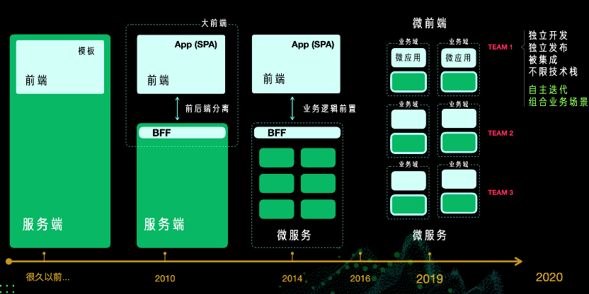

微服务在逻辑上是隔离的（甚至在物理上也是隔离的，部署在不同的服务器上），每个微服务可以独立存在。

与微服务不同，微前端在逻辑上是聚合的，在同一个 HTML 下，同时展示一个或多个子应用。

形态为：

- 多子应用并行渲染
- 单子应用渲染

<!-- ## 替代架构
### 巨石
### N 层应用程序
### 微服务 -->

## 应用场景

### 巨石项目拆分

### 历史项目合并

## 成本与收益

### 成本

### 收益

## 架构组织

### 敏捷开发

### 团队组成和规模

### DevOps 文化

### 跨多个团队协调微前端开发

### 平台团队？

## 架构设计

### 决策

#### 微前端的识别和边界的定义

#### 使用微前端撰写页面和视图

#### 跨微前端的路由、状态管理和通信

#### 管理跨领域问题的依赖关系

## 技术要点

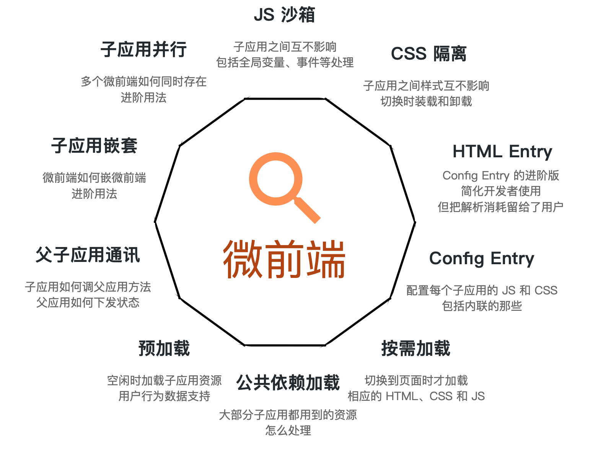

### JS 沙盒

### 样式隔离

### 应用通信

### 静态资源构建和加载

### 应用生命周期管理

### 路由托管

## 坊间主流实现方案

### single-spa

### 乾坤

### MicroApp

### wujie

### garfish

## 总结

- https://micro-frontends.org/
