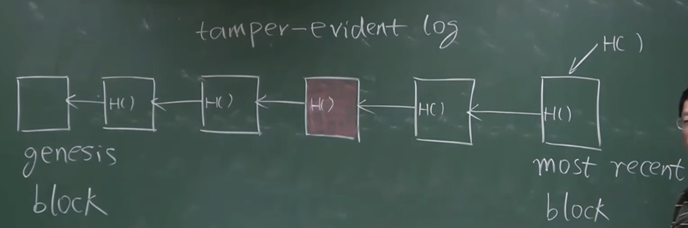
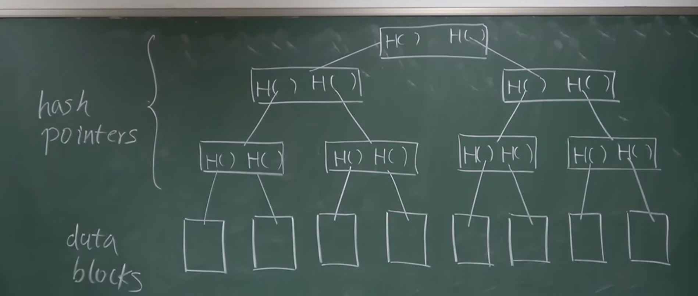

# 数据结构


Blockchains are linked lists using hash Pointers.

## 哈希指针

哈希指针是一个包含两个部分的数据结构

- 指针：指向特定数据的位置（如内存地址或磁盘位置）。
- 哈希值：该位置数据通过哈希函数计算得出的哈希值。用 H()表示

**在区块链中的应用：**
每个区块通过哈希指针链接到前一个区块，形成一条不可篡改的链。

> 1. 区块头（Block Header）:
>    • 前一个区块的哈希值（Previous Block Hash）: 指向前一个区块的哈希值，用于维持区块链的连贯性和安全性。
>    • 默克尔根（Merkle Root）: 交易的哈希值通过 Merkle 树结构计算出的根哈希值，用于快速验证区块中交易的完整性。
>    • 时间戳（Timestamp）: 区块创建的时间，用于记录区块生成的时间点。
>    • 难度目标（Difficulty Target）: 当前区块的挖矿难度目标，决定了生成区块所需的计算难度。
>    • 随机数（Nonce）: 挖矿过程中不断变化的值，用于找到满足难度目标的有效哈希值。
> 2. 区块体（Block Body）:
>    • 交易列表（Transaction List）: 包含所有在该区块中记录的交易。每个交易通常包括：

    •	交易ID（Transaction ID）: 交易的唯一标识符。
    •	输入（Inputs）: 交易的输入部分，指向前一交易输出的引用。
    •	输出（Outputs）: 交易的输出部分，指定接收者和发送金额。
    •	其他信息: 可能包括交易签名等。

```javascript

Block {
  Block Header {
      Version: 1,
      Previous Block Hash: "00000000000000000000...",
      Merkle Root: "4d3f5a5a1a2b4f32...",
      Timestamp: 1624068325,
      Difficulty Target: "170db8ff",
      Nonce: 2083236893
  },
  Transactions [
    Transaction {
      Transaction ID: "e3a1f...",
      Inputs: [
        {Previous Output: "txid:abcd..., index: 0", Signature: "3045..."}
      ],
      Outputs: [
        {Value: 50, Address: "1A1zP..."}
      ]
  },
    ...
    ]
}

```

## merkle tree 默克尔树

默克尔树是一个二叉树，其中每个叶子节点（Leaf Node）包含数据项的哈希值，而每个非叶子节点（Parent Node）包含其子节点哈希值的组合哈希值。树的根节点（Merkle Root）是最上层的节点，包含整个树的哈希值。

```
交易A, 交易B, 交易C, 交易D
哈希A, 哈希B, 哈希C, 哈希D

父节点:
哈希AB = Hash(哈希A + 哈希B)
哈希CD = Hash(哈希C + 哈希D)

根节点:
默克尔根 = Hash(哈希AB + 哈希CD)
```



> data blocks 即为交易 transaction
> 在比特币系统中，不同区块通过哈希值指针连接，在同一个区块中的多个交易（数据块），则通过 Merkle Tree 的形式组织在一起。区块本身分为两部分（块头和块身），在块头中存在有根哈希值（没有交易的具体信息），块身中存在交易列表。

该数据结构的优点在于：只需要记住 Root Hash（根哈希值），便可以检测出对树中任何部位的修改。
例如，所绘制 Merkle Tree 中节点 B 发生了改变，则对应的第二层第一个节点中第二个哈希值便也会发生改变，进而根节点中第一个哈希值也会发生改变，从而导致根哈希值也发生了改变。

**在区块链中的应用：**
Merkle Tree 可以用于提供 Merkle Proof（ 用于验证某个交易是否包含在 merkle tree）。关于 Merkle proof，需要先了解比特币系统中节点。比特币中节点分为**轻节点**和**全节点**。全节点保存整个区块的所有内容，而轻节点仅仅保存区块的块头信息。
比特币节点分为：

- 全节点 （block header + block body） ： full node / full validating node
- 轻节点 （block header）： light node
  > 为什么要分轻节点和全节点？
  > 因为硬件的局限。一个区块大小为 1MB，对于移动便携设备来说，如果存储区块的所有内容，则所需空间过大，而这是不现实的。所以轻节点只需要存储区块块头信息，全节点存储区块所有内容即可。

当需要向轻节点证明某条交易是否被写入区块链，便需要用到 Merkle proof。我们将交易到根节点这一条路径称为 Merkle proof，全节点将整个 Merkle proof 发送给轻节点（如下图所示），轻节点即可根据其算出根哈希值，和自己保存的对比，从而验证该交易是否被写入区块链。只要沿着该路径，所有哈希值都正确，说明内容没有被修改过。


**延伸**

- **Proof of Membership**
  - 证明成员关系（Proof of Membership），也称为默克尔证明（Merkle Proof）
- **Proof of Nonmembership**
  - 证明非成员关系（Proof of Nonmembership）用于证明某个数据项不在某个集合中。常用的方法包括使用改进的默克尔树，如默克尔前缀树（Merkle Patricia Trie）、排序默克尔树或更复杂的结构如 Merkle Interval Tree。
