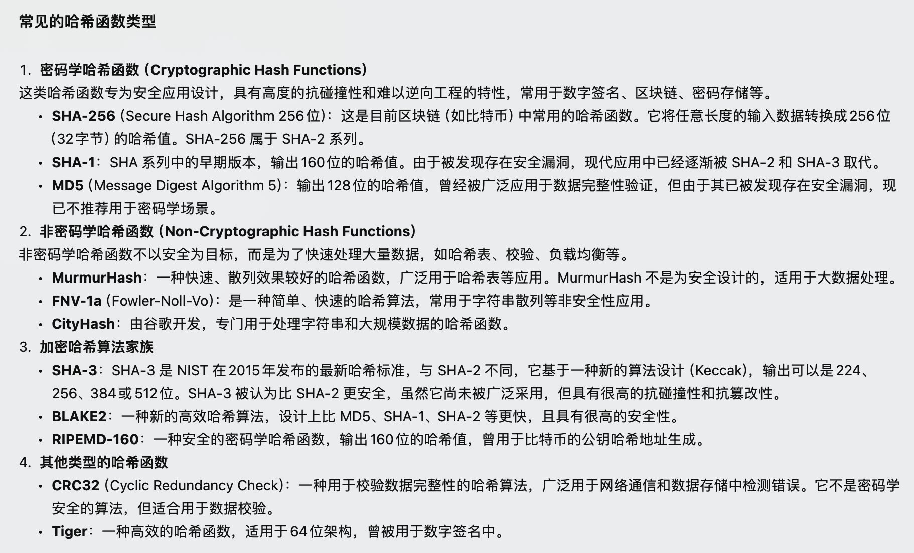

# 密码学原理

在比特币系统中，加密主要涉及两个内容：哈希和签名。

## 哈希函数

> 哈希函数（Hash Function）是一种从任意长度的数据输入，经过一系列计算，生成固定长度的输出值。
> 本质上是有损压缩，单向不可逆。
> 哈希函数有很多种，不同的哈希函数有不同的设计目的、应用场景和特性。
> 比特币系统中采用 SHA-256 哈希函数

密码学中，采用的哈希函数名为 `Cryptographic Hash Functions`。  
其两个重要性质分别为 **Collision Resistance**（抗哈希碰撞）和 **Hiding(隐藏性)**

### Collision Resistance 抗哈希碰撞

给定 x 和 y，且有 x!=y，但给定一个哈希函数 Hash()，可以得到 Hash(x)=Hash(y)，则称为 **hash 碰撞。**

**产生原因：输入空间大于输出空间** 。

比如 256 位的哈希值，输出空间 2^256，输入空间无限 ，根据鸽笼原理，终究会有哈希碰撞。

`Collision Resistance` 保证，如果有 Hash(x) != Hash(y)，必然可以得到 x!=y。（当然，这是理想状态，实际应用中，哈希碰撞基本上难以避免。目前并不存在一个 hash 函数可以从数学上证明具有 Collision Resistance 的性质）

- 作用：
  - 对 message 求 digest（摘要） （比如版本管理）。
  - 此时告诉某人 H(x)， 彼时某人拿到 x 求证，可验证当初 x 消息是否准确。

某些哈希函数经年后，人们找到了人为制作哈希碰撞的方法，故不再安全。 如 **md5**。

### Hiding

即，无法从散列值逆向推导出原始数据。 （如果能推导，那不就成压缩了）

### Puzzle Friendly

::: tip puzzle friendly （谜题友好性）:

1. 计算上困难但验证简单：解决某个问题需要大量的计算资源或复杂的推理过程，但一旦解答出来，验证正确性应该是快速且简单的。
2. 随机性或不可预测性：谜题的解答无法通过简单的逻辑或预先推测得出，需要参与者进行尝试或使用某种搜索过程。这种不可预测性对防止作弊或预知答案至关重要。
3. 逐步逼近的解法：一些谜题友好的系统允许通过不断尝试或逐步逼近的方式最终找到解答。比如在比特币的 PoW 算法中，矿工通过不断变更 nonce 来找到符合要求的哈希值。
4. 抗作弊性：谜题友好性还可能包含对抗作弊的设计，确保谜题只能通过正当的计算和逻辑解答，而不是通过捷径或攻击手段快速破解。
   :::

在比特币系统中，还需要第三个性质 Puzzle friendly。该性质要求哈希值计算事先不可预测，仅仅根据输入很难预测出输出。例如：我们需要一个哈希值，存在于某一个范围内，只能通过不停运算查找出来。

该性质保证了比特币系统中，只能通过“挖矿”获得比特币。也就是说，该性质保证了工作量证明(POW)机制可以运行下去【“”】。

## 签名

在第三方中心化系统中，账户开通依赖于第三方。但去中心化的比特币系统中，申请账户是用户自己来处理的，即自己创建一个公钥-私钥对。

- 比特币账户创立

  - 本地建立公私钥对（asymmetric encryption algorithm 非对称加密）。
  - 公钥相当于银行账号；私钥相当于银行卡密码；
  - 加密主要用于签名， **比特币交易需要用私钥签名，其他人用公钥验证。**
  - 在发布交易时，通过自己私钥签名，其他人可以根据公钥进行验证，从而保证该交易由自己发起。也就是说，只有拥有私钥，才能将该账户中的比特币转走。

> 注：无限生成公私钥对，也很难产生重复数据。

## 扩展

1. 非对称性：
   公私钥加密是一种非对称加密方式，意味着加密和解密使用的是不同的密钥。公钥加密的信息只有配对的私钥可以解密，反之，私钥加密的信息可以用公钥解密。
2. 安全性：
   私钥是保密的，必须由持有者安全地存储，不能泄露给他人。公钥则可以公开发布，供其他人使用。即使攻击者获得了公钥，也无法解密通过公钥加密的消息，因为解密必须要有私钥。
3. 私钥可推导出公钥，公钥不可推导出私钥。
