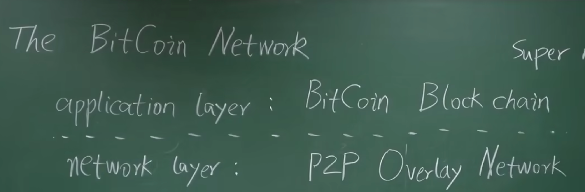
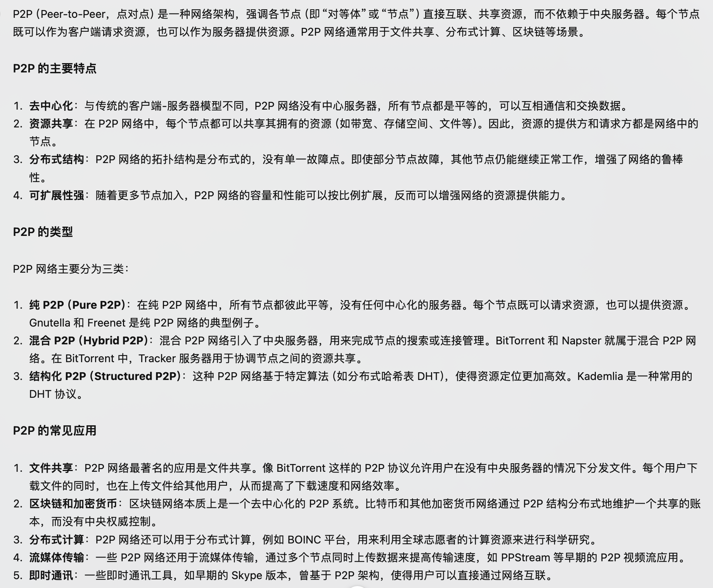
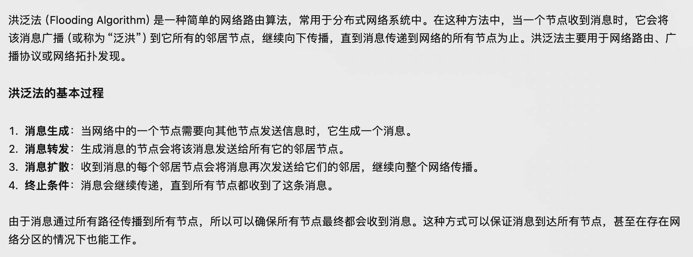

# 比特币网络

用户将交易发布到比特币网络上，节点收到交易后打包到区块中，然后将区块发布到比特币网络上。  
本文探讨新发布的交易和区块在比特币网络上是如何传播的。

## 网络结构

比特币工作于网络应用层，其底层（网络层）是一个 P2P Overlay network（P2P 覆盖网络）。比特币系统中所有节点完全平等，不像一些其他网络存在超级节点(super node)。

### 结构组成

- 网络节点（Node）：比特币网络中的节点是参与网络通信和数据共享的基本单位。节点可以是全节点（Full Node）或轻节点（Light Node）。全节点保存了比特币网络的完整数据，包括所有交易和区块信息。轻节点只保存了部分数据，通常只保存区块链的头部信息。
- 网络拓扑（Network Topology）：比特币网络是一个对等网络（Peer-to-Peer Network），节点之间直接相互通信。网络拓扑结构通常是一个全连接图，每个节点都与其他所有节点相连。
- 网络协议（Network Protocol）：比特币网络使用 TCP/IP 协议进行通信。节点之间的通信采用了 TCP 协议，便于穿透防火墙。当节点离开时，只需要自行退出即可，其他节点在一定时间后仍然没有收到该节点消息，便会将其删掉。

## 设计原则

**简单、鲁棒（最坏情况下能达到最优状况，即健壮性）而非高效**

每个节点维护一个邻居节点集合，消息传播在网络中采用**洪泛法**。某个节点在收到一条消息会将其发送给所有邻居节点并标记，下次再收到便不会再发送该消息。邻居节点选取随机，未考虑网络底层拓扑结构，也与现实世界物理地址无关。该网络具有极强鲁棒性，但牺牲了网络效率。

## 交易传播

- 比特币系统中，每个节点要维护一个等待上链的交易集合。
- 第一次听到交易，若是合法交易，则将其加入该交易集合并转发给邻居节点，以后再收到该交易就不再转发（避免网络上交易无线传输）。
- 假如网络中存在两个冲突交易，如交易 1：A->B，交易 2：A->C（假设花费的同一笔钱）。具体接收哪个取决于节点先接收到哪个交易，之后收到另一个交易会将其放弃。
- 假如某个节点先听到 A->B，但又听到 A->C 已经上链，则此时 A->B 为非法交易，所以要再等待上链交易集合中删除 A->B
- 新发布区块在网络中传播方式与新发布交易传播方式类似，每个节点除检查该区块内容是否合法，还要检查是否位于最长合法链上。区块越大，则网络上传输越慢。BTC 协议对于区块大小限制为不大于 1M 大小。

## 补充

### p2p

### 洪泛法

## 参考

[北京大学肖臻老师《区块链技术与应用》](https://www.bilibili.com/video/av37065233/?p=6)
