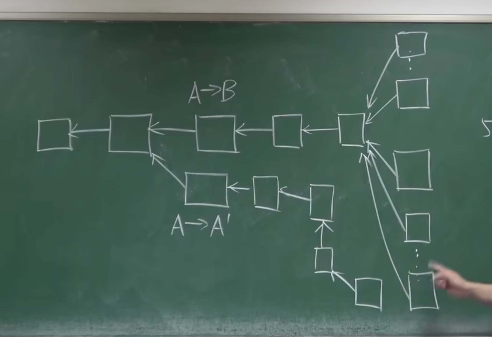
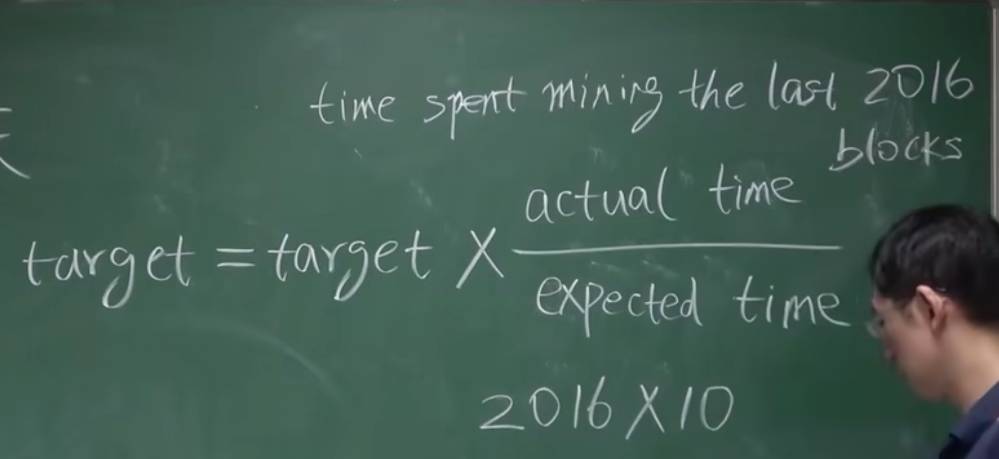

# 挖矿难度

挖矿本质上就是不断调整 block header 中的 nonce 值，使整个 block header 的哈希值小于等于给定的目标阈值。即：H(block header)<=target.（target 便是目标阈值，target 越小，目标难度就越大）。  
对于挖矿难度的调整，可以视为**调整目标空间在整个输出空间中所占比例大小**。

## 挖矿难度调整的必要性

在比特币系统设计中，区块链的出块时间保持在平均 **10min** 左右。  
 系统总算力越来越强，若挖矿难度保持不变，则出块时间会越来越短。

### 出块时间越来越短是好事吗？

出块时间缩短，那么交易可以很快便被写入区块链，并且提高了系统响应时间，增加了区块链系统效率。但是，出块时间并不是越短越好。 出块时间太短，也会造成一定的问题。

- 首先，区块在网络上传播具有时延，假如出块时间为 1 秒，但网络传播需要 10 秒，则会使得系统中节点经常性处于不一致的状态，增加了系统不稳定性，且系统经常性位于分叉状态（不仅二分叉，乃至多分叉）。

- 分叉过多，则不利于系统达成共识，且会造成算力分散，使得黑客攻击成本大大降低(不再需要整个系统 51%的算力)。

### 10min 的出块间隔是最优吗？

**当然不是**。 但可以确定的是，系统出块时间需要维持在一个定值附近。

以太坊中平均出块时间仅为 15 秒左右，但同样在以太坊中也有相应难度调整算法维持其平均出块时间，当然 15s 的时间明显会产生经常性的分叉，所以以太坊设计了新的共识协议 Ghost。

大量分叉

当然，对于一个交易系统来说，10min 这样一个交易时间是比较长的。但对于跨国交易来说，这个时间反而大大缩短了交易时间，减少了相应成本。

## 系统如何调整挖矿难度

在 BTC 协议中规定，每隔 2016 个区块需要调整一次难度，根据 10min 产生一个新区块可以得到，大概需要 14 天的时间。具体调整公式如下：

- actual time: 系统中产生最近 2016 所花费的时间
- 2016 \* 10 min: 预期时间

可见，如果实际实际比较长，target 会比较大，相应的挖矿难度会降低；如果实际实际比较短，target 会比较小，相应的挖矿难度会增大。

## 如何让所有矿工都愿意调整这个挖矿难度？

这一调整算法在代码中已经写入，如果有恶意节点故意不调，其所产生的区块不会被大多数诚实的节点承认。

在 block header 中有一个 nbits 的域，它是对 target 的编码存储（target 为 256 位，nbits 为 32 位，也就是说 block header 并未直接存储 target），其他节点在进行合法性验证时候会验证 nbits 域是否合法，不合法则对该区块不予以承认。

## 参考

[北京大学肖臻老师《区块链技术与应用》](https://www.bilibili.com/video/av37065233/?p=7)
